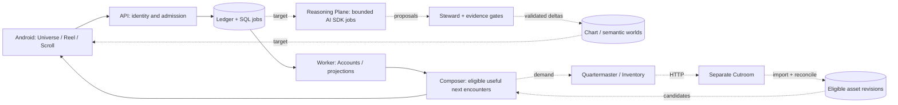

# How the system fits together

**A fast deterministic serving path, with durable background reasoning that proposes changes.** The database remains the authority. The cosmic interface expresses semantic state; it is not a decorative skin on a feed.

Solid paths exist in the bootstrap slice. Dashed paths are target architecture. Ledger is a logical canonical history, not a requirement for one giant physical event table forever.

## One owner per responsibility

The [machine-readable component map](component-map.json) and table below describe the same boundaries. Components are modules/roles; they do not each require a service or an agent.

| Component | Owns | Bootstrap status |
|---|---|---|
| Mobile | Navigation, rendering, local interaction state | First Universe/Scroll/keep path |
| API | Auth boundary, admission, client contracts | Scoped, revocable operator-issued device sessions; development only |
| Ledger | Event identity, order, causation and durable admission | PostgreSQL source events with ownership constraints and epoch stamps |
| Accounts | Conservative short-term recorded signals | Explicit kept-asset projection only |
| Composer | Candidate assembly, constraints, final selection | Editorial-unkept-v1 only |
| Substrate | Sources, claims, concepts and bridges | Source fields only; semantic graph planned |
| Cartographer / Chart | Typed personal geography and lineage | Explicit Trace projection; semantic worlds planned |
| Steward | Why hypotheses and evidence-linked proposals | Planned |
| Reasoning Plane | Global bounded execution, budgets, attempts, context isolation | Development certification, storage and atomic execution primitives; product dispatch disabled |
| Quartermaster | Demand, reuse/adapt/join/fund decisions | Planned |
| Inventory / Content Plane | Asset revisions, rights, availability, private bindings | Three editorial Scrolls |
| Cutroom Adapter | External run reconciliation and asset import | Pinned unwired HTTP client; host import/publication absent |
| Projector / Social | Authorized projections, visits and Blend | Planned |
| Rooms / Inhabitants | Bounded situated collaboration | Planned |
| Evaluation / Operations | Journey receipts, quality and current runtime inspection | J001, J002 sessions/epochs, J003 history clear, J004 reasoning faults and live state command |

## Full target and current implementation

The [target design](target/README.md) retains the complete recommendation engine, complex Ledger, per-universe semantic scope, shared global execution, content lifecycle and cosmic/social scope. [ADR-0008](../decisions/ADR-0008-foundation-adoption.md) explains adoption and conflicts. Exact table names, thresholds and transport details in target documents are designs until accepted through implementation ADRs and evidence.

Current code has one PostgreSQL database, two Node processes and one Android application. API requests never invoke a provider. A keep admits a source event and job atomically. The short worker transaction records an explicit Trace, updates Accounts and completes the job together. Replay cannot duplicate the kept asset. Composer persists candidate selection before the client reports actual exposure.

[ADR-0009](../decisions/0009-device-sessions-and-privacy-epochs.md) adds private per-session universe ownership. Authentication, revocation and deterministic projection use universe-first locking. Old-epoch jobs are discarded without projection; a busy universe does not block another ready universe. [ADR-0010](../decisions/0010-clear-scroll-history.md) adds retryable Clear Scroll history and Android cache invalidation. Full account deletion, backup erasure, pause and semantic read sets remain separate future scope.

The target provider lifecycle is Job → Step → Attempt → Proposal → validation → apply. Every paid request requires its own Attempt before dispatch. Context read sets and privacy/source/policy versions reject stale results. Neither database leasing nor SDK retries imply exactly-once paid execution. These are target contracts, not hidden capabilities of the bootstrap worker.

[ADR-0011](../decisions/0011-minimax-certification.md) adds a separate CLI experiment through the pinned AI SDK/MiniMax adapter. Its journal records a durable reservation before each bounded request and retains unknown remote outcomes after interruption. It uses synthetic fixtures only, never the owner history, and is not connected to the serving path. See the [operations guide](../operations/minimax-certification.md) for execution and evidence boundaries.

[ADR-0012](../decisions/0012-reasoning-admission-and-reconciliation.md) specifies separate reasoning records, one-time dispatch authorization, late accounting after privacy clear and canonical universe-first locks. Shared metadata, storage, SQL admission/reconciliation and an unwired invocation boundary exist. [J004](../journeys/J004.md) verifies separate-process crashes, late accounting and cleanup with local fixtures; these primitives do not enable product reasoning.

[ADR-0013](../decisions/0013-bounded-reasoning-fairness.md) and the [fairness model](../operations/reasoning-fairness.md) define bounded class/universe turns and validate synthetic scheduling/accounting counterexamples. [Durable SQL fair selection](../operations/reasoning-sql-fairness.md) now composes claim and full reservation atomically. The ordinary provider path stays disabled.

[ADR0020 and the Cutroom HTTP client](../operations/cutroom-http-client.md) add strict source-pinned wire handling with local fixture/restart proof. The target supply-plane arrows remain unwired; result metadata does not become an eligible asset.
