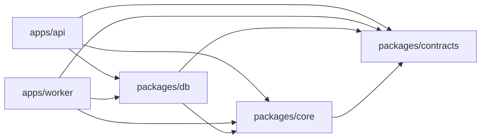
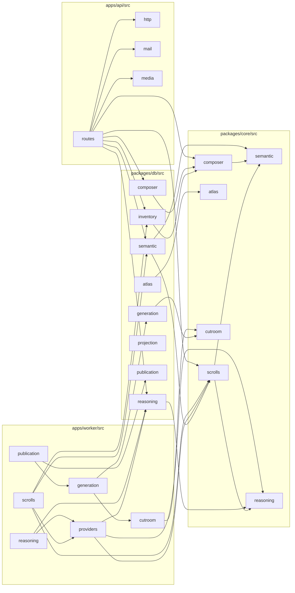

# Backend module map

The backend is three workspace packages and two apps under [ADR-0048](../decisions/0048-backend-module-boundaries.md).
Dependencies point one way: `contracts` imports nothing in the workspace; `core` imports `contracts`;
`db` imports `contracts` and `core`; the API and the worker import all three and never each other.
Only the repository-level `tests/` and `scripts/` import an app, by relative path. SQL lives only in
`packages/db`; Biome `noRestrictedImports` and `scripts/check-architecture.mjs` enforce these edges in
`pnpm lint`.

This map was generated from the import graph of commit `eecce45b` (216 files under `apps/api/src`,
`apps/worker/src` and `packages/*/src`; specifiers resolved with the TypeScript module resolver). It
shows no boundary violations and no file-level import cycle. The graph tool that produced it lives in
`scripts/refactor/`, which is removed after the refactor merges. To recompute exact edge counts, check
out that commit and run `node scripts/refactor/import-graph.mjs report`.

## Package graph

Import statements between packages at that commit (value / type-only): api to db 32 / 1, worker to
db 34 / 2, db to contracts 31 / 10, db to core 31 / 11, core to contracts 7 / 2, api to contracts 8 / 1,
worker to contracts 7 / 3, api to core 5 / 0, worker to core 6 / 2.

## Folder graph

Only the folder-to-folder edges that cross a package are drawn; edges inside a package are in the
tables below.

Every folder also imports `packages/contracts` (omitted above). `packages/db` has a cycle at folder
level among `.` (the package root files), `atlas`, `inventory`, `reasoning` (and its subfolders) and
`semantic`; there is no cycle between files. The worker's `generation` and `generation/import` folders
form the other folder-level cycle.

## What each folder owns and may import

### packages/contracts/src (imports `zod` only)

| Folder | Owns | May import |
|---|---|---|
| `.` | zod wire schemas, one topical module each; `index.ts` is the package root | `zod`, other files here |
| `cutroom-v1/` | the vendored Cutroom protocol, byte-for-byte; never edited | `zod` |

### packages/core/src (pure; imports `contracts`, `zod`, `node:crypto`)

| Folder | Owns | May import |
|---|---|---|
| `composer/` | signal-ranked and semantic Composers | `semantic/`, `shared/`, contracts |
| `semantic/` | attention hypotheses, bridge validation, source text | `shared/`, contracts |
| `atlas/`, `rooms/` | the Cartographer and the room Keeper | `shared/` (rooms also `atlas/`) |
| `scrolls/` | Scroll material, writing and web artifact rules | `reasoning/`, `semantic/`, contracts |
| `reasoning/` | wire shapes for answers and bridge inquiries | `shared/`, contracts |
| `inventory/` | Quartermaster targets | `semantic/`, contracts |
| `cutroom/` | Cutroom request preparation | `contracts/cutroom-v1` |
| `shared/` | canonical JSON, comparison, FNV, number helpers | nothing in the workspace |

### packages/db/src (imports `contracts`, `core`, `pg`, `zod`; the only home of SQL)

| Folder | Owns | May import |
|---|---|---|
| `.` | `connection.ts` (pool, locks), `identity.ts`, `privacy.ts`, feed, encounters, asks, worlds, relics, rooms, sign-in | any db folder, core, contracts |
| `sql/` | `queryable.ts`, `transactions.ts`, `recording-paused.ts` | `pg` |
| `shared/` | time and token-hash helpers | `node:crypto` |
| `reasoning/` | admission, answers, fairness, inquiries, storage, maintenance, `worker-reads.ts` | `.`, `semantic/`, `sql/`, core, contracts |
| `semantic/` | personal model, proposals, corrections, model scrolls | `.`, `inventory/`, `reasoning/`, `sql/`, core |
| `inventory/` | demand, read, supply | `.`, `sql/`, core |
| `atlas/` | Atlas writes and read model | `.`, `inventory/`, `reasoning/`, `shared/`, core |
| `composer/` | signals, semantic and feedback persistence | `.`, `inventory/`, `semantic/`, `shared/`, core |
| `projection/` | Keep projection, worker heartbeat | `.` |
| `publication/` | gate evaluation and minting | `semantic/` |
| `generation/` | generation storage and import records | contracts, `core/cutroom` |

### apps/api/src (imports all three packages, `fastify`; no SQL)

| Folder | Owns | May import |
|---|---|---|
| `.` | `main.ts` (process), `app.ts` (`buildApp`, error handler) | `routes/`, `http/`, `media/` |
| `routes/` | one file per route area | `http/`, `mail/`, `media/`, db, core, contracts |
| `http/` | authentication, error contract, input parsing, web session | db, contracts |
| `mail/`, `media/` | magic-link senders; media serving | `http/` (media) |

### apps/worker/src (imports all three packages and the provider SDKs; no SQL)

| Folder | Owns | May import |
|---|---|---|
| `.` | `main.ts` (projection loop), `project.ts` | `reasoning/`, `runtime/`, `scrolls/`, db |
| `reasoning/` | answer and inquiry workers, invocation, maintenance | `providers/`, `runtime/`, db, contracts |
| `providers/` | MiniMax transports, certification, fixtures | db `reasoning/`, core, contracts |
| `scrolls/` | supply worker, Scroll writing, material fetch | `providers/`, db, core |
| `generation/` | generation worker, import, media store | `cutroom/`, `runtime/`, db, contracts |
| `publication/` | gate evaluation, minting, CLI | `generation/`, db, contracts |
| `cutroom/` | HTTP client for Cutroom | `core/cutroom`, `contracts/cutroom-v1` |
| `runtime/` | log, env settings, stop signal | nothing outside the file |

See also [moved-paths.md](moved-paths.md) for where files used to live, and the per-package READMEs:
[contracts](../../packages/contracts/README.md), [core](../../packages/core/README.md),
[db](../../packages/db/README.md), [api](../../apps/api/README.md), [worker](../../apps/worker/README.md).
