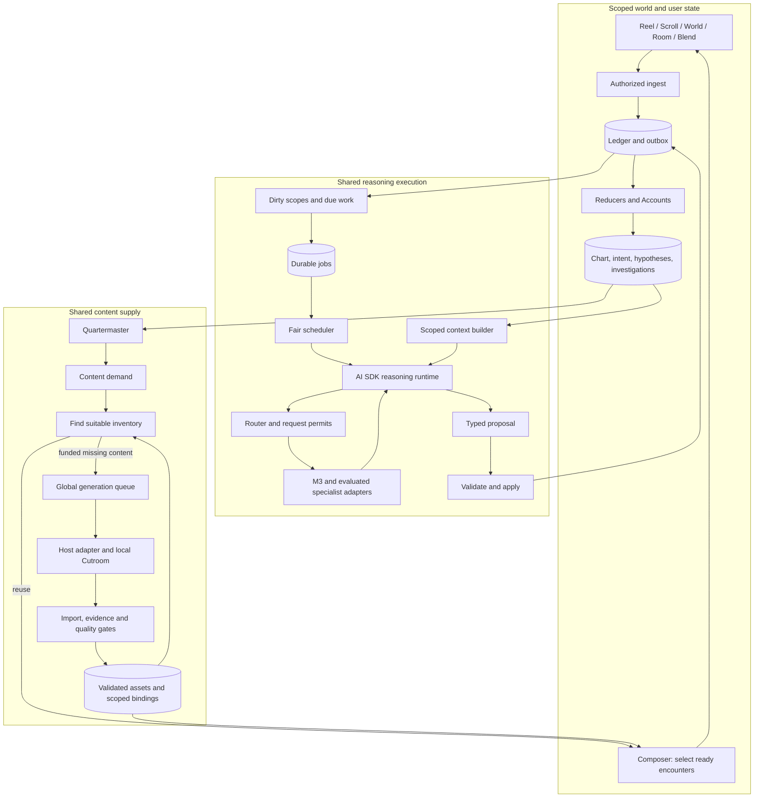

> **Target design, not runtime status.** Adopted through [ADR-0008](../../decisions/ADR-0008-foundation-adoption.md). Source front matter below records its original proposal status. Current executable boundaries live in [Architecture](../README.md), ADRs and contracts. Exact schemas/thresholds here require implementation decisions.

---
status: proposed
authority: architecture-proposal
date: 2026-09-15
project: KnowScroll Core Engine v2
scope: Refined design for founder review. Illustrative contracts and policies, not implemented behavior or approval to build.
---

# The whole engine, from a question to a useful next experience

A person watches an explanation about black holes, follows a branch about time dilation, and asks: “Would GPS work if we ignored relativity?” KnowScroll should preserve that actual question, find the relevant conceptual bridge, and offer an explanation that helps. It should not conclude merely that the person likes “space.”

Their universe, rooms and inhabitants are part of this experience. A new connection can become a route; a recurring question can become a room; a well-supported organizing idea can reshape a place. These changes carry reasons and preserve return paths.

## 1. Six responsibilities

| Question | Owner | Timing |
|---|---|---|
| What appears next? | Composer reads ready inventory, current context and approved candidate features | Immediate, no model call in the swipe path |
| What happened? | Ingest, Ledger and deterministic reducers/Accounts | On each observation or request |
| What might it mean? | Steward investigations and focused interpretation jobs | When enough evidence or explicit intent warrants work |
| What connection would help? | Bridge discovery, research and encounter planning | Shared asynchronous reasoning capacity |
| What should the universe become? | Cartographer proposes structure; validator/reducer applies it | Relevant evidence and navigation boundaries |
| What content is missing? | Quartermaster emits demand; shared planner reuses or generates | According to urgency, inventory and budget |

Rooms contribute inquiry and artifacts. Projector enables visits and Blends. Gates protect evidence and publication. Scribe explains committed changes. These are responsibilities, not necessarily separate services or autonomous processes.

## 2. Rules that make intelligence governable

Models interpret evidence and propose meaning. Code enforces authorization, budgets, ordering, eligibility and state transitions. Neither numbers nor fluent explanations establish a person's private motivation as fact.

- Keep serving and ordinary bookkeeping fast and deterministic.
- Preserve exact explicit questions, corrections and constraints alongside summaries.
- Store competing interpretations, supporting evidence and counterevidence.
- Let semantic work produce real candidate connections and encounter plans, before numeric structure gates close the candidate set.
- Apply proposals only against valid inputs, current permissions and domain invariants.
- Meter every expensive request, including retries and calls made by child agents.

A lease allows another worker to recover a job; it does not prove the provider executed once. A transcript permits continuation; it does not replace a transactional Ledger. These distinctions are implemented in [21](21-REASONING-RUNTIME.md) and [22](22-GLOBAL-EXECUTION.md).

## 3. Three planes, one product

These are logical planes. On the recorded single host, the API, one bounded worker process and SQLite can implement most boxes. At a hosted multi-host boundary, PostgreSQL, a worker pool and object storage can implement the same contracts. No provider call belongs in the API, including Ask: it submits an interactive job and can relay pending status or the worker's response.

One universe has persistent identity and state. Many universes share worker capacity. A warm worker can execute several scoped jobs over its lifetime without carrying one user's private context into the next.

## 4. What persists

| Store | What survives restart | Authority |
|---|---|---|
| Ledger and exposure lineage | Observations, explicit requests, decisions, mutation causes and meaningful outcomes | Scoped domain history |
| Substrate | Concepts, claims, sources, relations and corrections | Evidence status and provenance, not generated assertion |
| Accounts | Derived episode/exposure/action tallies | Recomputable policy inputs |
| Chart | Stable places, anchors, routes, lineage and navigation state | Committed world projection |
| Hypotheses and investigations | Alternative interpretations, original questions, evidence, tasks and unfinished commitments | Revisable personal or room-scoped interpretation |
| Jobs, steps, attempts and receipts | Checkpoints, effect intents, provider outcomes, costs, leases and fences | Execution history, separate from domain truth |
| Inventory and demand | Asset revisions, source dependencies, needs, generation waiters and encounter bindings | Eligibility, ownership and suitability |
| Rooms and agents | Residents, journals, positions, artifacts and budgets | Explicit room/agent scope |
| Social | Permissions, projections, visits, Blend state and revocation lineage | Shareable subsets only |

Every write has a domain or execution owner. “Reducer is the world writer” does not prohibit the queue from updating its own lease or the runtime from recording its own receipt. Models cannot issue raw database writes through their tool interface.

## 5. What models contribute

| Model work | Typed result | What remains deterministic |
|---|---|---|
| Interpret a trajectory or question | Alternative hypotheses with evidence and permitted uses | Scope, source validity, allowed uses and expiry |
| Find a conceptual bridge | Mechanism, relation, prerequisites, limitations and evidence | Candidate admission and diversity/quality constraints |
| Plan an explanation | Encounter plan tied to a question and claims | Inventory suitability and selection |
| Explore a room question | Research tasks, positions, tests and artifacts | Membership, commitments, budgets and publication |
| Propose world structure | Stable target IDs, organizing meaning and navigation rationale | Preconditions, policy gates, rate limits and application |
| Inspect generated material | Evidence/visual check results with limitations | Publication policy and correction propagation |
| Explain a committed change | Chronicle or invitation draft | Which change is eligible to surface and its receipt |

AI SDK provides model invocation and tool primitives. KnowScroll owns the durable investigation, context builder, job lifecycle, global admission and validation. The first general reasoning route is M3; embeddings use a separate adapter. Strict schema or forced tool guarantees are enabled only when verified for the actual endpoint.

## 6. One journey in order

1. **The feed is already usable.** Composer serves a ready Reel with a selection receipt. Prefetching does not count as exposure.
2. **A person follows an idea.** Playback and a branch request become separate Ledger observations. The branch stack remembers where Return should go.
3. **The person asks about GPS.** Keep the exact wording and current encounter. An interactive reasoning job is accepted or reports an honest pending state.
4. **Repeated background signals accumulate.** Related observations update Accounts immediately. Dirty markers combine repeated wake signals without losing evidence or distinct questions.
5. **The investigation receives context.** A worker reads a versioned world neighborhood, relevant episodes, the question and alternative interpretations. It does not receive the entire Ledger.
6. **Shared capacity admits each request.** The router selects an eligible model and admission reserves requests, tokens, concurrency and budget. Busy periods yield durable waiting jobs.
7. **Focused reasoning finds the mechanism.** Research can verify the relation between relativistic clocks and GPS. The model returns a bridge and an encounter plan; it may also conclude evidence is insufficient.
8. **Code validates the proposal.** Unrelated new events need not invalidate it. A changed premise, deleted source or privacy reset does. Accepted operations commit with a causal receipt.
9. **Quartermaster checks supply.** A suitable public explanation may already exist. Otherwise the demand can join a shared generation or fund a new one through the host's Cutroom adapter.
10. **The experience becomes eligible.** Imported assets pass evidence and quality checks. The private binding explains why this encounter fits here; it does not expose the user's hypothesis to other viewers.
11. **The world can develop.** A supported bridge may appear as a route; a room can continue the question. A structural change requires its own justified proposal. Return preserves the user's earlier position.

These are designed transitions, not a measured run. Detailed event tables are in [20](20-WORKED-TRACES.md); code and ER views are in [25](25-JOURNEY-AND-DATA-FLOWS.md).

## 7. Long investigations and living rooms

A Steward is one coordinating identity per universe. It can have several investigations and ask focused agents to investigate independent subquestions. Each child has a task, evidence scope, parent, budget and stop condition. A parent waiting for children releases its worker slot.

Residents retain identities, commitments and room memories. They can think independently before exchanging findings, challenge a claim and publish a checked artifact. They cannot inspect participants' private memories just because they share a room. Shared evidence and a private interpretation are different scopes.

The question can persist for weeks. Execution occurs in bounded bursts on new evidence, due commitments or explicit requests. Deterministic idle checks skip model calls when nothing warrants work. This preserves continuity while preventing an idle agent population from consuming unbounded capacity.

## 8. The layers and their limits

| Layer | Typical timing | Legitimate conclusion | Limit |
|---|---|---|---|
| Serving | Request | These candidates were eligible and selected | Selection is an intervention, not neutral evidence |
| Session continuity | Event | A branch was requested; this return position must be restored | Current intent is not automatically durable curiosity |
| Accounts | Event/decay | Several episodes and voluntary actions occurred | Counts do not establish why |
| Semantic interpretation | Funded job | This bridge or explanation might help, for stated reasons | Hypotheses remain revisable |
| World structure | Proposal/application boundary | A representation makes the person's paths more useful and legible | Map growth is not measured learning |
| Supply and room life | Demand/commitment | An artifact or explanation is needed or available | Supply is not proof of user interest |

## 9. Read deeper

[03](03-ARCHITECTURE.md) names every responsibility and boundary. [05](05-DATA-STATE-MODEL.md) explains storage. [06–09](06-USER-WORLD-MODEL.md) connect evidence, geography and recommendation. [10–13](10-CORE-AGENT.md) explain agents, rooms and social scopes. [14–16](14-QUALITY-ANTI-SLOP.md) cover quality and feedback. [21](21-REASONING-RUNTIME.md), [22](22-GLOBAL-EXECUTION.md) and [23](23-CONTENT-DEMAND-AND-INVENTORY.md) specify the new execution and supply contracts. [24](24-REVIEW-GUIDE.md) gathers the final review decisions.
