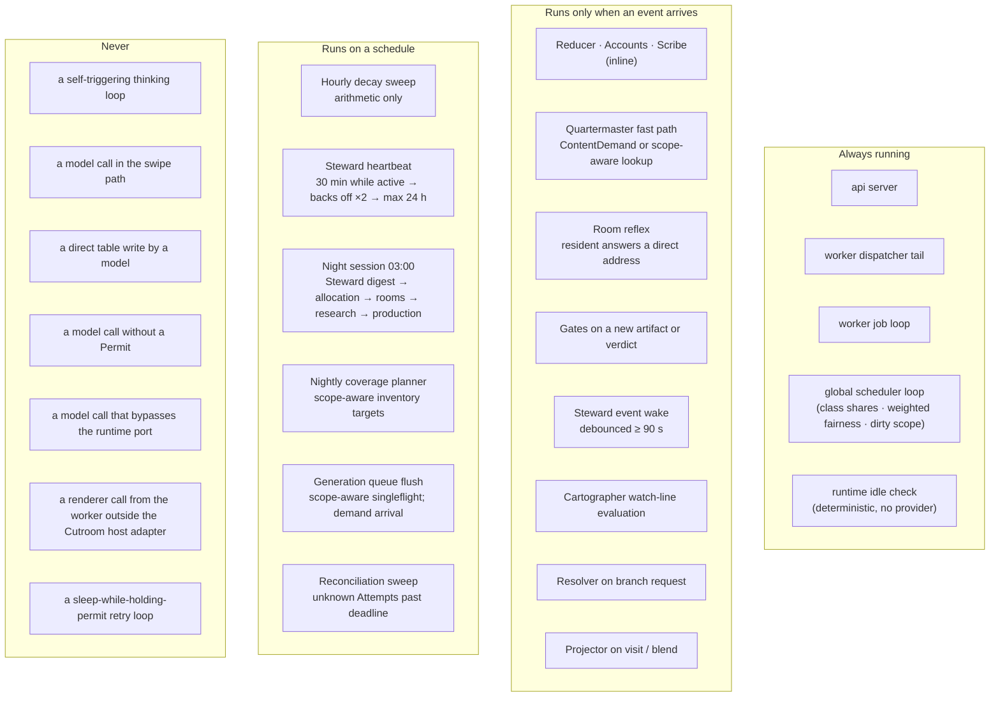

> **Target design, not runtime status.** Adopted through [ADR-0008](../../decisions/ADR-0008-foundation-adoption.md). Source front matter below records its original proposal status. Current executable boundaries live in [Architecture](../README.md), ADRs and contracts. Exact schemas/thresholds here require implementation decisions.

---
status: proposed
authority: architecture-proposal
date: 2026-09-15
project: KnowScroll Core Engine v2
scope: Design only. Process and module names are proposals; the runtime, scheduler and admission contracts are the architectural boundary; the SQL table names are logical proposals, not migrations.
---

# The complete architecture: what runs, what wakes, what calls what

`01-OVERVIEW.md` said the engine is an event log with subscribers. This document is the subscriber list, the wake rules, and the call graph, in enough detail that an engineer can see every process and every boundary. It is one of three architecture chapters; the durable model call boundary lives in [21-REASONING-RUNTIME.md](21-REASONING-RUNTIME.md), and the scheduler and admission gate that wrap every expensive attempt live in [22-GLOBAL-EXECUTION.md](22-GLOBAL-EXECUTION.md). Read this chapter for ownership, then use those two chapters for execution details.

The architecture is one logical machine in two cooperating OS processes, plus the shared resources the workers draw on. The processes are the existing `api` and `worker`; the shared resources are a relational database, an object store for media bytes, and the network ports the worker uses for provider calls and Cutroom. Inside the worker, the modules subscribe to the same Ledger; between the API and the worker, durable Jobs cross the queue table; between the worker and a provider, the runtime port governs every attempt; between the worker and Cutroom, the [content demand and inventory chapter](23-CONTENT-DEMAND-AND-INVENTORY.md) describes the contract.

## 1. The two processes, three planes, one logical history

```mermaid
flowchart LR
  subgraph api["api (Node, request/response)"]
    A1["ingest<br/>authenticates · tombstones · enqueues"]
    A2["Composer<br/>8-item window, no model call"]
    A3["Projector<br/>visits · blends · projection tokens"]
    A4["Why this appeared<br/>reads receipts only"]
    A5["Ask<br/>enqueues interactive job, never calls a provider"]
  end
  subgraph worker["worker (Node, one or many processes)"]
    subgraph scoped["scoped domain plane"]
      D1["Reducer · Accounts<br/>Cartographer · Scribe<br/>Settlement"]
    end
    subgraph reasoning["reasoning runtime"]
      R1["Context builder<br/>Router<br/>Provider adapters<br/>Step journal"]
    end
    subgraph globalplane["global execution plane"]
      G1["Scheduler · Class shares<br/>Weighted user fairness"]
      G2["Admission gate<br/>Permit · BudgetReservation<br/>Atomic reservations"]
      G3["Receipts store<br/>Causal · cost · disposition"]
      G4["Dirty scopes · High-water marks<br/>Coalescing · direct intent queue"]
    end
    subgraph contentplane["content and generation plane"]
      C1["Quartermaster<br/>ContentDemand only<br/>never a renderer call"]
      C2["Inventory planner<br/>Reuse · adapt · generate"]
      C3["Generation queue<br/>Fairness · resource budgets"]
      C4["Cutroom host adapter<br/>Local HTTP · import · provenance"]
    end
  end
  subgraph clock["launchd / supervisord"]
    K1["heartbeat tick"]
    K2["night session 03:00"]
    K3["hourly decay"]
    K4["watchdog"]
  end
  DB[("Relational store<br/>SQLite/WAL or Postgres")]
  OBJ[("Object store<br/>media bytes")]
  L[("Ledger: event, consumer_cursor, applied, subscription")]
  api --> L
  L --> scoped
  L --> reasoning
  L --> globalplane
  reasoning --> globalplane
  scoped --> globalplane
  contentplane --> globalplane
  contentplane --> OBJ
  globalplane --> DB
  reasoning --> DB
  scoped --> DB
  contentplane -.->|same boundary, metered| globalplane
  clock --> L
```

The three planes are a way to think, not a request for new services. In v0.1 the scoped plane, the reasoning runtime and the global plane live inside the single worker process; the content and generation plane is a module that calls out to Cutroom across the local HTTP boundary. As scale demands, the planes split into separate processes against a shared database; the contracts do not change.

Three rules apply to every edge:

1. **Only the reducer writes engine state** ([04-EVENT-ARCHITECTURE.md](04-EVENT-ARCHITECTURE.md) §4). Every domain change is an event the reducer folds; modules and agents propose, the reducer commits.
2. **Only the runtime invokes a model.** The Steward, residents, researchers, the verifier, and the planner all use the [reasoning runtime](21-REASONING-RUNTIME.md) port. A vendor SDK call from anywhere else is a drift violation.
3. **Every expensive attempt crosses the admission gate.** Retries, repairs, compactions, verification calls and subagent steps all reserve permits through the [global execution](22-GLOBAL-EXECUTION.md) layer. Wrapping only the outer agent stream is insufficient.

The runtime review §3.6 establishes this boundary and §19.2 lists the integration tests it must pass.

## 2. The module table

Every module is described by: what wakes it, what it reads, what it may write, whether it calls a model, and what bounds it. The "model calls" column names the route class and the budget owner, not the wire format.

| Module | Plane | Process | Wakes on | Reads | Writes (through the reducer) | Model calls (route / class) | Bound |
|---|---|---|---|---|---|---|---|
| **Ingest** | scoped | api | client request | — | `obs.*` events with selection-receipt id; tombstone policy respected | none | schema · privacy epoch |
| **Composer** | scoped | api | window request | Inventory readiness, Accounts, Chart, session state, family posteriors, candidate caches (incl. admitted BridgeCandidates), permitted scope | `serve.window` with receipt (families, probabilities, exclusions, BridgeCandidate refs) | none | 8-item window · ≤ 60 ms p95 initial · ≤ 50 ms warm |
| **Ask** | global | api | explicit question | the compiled bundle (Chart summary, current place, kept things) | `obs.ask` event, then enqueues an interactive Job | none in api; the worker owns the call | request enqueues a job; API returns pending if no slot |
| **Why** | scoped | api | "why this appeared" | the receipt chain for one item | none | none | — |
| **Reducer** | scoped | worker inline | every event | the event and the state it targets | state rows; `state.*` derived events | none | idempotent per event id |
| **Accounts** | scoped | worker inline | `obs.*`, `social.*`, hourly decay | Accounts, episodes | account rows; `account.updated` (coalesced) | none | arithmetic |
| **Cartographer** | scoped | worker job | `account.line_crossed`; nightly; `steward.proposal(structure)`; `room.artifact(bridge)`; substrate correction | Accounts, Chart, Substrate, episodes, hypotheses | `structure.proposal`, `world_delta` | one reasoning-runtime call per proposal that passes numeric gates · `accumulated_interpretation` | ≤ 1 committed major change per region per day |
| **Quartermaster** | content | worker job | `obs.branch_request`, `serve.window`, `session.start`, nightly coverage, `supply.gap` | session state, readiness, Accounts, Chart, budgets, scope-aware inventory | **ContentDemand** records only (never `warm` / `run` directly), reuse decisions, generation Jobs | one reasoning-runtime call to draft a brief's plan when a brief is created · `active_continuity` | scope-aware singleflight generation; demand + budget bounded |
| **Research runner** | reasoning | worker job | `research.requested` | Substrate, search ports, bundle | sources, claims, `research.completed` | planner + claim extraction (bounded reasoning-runtime call sequence, ≤ 8 steps, ≤ 2 provider calls) | ≤ 8 reasoning-runtime steps · ≤ $0.15 per episode |
| **Room runtime** | reasoning | worker job | `room.*` matches for a resident; `commitment.due`; `night.allocation`; `obs.thought` | room state, resident journal and memory, Substrate | positions, artifacts, `room.*` events | one reasoning-runtime call per resident step · one verification call per citation set · subagent children for focused investigations | funded budget per room; active set ≤ 3 |
| **Steward** | reasoning | worker job | debounced `steward.wake` (event-class filter); heartbeat with backoff; night | memory blocks, digest, tools over state, Investigation records | typed proposals only | one parent investigation per wake with up to N focused child jobs sharing parent budget · ≤ 6 reasoning-runtime steps in parent; children bounded | daily cap; backoff; no_work path |
| **Gates** | scoped | worker job | `cutroom.gate.verdict`, `room.artifact.created`, `encounter.drafted` | the artifact, claims, witness observation | verdicts, publication state | witness model call (M3 route, `accumulated_interpretation`) · bounded verification sub-step | per-tier gate set |
| **Scribe** | scoped | worker inline | committed `world_delta`, gated artifact, night end | the delta and its evidence | `chronicle.entry` | one reasoning-runtime call for the sentence, only for visible entries | ≤ 3 visible entries per day |
| **Projector** | scoped | api | visit, blend request | Chart, Inventory (shareable subset), visibility policy | projections, blends, `social.*` | none | policy |
| **Decay sweep** | scoped | worker | hourly clock | Accounts | mass recomputed; `account.updated` only where a state line is crossed | none | arithmetic |
| **Resolver** | content | api / worker | explicit branch request | Inventory, capsule, accounts | `serve.branch` or `branch.unmet` | none | T0 / T1 / T2 / T3 |
| **Verifier** | reasoning | worker job | every citation set | the artifact, source snapshot | one verdict per call | one reasoning-runtime call per citation set · `verification` class | bounded; bounded by Gate scheduling |

The word "inline" means the work completes inside the dispatcher's loop within a few milliseconds. The word "job" means it runs under a lease from the job table, can take minutes, and survives restarts. The word "plane" names the architectural role: **scoped** modules read and write scoped domain state and never touch a provider; **reasoning** modules drive the runtime port with bounded step sequences; **content** modules plan, gate and import media without invoking a renderer directly; **global** modules govern admission, scheduling, dirty scope and coalescing.

## 3. Clocks: what runs continuously, what runs on events, what runs on a schedule

The runtime review §3 names the consequence of `never`: every expensive attempt must cross the admission gate, every model call must use the runtime port, and every worker wait must release its slot. The runtime review §9.1 names the coalescing and dirty-scope semantics the global scheduler enforces; the [global execution chapter](22-GLOBAL-EXECUTION.md) §7 specifies the dirty high-water mark and freeze-and-retain rule.

The **backoff** is the important part of the heartbeat. While the person has been active in the last two hours, the Steward's watchdog is thirty minutes. Each idle heartbeat that finds nothing to do doubles the interval, to a maximum of twenty-four hours. Any event wake resets it. A person who does not open the app for a week costs one Steward turn a day, and that turn is mostly a digest read; the runtime's deterministic idle check (§8 of the global execution chapter) lets it return `no_new_evidence` without reserving a provider permit.

## 4. What calls what

The engine has three kinds of edges: **events** (asynchronous, through the Ledger), **reads** (a module queries state through scoped, permitted APIs), and **calls** (synchronous calls to a port). Only calls can block, and only the Composer, the Ask dispatcher and the Cutroom host adapter are on a request path. The runtime port, the admission gate and the dirty scope store sit in front of every model invocation; nothing reaches a provider without crossing them.

| Caller | Callee | Kind | When | Notes |
|---|---|---|---|---|
| client | api ingest | call | every observation, batched per second | the selection receipt id is joined here |
| client | Composer | call | window needed (2 items before the end of the current window) | no model call; candidate caches are read-only |
| client | Ask | call | explicit question | API enqueues an interactive Job; returns pending if no slot |
| Composer | Inventory, Accounts, Chart, candidate caches | read | per window | scoped to the universe; family posteriors included |
| Composer | Ledger | event `serve.window` | per window | the receipt with families, probabilities, exclusions |
| Resolver | Inventory | read | per branch request | exact, semantically equivalent, or honest preparing |
| Resolver | Quartermaster | event `branch.unmet` | per unmet branch | the strongest demand signal |
| Resolver | Ledger | event `serve.branch` | per served branch | tier and substitute recorded |
| Dispatcher | Reducer, Accounts | inline | per event | idempotent per event id |
| Dispatcher | job table | insert | for any subscriber marked job | child job spawns include parent_id and budget_owner |
| Accounts | Ledger | event `account.updated` (coalesced) | when a tally changes a state line | dirty reasons union, not last-wins |
| Cartographer | Substrate, Accounts, episodes | read | per evaluation | scoped to the affected subtree |
| Cartographer | reasoning runtime | call | once per proposal that passed numeric gates | accumulated_interpretation · one step |
| Cartographer | Ledger | event `structure.proposal`, `world_delta` | per decision | the model call cannot commit; the reducer validates |
| Quartermaster | scope-aware inventory | read | per ContentDemand decision | reuse/adapt/join decisions before any generation |
| Quartermaster | generation queue | insert | when a demand is funded | one generation job per scope-aware singleflight; many waiters share one run |
| Quartermaster | Cutroom host adapter | call `submit`, `cancel`, `events` | per funded generation | local HTTP loopback; provider port via the global admission gate |
| Cutroom host adapter | reasoning runtime | call | per supplier step inside Cutroom | metered if the integration is in place; conservative partition otherwise |
| Research runner | reasoning runtime | call | per planner + claim extraction step | bounded step sequence; budget per episode |
| Room runtime | reasoning runtime | call | per resident step and per verification call | children inherit parent budget; `verification` class for verifier |
| Steward | reasoning runtime | call | one parent investigation per wake | up to N focused child jobs share the parent budget; parent yields while children run |
| Steward | tools (read state, read chronicle, read room artifacts, read substrate neighbourhood) | read | per turn | scoped permissions enforced server-side |
| Steward | Ledger | event `steward.proposal.*` | per turn | the reducer validates |
| Reducer | Steward | event `steward.receipt` (outcome of an earlier proposal) | when an outcome is known | calibration evidence |
| Gates | reasoning runtime | call | per generated take (Cutroom gate hook) | witness model call · accumulated_interpretation |
| Scribe | reasoning runtime | call | one sentence per visible entry | templates for routine; model for complex |
| Projector | Chart, Inventory | read | per visit | shareable subset only |
| Reasoning runtime | Router | call | per step | the router selects an eligible route |
| Reasoning runtime | Admission gate | call | per Attempt | reserves Permit + BudgetReservation atomically |
| Reasoning runtime | Provider adapter | call | per Attempt | one invocation with a deadline and an output ceiling |
| Provider adapter | Provider | call | per Attempt | the only place the vendor SDK is imported |
| Admission gate | Permit · BudgetReservation · settlement | write | per Attempt | the only place these rows are mutated |

Two rules make this graph safe:

- **Modules never call each other synchronously across planes.** They emit events through the Ledger or enqueue Jobs through the job table. The only synchronous calls are to ports (model, search, Cutroom host) and reads of state. This is what lets any module be replayed from the Ledger alone.
- **The reducer is the only writer of engine state.** Modules produce events; the reducer folds them. A module that "writes" a table in the table above does so by emitting an event that the reducer applies. The same discipline applies to the runtime: only the admission gate and the settlement step mutate the Permit, BudgetReservation and Attempt tables.

## 5. The Steward's place in the graph

The Steward is deliberately off the critical path of everything. It receives a digest, not a firehose; it produces proposals, not writes; it is woken by debounced event classes and a backing-off heartbeat, not by every swipe. `10-CORE-AGENT.md` gives its full design. Here is only its interface.

```mermaid
flowchart LR
  subgraph in["What wakes it"]
    w1["event classes:<br/>voluntary marks crossing a line<br/>structure proposals pending<br/>room artifacts gated<br/>research completed<br/>receipts of its own proposals<br/>Ask with world scope"]
    w2["heartbeat with backoff"]
    w3["night session"]
  end
  subgraph turn["One parent investigation, possibly many focused children"]
    t1["compile context bundle:<br/>scope · privacy epoch · evidence refs · versions"]
    t2["deterministic idle check<br/>(no permit reserved if nothing changed)"]
    t3["parent reasoning step or child fork_investigation<br/>≤ 6 parent steps · ≤ N children share parent budget"]
    t4["synthesis step: read children's typed outputs<br/>compile BridgeCandidate or hypothesis alternatives"]
    t5["write proposals · edit memory blocks · append journal"]
  end
  subgraph out["What it may emit"]
    o1["research.requested"]
    o2["probe.requested for a frontier"]
    o3["structure: endorse or veto with a name and reason"]
    o4["room.open or room.priority"]
    o5["night.allocation within the cap"]
    o6["invitation.draft"]
    o7["hypothesis.proposal typed (alternatives + evidence refs + counter-evidence refs)"]
    o8["BridgeCandidate proposal typed (relation · prerequisites · mechanism · limits · evidence refs)"]
  end
  in --> turn --> out
```

The runtime review §1.2 calls the parent-with-children shape an investigation. The key additions to the original `10-CORE-AGENT.md` turn shape are:

- A parent turn may **fork** into focused child investigations (the appropriate inherited service class) using `fork_investigation`, and the children share the parent's budget reservation.
- The parent **yields** its worker slot while children run. It does not hold a slot or a permit while it waits.
- The parent's **synthesis** step is a fresh bundle whose evidence refs are the children's typed outputs (their `proposal_id` and `bundle_id`). It does not silently recompile.
- A deterministic **idle check** runs before the first reasoning step; if nothing material has changed, the parent journals `no_new_evidence`, reserves no provider attempt, and emits no proposal.

Everything on the right is a typed event that the reducer validates. The Steward cannot rank, publish, spend beyond its allocation, or write a place.

## 6. The Quartermaster's place in the graph

The runtime review §14 rewrites the Quartermaster's output from a renderer call into a typed ContentDemand, with scope-aware inventory suitability and a global planner that decides reuse/adapt/join/new-funded generation before any provider spend. A metered provider-port integration inside Cutroom is required for exact shared supplier admission; the [content demand and inventory chapter](23-CONTENT-DEMAND-AND-INVENTORY.md) is the single source of truth for this boundary.

```mermaid
flowchart LR
  subgraph in["What wakes it"]
    w1["obs.branch_request unmet"]
    w2["serve.window: scope-aware shortage"]
    w3["session.start: forecast place"]
    w4["nightly coverage pass"]
    w5["supply.gap from Composer"]
    w6["room.artifact that needs a render"]
  end
  subgraph plan["The demand plan"]
    p1["compile ContentDemand<br/>(scope, encounter_intent, concept/claim ids, language, modality, evidence requirements, deadline, sponsor_budget, privacy_epoch)"]
    p2["scope-aware inventory lookup<br/>(suitability check · reuse · adapt · join)"]
    p3["scope-aware singleflight:<br/>canonical fingerprint → one funded generation per scope"]
    p4["scope-aware fairness:<br/>credit + waiters · cancel one waiter does not kill others"]
    p5["host-local Cutroom adapter<br/>(submit · events · cancel · import)"]
    p6["artifact import: provenance · checksum · EncounterBinding"]
  end
  subgraph out["What it may emit"]
    o1["ContentAssetRevision · per-universe EncounterBinding"]
    o2["cutroom.events normalized (when Cutroom emits)"]
    o3["supply.gap when nothing eligible"]
  end
  in --> plan --> out
```

The runtime review §14 is explicit that the runtime does **not** claim the warm/run/estimate/invalidate SDK surface still exists, and that partial shot reuse across runs is a future capability. Quartermaster emits demands; the supply planner selects fulfillment and the host adapter calls Cutroom HTTP. Internal supplier calls need an explicit metered integration for exact global admission; the outer HTTP wrapper is insufficient. The Worker is the only importer of the Cutroom contract.

## 7. Failure and recovery

The runtime review §17 establishes the durable job lifecycle. The boundaries each failure mode respects:

| Failure | Response | Records |
|---|---|---|
| Crash during a Job | A replacement acquires a new fence and resumes only from completed checkpoints. A sent invocation without a terminal receipt is unresolved: reconcile by supported request lookup or late receipt, preserve unknown liability, and do not blindly redispatch. Completed outputs are reused only if current scope and retention still permit them. | `Job`, `Step`, `Attempt` |
| Crash between event append and reducer fold | The reducer's cursor is behind the tail; on restart it folds the events it missed. Folding is idempotent per event id. | `consumer_cursor`, `applied` |
| Model returns garbage | The Proposal fails schema or evidence validation; the admission gate records `Rejected`; the BudgetReservation is settled and the Attempt's receipts are kept; nothing else changes. | `Proposal`, `Receipt` |
| Cutroom late result after cancellation | Quarantined by the host adapter's fencing; KnowScroll records the cost and does not attach the asset. | `ContentAssetRevision` lineage |
| Privacy reset | Increments the user's epoch; every module checks the epoch on wake; pending Jobs with the old epoch abort at their next step; the runtime marks in-flight Attempts `Withdrawn`; the admission gate rejects the next dispatch. | `epoch`, `Attempt.status` |
| Provider outage | Reasoning and generation degrade to "not now"; the Composer serves from ready inventory; the Quartermaster records a supply gap, which is never interpreted as disinterest; the admission gate opens its provider circuit. | `circuit_breaker`, `supply.gap` |
| Provider ambiguity (sent, no response) | The runtime treats the Attempt as `Unknown` for the bounded reconciliation window; a lease expiry does not prove the call has stopped; the runtime's reconciliation path may extend the lease once or schedule a controlled retry under effect-specific policy. | `Attempt.status` |
| Two workers claim/recover the same Job | The stale worker is fenced by the lease_token; only the current token may commit a step; the second worker's writes are rejected by OCC. | `Job.lease_token`, `Attempt.fence` |
| Duplicate delivery / retry | The unique `settlement_key` on the Attempt and the unique `effect_key` on the Proposal both make the apply idempotent. | `Attempt.settlement_key`, `Proposal.effect_key` |
| Mismatched model call and world change | The Proposal envelope carries read set, privacy epoch, evidence refs; the reducer validates at commit; if the read set no longer holds, the Proposal is `Rejected` with a stale_reads reason and never applied. | `Proposal.envelope` |

## 8. Boundaries the drift rule should enforce

The repository already has `pnpm drift` for module boundaries. The new boundaries to add:

- **Only `reducer` writes engine tables** outside the runtime's own Permit / BudgetReservation / Attempt tables. Any other module writing a domain table outside the reducer fails the build.
- **`composer` imports nothing from `providers`.** A model call in the Composer fails the build.
- **`steward`, `rooms`, `research`, `verifier`, `gates` import the language-model port only through `providers`.** They never import a vendor SDK.
- **`quartermaster` is the only importer of the Cutroom contract.** The worker has exactly one Cutroom host adapter module.
- **`runtime` does not import a vendor SDK** outside `@knowscroll/providers` and the runtime's own adapters. A vendor SDK in any other place fails the build.
- **`admission gate` is the only writer** of `permit`, `budget_reservation`, `attempt`, and `settlement`. A direct database write to any of these from any other module fails the build.
- **`projector` reads only tables marked shareable.** A query touching `attention_account`, `hypothesis`, `event` with a user other than the caller fails the build (extends D-001's scoping rule).
- **No provider SDK in `apps/api` or `apps/web`.** Ask enqueues a Job; it does not call a provider. A vendor import anywhere in the API fails the build.
- **No telemetry label may contain user text.** A `metric(label=...)` call whose label contains raw user content fails the build.
- **No `setTimeout`-driven retry loop holds a Permit.** A `sleep` while holding an in-flight Permit fails the build.

These are the operational form of the architectural invariant: a universe owns its durable meaning, shared services supply bounded computation, and a user's world does not depend on keeping an agent process alive.

## 9. Where this departs from the existing documents

The original `03-ARCHITECTURE.md` kept a single-step Steward turn and a single-step Quartermaster call. The runtime review §1 and §14 establish the investigation-with-children shape and the ContentDemand shape respectively. The refinements are:

- **Steward turns become investigations.** A wake can spawn focused child jobs that share the parent budget and yield the parent worker slot. The synthesis step compiles a fresh bundle from the children's typed outputs; it does not silently recompile.
- **Quartermaster emits ContentDemand, not renderer calls.** Scope-aware inventory suitability decides reuse/adapt/join before any generation; scope-aware singleflight lets many waiters share one funded run without cancelling on each other's behalf.
- **Reasoning runtime is the only model port.** Every model call (Steward, residents, researcher, verifier, gates, planner, Cutroom supplier steps) goes through the runtime port with one invocation per Attempt. Wrapping only an outer agent stream is insufficient; the lower-level retries and compactions must cross the same boundary.
- **Global admission gate wraps every expensive attempt.** The Permit, the BudgetReservation and the Attempt are separate durable entities. Retries, repairs, compactions, verification calls and subagent steps all reserve their own permits. Wrapping only the outer agent stream would leak attempts.
- **Dirty scopes replace simple boolean flags.** The dirty scope carries `first_dirty_at`, `latest_event_seq`, `processed_event_seq`, accumulated `reasons` and a `pending_job_id`. The freeze-and-retain rule preserves arrivals while a job runs. Direct intents never collapse.
- **Composer eligibility and ranking remain deterministic.** The Composer's hard eligibility, fingerprint repetition, viability floor, quotas and slate selection stay code. Models propose BridgeCandidates and hypothesis alternatives; the deterministic Composer decides whether they appear next.
- **The Cutroom integration is the same-host, no-auth, requestId-idempotent contract.** The runtime review §14 names the boundary and forbids claiming the older `warm`/`run`/`estimate`/`invalidate` SDK surface.
- **Persistent identity is not the same as process.** The Steward, residents and rooms are durable identities whose wake rules are subscriptions, not loops. Their journals are append-only; their memory blocks are small and code-owned where the facts live.

The runtime review §19.2 names the integration tests these refinements must pass before they become an implementation invariant.

## 10. Reading order

This chapter is one of three architecture chapters. The reading order is:

1. **[21-REASONING-RUNTIME.md](21-REASONING-RUNTIME.md)** — the small, deliberate state machine the worker runs around every model call.
2. **[22-GLOBAL-EXECUTION.md](22-GLOBAL-EXECUTION.md)** — the scheduler, the admission gate, the lease and fencing tokens, the dirty scope store.
3. **[23-CONTENT-DEMAND-AND-INVENTORY.md](23-CONTENT-DEMAND-AND-INVENTORY.md)** — the Quartermaster's demand-driven plan and the Cutroom integration.
4. This chapter (03) — the call graph that ties the three together, plus the module table and the drift rule.

The [event architecture chapter](04-EVENT-ARCHITECTURE.md) and the [data and state model chapter](05-DATA-STATE-MODEL.md) describe the durable spine underneath; the [Steward chapter](10-CORE-AGENT.md) and the [persistent agents chapter](12-PERSISTENT-AGENTS.md) deepen the agent contracts; the [scaling and cost chapter](17-SCALING-COST.md) places the work in dated budgets.
