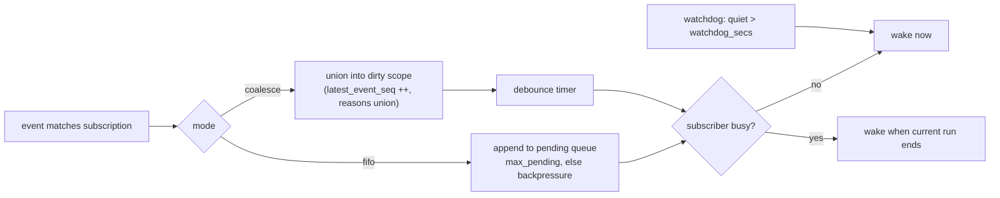

> **Target design, not runtime status.** Adopted through [ADR-0008](../../decisions/ADR-0008-foundation-adoption.md). Source front matter below records its original proposal status. Current executable boundaries live in [Architecture](../README.md), ADRs and contracts. Exact schemas/thresholds here require implementation decisions.

---
status: proposed
authority: architecture-proposal
date: 2026-09-15
project: KnowScroll Core Engine v2
scope: Design only. Event names are proposals; the envelope is the contract. Coalescing and direct-intent rules match [22-GLOBAL-EXECUTION.md](22-GLOBAL-EXECUTION.md) §7.
---

# Event architecture: the Ledger, subscriptions, dirty scopes, and wake rules

Everything the engine knows happened is an event. Everything the engine decided is an event. Everything a model proposed, and what the reducer did with the proposal, is an event. This document defines the envelope, the topics, the ordering rules, the subscription language, the two wake semantics, and the durable spines (Job, Attempt, Step, Bundle, Proposal, Permit, BudgetReservation, Receipt) that the event log is paired with. It is the durable spine underneath the call graph in [03-ARCHITECTURE.md](03-ARCHITECTURE.md) and the admission gate in [22-GLOBAL-EXECUTION.md](22-GLOBAL-EXECUTION.md).

The runtime review §§4, 11 and 17 establish the boundary this chapter respects: a proposal against identified inputs, a stale-result policy, an attempt lifecycle whose `Unknown` state is not a `Completed` state, and an envelope whose read set is the validator's contract.

## 1. Why one log

The alternatives were considered and rejected:

- **Separate queues per module** (a research queue, a room queue, a generation queue): each module would need its own audit trail, and "why did this happen" would require joining five logs. The existing `observation_event`, `world_delta`, `agent_message`, `generation_receipt` tables in `ARCHITECTURE.md` §7 are exactly this fragmentation; they remain as *projections* but the source of truth becomes one ordered log.
- **A message broker** (Redis streams, NATS): a second daemon for five users, and job state would leave the transaction that writes receipts. D-002 already rejected this for jobs; the same argument applies to events.
- **A persistent agent's trajectory as the log** (Headlong): correct for one agent, wrong for a system with a person, ten modules, and privacy scopes. The trajectory idea is used per agent ([10-CORE-AGENT.md](10-CORE-AGENT.md), [12-PERSISTENT-AGENTS.md](12-PERSISTENT-AGENTS.md)); the system log is typed and the agent's trajectory is a projection.

One relational store with a monotonic sequence, optimistic concurrency control on the durable entities, and consumer cursors gives ordering, replay, and audit with nothing to operate. The runtime review §1.1 establishes this posture.

## 2. The envelope

```ts
type Event = {
  seq: number;                 // monotonic per database; the only ordering
  id: string;                  // ulid; idempotency key
  at: string;                  // event time (ISO)
  ingested_at: string;         // when the engine saw it
  user_id: string | null;      // null for shared-substrate and system events
  epoch: number;               // the user's privacy epoch at emit time
  scope: { kind: 'universe'|'room'|'blend'|'public'|'system'; id: string };
  scope_epochs: Array<{ scope_id: string; epoch: number }>; // every authorization dependency
  location?: { kind: 'place'|'branch'|'session'|'substrate'; id: string };
  investigation_id?: string;
  type: string;                // dotted topic, see §3
  actor: { kind: 'person'|'module'|'resident'|'visitor'|'steward'|'cutroom'|'clock'|'friend'; id: string };
  cause: string[];             // ids of events that caused this one (the causal chain)
  context: { origin: 'own'|'visit'|'blend'|'shared_item'|'room'|'system'; via?: string };
  payload: object;             // typed per event type (zod)
  receipt?: string;            // model_receipt or generation_receipt id, when a model or provider was involved
  bundle_id?: string;          // the ContextBundle the step ran against, when this event is a Proposal
};
```

Five fields carry most of the design:

- **`cause`** makes "Why this appeared" a graph walk and makes every structural change traceable to the observations that produced it.
- **`context.origin`** is how social exposure is kept out of personal evidence ([13-SOCIAL-BLEND.md](13-SOCIAL-BLEND.md)): the Accounts module reads it and routes the event to the social ledger instead of the attention ledger.
- **`epoch`** is how a privacy reset fences late work: a consumer compares the event's epoch to the user's current epoch and drops stale work. The runtime's attempt lifecycle treats the epoch as a fence on every step boundary ([22-GLOBAL-EXECUTION.md](22-GLOBAL-EXECUTION.md) §6.3).
- **`bundle_id`** is how a Proposal ties back to the frozen inputs the model saw. A Proposal whose bundle hash differs from the bundle the reducer now resolves is stale and must be `Rejected` rather than silently reapplied.
- **`scope`** is the authorization root (`universe`, `room`, `blend`, or `public`, with its ID and epoch dependencies). `investigation_id` separately identifies a long-running question; children inherit authorized scope, never create permission by naming an investigation.

## 3. Topics

Topics are dotted and hierarchical so subscriptions can match by prefix. The topics added by the runtime review and the global execution chapter are marked **(new)**.

| Prefix | Emitted by | Examples |
|---|---|---|
| `obs.` | ingest (the person) | `obs.offered`, `obs.visible`, `obs.played` (with visible interval), `obs.skip`, `obs.branch_request` (kind), `obs.keep`, `obs.ask`, `obs.enter_world`, `obs.return_to_place`, `obs.prediction`, `obs.thought` (in a room), `obs.correction` (wrong connection, less like this), `obs.useful`, `obs.mute`, `obs.session.start`, `obs.session.end` |
| `serve.` | Composer, Resolver | `serve.window` (receipt: families, probabilities, exclusions, BridgeCandidate refs), `serve.branch` (explicit request resolved), `serve.substituted` (sourced alternative served when no exact branch) |
| `account.` | Accounts | `account.updated` (coalescing), `account.line_crossed` (which state line, which concept) |
| `episode.` | Accounts | `episode.opened`, `episode.closed` |
| `structure.` | Cartographer | `structure.proposal`, `structure.evaluated`, `world_delta.committed`, `world_delta.rejected` |
| `hypothesis.` | rules, Steward via reducer | `hypothesis.proposed` (carries alternatives and evidence refs), `hypothesis.updated`, `hypothesis.decayed` |
| `bridge.` | Steward via reducer | `bridge.candidate.admitted` (a BridgeCandidate the reducer accepted), `bridge.candidate.rejected` (reason), `bridge.candidate.used` (the Composer's deterministic gate admitted it into candidate cache) **(new)** |
| `supply.` | Quartermaster | `supply.demand`, `supply.demand.fulfilled`, `supply.demand.deferred`, `supply.gap`, `readiness.changed` **(new prefix naming)** |
| `cutroom.` | Cutroom host adapter (mirrored) | `cutroom.run.submitted`, `cutroom.event`, `cutroom.run.cancelled`, `cutroom.run.completed`, `cutroom.gate.verdict` **(KnowScroll adapter events, not a claim about Cutroom wire names; the old `sdk.` proposal is superseded)** |
| `research.` | research runner | `research.requested`, `research.completed`, `claim.added`, `source.added`, `claim.corrected` |
| `room.` | Room runtime | `room.opened`, `room.thread.opened`, `room.post`, `room.position.changed`, `room.test.proposed`, `room.artifact.created`, `room.ladder.moved`, `room.episode.started`, `room.episode.ended`, `room.quiet`, `room.dormant` |
| `resident.` | Room runtime | `resident.woke`, `resident.rested`, `resident.commitment.made`, `resident.commitment.due` |
| `steward.` | Steward | `steward.woke`, `steward.proposal.<kind>`, `steward.memory.edited`, `steward.slept`, `steward.investigation.opened`, `steward.investigation.closed` **(new)** |
| `proposal.` | reducer | `proposal.accepted`, `proposal.rejected` (reason) |
| `gate.` | Gates | `gate.verdict`, `publish.state.changed` |
| `chronicle.` | Scribe | `chronicle.entry` |
| `social.` | Projector | `social.visit.started`, `social.seen`, `social.share`, `blend.created`, `blend.ended` |
| `clock.` | launchd | `clock.hour`, `clock.heartbeat`, `clock.night` |
| `policy.` | operator | `policy.version`, `epoch.incremented`, `budget.changed` |
| `job.` | scheduler, runtime | `job.queued`, `job.leased`, `job.completed`, `job.cancelled`, `job.superseded`, `job.failed` **(new)** |
| `attempt.` | admission gate | `attempt.reserved`, `attempt.sent`, `attempt.completed`, `attempt.unknown`, `attempt.failed`, `attempt.cancelled`, `attempt.settled` **(new)** |
| `receipt.` | admission gate | `receipt.emitted` with the receipt id; the receipt body lives in the receipts store **(new)** |

The `job.*` and `attempt.*` prefixes are the operational trail of the global execution plane. Their events are written by the admission gate and the scheduler; modules read them as they would any other event. The runtime review §17 establishes the lifecycle these prefixes describe.

## 4. Ordering and idempotency

- **Order is `seq`.** Event time (`at`) is data; consumers never sort by it.
- **A consumer has one cursor** (`consumer_cursor(name, seq)`), advanced only after its work for that event is durably done. Restart resumes from the cursor.
- **Folding is idempotent per event id.** The reducer keeps `applied(event_id)`; an event applied twice is a no-op. This is what makes replay safe.
- **A module that emits in response to an event includes that event's id in `cause`.** Loops are detected by depth: a cause chain longer than 32 is rejected and alarmed.
- **Optimistic concurrency control on durable entities.** Job, Attempt, Permit, BudgetReservation, Proposal and ContentAssetRevision all carry a `version` column. Writes that present a stale version fail; the runtime does not "fix" stale writes, the reducer rejects them.

## 5. Durable entities beyond the event row

The runtime review §5 calls these out as separate durable entities, not fields on one row. Each is its own table; the event log is the trace of what happened to them.

| Entity | Owns | Where it lives |
|---|---|---|
| `Job` | work request: identity, kind, scope, class, budget owner, dependencies, outcome reference | `job` table; one row per Job |
| `Attempt` | one external invocation try for a Step: route, permit, request ID, status and fencing | `attempt` table; one row per Attempt |
| `Step` | one logical unit inside a Job, with zero or more external Attempts | `step` table plus append-only checkpoints; owned by Job |
| `ContextBundle` | frozen snapshot the step ran against: scope, privacy epoch, evidence refs, version hashes, token budget | `context_bundle` table; immutable, content-addressed by hash |
| `Proposal` | typed result with required evidence, preconditions, permissions, expiry | `proposal` table; one row per Proposal |
| `Permit` | the durable record that an Attempt reserved its share of every applicable resource | `permit` table; one aggregate per admitted Attempt, with dimension reservations |
| `BudgetReservation` | the durable record that an Account set aside the cost estimate for an Attempt | `budget_reservation` table; settled on Attempt completion |
| `Receipt` | the causal and cost spine that links an Attempt to its outcome | `receipt` table; the receipts store |
| `Investigation` | a persistent, scoped question with alternatives, evidence refs, child Jobs and a stopping rule | `investigation` table; described in [10-CORE-AGENT.md](10-CORE-AGENT.md) §3 |
| `ContentAssetRevision` | immutable revision of a reusable media asset with provenance and rights | `content_asset_revision` table |
| `EncounterBinding` | per-user binding of a `ContentAssetRevision` to a place, invitation and selection receipt | `encounter_binding` table |

The runtime review §5 explains the rationale. Two operational consequences: a crash between send and response is detectable because the Attempt exists; recovery may retain an unknown outcome when the provider cannot reconcile; a duplicate apply is impossible because the Proposal carries an `effect_key` and the reducer's transaction rejects duplicates.

## 6. Subscriptions

A subscription is a row, not code:

```ts
type Subscription = {
  subscriber: string;                 // 'accounts' | 'cartographer' | 'steward' | 'resident:r_17' | 'investigation:i_42' | ...
  filter: {
    types: string[];                  // prefixes: ['obs.', 'social.']
    user_id?: string;                 // residents and the Steward are per universe
    scope?: { kind: string; id?: string };
    predicate?: string;               // small expression over payload, e.g. "payload.kind == 'branch_request'"
  };
  mode: 'fifo' | 'coalesce';          // §7
  debounce_ms?: number;               // for coalesce: wait this long for more before waking
  watchdog_secs?: number;             // if set, synthesize an idle wake after this much silence
  run: 'inline' | 'job';
  max_pending: number;                // fifo cap; then backpressure
  enabled: boolean;
};
```

Residents subscribe with `scope: {kind:'room', id}` plus predicates like "payload.thread_id in my_threads or payload.addressed_to == me". The Steward subscribes to a short list of event *classes*, not to `obs.*` in general. The Composer does not subscribe to anything; it reads state on request. Investigations have their own subscription, distinct from the Steward's, so that parent and child Jobs can wake on their own evidence without coupling to the Steward's debounce.

## 7. Two wake semantics

This is the part borrowed from Headlong's thinker dispatch, because it solves a real problem: a busy agent must neither miss a direct message nor replay a thousand "state changed" pings. The runtime review §9.1 and the [global execution chapter](22-GLOBAL-EXECUTION.md) §7 specify the dirty high-water mark and the freeze-and-retain rule that this section pairs with.



- **FIFO** for things that deserve individual handling: a person's branch request, a message addressed to a resident, a job result, a receipt for a proposal, an explicit Ask, a privacy reset, a budget change. FIFO events never coalesce.
- **Coalesce** for "you should look again": account updates, chart changes, substrate changes, readiness changes. The wake payload is not the event; it is "there is news, the dirty scope is `S` and the latest event sequence is `H2`", and the module reads state.
- **Debounce** exists so that a person swiping ten times in a minute produces one Steward wake, not ten. The Steward's coalesce debounce is 90 seconds; a resident's is 5 minutes; the Cartographer's is 10 minutes; a quiet universe's may be longer.
- **Watchdog** is the only source of unprompted activity. It fires for the Steward (backing off, §3 of [03-ARCHITECTURE.md](03-ARCHITECTURE.md)) and for each Room's Keeper (weekly, to decide whether the room goes dormant). Residents do not have watchdogs; they wake on events or on the night allocation.
- **Direct intents never collapse.** A correction, an Ask, a branch request, a privacy reset, a budget change each produce their own Job in their own Attempt with their own outcome. Sharing retrieval work is allowed; collapsing the intents themselves is not.

### 7.1 The dirty high-water mark

When a coalesced job starts running against a dirty scope, the scheduler snapshots the scope's `latest_event_seq` as input high-water mark `H`, leaving `processed_event_seq` unchanged until completion. The job reads through `H`. If new events arrive that push the scope's `latest_event_seq` to `H2`, the in-flight job does not see them; its completion marks only the work through `H` as processed. In the same completion transaction, the global scheduler detects `H2 > H`, preserves the dirty scope with the new `latest_event_seq`, and either schedules a continuation Job or keeps the dirty marker armed. The boolean dirty flag is never cleared unconditionally; that loses new work.

```ts
type DirtyScope = {
  scope: { kind: 'universe' | 'room' | 'public' | 'blend'; id: string };
  job_family: string;
  first_dirty_at: string;
  latest_event_seq: number;
  processed_event_seq: number;        // last successfully completed H
  reasons: string[];                  // union, never overwritten
  pending_job_id: string | null;
  high_water_at_run: number | null;
  high_water_at_complete: number | null;
};
```

A direct intent arrival does not touch `reasons`; it is its own Job. A coalescing reason writes into `reasons` and increments `latest_event_seq`. The scheduler's deterministic idle check (§8 of [22-GLOBAL-EXECUTION.md](22-GLOBAL-EXECUTION.md)) uses the same field set to decide whether to skip a model call.

## 8. What is a "session"

Client sessions matter for the Composer and for episodes:

- `obs.session.start` is emitted when the client foregrounds after ≥ 30 minutes away; `obs.session.end` after 5 minutes of no observation.
- **Session state** ([05-DATA-STATE-MODEL.md](05-DATA-STATE-MODEL.md) §4) is a small row updated inline: branch stack, the last 20 concepts seen with timestamps, fatigue counters per place and per form, the branch horizon (predicted probabilities of each branch kind on the current item), the current scope (universe, a place, a room, a blend).
- An **episode** is the unit of evidence: all events within one session that share a root encounter or a branch chain, closed when the person moves vertically twice or 30 minutes pass. Ten actions around one reel are one episode; the Accounts module caps what one episode can contribute ([06-USER-WORLD-MODEL.md](06-USER-WORLD-MODEL.md) §3).

## 9. The privacy epoch in the log

Implementation boundary: [ADR-0010](../../decisions/0010-clear-scroll-history.md) defines physical erasure of the current bootstrap Scroll encounter history with a minimal retry receipt. The semantic **reset** below is a separate target contract, not the implementation of that history-clear endpoint. Account deletion and backup retention need their own policy; neither operation is implied by an epoch increment.

A reset does not delete the log. It:

1. appends `epoch.incremented` for the user;
2. tombstones the payloads of the user's `obs.*`, `hypothesis.*`, `steward.*`, `room.*` (private rooms) events older than the new epoch, leaving envelopes for audit where policy permits;
3. deletes derived state (accounts, chart, hypotheses, Steward memory, private room state) through a dependency index;
4. marks every in-flight `Attempt` with `status = Withdrawn` and lets the global scheduler settle the `BudgetReservation` and `Permit` rows without applying their `Proposal`s;
5. lets every consumer drop pending work whose `epoch` is old at its next step.

Shared substrate events (claims, sources) are not personal and survive. A room the person shared with a friend follows the room's ownership rule, not the resetting person's epoch.

## 10. Why not derive everything from the log at read time

Serving reads projections because replaying the full history per request would be too slow. Accepted domain events and projection updates share a transaction, so domain projections can be reconstructed from a valid snapshot plus the retained event suffix using the recorded reducer version. Runtime intents, provider receipts, source snapshots and artifact bytes are separate canonical inputs; rebuilding them never means rerunning model calls.

A replay check starts from the same known checkpoint and compares at the same event watermark, with matching reducer/policy versions. A seven-day tail without its initial state cannot reproduce lifetime aggregates. An unexplained difference is a correctness failure; a deliberate version migration needs an explicit comparison policy. Erased private payloads stay erased rather than being recreated from an audit copy. A pending dirty scope with `latest > processed` is expected; clearing it prematurely is the bug.

## 11. The proposal envelope and stale-reads policy

This envelope is a target protocol. Current explicit keeps use server-owned scope, exposure lineage and epoch checks under the universe lock; they are commutative deterministic references, not semantic proposals. Before adding proposals, specialize each read-set entry with entity kind, authorized scope, immutable identity and revision/evidence validity. Check those dependencies and operation preconditions atomically with application. A global Accounts or universe revision alone is not a substitute for this semantic read set.

The runtime review §11 defines the envelope the reducer validates:

```ts
interface ProposalEnvelope {
  id: string;
  job_id: string;
  scope_id: string;                              // bound from the authenticated job; never trusted from the model
  input_bundle_id: string;
  base_world_version: number;                    // the world_version the proposal was prepared against
  privacy_epoch: number;                         // the privacy_epoch the proposal was prepared against
  read_set: Array<{ entity_id: string; revision: number }>;     // the stable scoped readset
  evidence_refs: string[];
  proposed_operations: TypedDomainOperation[];
  expires_at?: string;
  effect_key: string;                            // unique per Proposal; duplicate apply is rejected
  explanation: string;
};
```

The server supplies the trusted envelope fields (scope, world_version, privacy_epoch, effect_key). The model supplies the operations and the explanation; the model's `confidence` is stored as a labeled estimate and is not authorisation or calibrated correctness.

**Apply transaction:** check idempotency by `effect_key` → active privacy/cancellation fences → evidence validity → read/write preconditions → domain invariants → apply accepted operation group → append mutation/outcome events and outbox → record proposal disposition. Checks and writes are atomic relative to conflicting domain writes; validating outside a transaction and applying blindly is the failure mode this envelope prevents.

The stale-result matrix the runtime review §11 names:

| Change | Handling |
|---|---|
| Unrelated newer observations | Apply if the complete semantic read set still holds; preserve historical input watermark |
| Commutative observation/reference addition | Deterministic merge only when the operation's defined semantics permit it |
| Target renamed/moved/split; premise changed | Rebuild context and re-evaluate; do not mechanically transplant the model's conclusion |
| Privacy epoch changed, evidence withdrawn, authorization revoked | Reject application; stop further calls; reconcile cost and perform required cleanup |
| Better equivalent pending job exists | Supersede old work; retain receipt, avoid duplicate mutation |
| Result useful as public factual research but personal plan stale | Separately validate admissible public artifact; do not silently declassify personal output |

A "rebase" is either a proven deterministic transformation or another funded inference. It is not a generic free repair. Atomic operation groups prevent a planet creation and its required provenance from being half-applied. Independent Proposals may succeed or fail separately with explicit receipts.

## 12. What the Ledger does not promise

- **Exactly-once effects.** Leases and fencing tokens do not eliminate provider ambiguity; the `Attempt.status = Unknown` is the contract. The runtime may reconcile, may schedule a bounded retry under effect-specific policy, but it never invents a success.
- **A globally meaningful event order across hosts.** Within one scope, events are ordered by `seq`. Across scopes, only causal references are preserved. A replicated universe does not promise total order.
- **A single physical log.** One logical event vocabulary, possibly many physical stores, with explicit outbox/inbox boundaries at the hosted multi-host boundary ([22-GLOBAL-EXECUTION.md](22-GLOBAL-EXECUTION.md) §13).
- **Calibrated provider outcomes.** A provider's reported usage is its usage; a provider's reported refusal is its refusal; an `Unknown` Attempt is unknown until reconciliation, not assumed success and not assumed failure.

These are the limits that let the runtime and the global scheduler make honest decisions under load.
