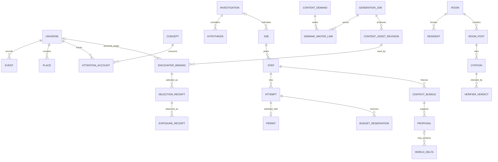

> **Target design, not runtime status.** Adopted through [ADR-0008](../../decisions/ADR-0008-foundation-adoption.md). Source front matter below records its original proposal status. Current executable boundaries live in [Architecture](../README.md), ADRs and contracts. Exact schemas/thresholds here require implementation decisions.

---
status: proposed
authority: architecture-proposal
date: 2026-09-15
project: KnowScroll Core Engine v2
scope: Design only. Table names are logical proposals; migrations decide SQL. Where a table already exists in ARCHITECTURE.md §7 it is kept and the difference is noted. The ER diagram is the authoritative reference for the durable spine; the table sections below deepen it.
---

# Data and state model: what is persistent, who owns it, how it relates

The engine's state is a set of materialized views over the Ledger ([04-EVENT-ARCHITECTURE.md](04-EVENT-ARCHITECTURE.md)), augmented by the durable entities the runtime, the global scheduler and the content plane need ([21-REASONING-RUNTIME.md](21-REASONING-RUNTIME.md), [22-GLOBAL-EXECUTION.md](22-GLOBAL-EXECUTION.md), [23-CONTENT-DEMAND-AND-INVENTORY.md](23-CONTENT-DEMAND-AND-INVENTORY.md)). This document lists every store, their owners, the relationships an engineer needs to hold in their head, and the ER diagram that anchors them. One SQLite file (D-001) in v0.1; managed PostgreSQL at the hosted multi-host boundary as a future proposal.

## 1. The ER diagram

This overview shows actual logical entities rather than treating store names as SQL rows. Cardinalities describe a proposed logical model; final migrations must prove the foreign keys, uniqueness constraints and retention rules. [25-JOURNEY-AND-DATA-FLOWS.md](25-JOURNEY-AND-DATA-FLOWS.md) separates the complete model into four readable diagrams.

**Authority distinction:** Ledger events are canonical accepted domain history, paired transactionally with derived state. Runtime intentions, provider receipts, source snapshots and artifact bytes also have their own durable records; they are not reconstructed by rerunning models from the Ledger. A job with no model call can still have a complete outcome. Not every world delta needs a model receipt.

## 2. The eleven stores

| # | Store | Owner (only writer, via the reducer) | Rebuildable from the Ledger? |
|---|---|---|---|
| 1 | Ledger | ingest and modules | it *is* the source |
| 2 | Substrate | research runner, verifier, operator | yes, from `research.*` and `policy.*` events plus source snapshots |
| 3 | Accounts | Accounts module | yes |
| 4 | Chart | Cartographer | yes |
| 5 | Hypotheses | rules, Steward proposals | yes |
| 6 | Inventory | Quartermaster, Gates, Cutroom mirror | yes, except media bytes, which live in the object store |
| 7 | Rooms | Room runtime | yes, except journals, which are append-only files |
| 8 | Steward memory | Steward | journal append-only; memory blocks rebuilt from `steward.memory.edited` |
| 9 | Social | Projector | yes |
| 10 | Runtime spine | runtime, admission gate | yes, by replay; live rows persist with optimistic concurrency control |
| 11 | Content plane | Quartermaster, Gates, Cutroom host adapter | yes, except media bytes |

Plus an **Ops** group (`policy_version`, `receipt`, `replay_check`) that is operational rather than product state.

## 3. Store 1: Ledger

| Table | Fields | Notes |
|---|---|---|
| `event` | `seq, id, at, ingested_at, user_id, epoch, scope_kind, scope_id, type, actor_kind, actor_id, cause (json), origin, via, payload (json), receipt_id, bundle_id` | envelope of [04-EVENT-ARCHITECTURE.md](04-EVENT-ARCHITECTURE.md) §2 |
| `consumer_cursor` | `consumer, seq, updated_at` | one row per subscriber |
| `applied` | `event_id, consumer` | idempotency |
| `subscription` | `subscriber, filter (json), mode, debounce_ms, watchdog_secs, run, max_pending, enabled` | residents and Investigations insert their own rows when created |
| `pending_wake` | `subscriber, kind, payload, created_at` | the FIFO / coalesced pending wakes |
| `dirty_scope` | `scope_kind, scope_id, job_family, first_dirty_at, latest_event_seq, processed_event_seq, reasons (json), pending_job_id, high_water_at_run, high_water_at_complete, version` | the runtime review §9.1 freeze-and-retain rule |

The `dirty_scope` table is new and is the durable form of the coalescing state. The runtime's freeze-and-retain rule and the global scheduler's deterministic idle check read and write it; the [event architecture](04-EVENT-ARCHITECTURE.md) §7.1 defines the field semantics.

## 4. Store 2: Substrate (shared)

Kept from `ARCHITECTURE.md` §7.1 with three additions.

| Table | Fields | Notes |
|---|---|---|
| `concept` | `id, canonical_name, description, kind, code, embedding_ref, created_by, created_at` | `code` is a hierarchical semantic address, stable |
| `concept_relation` | `from, to, kind, weight, evidence_claim_id, valid_from, valid_to` | kinds: `narrower_than, prerequisite_for, explains, contradicts, analogous_in, applies_to, part_of, co_explored` — `co_explored` is behavioural |
| `claim` | `id, statement, truth_state, confidence, valid_from, valid_to, epistemic_status` | |
| `claim_source` | `claim_id, source_id, support_kind, locator, family_id` | `family_id` groups sources from one origin; grouping is not proof that different families are independent |
| `evidence_family` | `id, root_source_id, kind` | origin/derivation lineage; independence requires evidence |
| `source`, `source_snapshot`, `correction` | as existing | |
| `concept_neighbourhood` | `concept_id, neighbour_id, distance, path_kind` | precomputed 2-hop index |
| `bridge_candidate` **(new)** | `id, scope_kind, scope_id, scope_epochs, from_concept_id, to_concept_id, relation_type, mechanism (text), prerequisites (json), limitations (json), evidence_refs (json), counterevidence_refs (json), admitted_at, admission_proposal_id, status, version` | the runtime review §1.3 BridgeCandidate; private bridge candidates remain in scoped partitions; only independently authorized public knowledge belongs in shared substrate; the validator admits candidates; the deterministic Composer decides whether it appears next |
| `encounter_plan` **(new)** | `id, scope_kind, scope_id, investigation_id, bridge_candidate_id (nullable), question_ref, learning_intent (not inferred learning), prerequisites, explanation_sequence, evidence_refs, candidate_constraints, expiry, proposal_id, version` | validated plan affecting retrieval and demand; private plans remain scoped |
| `limitation` **(new)** | `bridge_candidate_id, kind, statement, evidence_refs (json)` | `kind ∈ {analogy_limit, scope_limit, evidence_limit}`; required by the validator before a candidate is admitted |

The substrate is deliberately larger than any universe. It is seeded once from an editorial concept map (a few hundred concepts, hand-checked) and grows only through research episodes and verifier-accepted claims. The **sky** the client shows as faint constellations is a projection of this store.

Bridge evidence is a validated payload, not arbitrary JSON: `{ claim_id, source_snapshot_id, revision, locator, supports: from | to | mechanism | limitation }`. The bridge intake checks support for both concept sides and the proposed relationship, plus limitations appropriate to the claim. A citation count alone cannot establish the mechanism; all references resolve to authorized source material. Counterevidence may be empty only with an explicit search/disposition, not a claim that none exists.

## 5. Store 3: Accounts (per user)

| Table | Fields | Notes |
|---|---|---|
| `attention_account` | `user_id, concept_id, mass, mass_at, episodes, days_active, span_days, exposure_s, marks (json by kind), returns, first_at, last_at, last_return_at, social_seen, social_marks, negatives (json), source_families, exposure_share, lines (json), state, version` | one row per concept the person has ever met; `state ∈ {seen, sighted, anchored, dormant, archived}` |
| `episode` | `id, user_id, session_id, root_encounter_id, opened_at, closed_at, concepts (json weights), weight, has_voluntary, is_return, origin` | the evidence unit |
| `mark` | `id, user_id, episode_id, event_id, kind, concept_id, weight, origin` | one voluntary act |
| `route` | `user_id, from_concept, to_concept, kind, count, last_at, first_at` | navigation edges |
| `session_state` | `user_id, session_id, scope (json), branch_stack (json), recent (json), fatigue (json), horizon (json), window_no, updated_at` | small; rewritten inline |
| `family_posterior` | `user_id, scope_kind, family, alpha, beta, updated_at` | Thompson sampling state |
| `social_account` | `user_id, concept_id, via_user_id, seen, marks, first_at, last_at, converted_at` | the social ledger |

## 6. Store 4: Chart (per user)

| Table | Fields | Notes |
|---|---|---|
| `place` | `id, user_id, kind, name, anchor_concept_id, parent_place_id, state, born_at, born_delta_id, superseded_by, salience, version` | kinds: `sighting, planet, region, system, galaxy, moon, hole, ruin, station, relic_moon` |
| `place_anchor` | `place_id, concept_id, weight, role` | `role ∈ {primary, member, bridge}` |
| `place_relation` | `from_place, to_place, kind, weight, lineage_id, valid_from, valid_to` | `kind ∈ {contains, orbits, bridge, moon_of, pulls (hole), rests_on (settled question dependency)}` |
| `structure_proposal` | `id, user_id, kind, target_place_id, proposal (json), viability (json), tests (json), status, evaluated_at, evaluations, model_receipt_id, reason` | the Cartographer's working object |
| `world_delta` | `id, scope_kind, scope_id, type, payload, lineage, risk_tier, status, causal_class, evidence (json), before, after, reason, version` | `causal_class ∈ {personal_exploration, shared_evidence_change, room_artifact, explicit_revision, policy_correction, social}` |
| `layout_hint` | `place_id, layout_version, ring, angle, size, style` | advisory to the renderer |
| `chronicle_entry` | `id, user_id, delta_id, artifact_id, sentence, visibility, created_at, seen_at` | |

## 7. Store 5: Hypotheses (per user)

Kept exactly as D-004 (`user_hypothesis`, `hypothesis_evidence`, `hypothesis_relation`, `inference_run`, `personalization_suppression`, `explanation_path`) with these refinements:

- `permitted_uses (json)` on `user_hypothesis` lists which decisions it may influence (`composer.family_prior`, `steward.context`, `chronicle.wording`, `none`). A hypothesis with `permitted_uses = ['steward.context']` can shape what the Steward reads and never shapes ranking.
- `user_hypothesis` adds a projected `alternatives (json)` view listing competing interpretations, each with its own `evidence_refs` and `counterevidence_refs` and `confidence_label`. The runtime review §1.2 requires concrete alternatives with exact question and evidence refs; the alternatives column is the storage form.
- `user_hypothesis.investigation_id` references the Investigation row whose open question raised the hypothesis. A hypothesis is a typed alternative inside an investigation, not an unattached note.
- `hypothesis_alternative` (new) is the canonical row for each competing interpretation; the JSON view is not a second writable copy with evidence and counter-evidence refs, confidence label, expiry, and supersession lineage. This is the runtime review §1.2 "alternatives" storage.

## 8. Store 6: Inventory

| Table | Fields | Notes |
|---|---|---|
| `encounter` | as existing (`kind: reel\|scroll`, truth_state, status, risk_tier, created_by_kind) plus `origin_place_kind, gap_kind, slop (json)` | `gap_kind` records *why it exists* (`continuation, depth, bridge, frontier, challenge, revisit, room_artifact, seed, social`) |
| `encounter_concept` | `encounter_id, concept_id, weight, role` | `role ∈ {primary, secondary, mentioned}` |
| `encounter_claim`, `branch`, `continuity_capsule`, `capsule_claim`, `capsule_relic`, `reel_asset`, `scroll_document`, `scroll_block`, `witness_observation`, `encounter_reconciliation`, `trace`, `relic`, `prediction` | as existing | |
| `readiness` | `encounter_id, state, tier, playable_at, manifest_ref, expires_at, pool, verdict_summary` | `state ∈ {planned, preparing, playable, complete, eligible, withdrawn}`; `eligible` = passed KnowScroll gates and publication policy |
| `brief` | `id, user_id, scope, gap_kind, cause (json), question, intent_act, claims (json), capsule_id, deadline_class, budget_usd, priority, pool, lane, status, cutroom_project_id, created_by, content_demand_id (new)` | the `EncounterBrief`, now linked to its originating `ContentDemand` |
| `fingerprint` | `encounter_id, semantic (vector ref), template (hash of structure), argument (hash of claim set)` | repetition detection |
| `verdict` | `id, target_kind, target_id, gate, outcome, evidence (json), model_receipt_id, at` | mirrors Cutroom verdicts and holds KnowScroll's own |
| `publication` | `encounter_id, state, policy_version, at, reason` | `draft → evaluated → approved → published → corrected → retired` |
| `verifier_verdict` (new) | `id, citation_id, claim_id, source_id, locator, outcome, model_receipt_id, at` | verifier is a separate logical entity, not just a gate on a verdict row |
| `citation` (new) | `id, room_post_id, claim_id, source_id, locator, family_id` | a claim cited by a room post; the verifier validates it |
| `inventory_suitability` (new) | `id, content_demand_id, encounter_id, score, reason, suitability_status` | the runtime review §15.2 two-stage reuse decision: retrieval candidates then suitability |

## 9. Store 7: Rooms

| Table | Fields | Notes |
|---|---|---|
| `room` | `id, user_id (owner) or null (shared), place_id, question, anchor_concept_id, ladder, charter (json), opened_at, opened_by (kind,id), visibility, budget_account_id, last_episode_at, state, version` | `ladder ∈ {opened, arguing, settling, made, quiet, dormant, reopened}` |
| `room_thread` | `id, room_id, question, opened_by, state, holder_resident_id` | sub-questions |
| `room_position` | `id, room_id, thread_id, resident_id, stance, statement, evidence_families (json), confidence, valid_from, valid_to, superseded_by` | bi-temporal |
| `room_post` | `id, room_id, thread_id, author (kind,id), kind, content, claim_refs (json), addressed_to, at, verifier_verdict_id` | `kind ∈ {position, objection, question, test_proposal, finding, thought (person), summary}` |
| `room_test` | `id, room_id, thread_id, proposed_by, description, method, status, result_artifact_id` | a runnable check |
| `room_artifact` | `id, room_id, kind, payload, truth_state, made_by (json residents), evidence_families, gate_state, escaped_as (encounter_id or delta_id), at` | `kind ∈ {both_sides_scroll, bridge_proposal, ruin, probe_request, kept_thing, settled_answer, reframing}` |
| `room_budget` | `room_id, credits, funded_by (json), spent, last_funded_at` | attention-funded |
| `room_dependency` | `room_id, rests_on_room_id, artifact_id, kind` | "what this place can now say" |
| `resident` | `id, room_id, name, role (json: method, evidence_access), temperament (json: initiative, humility), standing, model_tier, threads (json), state, created_at, promoted_from_visitor_id` | |
| `resident_memory` | `id, resident_id, kind, content, refs (json), importance, created_at, last_accessed_at, valid_from, valid_to` | `kind ∈ {observed, heard, verified, reflection}` |
| `resident_commitment` | `id, resident_id, statement, due_at, state, fulfilled_by_post_id` | |
| `visitor` | `id, room_id, episode_id, role, summoned_for, contributions, at` | ephemeral agents |
| journal files | `rooms/<room>/<resident>/trajectory.jsonl` | append-only; tiered projection for context |

## 10. Store 8: Steward memory (per user)

| Table or file | Fields | Notes |
|---|---|---|
| `steward/<user>/trajectory.jsonl` | append-only steps: `wake, digest, tool_call, tool_result, proposal, memory_edit, sleep, fork_investigation, child_settled, synthesis_step` | the trajectory; tiered compaction is a *view*, the file is never rewritten |
| `steward_memory_block` | `user_id, name, content, version, updated_at, max_chars` | pinned blocks: `universe_summary, open_questions, recent_changes, my_open_plans, calibration, budget` |
| `steward_proposal` | `id, user_id, kind, payload, status, receipt_event_id, outcome (json), at` | every proposal and what became of it |
| `investigation` **(new)** | `id, user_id, scope (kind, id), question (text), open_questions (json), alternatives (json), evidence_refs (json), counterevidence_refs (json), accepted_artifact_refs (json), task_ids (json), next_wake (reason, not_before), stopping_rule, budget_account_id, status, opened_at, closed_at, version` | the runtime review §1.2 persistent investigation; the Steward resumes a matching open investigation when possible and opens one for a distinct unresolved question; children share its budget owner |
| `investigation_alternative` **(projection)** | `id, investigation_id, hypothesis_id, evidence_refs (json), counterevidence_refs (json), confidence_label, status, valid_until, supersedes` | read-only join of hypothesis alternatives by investigation; avoid duplicate canonical alternatives |

## 11. Store 9: Social

Kept from `ARCHITECTURE.md` §7.7 (`friendship, visibility_policy, visit_projection, share, blend, room_member`) with two additions: `social_mark` (in the Accounts store as `social_account`) and `blend_state` (`blend_id, overlap (json), complement (json), bridges (json), disagreements (json), computed_at, version`).

## 12. Store 10: Runtime and global execution spine

This is the cluster the runtime review §5 names as separate durable entities. It is the operational backbone the scheduler, the admission gate, the receipts store and the runtime depend on. Each entity has its own table with optimistic concurrency control on writes.

| Table | Fields | Notes |
|---|---|---|
| `job` | `id, kind, scope (kind, id), class, route_candidates (json), budget_account_id, parent_job_id, investigation_id, dependencies (json), causal_trigger_id, payload_hash, coalescing_key, not_before, soft_target, hard_expiry, status, lease_owner, lease_token, lease_deadline, attempt_count, outcome_ref, supersession_ref, cancellation_ref, policy_version, version` | the runtime review §7.1 durable job shape |
| `attempt` | `id, job_id, step_id, route_id, permit_id, status, deadline, output_ceiling, fence_token, request_id, response_id, usage (json), cost_usd, settlement_key, version` | the runtime review §5 separate durable entity; `Sent`, `Unknown`, `Completed`, `Failed`, `Cancelled`, `Superseded`, `Withdrawn` |
| `step` | `id, job_id, kind, model_ref, tool_ref, status, started_at, completed_at, bundle_id, content_hash, version` | logical work unit; status projection plus append-only journal; retries are new Attempts on this Step |
| `step_checkpoint` | `id, step_id, attempt_id, continuation_ref, completed_tool_refs, seq, at` | protected bounded checkpoint; transient token deltas are not canonical personal history |
| `context_bundle` | `id, job_id, step_id, scope (kind, id), privacy_epoch, build_version, retrieval_query, evidence_refs (json), summary_versions (json), entity_versions (json), event_high_water, token_budget (json), omitted_material_summary, prompt_version, content_hash, version` | immutable, content-addressed by hash; the runtime review §5 bundle |
| `proposal` | `id, job_id, step_id, kind, payload (json), input_bundle_id, base_world_version, privacy_epoch, read_set (json), evidence_refs (json), proposed_operations (json), effect_key, expires_at, status, applied_at, rejection_reason, version` | the runtime review §11 proposal envelope; reducer applies |
| `permit` | `id, attempt_id, dimensions (json), reserved_at, reserved_until, settled_at, actual_usage (json), version` | one aggregate permit per admitted Attempt; child quota reservations hold each applicable dimension |
| `budget_reservation` | `id, attempt_id, account_id, estimate_microusd, reserved_at, expires_at, settled_at, actual_microusd, refund_microusd, reason, version` | budget owner account |
| `receipt` | `id, scope (kind, id), cause_event_ids (json), trigger (json), job_id, attempt_id, route_id, permit_id, budget_reservation_id, policy_version, bundle_id, bundle_content_hash, event_high_water, result, proposal_id, proposal_disposition, usage (json), cost_usd, started_at, completed_at, operator_notes, version` | the runtime review §18.1 causal and cost spine |
| `model_receipt` | `id, attempt_id, provider_request_id, response_id, usage (json), cost_usd, capability_profile_snapshot, tariff_version, evidence_status, at, version` | a single model call's outcome |

Optimistic concurrency control: every mutation of a versioned projection presents the row's current `version` and increments it. A write that presents a stale version fails the database transaction; the runtime does not retry blindly, it re-reads and decides whether the new state invalidates the attempt.

## 13. Store 11: Content plane

This is the runtime review §14–§15 cluster, joined to Inventory by the `EncounterBinding` table and to Operations by the `cutroom_run` link.

| Table | Fields | Notes |
|---|---|---|
| `content_demand` **(new)** | `id, scope (kind, id), causal_signal_refs (json), encounter_intent (json), concept_claim_ids (json), audience_prerequisites (json), language, modality, continuity_constraints (json), evidence_requirements (json), deadline, reuse_policy, privacy_epoch, sponsor_budget, expiry, status, version` | the runtime review §14.1 typed demand; never a renderer call |
| `demand_waiter_link` **(new)** | `id, content_demand_id, generation_job_id, scope (kind, id), scope_epochs, exposure_account_id, requested_at, status` | many waiters may share one funded run; cancelling one waiter does not kill others |
| `generation_job` **(new)** | `id, origin_content_demand_id, scope (kind, id), lane (fast, quality, repair), pool, priority, status, cutroom_run_id, budget_reservation_ids (json), started_at, completed_at, version` | the runtime review §14.3 funded generation |
| `content_asset_revision` **(new)** | `id, generation_job_id (nullable for imported assets), base_revision_id, scope (kind, id), scope_epochs, source_paths (json), checksums (json), rights (json), provenance (json), created_at` | immutable content revision; mutable availability/withdrawal is a separate `asset_availability` projection |
| `encounter_binding` **(new)** | `id, content_asset_revision_id, scope (kind, id), scope_epochs, universe_id (nullable for other scopes), place_id, invitation_id, status, created_at, version` | scoped binding; selection and exposure receipts reference it later, at actual selection/exposure |
| `provenance` **(new)** | `id, content_asset_revision_id, kind, ref, captured_at, version` | `kind ∈ {source, derivation, import}`; the runtime review §14.3 host-local import |
| `cutroom_run` **(new)** | `id, generation_job_id, request_id, status, events (json), artifact_refs (json), local_paths (json), started_at, completed_at, cancelled_at, version` | mirrored from the V1 same-host contract; the runtime review §14.2 |

## 14. Ops

`policy_version`, `replay_check (date, diff_summary)`, `circuit_breaker (route_id, opened_at, opens, closes)`, `coalescing_stats (scope_kind, scope_id, family, ratios)`.

## 15. Sizes, for honesty

For one heavy user over a year: ~200k events, ~3k concepts touched, ~3k account rows, ~50 places, ~2k encounters, ~10 rooms with ~40 residents, one Steward journal of a few MB. These are sizing assumptions, not a SQLite benchmark; measure write contention, indexes, payload size and retention.

For one heavy user's runtime spine over a year: ~5k Jobs, ~10k logical Steps, ~15k Attempts (some Steps retry), ~5k Proposals, at least one outcome/usage receipt per external Attempt plus reconciliation entries. The runtime spine stays modest because the dirty scope table coalesces most "something changed" signals.

The growth that matters is the dirty_scope table under heavy activity. With per-scope `family` keys the table holds one row per (scope, job_family); one universe-level coalescing key per family is four rows for four families. If investigation-specific coalescing is needed, add an explicit investigation key under that same authorization scope; twenty investigations times four families then means eighty rows.

The Ledger is append-only and cheap to archive by `seq` range after twelve months. The runtime spine rows are durable for the lifetime of the Job or Attempt, then archivable; the receipts store keeps durable links for audit, with retention policy per receipt class.

## 16. Where the durable spine interacts with the runtime

The runtime review §5 establishes that the runtime, the global scheduler, the admission gate, the receipts store and the world reducer are the five writers of the runtime spine. Everything else reads.

- The runtime writes `attempt`, `step`, `step_checkpoint`, `context_bundle`, `proposal`, `permit` (via the admission gate), `budget_reservation` (via the admission gate), `model_receipt`.
- The global scheduler writes `job`, `consumer_cursor`, `pending_wake`, `dirty_scope`, `receipt`, `circuit_breaker`.
- The world reducer writes `applied`, `subscription`, `event` (consumer), and the domain stores.
- Modules and agents read these tables through scoped, permitted APIs; they never write directly.

A direct write to the runtime spine from anywhere else is a drift violation. Proposed import checks enforce module boundaries; transactional integration tests must prove write ownership and concurrency behavior.
