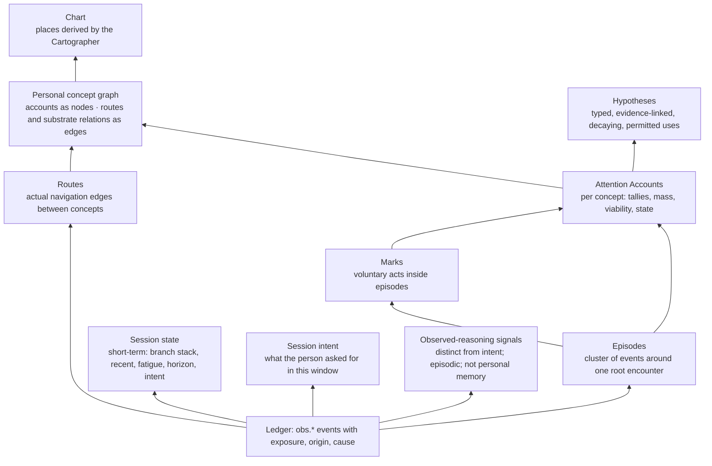

> **Target design, not runtime status.** Adopted through [ADR-0008](../../decisions/ADR-0008-foundation-adoption.md). Source front matter below records its original proposal status. Current executable boundaries live in [Architecture](../README.md), ADRs and contracts. Exact schemas/thresholds here require implementation decisions.

---
status: proposed
authority: architecture-proposal
date: 2026-09-15
project: KnowScroll Core Engine v2
scope: Design only. Thresholds and weights are bench values to calibrate against replayed histories before they become rules. Numbers are illustrative; the contracts they parameterize are not.
---

# The user and world model: what is measured, what is inferred, and what is never concluded

A person must not be reduced to an "interest score". That sentence in the founding documents is still right. What it left implicit is the layer beneath: how a stream of events becomes numbers the Composer and Cartographer can use **without a model call**, while still leaving room for a model to propose interpretations that have to survive evidence before they shape anything. This chapter defines that arithmetic — the **Attention Accounts** — and the layers above it: the session state, the personal concept graph, and the hypothesis layer. It also separates five things the previous draft conflated: **attention evidence** (what the engine sees), **user intent** (what the person asked for in this session), **personal hypotheses** (competing interpretations the engine has proposed), **observed reasoning** (what the person appeared to do), and **private memory** (long-lived interpretive material that does not yet rank anything). Each layer may conclude only what its evidence supports.

The reasoning runtime that proposes interpretations is defined in [21-REASONING-RUNTIME.md](21-REASONING-RUNTIME.md). The global scheduler that decides when those proposals are funded and when they wait is in [22-GLOBAL-EXECUTION.md](22-GLOBAL-EXECUTION.md). The supply side that turns unmet demand into reusable assets is in [23-CONTENT-DEMAND-AND-INVENTORY.md](23-CONTENT-DEMAND-AND-INVENTORY.md). This chapter stays inside the user/world plane: what is observed, what is derived from observation, and what is not yet allowed to leave the room in which it was proposed.

A worked example follows in §12; a one-week trace is reconstructed from evidence IDs only. "Why this appeared" (`01-OVERVIEW.md` §1) reads from this chapter's receipts; the Composer (`08-RECOMMENDATION.md`) consumes the rubric features it exposes; the Cartographer (`07-UNIVERSE-EVOLUTION.md`) reads the structural facts it produces.

## 1. The stack



| Layer | Deterministic? | Decays? | May conclude | May not conclude |
|---|---|---|---|---|
| Episodes and marks | yes | no (they are facts) | "this happened, in this context, caused by that" | anything semantic |
| Attention Accounts | yes | mass decays; counts do not | "this concept has this much recent attention and voluntary actions, with exposure and origin lineage" | why, what it means, who the person is |
| Routes | yes | no | "the person went from here to there this many times" | that the concepts are related in reality |
| Personal concept graph | yes | inherits Accounts' decay | "these accounts and routes form this structure" | that the structure is understood |
| Session state | yes | discarded at session end (retained 7 days for replay) | "right now they keep choosing mechanisms" | that this is durable |
| Session intent | yes | per-window; re-anchored on every event | "this branch request, this question, this correction" | that any model interpretation of it is correct |
| Observed-reasoning signals | yes | per-episode | "this episode contained a kept-then-revised prediction" | that the person understood or learned |
| Hypotheses | rules propose; reasoning runtime proposes; the reducer validates | yes, by policy | "probably; here is the evidence and the alternative explanation" | identity, diagnosis, mastery, belief |
| Private memory (Steward digest, resident journal) | model-owned; restricted reads | yes, by policy | nothing by itself; may carry hypothesis evidence | anything that influences serving without a typed proposal |

The five columns at the bottom of the table are deliberate. The previous draft merged "hypothesis" and "memory". The runtime review (§1.2, §10) requires that **persistent identity is not a process**: an investigation may live for weeks without a worker staying warm, and its memory is the evidence it has accumulated plus the typed proposals it has produced — not a daemon's resident context. This chapter implements that separation by giving every layer its own read/write contract, its own decay rule, and its own list of things it is not allowed to conclude.

## 2. Exposure: what counts as "seen"

An `obs.played` event carries the visible interval in milliseconds and whether audio was on. The Accounts module turns it into exposure only when:

- the item was **visible** for ≥ 3 s (reel) or the reader scrolled past ≥ 20% of a Scroll's height; and
- the client was foregrounded; and
- the item was not prefetched-but-offscreen (the client never emits `obs.played` for those; the server rejects `played` without a preceding `visible`).

Exposure per episode is capped at the item's duration (replays add a `replay` count, not exposure seconds). A `skip` is recorded with the visible interval; a skip after < 3 s is a `fast_skip` and is a weak negative; a skip after ≥ 50% of the item is not a negative at all, it is a `done`.

The **selection receipt** that put the item on screen is joined to the exposure. `exposure_share` on the account is the fraction of the concept's episodes that began with a system-offered item rather than a person-navigated one. It is stored for humility and shown in "Why this appeared"; it is not used as a causal discount (the September 8 review was right that a guessed discount does not recover a clean preference).

Exposure is **attention evidence**. It is never read by a model in raw form: the Steward sees only the digest described in §11, the Composer sees the rubric features in [08-RECOMMENDATION.md](08-RECOMMENDATION.md) §5, and the Cartographer sees viability tuples and counts. No consumer of this chapter's data is allowed to substitute its own interpretation for a hypothesis the reasoning runtime has not proposed.

## 3. Episodes: the unit of evidence

Ten actions around one reel must not count as ten discoveries. An **episode** is:

- opened by the first exposure to a root encounter in a session;
- extended by every event on that encounter, its branches, and its "enter world" destination;
- closed by two vertical moves to unrelated items, a scope change to another place, session end, or 30 minutes.

Episode weight, per concept it touches (credit is proportional to `encounter_concept.weight`):

| Component | Value | Condition |
|---|---|---|
| base | 0.5 | exposure threshold met |
| voluntary | +1.5 per distinct mark kind, max 3 kinds | branch, keep, ask, enter, thought, prediction, useful, share |
| return | +2.0 | this episode began ≥ 4 h after the previous episode on this concept **and** contains a voluntary mark |
| social | ×0.0 to the attention account, +1 to the social account | `origin ∈ {visit, shared_item, blend}` — see [13-SOCIAL-BLEND.md](13-SOCIAL-BLEND.md) |
| negative | separate tally | fast_skip, correction, mute; never subtracted from mass, always visible to gates |

Maximum weight per episode is therefore 7.0. Watching alone, however long, contributes 0.5. This ratio is the single most important number in the engine: it is what makes "what the person did" outweigh "what the system showed them". The Sept 8 review's observation that "voluntary is not independent of the recommender" is recorded by `exposure_share` and constrained by the dampers in [16-FEEDBACK-LOOPS.md](16-FEEDBACK-LOOPS.md) L1 and L8; it is not recovered by a coefficient here.

Observed-reasoning signals are an **episodic overlay**, not a separate layer. An episode may contain: a kept-then-revised prediction, a thought that ends in "?", a prediction whose outcome the engine later surfaces. These signals carry no mass and they do not rank. They become evidence for a hypothesis only when the reasoning runtime reads them under a typed, scoped proposal in [21-REASONING-RUNTIME.md](21-REASONING-RUNTIME.md) §5.

## 4. The account and its mass

For each (user, concept) the account holds the counts from `05-DATA-STATE-MODEL.md` §4 and one derived scalar:

```
mass(t) = Σ_episodes  weight_e · 2^( −(t − closed_at_e) / H )        with H = 21 days
```

Mass is stored with `mass_at` and rescaled lazily on read (`mass · 2^(−Δ/H)`), so the hourly sweep only needs to touch accounts near a state line. Counts (`episodes`, `days_active`, `marks`, `returns`, `source_families`) never decay: history is kept; salience fades.

**Viability** is the tuple the Cartographer uses instead of mass:

```
viability(concept) = {
  episodes,                       // distinct evidence episodes
  days_active,                    // distinct calendar days with a voluntary mark
  span_days,                      // last_mark_day − first_mark_day
  voluntary,                      // count of marks
  returns,                        // separated voluntary returns
  source_families,                // distinct evidence families across marked encounters
  social_share,                   // social_marks / (marks + social_marks)
  exposure_share,                 // system-offered fraction (for humility only)
  negatives                       // { fast_skips, corrections, mutes }
}
```

Nothing in viability can be raised by the system showing more of the concept: `episodes` rises with exposure, but every structural gate in [07-UNIVERSE-EVOLUTION.md](07-UNIVERSE-EVOLUTION.md) requires `voluntary`, `days_active`, `returns`, and `source_families`, which require the person to act, on different days, on different sources.

## 5. State lines

An account's `state` is derived from viability and mass by thresholds with hysteresis. These are the lines the Cartographer watches. Bench values:

| State | Enter when | Leave when |
|---|---|---|
| `seen` | any exposure | — |
| `sighted` | the concept is a 1–2 hop substrate neighbour of an `anchored` concept **or** a room or friend proposed it, and it has 0 voluntary marks | it gains a voluntary mark → `seen`+ evaluation |
| `anchored` (planet-viable) | `episodes ≥ 3`, `days_active ≥ 2`, `voluntary ≥ 2`, `source_families ≥ 2`, `social_share < 0.5`, `mass ≥ 4.0` | `mass < 1.0` for 30 days → `dormant` |
| `dormant` | as above | a voluntary mark → `anchored` again (rediscovery event); or 120 more days → `archived` |
| `archived` | dormant 120 days | a voluntary mark → `anchored` with `rediscovered` flag; archived places leave the default chart view but keep their identity and history |

The asymmetry is deliberate: it takes at least two days and two source families to become a numeric anchor candidate, and a single voluntary act to come back. Entry is slow; return is instant.

**Burst versus long-term.** A concept with `days_active ≥ 3` and `span_days ≥ 14` is `long_term`. A concept with high mass but `span_days ≤ 2` is a `burst`. The Composer treats bursts as current direction (continuations) and long-term as calibration targets (revisits). The Cartographer requires `span_days ≥ 2` for a planet and `≥ 7` for a system.

These lines are **illustrative policy**, not truth about a person. They may move; when they do, the new thresholds are versioned, replayed, and recorded. The line itself does not encode an inference about the person: a `state` field is a routing hint, not a label of interest.

## 6. Routes: the personal graph's edges

Every navigation writes a route:

| Route kind | When |
|---|---|
| `branch` | a horizontal request from an encounter about A to a branch whose primary concept is B |
| `vertical` | two consecutive items about A then B (weak; counted, never used alone) |
| `enter` | Enter World from an item about A into a place anchored on B |
| `bridge_used` | the person took an offered bridge candidate from A to B and marked it |
| `blend_bridge` | a route taken inside a Blend (origin recorded) |

Routes plus substrate relations form the **personal concept graph**: nodes are accounts, edges are routes (behavioural, weighted by count and recency) and substrate relations (semantic, typed). The Cartographer keeps the two edge layers separate (Mucha's multilayer idea) so that "they navigated between these" never becomes "these are related".

Routes are themselves **attention evidence**, not observations of understanding. The reasoning runtime may read route counts as one input under a scoped proposal; the Composer may read them as a `fit` feature; the Cartographer counts only specific route kinds (`branch`, `enter`, `bridge_used`) when a structural gate requires a deliberate act. Vertical adjacency is recorded and never used alone.

## 7. Concept credit: how an event finds its concepts

- **Encounter events** credit `encounter_concept` rows by weight (primary 1.0, secondary 0.5, mentioned 0.2).
- **Branch requests** credit the branch's primary concept when the branch is served, not when requested; a request whose branch is never served credits nothing but is kept as a `mark` of kind `branch` with `served: false` (it still shows intent, and the Quartermaster treats it as unmet demand).
- **Enter world / select place** credits the place's primary anchor.
- **Ask** is matched to concepts by embedding nearest-neighbour over the substrate with a confidence threshold; above it, the mark credits the concept; below it, the ask creates a `question` node in the personal graph with no concept, which the Steward may later resolve into a research request.
- **Thoughts in a room** credit the room's anchor concept.
- **Social-origin events** credit the social account only.

These credit rules are the only path by which an event reaches an account. The Steward or residents cannot credit accounts directly: their typed proposals ride the same event types and inherit the same restrictions (`origin: steward` is a distinct origin that never credits).

## 8. Session state: the short-term model

Rewritten inline on every event, discarded at session end (retained 7 days for replay):

```ts
type SessionState = {
  scope: { kind: 'universe'|'place'|'room'|'blend'; id?: string };
  branch_stack: { encounter_id: string; kind: BranchKind }[];      // where "back" goes
  recent: { concept_id: string; at: string; weight: number }[];     // last 20 credits
  fatigue: { place: Record<string, number>; form: Record<'reel'|'scroll', number>; act: Record<IntentAct, number> };
  horizon: Record<BranchKind, number>;                              // p(next request is this kind), §9
  window_no: number;
  marks_this_session: number;
  // Session intent: what the person asked for in this window. Re-anchored on every
  // explicit request; never inferred from viewing.
  intent: {
    explicit: { kind: 'branch'|'ask'|'continue'|'oppose'|'example'|'counterfactual'|'probe'|'correction'|'none'; ref?: string; at?: string };
    scope: 'this_window' | 'this_session';
  };
  // Observed-reasoning signals: episodic only; not personal memory; never rank.
  reasoning: {
    predictions: { id: string; made_at: string; outcome?: 'correct'|'revised'|'unresolved' }[];
    revisions: { id: string; from: string; to: string; cause: string }[];
    questions_kept: string[];        // ids only; resolved by Steward scope
  };
};
```

`fatigue.act` counts the *kind of thinking* recently served (`expose, connect, compare, predict, manipulate, reflect, revise` — the existing `encounter_intent.primary_act` vocabulary) so the Composer can calibrate across kinds, not only topics.

`intent.explicit` is **what the person asked for, in the words they used**. It is the only place the engine stores user intent: explicit branch requests, kept questions, corrections, and explicit "give me an alternative" requests. A model never writes `intent.explicit`; it reads it as a typed context field under the proposal envelope in [21-REASONING-RUNTIME.md](21-REASONING-RUNTIME.md) §5. Watching an item does not change `intent.explicit`.

`reasoning` is **observed reasoning**: did the person predict, did they revise, did they keep a question. It is per-episode; it does not accumulate into a personal memory row. The reasoning runtime reads it as evidence under a scoped proposal; the Composer reads it as a `continuity` feature when the same prediction is revisited.

## 9. The branch horizon

The horizon is the probability that the person's next horizontal request on the current item will be each branch kind. It is what the Quartermaster hands to the Cutroom contract as a `probability` for warming (see [23-CONTENT-DEMAND-AND-INVENTORY.md](23-CONTENT-DEMAND-AND-INVENTORY.md) §3). It is computed deterministically:

```
p(kind) ∝ prior(kind | encounter.kind, truth_state)          // editorial table
        × (1 + 0.5 · session_rate(kind))                       // this session's requests of that kind
        × (1 + 0.3 · account_rate(kind, primary_concept))      // this person's history on this concept
        × availability(kind)                                   // 0 if the branch kind is impossible for this item
```

normalized over kinds, with a floor of 0.05 for any available kind. Availability is known from the capsule (a fictional branch cannot "oppose" with sources; a Scroll with an embedded model can "manipulate"). The horizon is also the client's branch rail order.

The horizon is **prediction, not policy**. It is a probability that informs which warm the Quartermaster schedules; it does not decide which branch a future request will be. The actual request — when it arrives — re-anchors `intent.explicit`.

## 10. Hypotheses: the interpretive layer

The D-004 contract stands: kind, statement, confidence, sensitivity, evidence, counterevidence, causal discount, decay policy, policy version; restricted kinds never rank; prohibited kinds are never written. Three refinements over the previous draft:

1. **Rules propose from accounts, not from raw events.** The Phase 1 rules in D-004 ("a place is born when three encounters anchor to one concept cluster") become viability lines in §5. Hypotheses of kind `direction`, `affinity`, `familiarity`, `open_question`, `disconnection` are proposed by rules that read viability, with the evidence ids being the episodes and marks.
2. **The reasoning runtime proposes hypotheses that rules cannot see**, for example "the kept question in Room Q and the returns to P share a premise". It must cite episode and artifact ids as evidence and state an alternative explanation; the reducer rejects a proposal without both. Its `permitted_uses` default to `['steward.context', 'chronicle.wording']`; only a rule-proposed hypothesis may carry `composer.family_prior`, and only for the `direction` kind.
3. **A hypothesis is *not* a fact, *not* personal memory, *not* the Steward's resident context.** It is a typed proposal with a permitted-uses list. Its `confidence` is a labeled estimate; it is not authorization or calibrated correctness ([22-GLOBAL-EXECUTION.md](22-GLOBAL-EXECUTION.md) §3, §5).

Hypotheses decay by their policy (a `direction` hypothesis has a 7-day half-life; `open_question` does not decay while the question is kept). "Why this appeared" shows the immediate cause chain from the Ledger, never a hypothesis's confidence as a percentage.

The permitted-uses list is the **only** way a hypothesis touches the engine. A hypothesis that does not list `composer.family_prior` does not enter the Composer's priors. A hypothesis that does not list `chronicle.wording` does not produce visible language. A hypothesis that does not list `cartographer.input` does not change the chart.

## 11. What the model never sees

The Steward and the residents receive **digests** computed from accounts and episodes, never the raw event stream, and never the following: device or app-usage data, anything a friend did in their own universe, a person's private room thoughts if the resident belongs to a shared room, or any hypothesis marked `restricted` unless its `permitted_uses` includes the reader. The digest generator is code, and its output schema is the whole surface a model can see of a person.

The digest is the **private memory** layer. It is read by:

- the reasoning runtime, under a typed proposal envelope that binds scope and `permitted_uses`;
- the room verifier, when verifying a citation that names a concept;
- the Scribe, when drafting a chronicle line that names evidence.

The digest is never read by the Composer's scoring path. The Composer reads the rubric features in [08-RECOMMENDATION.md](08-RECOMMENDATION.md) §5, which are derived from this chapter's data in a separate deterministic pipeline. This is the boundary that makes "the Steward cannot rank" a structural fact, not a rule.

## 12. Worked example: one week

Day 1: the person watches a seed reel on robotic perception (exposure, 0.5), branches to "deeper mechanism" (mark: branch, +1.5), keeps it (mark: keep, +1.5). One episode, weight 3.5, concept `tech.robotics.perception` primary (1.0) and `tech.ml.vision` secondary (0.5). Accounts: perception mass 3.5, vision 1.75. State: both `seen`; perception has `episodes 1, days 1, voluntary 2, families 1`. Not anchored. `intent.explicit` re-anchors to `branch: deeper-mechanism`. `reasoning.questions_kept` is empty.

Day 3: returns via the Cable to a different reel about vision (a different source), watches, enters the Technology place, and asks "how do robots know where they are?" — an ask matched to `tech.robotics.localization` (a new concept, `seen`) and credited to perception as secondary. Episode weight 0.5 + 1.5 (enter) + 1.5 (ask) + 2.0 (return) = 5.5. Perception now: episodes 2, days 2, voluntary 4, returns 1, families 2. Mass ≈ 3.5·2^(−2/21) + 5.5·0.5 ≈ 3.3 + 2.75 = 6.05. Still needs `episodes ≥ 3`. `intent.explicit` re-anchors to `ask: how-do-robots-localize`; the question node is added to the personal graph with no concept attached.

Day 4: a room artifact on localization passes gates and is served as a Scroll; the person reads 60% and leaves a thought. Episode weight 0.5 + 1.5 = 2.0 on localization; perception gets 0.5 as secondary. Perception: episodes 3, days 3, voluntary 5, returns 1, families 3, mass ≈ 8. **Anchored.** The Cartographer will now evaluate whether `tech.robotics.perception` deserves to be a region inside the Technology planet or, with `tech.ml.vision` also approaching viability, whether Technology is about to have two viable children ([07-UNIVERSE-EVOLUTION.md](07-UNIVERSE-EVOLUTION.md)).

A reasoning runtime job on day 5 proposes a `direction` hypothesis: "the person is exploring perceptual mechanisms across robotics and vision, with a localization question pending." Evidence ids: day-1 episode, day-3 episode, the day-3 ask question node. Counter-evidence: none in scope. `permitted_uses: ['cartographer.input']`. The reducer accepts; the Cartographer reads it as one input among others but the structural gates still require independently viable regions.

At no point did anything conclude that the person "likes robotics". The chart will show a place because the person came back on three days, chose four times, and read from three source families; semantic and navigation checks must also pass. Neither the dates nor source count proves causal independence from the recommender. The hypothesis on day 5 is one input; the place is born of evidence.
