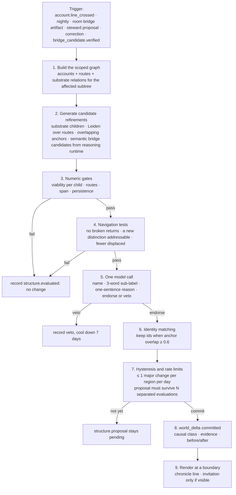
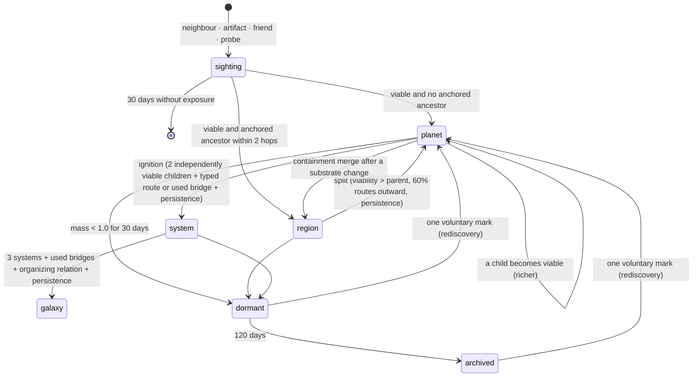

> **Target design, not runtime status.** Adopted through [ADR-0008](../../decisions/ADR-0008-foundation-adoption.md). Source front matter below records its original proposal status. Current executable boundaries live in [Architecture](../README.md), ADRs and contracts. Exact schemas/thresholds here require implementation decisions.

---
status: proposed
authority: architecture-proposal
date: 2026-09-15
project: KnowScroll Core Engine v2
scope: Design only. All thresholds are bench values for replay calibration (see [18-IMPLEMENTATION-PHASES.md](18-IMPLEMENTATION-PHASES.md)). Nothing here changes the founding cosmic grammar; it gives it an operational meaning.
---

# Universe evolution: the algorithm behind planets, systems, galaxies, moons, holes, and frontiers

The universe must not be a UI animation over a watch counter. This chapter defines what each celestial object *is* as data, what causes it to appear, change scale, split, merge, sleep, and return, and what the language model is and is not allowed to decide about it. The module that runs it is the **Cartographer**. Its decisions are constrained by two facts the previous draft elided: **numeric gates are not the sole candidate producer**, and **bridges must be grounded in mechanism, not in substrate degree**. Both corrections come from the September 15 critical review.

The reasoning runtime that proposes alternative organizations and bridge candidates is in [21-REASONING-RUNTIME.md](21-REASONING-RUNTIME.md). The global scheduler that decides when those proposals are funded is in [22-GLOBAL-EXECUTION.md](22-GLOBAL-EXECUTION.md). The shared inventory and generation plane is in [23-CONTENT-DEMAND-AND-INVENTORY.md](23-CONTENT-DEMAND-AND-INVENTORY.md). This chapter stays inside the chart plane: how a place appears, what it contains, how it changes, and what it must not become.

## 1. The user's ladder, kept, with three corrections

The proposed ladder was `Planet → richer planet / continents → Star → Solar System → Galaxy → larger structures`, driven by attention. This design keeps the ladder as a **scale** ladder and keeps attention as the **fuel**, with three corrections:

1. **Attention is never the trigger.** The trigger is always a structural fact about the person's own graph that attention alone cannot fake.
2. **Numeric gates are not the sole candidate producer.** A model may propose alternative organizations and bridges, and the substrate's typed children remain a primary generator, but neither numeric viability nor degree-based proximity is allowed to be the only path that brings a place into being.
3. **Stars are not a hub role.** When a planet ignites, its parent concept remains its anchor; "star" — in the founding meaning of an explanatory foundation — is a separate property (`load_bearing`) earned from substrate relations across multiple *other* places. A technology hub is not automatically a foundational idea; that conflation was a real ambiguity.

| Scale change | Trigger (structural) | Fuel (attention) | Optional semantic input |
|---|---|---|---|
| nothing → sighting | a substrate neighbour, a room artifact, a friend, or a probe made a concept *available* | none needed | reasoning runtime may name or describe it |
| sighting → planet (or region) | the concept became **viable** on its own ([06-USER-WORLD-MODEL.md](06-USER-WORLD-MODEL.md) §5: episodes, days, voluntary marks, independent sources) | mass ≥ 4 | reasoning runtime may propose alternative placements; substrate children are the default |
| planet → richer planet | one child concept became viable | — | — |
| planet → system (ignition) | **two** children are *independently* viable and there is a real route between them | parent mass, span ≥ 7 days | reasoning runtime may propose a bridge candidate that satisfies the route condition; the candidate must carry mechanism and limitations, not degree |
| systems → galaxy | ≥ 3 systems joined by *used* bridges under an organizing relation | — | reasoning runtime may name the organizing idea; the substrate relation is checked, not invented |
| anything → dormant → archived | fuel ran out (mass below the retention line) | — | — |
| dormant → live (rediscovery) | one voluntary act | — | — |

The optional semantic input column is the correction. The reasoning runtime proposes candidates **upstream of numeric gates**: it may name a sighting, propose a placement, or suggest a bridge candidate whose mechanism is typed and whose evidence is cited. The numeric gates then decide whether the proposal survives. The reasoning runtime cannot lower gates, add members, or invent concepts.

The load_bearing property (§4.7) is the only place "star" lives in the data. It may be proposed when a live place's anchor has at least three validated `explains` or `prerequisite_for` relationships across at least two other places (illustrative candidate threshold). Admission additionally requires a cited explanation of what those places depend on, correct relation direction, limits and a useful navigation role. Edge count only triggers evaluation; it never awards foundational status. Attention cannot buy it. The renderer shows it as brightness and pull lines, not as a separate object. This preserves the founding meaning while making its evidence requirement explicit.

## 2. What a place is, as data

A place is a row in `place` ([05-DATA-STATE-MODEL.md](05-DATA-STATE-MODEL.md) §5) with an anchor concept, a kind, a parent, a state, and relations. Its geometry is derived; its identity is not.

```
place P
  anchor         concept c (a stable substrate concept id and code, e.g. tech.robotics.perception)
  kind           sighting | planet | region | system | galaxy | moon | hole | ruin | station | relic_moon
  parent         the place that contains it (a region's planet, a planet's system, a system's galaxy) or null (free)
  members        concepts credited to P: c and any of c's substrate descendants that are not themselves places
  viability      viability(c) from the Accounts, plus aggregated viability of members
  relations      contains · orbits · bridge · moon_of · pulls · rests_on
  flags          load_bearing · rediscovered · via_friend · burst · bridge_mechanism_typed
  lineage        the world_delta that created it and every delta that changed it
```

A concept can be the anchor of at most one live place per user. Members belong to exactly one place (the nearest anchored ancestor). Everything the Composer needs about a place (which concepts, which ready encounters) is answered by these two rules without a graph search.

`bridge_mechanism_typed` is the new flag. A bridge relation between two places carries this flag only when its mechanism is typed (`analogous_in`, `applies_to`, `prerequisite_for`, `explains`, `compares_mechanism`), its prerequisites are recorded, its limitations are recorded, and source support exists for both sides and the stated relationship, with appropriate limitations. A bridge that lacks the flag is treated as **advisory** by the Composer: it can guide further research but cannot boost serving scores or satisfy the "real route between independently viable children" condition for ignition.

## 3. The evolution cycle



Steps 1–4 and 6–9 are code. Step 5 is the only model call, and it can only veto or name; it cannot create a place the numbers did not justify, lower the gates, or invent a member. The reasoning runtime may have proposed an alternative organization or a typed bridge candidate upstream of step 2; that proposal enters as one input, with its mechanism, evidence, and limitations. The substrate's typed children remain the default candidate generator. Leiden and embeddings (§6) are reserved for subtrees with ≥ 40 routed concepts.

The reasoning runtime cannot **commit** a world delta. It can only propose, name, and describe. The reducer validates every proposal; the Cartographer commits only structural changes that satisfy the numeric gates and the navigation tests.

## 4. Each transition, precisely

### 4.1 A sighting appears (the frontier)

A `sighting` is a place with no attention of its own. Sources, each recorded as the sighting's `reason`:

- **Substrate neighbourhood:** when a concept becomes anchored, its 1–2 hop substrate neighbours with a typed relation (`narrower_than`, `analogous_in`, `prerequisite_for`, `applies_to`) and 0 personal exposure become sightings, ranked by substrate degree, capped at 5 visible per place.
- **Room artifact:** a gated `bridge_proposal` or `probe_request` names a concept.
- **Friend:** a concept the person met during a visit and marked (keep or ask) becomes a sighting flagged `via_friend` ([13-SOCIAL-BLEND.md](13-SOCIAL-BLEND.md)).
- **Steward probe:** the reasoning runtime proposes a probe; a research episode gives the concept ≥ 1 ready encounter; then it is a sighting with `reason: probe`.
- **The sky:** the Composer's frontier family may also sample substrate concepts with no relation to anything anchored ("something unfamiliar"); they become sightings only if marked.

A sighting with no exposure for 30 days is removed (it was an offer, not history). A sighting that gains a voluntary mark is re-evaluated as a planet or region candidate.

### 4.2 A planet or a region appears

When a concept `c` crosses the `anchored` line ([06-USER-WORLD-MODEL.md](06-USER-WORLD-MODEL.md) §5), the Cartographer decides **where it lives**:

1. Find the nearest live place `Q` whose anchor is a substrate ancestor of `c` within 2 hops of `narrower_than`/`part_of`.
2. If such `Q` exists, `c` becomes a **region** of `Q` (`parent = Q`, `kind = region`). Q is now "richer".
3. Otherwise `c` becomes a **free planet**.

The Cosmos prototype's rule "free planets for minor interests" falls out of step 3: an interest with no anchored ancestor is free, whatever its size.

Birth conditions (bench): `episodes ≥ 3, days_active ≥ 2, voluntary ≥ 2, source_families ≥ 2, social_share < 0.5, mass ≥ 4.0`. These numeric conditions make a birth candidate eligible. Its placement, naming, evidence and navigation checks must still pass before commit. No additional multi-day persistence gate is proposed for this minor change; major changes use the separate persistence rule. Its `causal_class` is `personal_exploration`. The chronicle line is quiet ("A place formed around robotic perception"), not a card.

The reasoning runtime may, upstream of the numeric gates, propose an **alternative placement**: "this concept could be a region of Q or a sibling of Q under a substrate ancestor at hop 3". Such a proposal is recorded as `structure.proposal(placement)` with mechanism (`narrower_than` / `part_of` / `analogous_in`) and evidence. The Cartographer evaluates the proposal alongside the default rule; if both rules agree, the default wins; if they disagree and the proposal carries stronger evidence, the Cartographer defers to the proposal **only when its mechanism is typed and its evidence is cited**, and only at the next evaluation boundary.

### 4.3 Sub-regions and the recursive rule

A region can have regions. The same birth rule applies with the region as `Q`. This is the founding "every world runs the same loop at a smaller scale", with one guard: a region needs at least **two** encounters marked in it that are not marked in its parent, so that a single deep reel does not spawn a region under a region under a region.

When the person's marks credit a concept that the substrate does not yet have as a child of the planet's anchor (an Ask that matched nothing, a room thread), the reasoning runtime may propose a **concept creation** in the substrate with evidence (a research episode that finds sources). Only then can a region form there. The substrate grows by research, not by inference about the person.

### 4.4 Ignition: planet → system

The proposal `ignite(P)` is generated when P has ≥ 2 regions. It passes the numeric gate when:

- at least two regions `R1, R2` are **independently** viable: each satisfies the planet birth conditions on its own concept, not counting marks inherited from P;
- there is at least one **route** between them, or from each of them to P's hub, of kind `branch`, `enter`, or `bridge_used` (vertical adjacency does not count);
- the route condition may be **satisfied by a typed bridge candidate** whose mechanism is `analogous_in`, `applies_to`, `prerequisite_for`, `explains`, or `compares_mechanism`, with prerequisites and limitations recorded, and whose evidence refs cite at least one encounter marked in each region — but only when the person has taken that candidate and marked it (`bridge_used`). A candidate that has been proposed but not used does not satisfy ignition.
- `span_days(P) ≥ 7` and `days_active(P) ≥ 4`;
- P was born ≥ 3 days ago (no promotion on the day of birth);
- the proposal has passed two evaluations at least 24 hours apart (the second may be the reasoning runtime's endorsement or the nightly pass).

Navigation test: the proposal must make a previously unaddressable distinction addressable ("perception mechanism" vs "its use in a robot"), and must not displace any return anchor (every encounter that pointed at P still resolves to P-the-hub or to one of the new planets).

On commit, P's `kind` becomes `system`, its regions become `planet` with `parent = P`, and P's concept remains P's anchor. IDs are unchanged. The delta is major, so it is the day's one allowed change for that subtree, and it earns a card ("Technology now has two places you keep returning to"). Ignition is the only transition that produces a visible animation by default.

**Why start with two.** Two separately viable children plus a useful, actually traversed connection are a proposed initial threshold. Whether three gives better structure is an evaluation question; no measured delay or quality advantage is established. Separate viability is not statistical independence from recommendation exposure.

### 4.5 Staying together, splitting, merging

- **One viable child:** the planet becomes richer; no split. A person who follows one narrow idea deeply gets a detailed planet, never a system. That is the intended outcome, not a failure.
- **Two viable children with no route between them and no shared ancestor within 1 hop:** they are not a system. If the parent itself is not viable (people often pass through a broad seed to reach a specific thing), the two become **free planets** and the parent reverts to a sighting. The delta's reason says so.
- **Split (region → free planet):** proposed when a region's viability exceeds its parent's and ≥ 60% of its routes leave the parent's subtree. On commit it becomes a free planet with a `bridge` relation to its old parent. Persistence: two evaluations ≥ 48 h apart.
- **Merge into a system (siblings):** two free planets whose anchors share a substrate parent within 1 hop, with ≥ 3 routes between them in 14 days, both viable, propose a system with that parent as hub. Naming is the parent concept's name; the model call may veto ("these are the same idea at two granularities").
- **Merge by containment:** if a free planet's anchor turns out to be a substrate ancestor of another live place's anchor (usually after a substrate correction), the descendant becomes a region. `causal_class: shared_evidence_change`.

### 4.6 Moons

A concept credited from **two** places (a `bridge`-role anchor: routes into it from both, marks in both contexts) becomes a `moon` with `moon_of` relations to both when it is itself viable. It orbits the pair. The Cosmos prototype's "Keep moon" is a different kind, `relic_moon`: a per-place landmark for kept things, created automatically when a place has ≥ 3 relics. The two never share a type.

### 4.7 The load-bearing property

A candidate threshold such as three validated explanatory/dependency relations across two other places can trigger review. It cannot set `load_bearing` by itself. Every relied-on relation needs source support, correct direction and an account of what explanatory work it does. The proposal states the mechanism, limitations, counterexamples and the navigation benefit of showing those dependencies together.

Cartographer validates that evidence and the scoped read set before assigning the property. The renderer can then brighten the place and show pull lines. A nightly deterministic check can remove or queue review of a stale dependency; it does not repeatedly ask a model when evidence has not changed. Attention and graph degree cannot buy foundational status.

## 5. Hysteresis and rate limits

| Rule | Value |
|---|---|
| entry line vs retention line for `anchored` | mass ≥ 4.0 to enter, < 1.0 for 30 days to leave |
| major changes per subtree per day | 1 (birth of a sighting or region is minor; ignition, split, merge, galaxy are major) |
| visible chronicle entries per day | 3 |
| minimum age before promotion | 3 days |
| separated evaluations before ignition / split / galaxy | 2 / 2 / 2 at ≥ 24 h / 48 h / 72 h |
| model veto cool-down | 7 days before the same proposal is re-evaluated |
| identity retention | a proposed group keeps an existing place's id if anchor-concept overlap (Jaccard over members) ≥ 0.6 |
| typed-bridge promotion cool-down | 7 days before the same mechanism is re-proposed |

Corrections and privacy resets are exempt: a `claim.corrected` that removes a place's only source, or an `epoch.incremented`, is applied at once.

## 6. Where Leiden, embeddings, and semantic bridge candidates fit

The substrate's typed children are the first candidate generator and cover most cases. Three more generators run only when the personal graph inside a place has ≥ 40 concepts with routes:

- **Leiden over the route layer** of the subtree proposes groupings that the substrate hierarchy does not express (a person who navigates between "compilers" and "type theory" more than between "compilers" and "linkers"). A Leiden group becomes a proposal only if it can be named by a substrate concept that is a common ancestor or a typed neighbour of ≥ 60% of its members; otherwise it is logged as a shadow grouping and shown to nobody.
- **Embedding neighbours** propose *sightings*, never places. A high-degree node in the embedding graph is not a star; substrate degree is not a foundational claim.
- **Typed bridge candidates** from the reasoning runtime ([21-REASONING-RUNTIME.md](21-REASONING-RUNTIME.md) §6) enter the same upstream-of-numeric-gates slot as substrate children. Each candidate carries source/destination concepts, a typed relation, a mechanism, evidence refs, prerequisites, and limitations. Candidates that lack any of these fields are rejected at intake; candidates that satisfy them but fail the numeric gates are logged with their mechanism and may be re-proposed later when new evidence arrives.

Groupings are matched to existing places by member overlap before any id is assigned, so re-running the optimizer never renames a place (the GraphRAG identity-churn problem, avoided by design).

## 7. The model call

Input (schema): the proposal kind, the anchor concepts with codes and descriptions, the member concepts, up to 6 titles of encounters marked in each child, the routes, the viability tuples, the navigation tests and their results. Output (schema):

```ts
{ verdict: 'endorse' | 'veto',
  name: string,                 // display name, ≤ 4 words
  sublabel: string,             // ≤ 3 words, as on the survey sheet
  reason: string,               // one sentence, shown in "why did this change"
  veto_code?: 'same_idea_two_granularities' | 'label_misleads' | 'no_real_distinction' | 'organizing_relation_absent' | 'mechanism_untyped' }
```

The call is made with the mid-tier text model. Its receipt is attached to the delta. A veto is final for 7 days. It cannot change thresholds, add members, or invent a concept.

## 8. The state machine of a place



Moons, holes, ruins, and stations have their own smaller machines (`hole: open → pulled → settled | faded`; `ruin` is terminal; `station` follows its room).

## 9. Worked example: the Cosmos prototype's Technology system, with honest triggers

The prototype igniting Technology at "≥ 8 stops across ≥ 2 sub-concepts" would ignite from autoplay alone. Under this design the same story takes twelve days and cannot be produced by the feed on its own:

- Days 1–4: Technology is a seed door. Perception (under robotics) becomes anchored on day 4 ([06-USER-WORLD-MODEL.md](06-USER-WORLD-MODEL.md) §12) and becomes a **region of Technology** because Technology is its anchored ancestor within 2 hops. Chronicle: quiet line.
- Days 5–9: the person returns to vision through two different sources and branches twice; `tech.ml.vision` becomes anchored on day 9 — a second region. Technology now has two regions. An `ignite(Technology)` proposal is generated and fails the gate: no route between the regions (the person reached each from the Cable, never from the other), and `span_days(Technology) = 8` but the second region is 0 days old. The reasoning runtime, on day 8, also proposed a typed bridge candidate "perception mechanism ↔ learned visual features" with relation `compares_mechanism` and one evidence ref. The candidate is **recorded but not used**; the route condition requires a `bridge_used`, not a proposal.
- Day 10: the person, inside the perception region, asks "is this the same as what the vision reel called a feature?" — an Ask matched to vision, credited as a `branch` route from perception to vision. The route condition is met. First evaluation passes; proposal pending.
- Day 11: the night pass re-evaluates (≥ 24 h): still passes. The reasoning runtime, in its night turn, endorses with a reason. Navigation tests pass (both regions have ready encounters and return anchors).
- Day 12: model call names the system "Technology", sub-labels "machines · seeing · learning", endorses. Commit: Technology is a system with hub Technology and planets Perception and Vision. Card: "Technology has two places you keep returning to: perception, and how machines learn to see."

If on day 10 the person had instead kept watching vision reels the feed offered, the route would never have formed, and Technology would have stayed a richer planet with two regions. That is the intended difference between a universe grown by living in it and one grown by being shown things.
