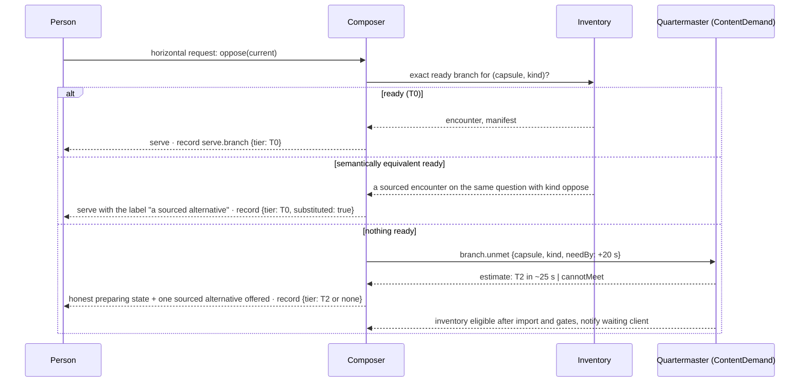

> **Target design, not runtime status.** Adopted through [ADR-0008](../../decisions/ADR-0008-foundation-adoption.md). Source front matter below records its original proposal status. Current executable boundaries live in [Architecture](../README.md), ADRs and contracts. Exact schemas/thresholds here require implementation decisions.

---
status: proposed
authority: architecture-proposal
date: 2026-09-15
project: KnowScroll Core Engine v2
scope: Design only. Weights and quotas are a versioned policy table, not code constants; all bench values here are starting points for replay.
---

# Recommendation: what appears next, and why it is not an engagement feed

The Composer answers one question with no model call and an illustrative warm-path target below 60 ms: *given this person's state and this inventory, which eight items go in the next window, and with what probabilities?* It borrows the staged shape of X's candidate pipeline (source → hydrate → filter → score → select → record) and Instagram Explore's multi-stage ranking, and it rejects their objective. Its objective is a slate that maximizes expected **useful next encounters**, separate, inspectable objectives for voluntary acts, grounded connections, deferred return, novelty and bounded information gain. Engagement is a floor, not a target. Watch time is not a positive optimizer signal at all; it is permitted to appear only inside the restricted admin-analytics surface described in §10.

The runtime that proposes bridge candidates and encounter intents upstream of the Composer is in [21-REASONING-RUNTIME.md](21-REASONING-RUNTIME.md). The global scheduler that funds reasoning or generation work requested by Composer is in [22-GLOBAL-EXECUTION.md](22-GLOBAL-EXECUTION.md). The supply plane that decides what is ready and what must be generated is in [23-CONTENT-DEMAND-AND-INVENTORY.md](23-CONTENT-DEMAND-AND-INVENTORY.md). This chapter stays inside the serving plane: how a slate is built, how it is logged, and what the Composer is forbidden to optimize.

## 1. The objective, stated so it can be computed

The Composer evaluates an **outcome vector** and uses a versioned constrained ranking policy to choose a slate:

- **Voluntary-action proxy** `U` — within the episode the item starts, the person does any voluntary act (`branch, keep, ask, enter world, leave a thought, make a prediction, mark "useful", share`).
- **Continuity** `C` — the item continues a thread the person started, answers a kept question, or sits in a series the person followed.
- **Depth or conceptual connection** `D` — the item connects the current place to a typed bridge candidate with recorded mechanism (not a substrate-degree neighbour).
- **Deferred return** `R` — within 7 days the person voluntarily returns to the item's place, or uses a bridge the item opened.
- **Meaningful novelty** `N` — the item opens a route the person had not used, or surfaces a grounded counterexample.
- **Bounded information gain** `I` — the item resolves a permitted uncertainty, capped at `I_max` so the system does not maximize psychological information extraction.

The slate objective is a versioned, multi-term utility:

```
J(S | context) = Σ_i [ wU·U_i + wC·C_i + wD·D_i + wR·R_i
                     + wN·N_i + wI·min(I_i, I_max) ]
                − redundancy(S) − fatigue(S) − unsupported_leap(S)
```

subject to:

- current permissions, suppression, evidence, and artifact gates;
- acceptable interestingness and accessibility;
- bounded repeated-topic share and protected exploration support;
- readiness, operating budgets, and admission availability;
- the explicit anti-loop constraints in §5 and §6.

Weights `w*` are **versioned developer policy**, not user-profile sliders. The objective family is the September 15 review's correction of the marks-as-final-objective shorthand. The expression above is a scalarization for ranking, not proof of usefulness. Keep its components, exclusions and policy version inspectable. Voluntary acts, return and bridge use remain proxy outcomes; measure user-rated usefulness and correction behavior separately, and test feedback effects before promoting a term.

**Engagement floor (viability).** The estimated probability that the item is *not fast-skipped* must exceed 0.35 (0.20 for frontier items). Below the floor the item is not shown, however high its other terms. Above it, engagement contributes nothing further. Viability is a **floor**, not a score, and it saturates.

**Watch time is not a positive signal.** No Thompson posterior, utility term, forecast, or Steward digest field reads `exposure_s`, session length, or swipe counts as a positive signal. Watch time exists for exposure accounting ([06-USER-WORLD-MODEL.md](06-USER-WORLD-MODEL.md) §2) and for the restricted admin-analytics surface in §10. Viability is the only consumer of fast-skip behaviour, and it is a floor.

The positive-watch-objective question — "should watch hours ever become a recommendation feature" — is **separated from authorized admin analytics**: an admin dashboard can describe what the system served and how long people watched, and a research evaluation can correlate that with reported usefulness; the Composer's serving objective cannot. If a future policy adds a watch-derived feature, it must cite README Law 3 and be recorded as a new decision in [steering/DECISIONS.md](../../../steering/DECISIONS.md); see also [14-QUALITY-ANTI-SLOP.md](14-QUALITY-ANTI-SLOP.md) §6.

## 2. The pipeline

```mermaid
flowchart LR
  subgraph S["1. Sources (candidate families)"]
    f1["continue"]
    f2["deepen"]
    f3["bridge"]
    f4["frontier"]
    f5["revisit"]
    f6["challenge"]
    f7["room"]
    f8["social"]
    f9["timely"]
    f10["seed"]
  end
  S --> H["2. Hydrate<br/>readiness · concepts · claims · quality · fingerprints · truth state · form · intent act · bridge mechanism"]
  H --> G["3. Gates<br/>eligibility · unseen or revisit-eligible · not muted · not near-duplicate · form · risk tier · quality floor · viability floor · evidence gate"]
  G --> SC["4. Score<br/>transparent multi-term utility with logged terms"]
  SC --> SEL["5. Select the slate<br/>quotas · calibration · exploration floor · MMR with fingerprint kernel"]
  SEL --> SV["6. Serve<br/>window of 8 descriptors + cursor"]
  SV --> RC["7. Record<br/>serve.window receipt: families, probabilities, exclusions, terms"]
  X["explicit branch request"] --> BR["branch resolver"] --> SV
```



Each family is a separate function that returns up to K candidates with a within-family sampling probability. Families run in parallel; one family failing degrades the window rather than the request. The **evidence gate** in step 3 is the September 15 correction: a `bridge` candidate whose mechanism is untyped, or whose prerequisites/limitations are absent, cannot pass the gate; it may be logged as advisory, but it cannot rank.

## 3. Candidate families

| Family | Draws from | Purpose | Within-family probability |
|---|---|---|---|
| **continue** | the current branch chain and series; ready branches of the last 3 items | keep a thread going | by branch horizon `p(kind)` ([06-USER-WORLD-MODEL.md](06-USER-WORLD-MODEL.md) §9) |
| **deepen** | ready encounters on typed `narrower_than` children of the current place's anchor | depth in the current region | proportional to child mass + 1 |
| **bridge** | ready encounters on typed bridge candidates whose mechanism is recorded, with prerequisites and limitations | the familiar to the adjacent, via a real mechanism | by mechanism strength and route count |
| **frontier** | sightings; substrate concepts with 0 exposure sampled by degree; editorial seeds beyond the current universe | intentional introduction of the outside | uniform over sightings, then 20% "sky" sample |
| **revisit** | dormant and long-term places on a spaced schedule; places with *new* evidence or artifacts since the last visit | rediscovery; newly relevant | by time since last visit matched to schedule |
| **challenge** | encounters presenting claims with a `contradicts` relation to claims the person marked or kept; opposing schools | credible opposition | by the strength of the contradicted mark |
| **room** | gated artifacts from rooms the person funded, whose question they kept, or in a place they anchor | the world's own work | by room funding and artifact freshness |
| **social** | friend-shared items; friends' public discoveries; blend bridges | discovery through others | by friendship policy |
| **timely** | source-freshness events attached to an anchored place | a live world | by freshness |
| **seed** | the editorial door set | cold start and blank regions | uniform within the door grid |

**What "introduced from outside" means operationally:** the frontier family is the only one allowed to propose concepts with no route to the person's chart, and it has a guaranteed share (§6). Everything else is within two hops of something the person did.

The `bridge` family requires an admitted BridgeCandidate. Its `relation_type` is one of `analogous_in | applies_to | prerequisite_for | explains | compares_mechanism`; its `mechanism` is an actual explanation in text, not that enum. Prerequisites, limits and source-snapshot evidence must support both sides and the relationship. User marks explain relevance, but do not prove factual claims. An unvalidated candidate can guide a research task; it cannot raise serving scores or bypass the evidence gate.

## 4. Hydration and gates

Hydration attaches readiness, concept credits, claims and their evidence families, the quality vector ([14-QUALITY-ANTI-SLOP.md](14-QUALITY-ANTI-SLOP.md) §2), fingerprints, truth state, form (reel or scroll), intent act, and — for bridge family items — the bridge candidate's mechanism, prerequisites, limitations, and evidence refs. Gates are hard and logged with reason codes:

- eligibility: `publication.state = published`, rights OK, epoch current, not withdrawn, risk tier permits automatic display;
- not seen by this person, unless the family is `revisit` and the revisit schedule allows it;
- not muted (person, source, concept);
- fingerprint distance to everything served in 30 days above the repetition line, on all three fingerprints (semantic, template, argument);
- form allowed in this stream (the Interdimensional Scroll admits Scrolls only);
- quality floor and viability floor;
- **evidence gate** (bridge family): typed mechanism + populated prerequisites + populated limitations + ≥ 1 cited evidence ref per side; otherwise logged as `bridge.advisory` and excluded from the slate.

A gated-out item records `excluded_by`, so "Why this appeared" can also answer "why not that". The evidence gate is not a soft penalty — it is a hard exclusion. A bridge candidate that lacks a typed mechanism cannot enter the slate because it cannot pass the gate.

## 5. Scoring: a transparent multi-term utility

```
u(item) = wU·U + wC·C + wD·D + wR·R + wN·N + wI·min(I, I_max)
        − redundancy − fatigue − risk − unsupported_leap
```

| Term | Range | Computed from | Meaning |
|---|---|---|---|
| **U** (useful encounter) | 0–1 | target-conditioned retrieval: the decayed weights of this person's episodes whose concepts are within 1 hop of the item's primary concept (the SIM idea: retrieve the relevant history for this candidate, do not average the whole person), plus a session-recency boost | "this connects to things they actually did" |
| **C** (continuity) | 0–0.3 | continues the branch stack; answers a kept question; is the next in a series the person followed | |
| **D** (depth / typed bridge) | 0.1–1.2 | bridge candidate's mechanism strength + substrate distance from the nearest anchored concept (0 hops 0.3, 1 hop 1.0, 2 hops 0.8, further 0.1; frontier family exempt); +0.2 if the mechanism is typed and the prerequisites/limitations are populated | "this is new but bridgeable through a real mechanism, and it is a different kind of thinking" |
| **R** (deferred return) | 0–0.3 | room/series context and bridge candidate freshness | |
| **N** (meaningful novelty) | 0–0.5 | opens a route the person has not used, or surfaces a grounded counterexample | |
| **I** (bounded information gain) | 0–1 | permitted uncertainty resolution, capped at `I_max = 0.3` | |
| **redundancy** | 0–0.6 | fingerprint similarity to the last 30 days served, with a steep curve near the line | "the same argument in a different coat" |
| **fatigue** | 0–0.4 | session counts per place and per form | |
| **risk** | 0–0.5 | disputed claim without a counterview available; modelled outcome with weak assumptions; truth-state mismatch with the stream's policy | |
| **unsupported_leap** | 0–0.7 | bridge family without evidence gate; frontier item with no scout record | |

Weights live in `policy_version`; every term is stored per candidate in the receipt (`candidate_score.utility_terms`). No term is learned at first. When there is enough logged data (thousands of served windows with outcomes), a learned model may replace **U** and **R** only, and must pass an evaluation designed for the logged policy support before it serves. Propensities cannot evaluate never-exposed actions, and shared generated inventory can violate ordinary independence assumptions; controlled or cluster-level evaluation may be needed. **D** cannot be learned: it is gated by the evidence gate, not by a score.

The **anti-loop constraints** are these:

- `D` saturates at `0.6` for any candidate whose mechanism is untyped, regardless of substrate proximity;
- `U` saturates at `0.5` for any candidate whose `exposure_share` on the relevant account exceeds `0.8` (a place that has been fed mostly by the system cannot be rewarded for that feeding);
- `R` is set to `0` if the candidate is the same argument (template + argument fingerprint within line) as something served in the last 30 days;
- the slate is required to contain at least one candidate whose `D` term was earned through a typed bridge mechanism, when such a candidate is eligible.

These constraints are part of the policy version. They are not knobs that an LLM may turn.

## 6. Selecting the slate

A window is eight items. Selection is greedy maximal marginal relevance with the fingerprint kernel, subject to quotas and a calibration target:

| Constraint | Bench value |
|---|---|
| frontier | ≥ 1 per window |
| revisit or challenge | ≥ 1 per 2 windows |
| same place | ≤ 2 per window, never adjacent |
| form balance (Cable) | ≥ 1 Scroll per window; ≥ 3 Reels per window |
| intent acts | no act more than 3 times in a window |
| calibration | the place distribution over the last 5 windows tracks the person's mass distribution (Steck's calibration), with a **15% exploration floor** reserved for frontier, bridge, and revisit |
| typed-bridge quota | ≥ 1 per 2 windows when eligible, drawn from the bridge family after evidence gate |
| exploration randomization | 5% of windows swap one slot for a uniformly random eligible frontier item (logged as such) |

**Family mixture** is chosen by Thompson sampling: each (scope, family) has a Beta posterior over "the served item produced a useful encounter", decayed weekly. A family's share in a window is its sampled rate, clipped to the quotas. The delayed outcome (a return within 7 days, an item reused through a bridge the item opened) updates the posterior late; an early proxy (a keep or a branch within the episode) updates it immediately with a smaller weight, in the spirit of Spotify's impatient bandits. All of this is logged: the family probability, the within-family probability, and the slot's conditional probability given previous slots, so off-policy estimation is possible later (the September 8 review's requirement).

Explicit navigation (a branch request, entering a place, opening a room) bypasses the slate entirely and is logged under a different policy context.

## 7. Cold start: a person we know nothing about

Day one is not a planet. It is a set of doors.

- The **seed door grid** is editorial: 4 domains × 4 kinds of thinking (mechanism, history, model, argument) = 16 doors, each a reviewed encounter with a branch horizon. The owner's D-016 worlds are one instance; a new person gets the general grid.
- The first window is 8 doors chosen by Thompson sampling with all posteriors at the prior, plus the calibration target set to uniform.
- The first voluntary act (a branch, a keep, an ask) creates the first **trace** and the first sightings around its concept; the chart stays blank until the first place is viable (three episodes, two days). "Blank is honest."
- Language-model priors from text are used only if the person **writes** something (an Ask), and only as a calibration-gated prior on family weights, never as a place. The 2026 bandit literature is clear that uncalibrated LLM priors hurt as often as they help.
- No onboarding questionnaire, no topic picker (README Law 1).

## 8. Explicit requests: the branch resolver



An unmet request is a `mark` of kind `branch` with `served: false`. It is the strongest demand signal the Quartermaster has, and it enters the ContentDemand path ([23-CONTENT-DEMAND-AND-INVENTORY.md](23-CONTENT-DEMAND-AND-INVENTORY.md) §3). The Cutroom contract ([23-CONTENT-DEMAND-AND-INVENTORY.md](23-CONTENT-DEMAND-AND-INVENTORY.md) §4) is a same-host HTTP service, not the older `warm/run/estimate/invalidate` SDK; the resolver above reflects that contract.

## 9. What the receipt records

For every window: policy version, session state hash, the candidate set per family with within-family probabilities, the family probabilities, the slot-conditional probabilities, every gate exclusion with a reason (including the evidence-gate exclusion for untyped bridge candidates), every scored term for every candidate, the quotas that bound, and the exploration swap if any. For every explicit request: the tier, substitution, and the estimate. This is what "Why this appeared" reads (the immediate cause chain, never a percentage), what off-policy evaluation reads later, and what the replay check re-derives.

## 10. What the Composer feeds upward — and what only the restricted analytics surface sees

- Every served item's exposure and marks go to the Accounts (through the Ledger).
- Family posteriors update from useful-encounter outcomes and deferred returns.
- Unmet branch requests and quota shortfalls ("no frontier item was eligible in place P") go to the Quartermaster as `supply.gap`.
- Nothing goes to the Steward directly; it reads the digest ([06-USER-WORLD-MODEL.md](06-USER-WORLD-MODEL.md) §11).

**Watch-time analytics are authorized for admin analysis, not for the serving objective.** The September 15 runtime review §18.2 records the founder's clarification: admin dashboards can join selection receipts, actual exposure intervals, and watch-hours measurement, defined precisely (eligible visible playback intervals, pause/background handling, replay treatment, device/session reconciliation, deduplication), to describe what the system served and how long people watched. A prepared or prefetched Reel is not an exposure. Autoplay, a kept item, an opened source, and an explicit question remain separate observations. These aggregates are useful descriptive telemetry; they do not establish learning, durable interest, or a causal improvement in recommendations, and they do not feed the Composer's scoring path.

## 11. What the Composer refuses to learn

- that watch time predicts value;
- that a topic the person watched most deserves the most production;
- that a model's confidence is calibrated correctness;
- that bridge candidates are equivalent to substrate-degree neighbours;
- that consensus among its agents is truth;
- that a candidate without a typed mechanism can rank by bridge strength.

Each refusal names a proposed implementation constraint in this chapter: a saturated utility term, an evidence gate, a fingerprint constraint, an anti-loop quota, a restricted analytics surface. The next chapter describes how the supply plane decides what enters the slate at all.
