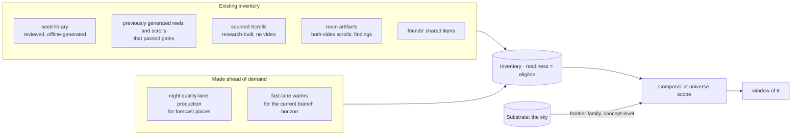

> **Target design, not runtime status.** Adopted through [ADR-0008](../../decisions/ADR-0008-foundation-adoption.md). Source front matter below records its original proposal status. Current executable boundaries live in [Architecture](../README.md), ADRs and contracts. Exact schemas/thresholds here require implementation decisions.

---
status: proposed
authority: architecture-proposal
date: 2026-09-15
project: KnowScroll Core Engine v2
scope: Design only. The Cable is a surface over the Composer; nothing here adds a second recommendation system.
---

# Interdimensional Cable: the global surface and how it touches the universe

The README says the Cable is the zero-effort replacement for opening a feed, and that the Interdimensional Scroll "is not a separate recommendation system". This chapter takes that literally: the Cable is the Composer ([08-RECOMMENDATION.md](08-RECOMMENDATION.md)) run at **universe scope** with both forms allowed, and every other stream is the same pipeline with a different scope or form filter. What makes the Cable *interdimensional* is a guaranteed share of items from outside the person's universe, each labelled with where it came from.

The supply side that decides what is ready and what must be generated lives in [23-CONTENT-DEMAND-AND-INVENTORY.md](23-CONTENT-DEMAND-AND-INVENTORY.md). The reasoning runtime that proposes bridge candidates upstream of the Composer lives in [21-REASONING-RUNTIME.md](21-REASONING-RUNTIME.md). The global scheduler that funds each Composer request lives in [22-GLOBAL-EXECUTION.md](22-GLOBAL-EXECUTION.md). This chapter stays inside the serving plane: how a window is shaped for a person, how its origin is made visible, and how the Cable differs from a generic feed.

## 1. One pipeline, four scopes

| Stream | Scope | Forms | Family quotas that differ |
|---|---|---|---|
| **Interdimensional Cable** | universe | reel + scroll | frontier ≥ 1 per window; social allowed; sky sample on |
| **Interdimensional Scroll** | universe | scroll only | same, minus reels |
| **World Cable** | one place (and its subtree) | reel + scroll | deepen and room families dominate; frontier becomes "the edge of this place" (sightings of this place only); calibration is within the place |
| **Blend Cable** | a blend | reel + scroll | families `from_friend`, `bridge_between_us`, `both_open` added ([13-SOCIAL-BLEND.md](13-SOCIAL-BLEND.md)) |

The scope changes what the families draw from and how calibration is computed. Nothing else changes: the same gates, the same multi-term utility, the same receipt, the same evidence gate for typed bridges.

## 2. Channels: how origin is made visible

Every served item carries a **channel** derived from its family, so the person always sees where a thing came from (Law 13) without a percentage. Channels are the Cable's way of saying "this is from another dimension":

| Channel label (client may reword) | Family | What it tells the person |
|---|---|---|
| your worlds | continue, deepen | inside a place you have |
| next door | bridge | one step from something you did, through a typed mechanism |
| another dimension | frontier (sightings, sky, probes) | outside your universe on purpose |
| the argument | challenge | credible opposition to something you marked |
| from the rooms | room | the world's own work |
| through a friend | social | a friend's discovery, visit, or blend |
| you left this | revisit | a dormant or newly relevant place |
| just in | timely | a fresh source on a place you have |
| a first door | seed | cold start, no history yet |

The `next door` channel is the correction. The previous draft described the bridge family as "one step from something you did" without distinguishing a typed mechanism from substrate proximity. The corrected channel carries the mechanism's relation type — "analogous_in", "applies_to", "prerequisite_for", "explains", "compares_mechanism" — so the person can see *how* the connection was drawn, not just that a path exists.

The channel is part of the receipt and of the card's origin line ("Technology ↳ Collective behaviour ↳ this encounter", as in the Living Observatory prototype).

## 3. Where candidates come from



Two rules govern the mix of existing and generated content:

1. **The Cable serves only what is ready and eligible.** Generation never happens *because* the Cable needs an item. If a family has no eligible candidate the slot goes to another family and a `supply.gap` is recorded for the Quartermaster. The supply path is [23-CONTENT-DEMAND-AND-INVENTORY.md](23-CONTENT-DEMAND-AND-INVENTORY.md) §3.
2. **Generated and retrieved items compete on the same terms.** `created_by_kind` is a hydration field for the receipt, not a ranking term. A generated reel is not preferred because it cost money, and a sourced Scroll is not penalized because it has no video. The quality vector ([14-QUALITY-ANTI-SLOP.md](14-QUALITY-ANTI-SLOP.md)) is what separates them.

The **sky** is the exception to "ready and eligible": the frontier family may surface a *concept* that has no encounter yet, as a sighting card ("something unfamiliar: a place with a name and a reason, nothing to watch yet"). Tapping it is a probe request (`obs.branch_request` of kind `probe`), which is a voluntary mark and a demand signal. This is how a person can reach beyond the inventory without the system pretending it has content it does not.

## 4. How watching changes the universe

The chain, for one vertical item watched and left:

```
obs.visible → obs.played(18 s)  →  episode e opens on the item's root
                                 →  exposure credited to encounter_concept rows (0.5 base weight)
                                 →  session_state.recent and fatigue updated
                                 →  family posterior: no mark yet (neutral)
obs.skip after 18 s (done)       →  episode continues; no negative
next item, unrelated             →  vertical route recorded (weak)
second unrelated item            →  episode e closes with weight 0.5 per credited concept
```

That is all. No place changes from watching. A concept that is watched ten times without a mark has ten episodes of weight 0.5, mass ≈ 5, and `voluntary = 0`: it never anchors. The chart may show it as a sighting if it is a neighbour of something anchored; otherwise it is invisible history. This is the README's Law 4 as arithmetic.

With a mark (branch, keep, ask, enter), the episode's weight rises to 2–7, the concept moves toward the `anchored` line, and the Cartographer's watch line may fire ([07-UNIVERSE-EVOLUTION.md](07-UNIVERSE-EVOLUTION.md)).

Exposure is **attention evidence** and stays inside [06-USER-WORLD-MODEL.md](06-USER-WORLD-MODEL.md) §2. The Cable does not promote an exposure to a hypothesis or a mark on its own. A watch is never the only path to a place.

## 5. Requesting a continuation or an alternative

A horizontal request is the strongest thing a person can do in the Cable:

- It is a **mark** of kind `branch`, credited to the branch's primary concept when the branch is served.
- It updates the **branch horizon** immediately ([06-USER-WORLD-MODEL.md](06-USER-WORLD-MODEL.md) §9), which changes what the Quartermaster warms next.
- It creates a **route** from the current concept to the branch's concept.
- If unmet, it is `served: false` demand, which the Quartermaster ranks above all speculative work ([23-CONTENT-DEMAND-AND-INVENTORY.md](23-CONTENT-DEMAND-AND-INVENTORY.md) §3).
- It bypasses ranking: the resolver serves the exact branch, a labelled sourced substitute, or an honest preparing state ([08-RECOMMENDATION.md](08-RECOMMENDATION.md) §8).

"Continue this reel" and "give me an alternative" differ only in `kind` (`continue` vs `explain_differently | oppose | example | counterfactual`). A counterfactual branch carries the truth state `counterfactual` in its capsule and the Composer's risk term keeps the branch from being confused with a documented one in later windows.

The `intent.explicit` field in session state ([06-USER-WORLD-MODEL.md](06-USER-WORLD-MODEL.md) §8) is re-anchored by every explicit request. The Cable never infers intent from viewing.

## 6. Introducing the outside on purpose

The Cable's frontier share is the mechanism that keeps a universe from closing on itself. It is deliberately not "random":

| Source of outside items | Share of the frontier slot (bench) | Why |
|---|---|---|
| sightings adjacent to anchored places | 50% | bridgeable novelty |
| probes the reasoning runtime proposed and research fulfilled | 20% | the engine's own curiosity, accountable in the chronicle |
| room artifacts that opened a route | 10% | the world's work |
| sky sample: substrate concepts by degree, no relation to the chart | 15% | true outside |
| friends' discoveries | 5% | other people's blind spots |

Plus the 5% uniformly random window swap from [08-RECOMMENDATION.md](08-RECOMMENDATION.md) §6. Every outside item's exposure is logged with `family = frontier` so that later marks on it can be attributed to deliberate introduction rather than to inference.

The frontier share is **policy, not a learned target**. The shares in the table are versioned; an LLM may not propose a different mix. The September 15 runtime review §12 makes the broader rule explicit: a smaller model during overload is acceptable only for tasks where it has demonstrated the required quality floor; the frontier share is not a knob that adapts to provider health.

## 7. Rolling windows and prefetch

- The client asks for the next window when 2 items remain in the current one. Windows are immutable once served; a re-request returns the same window.
- The Composer returns descriptors (id, form, channel, origin line, truth shape, duration, manifest url if playable). Media is fetched around the active item only.
- **Prefetch depth** for generated items follows the demand-plane rule ([23-CONTENT-DEMAND-AND-INVENTORY.md](23-CONTENT-DEMAND-AND-INVENTORY.md) §5): the fast lane keeps 1–2 items ahead per viewer for branches; vertical items come from ready inventory, which the Quartermaster keeps stocked so that the median window needs no generation at all.
- If the next window would contain a generated item that is `preparing`, the Composer substitutes a ready item and logs the substitution; it never shows a spinner in a vertical slot.

The Cable does not own a separate prefetch queue. The Cutroom contract's `requestId` and stage cancellation are the unit of prefetch control, and they live in the host-local Cutroom adapter ([23-CONTENT-DEMAND-AND-INVENTORY.md](23-CONTENT-DEMAND-AND-INVENTORY.md) §6). The Cable consumes their outcomes; it does not duplicate them.

## 8. The rest card

Every 10 encounters (Q5's default) the Cable inserts a rest card ("That's a good place to stop.") as a non-blocking item with no media. It is recorded as `serve.rest`; skipping it is not a negative; staying on it and leaving is recorded as `obs.session.end` with `reason: rest`. It is the only item in the stream that is not a Reel or a Scroll, and it is rendered by the stream shell, not by a consumption renderer, so the `Reel | Scroll` law holds.

## 9. What the Cable is not allowed to do

- Show an item because it is likely to hold attention (viability is a floor, not a score).
- Fill a slot with generated filler because nothing else was ready.
- Reshuffle a served window.
- Serve a `preparing` branch as if it were an item.
- Hide the channel.
- Count a prefetched, offscreen, or muted-background play as exposure.
- Substitute a frontier item for an untyped bridge candidate and call the bridge evidence-gate pass.
- Promote a frontier share into a learned objective.
