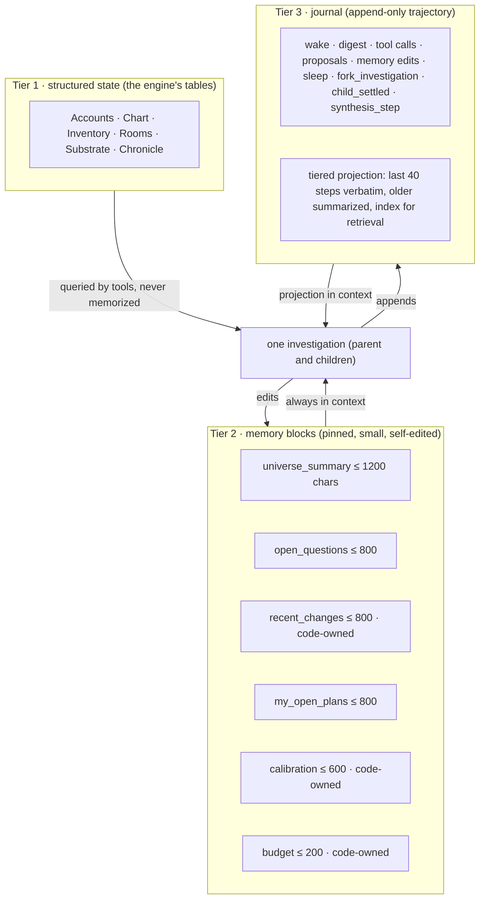
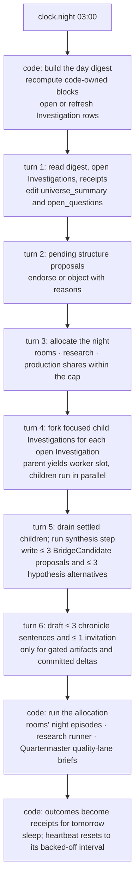

> **Target design, not runtime status.** Adopted through [ADR-0008](../../decisions/ADR-0008-foundation-adoption.md). Source front matter below records its original proposal status. Current executable boundaries live in [Architecture](../README.md), ADRs and contracts. Exact schemas/thresholds here require implementation decisions.

---
status: proposed
authority: architecture-proposal
date: 2026-09-15
project: KnowScroll Core Engine v2
scope: Design only. Steward tool schemas are proposals. Budgets cite D-011 and D-014 and do not change them. Investigation semantics come from the runtime review §§1.2 and §6.
---

# The core agent: the Steward, its investigations, and its harness

Should KnowScroll have a central language-model agent? Yes: **one per universe, called the Steward**, persistent in identity and memory, never persistent in execution, with a small read surface and a typed write surface. This document is its full design: what it is for, what it remembers, what wakes it, what it sees when it wakes, what it can do, how it is kept honest, and what it costs. The persistent unit it produces is an **Investigation**: a scoped, durable question whose evidence and alternatives survive the worker process that is currently reasoning about it.

The Investigation is the durable form of the runtime review §1.2 "persistent investigation". One Steward per universe opens Investigations; an Investigation may open focused child Jobs under the parent's budget; the parent's worker slot yields while children run; the parent synthesises a fresh bundle from the children's typed outputs. This is what "persistent in state, not in execution" looks like in practice.

## 1. Why an agent at all, and why only one

Everything in [06-USER-WORLD-MODEL.md](06-USER-WORLD-MODEL.md), [07-UNIVERSE-EVOLUTION.md](07-UNIVERSE-EVOLUTION.md), [08-RECOMMENDATION.md](08-RECOMMENDATION.md) runs without a model. What those layers cannot do:

- notice that three kept questions in different places share a premise;
- decide which of forty possible research episodes is worth $0.15 tonight;
- decide that a sighting deserves a probe before the person has ever touched it;
- write one honest sentence about why a place changed;
- judge that a numerically valid split is semantically empty (delegated to the Cartographer's model call, but the Steward can endorse or object);
- allocate a night's budget between rooms that are arguing, research that is pending, and reels that a forecast says will be wanted.

These are judgments about meaning and priority. They are exactly the jobs a language model does well and rules do badly. They are also rare (a handful a day), tolerant of latency (minutes), and cheap if the context is compiled well. That profile is an **ambient agent** (event-driven, background, surfaces to the person only through cards) with a **heartbeat** (periodic "anything need attention?", silent if not) and **sleep-time compute** (a nightly digest that prepares state before the person returns).

Why only one: a second agent would need to coordinate with the first through the same log the first already reads. Rooms have their own agents because rooms are separate worlds with separate questions; the universe has one steward because it is one world. Cross-cutting investigations may still span rooms, places, and substrates; they do so by opening Investigations with explicit grants for each contributing scope, not by spawning a second Steward.

## 2. Persistent in what sense

| Property | Headlong's agent | The Steward |
|---|---|---|
| identity | one, continuous | one per universe, continuous |
| execution | a loop that never stops, backing off when idle | no loop; woken by events, a backing-off heartbeat, and the night clock |
| trajectory | append-only DAG of jsonl, fork and merge | the same shape, per universe, in the media volume |
| context | a projection of the whole trajectory at decaying resolution | a projection of the trajectory **plus** pinned memory blocks **plus** a code-generated digest of structured state **plus** an Investigation record per active question |
| tools | Bash | a fixed read set over engine state and a fixed set of typed proposals |
| input | every message lands in one stream | only event classes it subscribed to, debounced, as a digest |
| output | anything a shell can do | typed proposals the reducer validates |
| cost | $1–2 per hour | cents per day, bounded by a cap |
| privacy | "assume anything you tell it is shared" | reads only the digest schema for its own universe |

The Steward "keeps thinking independently" in the only sense that matters for the product: it has a continuous memory of what it has noticed and planned, it opens durable Investigations that survive worker restarts, and it acts without being asked. It does not burn tokens in silence.

## 3. Investigations: the persistent unit

The Steward's wake may open one or more Investigations. An Investigation is a typed question with concrete alternatives, evidence and counter-evidence refs, child Jobs, a stopping rule and a budget. The runtime review §1.2 names the durable shape:

```typescript
interface Investigation {
  id: string;
  scope: { kind: 'universe' | 'room' | 'public'; id: string };
  question: string;
  explicitUserIntentRefs: string[];
  alternatives: Array<{ hypothesisId: string; evidenceRefs: string[] }>;
  openQuestions: string[];
  taskIds: string[];
  acceptedArtifactRefs: string[];
  nextWake: { reason: string; notBefore?: string } | null;
  stoppingRule: string;
  budgetAccountId: string;
  status: 'active' | 'waiting' | 'satisfied' | 'inconclusive' | 'cancelled';
}
```

An Investigation can ask: "Is this person's repeated return to black holes about spacetime, visual spectacle, or an unresolved question about clocks?" Its alternatives remain alternatives. Watching longer does not settle them. Explicit statements can clarify current intent; they do not automatically establish a permanent identity. A focused child Job might compare clock explanations. Another might verify the conceptual bridge from relativity to GPS. The Investigation synthesises the results into a proposed next experience.

The Investigation is durable: it survives worker restarts, provider outages, even privacy resets (with `status = cancelled` if its scope was reset). Its children share the parent budget; the parent yields its worker slot while children run.

**Long horizon does not mean a continuously self-triggering loop.** It means durable questions, accumulated evidence, resumable work, and follow-through. Allow several agents when independent research or different expertise improves the answer; do not use agent agreement as independent evidence when they consumed the same sources.

### 3.1 A concrete example

Suppose a person keeps returning to reels about black holes, takes a branch on time dilation, asks "why do clocks differ in different gravitational fields?", and opens a counterargument Scroll on GPS. The Steward does not "respond" — it opens an Investigation:

```
Investigation i_42
  scope        { kind: 'universe', id: u17 }
  question     "Is this person's recurrence to black holes about spacetime,
                visual spectacle, or an unresolved question about clocks?"
  alternatives [
    { hypothesisId: h_visual_fascination,   evidenceRefs: [enc:e12, room_post:p31] },
    { hypothesisId: h_unresolved_clock,     evidenceRefs: [obs:ask.97, scroll:s_gps] },
    { hypothesisId: h_conceptual_bridge,    evidenceRefs: [room_post:p34, encounter:e19] }
  ]
  openQuestions ["is the GPS argument sourced? what evidence family supports the clock analogy?"]
  taskIds [job:parent_steward_2026_09_15_03, job:child_visual, job:child_clocks, job:child_relation_gps]
  stoppingRule "any alternative reaches confidence >= labeled_useful AND no counter-evidence in last 7d"
  budgetAccountId "u17:steward"
  status "active"
```

The parent Job compiles a bundle from universe-scoped evidence; the Steward uses `fork_investigation` to spawn three focused children, each with a narrower bundle (the parent's slice plus the child's question). The children run in parallel, share the parent's budget, and journal their typed outputs. The parent re-activates when all three settle, runs a synthesis step with a fresh bundle (the children's `proposal_id`s and `bundle_id`s are its evidence refs), and either writes a `bridge.candidate.admitted` Proposal, a `hypothesis.proposed` Proposal with the alternatives and their evidence, or a `no_new_evidence` step that closes the Investigation without a Proposal. The runtime review §1.2 establishes the synthesis shape.

## 4. Memory: three tiers, each with a different owner



The division of labour:

- **What happened lives in Tier 1.** The Steward never "remembers" that a place formed; it asks. This is what stops its memory from drifting away from the truth: the database is always right and the Steward's notes are always notes.
- **What it thinks lives in Tier 2.** Six blocks, each with a max size. Three are **code-owned** (`recent_changes`, `calibration`, `budget`) and regenerated from Tier 1 before every turn; the model cannot edit them. Three are **model-owned** (`universe_summary`, `open_questions`, `my_open_plans`) and edited by the model through a `note_to_self` tool, with the edit logged. This is Letta's self-editing core memory with a hard boundary around the facts.
- **What it did lives in Tier 3.** The journal is never rewritten. Its projection for context is Headlong's tiered compaction: the last 40 steps verbatim, the previous 200 as one-line summaries, everything older as a dated index of proposals and outcomes the model can retrieve by id.
- **What it is currently investigating lives in the Investigation row** ([05-DATA-STATE-MODEL.md](05-DATA-STATE-MODEL.md) §10). The Steward reads its open Investigations before compiling a wake; it can `fork_investigation` to open a focused child, or it can close an Investigation whose stopping rule has fired.

What is compressed: the journal's projection, by code, at wake time. What is never compressed: the journal file, the Ledger, the memory blocks (they are small by construction), the Investigation records (they are append-only with explicit status transitions).

## 5. What wakes it

| Wake source | Mode | Debounce | Examples |
|---|---|---|---|
| `account.line_crossed` for `anchored`, `dormant`, `rediscovered` | coalesce | 90 s | a place is about to form; a place came back |
| `structure.proposal` pending a second evaluation | fifo | — | endorse or object |
| `room.artifact.created` that passed gates | coalesce | 5 min | consider an invitation; consider a research follow-up |
| `research.completed` for a request it made | fifo | — | read the result; decide next |
| `steward.receipt` (outcome of an earlier proposal) | coalesce | until next wake | calibration |
| `obs.ask` with world scope ("what is my universe becoming?") | fifo | — | interactive path (§10) |
| `obs.correction` (wrong connection, less like this) | fifo | — | record; adjust `open_questions`; propose suppression scope |
| `supply.gap` repeated ≥ 3 times for one place | coalesce | 1 h | propose research or production priority |
| `bridge.candidate.used` (the deterministic Composer admitted a BridgeCandidate into candidate cache) | coalesce | 30 min | evaluate whether the candidate is earning its place in the universe |
| `investigation.child_settled` for an open Investigation this Steward opened | fifo | — | read the child's typed output; decide whether to run a synthesis step |
| heartbeat | watchdog | 30 min → ×2 → 24 h | "anything need attention?" |
| `clock.night` | fifo | — | the night session |

A wake is admitted only if the **digest delta** (a code-computed score of how much changed since the last wake: new marks, pending proposals, new artifacts, receipts, open Investigations) exceeds a threshold, or a FIFO item is present. A heartbeat with nothing new returns `STEWARD_OK` after the deterministic idle check ([22-GLOBAL-EXECUTION.md](22-GLOBAL-EXECUTION.md) §8), costs almost nothing, and doubles the next interval.

## 6. What it sees: the compiled context bundle

Every turn's bundle is assembled by the context builder, frozen, content-hashed, and recorded as the bundle the step ran against. The runtime review §21 establishes the durable shape. Within a 12k-token budget for a parent Investigation step:

1. **System prompt:** its role, the product laws it must not break, the list of proposal kinds and their schemas, and the sentence "you are not the person and you do not speak to them; cards are written for them by the Scribe from your drafts".
2. **Memory blocks:** all six.
3. **Digest since last wake** (code-generated, schema below).
4. **Open Investigations:** each with its question, alternatives, evidence refs, child statuses, and stopping rule.
5. **Receipts:** outcomes of its proposals resolved since last wake.
6. **Journal projection.**

```ts
type StewardDigest = {
  since: string; until: string;
  sessions: { count: number; total_min: number };
  marks: { kind: string; concept: string; place?: string; count: number }[];   // aggregated, never raw events
  line_crossings: { concept: string; line: string }[];
  pending_structure: { id: string; kind: string; target: string; viability: object; evaluations: number }[];
  committed_deltas: { id: string; type: string; place: string; causal_class: string }[];
  room_news: { room: string; ladder: string; artifacts: { id: string; kind: string; gate: string }[]; funded: number }[];
  research_done: { id: string; question: string; claims_added: number; families: number }[];
  supply: { gaps: { place: string; family: string; count: number }[]; ready_by_place: Record<string, number> };
  social: { visits: number; blends: number; via_friend_sightings: number };   // counts only
  bridge_used: { candidate_id: string; place: string; mark_rate_30d: number }[];
  investigations_open: { id: string; question: string; alternatives: number; children_settled: number }[];
  budget: { day_cap: number; spent: number; night_cap: number };
  receipts: { proposal: string; outcome: string; detail: object }[];
};
```

The digest is the entire surface through which a model sees a person. It contains no raw text the person wrote (an Ask is summarized as a concept match), no device data, nothing from a friend's universe, and no hypothesis marked `restricted` unless `permitted_uses` includes `steward.context`.

## 7. What it can do: tools

### 7.1 Read tools (pure, over Tier 1, results truncated to schema)

`read_accounts(scope, window_days)`, `read_chart(scope)`, `read_substrate_neighbourhood(concept, hops ≤ 2)`, `read_room(room_id)`, `read_chronicle(since)`, `read_readiness(place)`, `read_budget()`, `search_substrate(text) → concepts`, `read_journal(id | query)`, `read_investigation(id)`, `read_bridge_candidate(id)`.

### 7.2 Proposal tools (each emits one typed event)

| Tool | Payload | Reducer validation | Effect if accepted |
|---|---|---|---|
| `propose_research` | question, scope concept ids, gap kind, budget ≤ $0.15, why (one sentence) | concepts exist; budget within the night allocation; ≤ 3 per night | `research.requested` |
| `propose_probe` | sighting or concept, why | concept exists; place has < 5 sightings | research → a sighting with `reason: probe` |
| `endorse_structure` / `object_structure` | proposal id, reason | proposal pending; reason non-empty | counts as one separated evaluation; an objection forces the Cartographer's model call to see it |
| `propose_room_open` | question, place, evidence ids | ≥ 2 marks on the question; place has < 3 active rooms | `room.opened` |
| `set_room_priority` | room id, share | shares sum ≤ 1 over funded rooms | night allocation weight |
| `allocate_night` | shares for rooms / research / production | sums to ≤ night cap | the night session's budget split |
| `draft_invitation` | artifact or delta id, two sentences | the target passed gates; ≤ 1 per day | the Scribe polishes and the client shows one card |
| `propose_hypothesis` | D-004 fields **plus** `alternatives` (each with hypothesis id, evidence refs, counter-evidence refs and confidence label), `question_id` (the Investigation) | ids exist; kind permitted; sensitivity ≠ prohibited; each alternative has ≥ 1 evidence ref or it is rejected | `hypothesis.proposed` with `permitted_uses ⊆ {steward.context, chronicle.wording}` |
| `propose_bridge_candidate` | `from_concept_id, to_concept_id, relation_type, mechanism (text), prerequisites (json), limitations (json), evidence_refs (json), counterevidence_refs (json), question_id` | ids exist; both concepts in scope; mechanism non-empty; ≥ 1 evidence ref; ≥ 1 limitation | `bridge.candidate.admitted` to the substrate; the deterministic Composer decides whether it appears next |
| `note_to_self` | block name, new content | block is model-owned; size ≤ max | memory block version++ |

### 7.3 Investigation tools

| Tool | Payload | Effect |
|---|---|---|
| `open_investigation` | scope, question, alternatives, evidence refs, stopping rule, budget owner | inserts an `investigation` row; emits `steward.investigation.opened` |
| `fork_investigation` | parent investigation id, narrow question, narrow evidence refs, narrow bundle scope | enqueues a focused child Job under the parent budget; emits `steward.investigation.child_opened` |
| `close_investigation` | investigation id, status (`satisfied` / `inconclusive` / `cancelled`), final proposal ids | updates the row; emits `steward.investigation.closed` |

The parent Investigation's `taskIds` list contains the parent Job id and the child Job ids. The child Jobs inherit the parent's budget reservation through the [global execution chapter](22-GLOBAL-EXECUTION.md) §10 subagent rules; they do not each open their own budget owner.

There is no tool that writes a place, ranks an item, publishes, spends outside the allocation, or messages the person. ≤ 6 reasoning-runtime steps per parent turn; ≤ 12 in the night session; the runtime owns the bound.

## 8. The night session, step by step



The runtime review §1.3 establishes the synthesis step; the runtime port's step journal ([21-REASONING-RUNTIME.md](21-REASONING-RUNTIME.md) §4) is what makes the night resumable across worker crashes. Turn 1 compiles a bundle; turn 2 reads pending proposals; turn 3 allocates the night; turn 4 forks focused children for each open Investigation (each child is a small bundle, a budget reservation against the parent's reservation, and a the appropriate inherited service class admission); turn 5 resumes after children settle and writes proposals; the waiting parent releases its worker slot; turn 6 drafts chronicle sentences; the closing code step runs the allocation and writes receipts. If the day's digest is empty (no sessions, no artifacts, no open Investigations with due work) the night session is a single code step that writes `no_new_evidence` and calls no model.

The whole night for one universe is bounded by D-011's $0.50 for the Steward's own calls, separate from the room and production pools it allocates ([17-SCALING-COST.md](17-SCALING-COST.md)).

## 9. The interactive path: Ask

"Ask" is a person typing a question. It must feel instant, so it does not run a Steward turn. It runs an **interactive** reasoning-runtime call with a compiled bundle of: the memory blocks, the current scope (place, item, room), kept things in scope, the substrate neighbourhood of the matched concept, and (if the Ask explicitly references a BridgeCandidate) the BridgeCandidate's evidence and limitations. The answer is served with sources where it makes claims, labelled by truth shape, and written to the Steward's journal as an `ask` step so the next real turn knows it happened. The runtime review §19.2 establishes that Ask enqueues an interactive Job; the API never calls a provider.

The API path:

1. Client emits `obs.ask` with the question wording and the current scope.
2. API enqueues an `interactive` Job in the global scheduler. The scheduler returns a Job id; if a worker slot is free, dispatch is prompt.
3. The runtime compiles the bundle, the admission gate reserves the Permit and the BudgetReservation, the router selects the Ask route, the provider call dispatches.
4. The Job completes with a typed `ask.answer` Proposal (a self-targeted Proposal whose only effect is the chronicle entry and the journal step).
5. The API streams the Job's results to the client or returns a `pending` status if no slot was free; it never imports a vendor SDK.

The only Proposal Ask may emit is `note_to_self`. If the question is about the universe itself ("why did Technology change?") the answer is read from the chronicle and the delta's reason, not composed.

## 10. Keeping it honest: the calibration loop

Every Proposal gets an outcome, computed by code, written to `steward_proposal.outcome` and shown in the `calibration` block:

| Proposal | Outcome measured | Window |
|---|---|---|
| probe | did the resulting sighting get a voluntary mark? | 14 days |
| research | did a resulting encounter get served, and did it get a mark? | 14 days |
| endorse_structure | did the place stay live 30 days later? | 30 days |
| draft_invitation | was the card opened; did it lead to a mark? | 7 days |
| propose_room_open | did the person return to the room? | 14 days |
| propose_hypothesis | was it later contradicted by a correction? | 30 days |
| propose_bridge_candidate | did the BridgeCandidate reach a served encounter that earned a mark? | 14 days |

The block reads like "probes: 3 of 7 marked; research: 5 of 6 served, 2 marked; bridge candidates: 4 of 9 marked; hypotheses: 1 of 4 contradicted". The model sees its own hit rate every turn. A Steward whose probes are never marked is told so, and the reducer lowers its probe allowance (a policy rule, not the model's choice).

The runtime review §6 establishes the receipts that record the outcome; the calibration block is a code-owned digest of those receipts, not a model-generated summary.

## 11. Failure modes and their guards

| Failure | Guard |
|---|---|
| it flatters the person's current direction (sycophancy toward the digest) | it cannot rank; its research Proposals are capped and 1 of 3 must be a `challenge` or `frontier` gap kind |
| it invents evidence | every Proposal cites ids the reducer checks exist; a bad id rejects the Proposal and charges the budget |
| memory drift | code-owned blocks are regenerated; model-owned blocks have max sizes; the journal is append-only; Investigation records are append-only |
| runaway cost | per-turn step caps; per-day cap; per-parent-investigation child count cap; backoff; empty-digest short circuit |
| privacy leakage | the digest schema is the only input; residents of shared rooms never see it; the bundle's `scope` and `privacy_epoch` are bound server-side |
| it becomes the orchestrator | it has no tool that calls a module; modules react to its events through the same subscriptions as everything else |
| it speaks for the person | it never addresses the person; the Scribe rewrites its drafts and the client shows them as cards with receipts |
| a child Job over-runs | the child inherits a bounded budget slice; the parent cannot fork another child if the slice is exhausted; the runtime reserves before the child dispatches |
| parent occupies worker slot waiting for children | the runtime releases the slot when the parent yields on children; the parent re-activates only when a child settles or the deadline elapses ([21-REASONING-RUNTIME.md](21-REASONING-RUNTIME.md) §10) |
| a BridgeCandidate smuggles in topic similarity as evidence | the runtime review §1.3 distinguishes BridgeCandidate (mechanism, prerequisites, limitations, evidence refs) from vector-near retrieval; the validator checks the mechanism and limitations before admitting the candidate into the candidate cache |
| a hypothesis alternative has no evidence ref | the reducer rejects the Proposal; the budget is settled and the attempt is recorded |
| the Investigation's evidence has been corrected after the bundle froze | the bundle's `event_high_water` records the freeze; the reducer's stale-result matrix ([04-EVENT-ARCHITECTURE.md](04-EVENT-ARCHITECTURE.md) §11) rebuilds the bundle if the read set no longer holds |
| a model's self-reported confidence used as authority | confidence is a labelled estimate; the validator uses only the schema, evidence, preconditions and read set |

## 12. Cost

A heartbeat with nothing new: deterministic idle check, no model call. A heartbeat with news: ~6k input, ~600 output, one or two reasoning-runtime steps, sometimes one child fork that may finish in seconds. A night session: ~30–40k input across six turns, ~3k output, plus the children's reasoning cost against the same budget. At the dated MiniMax M3 pay-as-you-go rates ([17-SCALING-COST.md](17-SCALING-COST.md)) this is cents per active day and well under the $0.50 night cap; the [scaling chapter](17-SCALING-COST.md) gives the envelope.

The Steward is the cheapest module in the engine per unit of judgment, because it is compiled context around a small number of decisions rather than a loop. The Investigation shape is what keeps it cheap at long horizons: a small bundle per child, bounded per-child budget, parent synthesis only on completion.

## 13. What would change this design

- If replay shows rules alone produce good research and probe choices, the Steward shrinks to naming and invitations.
- If the person's Ask usage shows they want a conversational universe, the interactive path grows and gets its own memory, still without proposal rights.
- If the calibration block shows the Steward's proposals are consistently worse than the Quartermaster's forecasts, its allocation rights move to code and it keeps only meaning tasks.
- If the parent's synthesis step consistently produces no new evidence, the parent's `taskIds` shrinks to direct Proposals and the child-fork path becomes optional.

The Investigation is the durable unit that makes each of these evolutions cheap: change the parent's shape, the children, the synthesis, and the rest of the system does not change.
