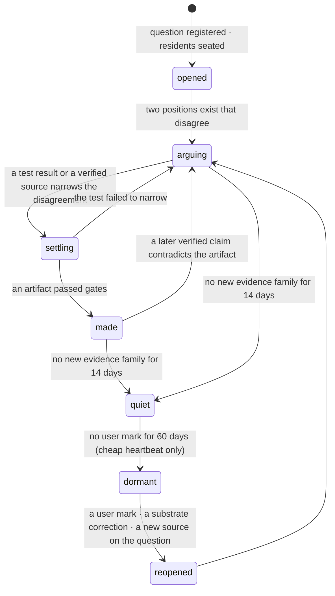
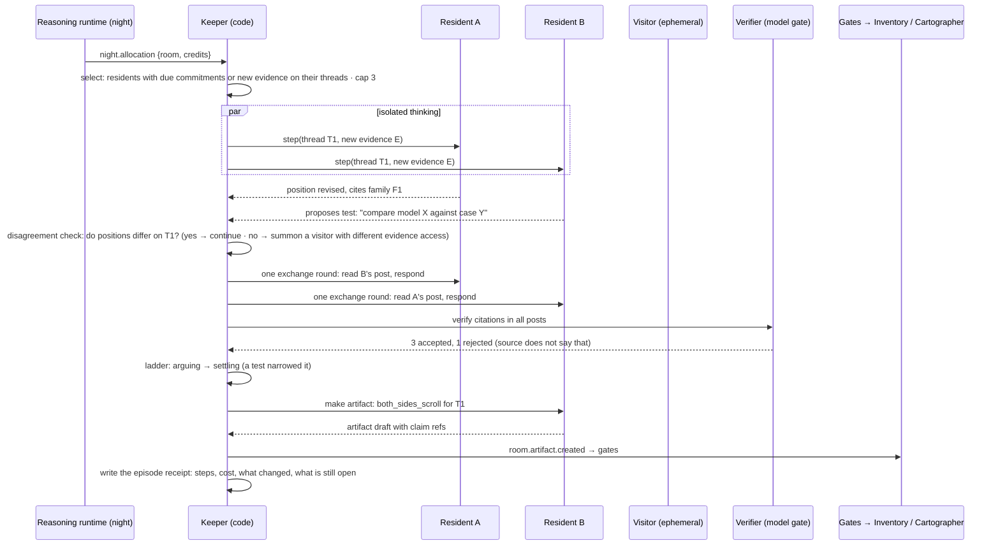

> **Target design, not runtime status.** Adopted through [ADR-0008](../../decisions/ADR-0008-foundation-adoption.md). Source front matter below records its original proposal status. Current executable boundaries live in [Architecture](../README.md), ADRs and contracts. Exact schemas/thresholds here require implementation decisions.

---
status: proposed
authority: architecture-proposal
date: 2026-09-15
project: KnowScroll Core Engine v2
scope: Design only. Caps and credit values are bench values. Builds on the 2026-09-07/08 design passes (rooms = one question; roles with sources; Project SID translation) and the Sept 8 review's inhabitant section.
---

# Idea Rooms: living communities of agents around one question

An Idea Room is not a chat room with assistants waiting for a prompt. It is a **small world**: one question, a charter of evidence norms, threads, positions, tests, artifacts, a ledger of what it made, and three to five **residents** with journals and memories who continue working when nobody is watching, under a budget the person's own attention funds. This chapter defines the room; the persistent identity of those residents across long investigations is defined in [12-PERSISTENT-AGENTS.md](12-PERSISTENT-AGENTS.md).

The reasoning runtime that schedules resident turns and budgeted jobs is in [21-REASONING-RUNTIME.md](21-REASONING-RUNTIME.md). The global scheduler that decides which rooms receive funding tonight is in [22-GLOBAL-EXECUTION.md](22-GLOBAL-EXECUTION.md). The supply plane that turns room artifacts into reusable inventory is in [23-CONTENT-DEMAND-AND-INVENTORY.md](23-CONTENT-DEMAND-AND-INVENTORY.md). This chapter stays inside the room plane: what the room is, what it owes its members, and what its memory may and may not leak.

## 1. What a room is

```
room
  question           one open question, phrased as a question, anchored to a concept
  place              the station on the chart it belongs to (a planet, a region, or open space for a hole)
  charter            evidence norms for this place: what counts, what must be cited, what is off limits
  ladder             opened → arguing → settling → made → quiet → dormant → reopened
  threads            sub-questions, each held by one resident
  positions          resident × thread → stance with evidence families (bi-temporal)
  tests              proposed checks: a source lookup, a simulation, a model comparison, a counterexample search
  artifacts          typed things the room made (§6)
  dependencies       "rests on" links to other rooms' settled answers
  budget             credits earned from attention, spent on cognition (§7)
  residents          3–5 persistent agents; visitors summoned per episode
  keeper             a deterministic bookkeeper (not an agent)
  verifier           a model gate on citations (not an inhabitant)
```

A room is *about* its question the way a place is about its concept. Everything it does is in service of moving the question along the ladder, and the ladder is the only "score" the person sees.

A room's residents are **long-investigation identities**: each resident has its own memory scoped to the room (private to it), and may be summoned to other rooms only as a visitor with no carry-over of private memory. A resident's private memory is the room's working state — positions in progress, tests planned, sources under review, commitments open. It is not the resident's identity; the identity lives in the room's threads and the resident's journal, and survives worker replacement because it is durable state, not a resident process ([12-PERSISTENT-AGENTS.md](12-PERSISTENT-AGENTS.md) §1, §3).

## 2. How rooms are created, and how many

| Path | Trigger | Who opens |
|---|---|---|
| carried question | the person keeps a question, or leaves a thought that ends in "?" and returns to it | the reducer, when the question has ≥ 2 marks over ≥ 2 days |
| black hole | a hole forms ([07-UNIVERSE-EVOLUTION.md](07-UNIVERSE-EVOLUTION.md)) and nobody holds it | the reasoning runtime proposes; the reducer opens |
| spin-off | a thread inside a room gains ≥ 3 user marks of its own | the Keeper proposes; the reasoning runtime endorses |
| friend | a shared question during a visit or blend | the Projector, with both people's consent |

Caps: ≤ 3 **active** rooms per place, ≤ 12 active rooms per universe. Beyond the cap a new question joins an existing room as a thread. Rooms are never opened because a place is popular or because the engine has spare budget.

## 3. The ladder



The Keeper moves the ladder; residents cannot. "Made" does not mean answered: a `both_sides_scroll` is an artifact; so is a `reframing` ("the question was two questions"). A `settled_answer` requires the verifier's acceptance of a claim with ≥ 2 independent evidence families **and** the question's resolution contract (empirical questions need sources; a mathematical question needs a checked argument; a value question can only be settled by the person, so the room can at most produce a both-sides artifact).

## 4. Three ways a room lives

| Mode | When | Who runs | Model tier | Bound |
|---|---|---|---|---|
| **reflex** | the person is in the room and addresses a resident, or leaves a thought | the addressed resident, or the holder of the nearest thread | highspeed | ≤ 2 steps, no external tools; answers from memory; may commit to "I will check" |
| **background** | an event touches a thread: new evidence in the substrate, a test result, a post from another resident | the subscribed resident, one step | mid-tier | 1 step; coalesced, 5-minute debounce; only if the deterministic novelty check finds something new |
| **night episode** | the night session allocates credits to this room | the Keeper orchestrates residents | mid-tier; high-tier for verification | ≤ 8 steps total; ≤ 3 active residents; ≤ 2 visitors |

Between these, the room does nothing. There is no heartbeat for residents. The Keeper has a weekly watchdog whose only job is to move the ladder toward quiet or dormant.

Long investigations are supported without keeping a worker warm. The reasoning runtime ([21-REASONING-RUNTIME.md](21-REASONING-RUNTIME.md) §3) records an investigation's question, alternatives, evidence refs, open questions, task ids, accepted artifact refs, next-wake, stopping rule, and budget account id as a typed durable object. The investigation is the persistent identity; the resident turn is one execution burst of that investigation. When a worker wakes to a due investigation, it loads the resident's journal, restores completed tool results, and resumes from a safe checkpoint ([21-REASONING-RUNTIME.md](21-REASONING-RUNTIME.md) §3, §7). No resident process is required to be alive across nights.

## 5. A night episode



Rules the Keeper enforces in every episode:

- **Isolated first, then exchange.** Each selected resident thinks about the new evidence alone before reading the others (the "cost of consensus" finding: isolated self-correction beats unguided homogeneous debate).
- **Disagreement floor.** If every position on a thread converges and no verifier-accepted source settled it, the Keeper summons one **visitor** with an evidence access none of the residents has (a primary-source reader if they are all synthesizers; a modeller if they are all readers). The visitor's post is attributed to the visitor and leaves when the episode ends.
- **Evidence families, not voices.** A claim's support is the count of distinct `evidence_family` ids cited by accepted posts. Three residents citing one paper are one family.
- **Cycle detection.** If two consecutive episodes on a thread add no new family, test, or reframing, the thread is marked `stuck: needs <what>` and stops consuming credits until something new arrives. The room does not manufacture disagreement to look alive.
- **One output channel.** Residents produce posts and artifact drafts. Only the Keeper writes room state, and only the gates decide whether an artifact leaves the room.
- **No private truth shared.** A resident's private journal is read by no other resident, no visitor, and no other room. A resident's "I will check that tonight" commitment is visible to the Keeper as a typed commitment, not as the resident's reasoning. The reasoning that produced a position is logged as a step receipt, not as a shared memory.

## 6. How ideas escape the room

Nothing leaves a room as chat. Things leave as typed artifacts through gates:

| Artifact | Made when | Where it goes | Gate |
|---|---|---|---|
| `both_sides_scroll` | a thread has ≥ 2 verified positions | Inventory as a Scroll with truth state `disputed` or `interpretation`; served by the `room` family | epistemic + quality |
| `finding` | a test produced a result | a Scroll block; a claim proposal to the substrate if verified | verifier |
| `bridge_proposal` | a resident connects the question to another place's concept with a cited relation | the Cartographer as a candidate `bridge` relation and a sighting | substrate check: the relation must be typed and cited |
| `probe_request` | the room needs a source or region nobody has | the reasoning runtime's next digest; the Quartermaster's research queue | budget |
| `settled_answer` | verifier + resolution contract satisfied | substrate claim; the hole resolves; `rests_on` dependency for other rooms | verifier, ≥ 2 families |
| `ruin` | a previously settled answer was overturned | a ruin on the chart; dependent rooms notified ("rests on a ruin") | verifier |
| `reframing` | the room concludes the question was malformed | the question splits; the hole is renamed with lineage | Keeper + reasoning-runtime endorsement |
| `kept_thing` | the person keeps a post or artifact | the person's relics | none (it is the person's act) |

**An idea travelling** is recorded as lineage: when a room cites another room's artifact, a `room_dependency` row is written; when an artifact becomes an encounter that a person marks in a third place, the mark's `cause` chain points back to the room. The chronicle can therefore say "an argument from the Commons reached your Compilers planet through the vision reel", and it can say it because the chain exists, not because a model narrated it.

## 7. Attention-funded cognition

This is the cost model, and it is also the answer to "how does the user participate without becoming the commander".

- A room has a **credit balance**. Credits are earned by the person's voluntary acts on the room's question, threads, or artifacts: keep (+3), thought (+3), ask the room (+3), return to the room (+2), mark on a served artifact (+2), reading an artifact ≥ 60% (+1). Credits decay 10% per week.
- Credits are spent by episodes: a night episode costs 6 credits (plus real dollars from the night pool, converted at a policy rate); a background step costs 1; reflex steps are free (the person is there).
- A room with < 6 credits gets no night episode. It goes `quiet`, then `dormant`. It costs nothing while dormant. One voluntary mark reopens it.
- The reasoning runtime's `set_room_priority` can shift the *night pool's dollars* between funded rooms, but cannot fund a room that has no credits. The person's attention is the only source of energy; the reasoning runtime only decides how efficiently it is spent.

The person never assigns tasks. They keep, ask, leave thoughts, and return. Rooms whose questions they care about get to think more. That is the whole control surface, and it is one that cannot be gamed by the engine showing more room artifacts (a served artifact earns nothing until the person acts on it).

## 8. The person in the room

The person can: read the ladder and the last episode's receipt; read positions and artifacts with their sources; leave a **thought** on the table (an observation the residents may take up; it is a mark); **ask the room** a question (registers a thread with priority; a mark); try a model or test a resident built; keep anything; answer a **"your call"** card when a value question needs a human; and leave.

The person cannot: assign a task, delete a position, promote a resident, or tell the room what to conclude. If the person disagrees with a position, they leave a thought; residents are obliged by the charter to respond to thoughts in their next step, but not to agree.

While the person is present, residents run in reflex mode: cheap, from memory, and they may say "I will check that tonight" — a commitment the Keeper records and the night episode honours. This is how a room feels alive without spending like it.

## 9. Agent activity is never the person's interest

- Resident events (`room.post`, `room.position.changed`, artifacts) **never** write Attention Accounts. The Accounts module ignores `actor.kind ∈ {resident, visitor}` entirely.
- A served artifact is exposure for the person; only their marks on it are evidence.
- Room credits are separate from Accounts: a funded room is evidence that the person acted, and that evidence already lives in the marks that funded it.
- A `bridge_proposal` becomes a sighting, never a place. A place forms only if the person acts on it ([07-UNIVERSE-EVOLUTION.md](07-UNIVERSE-EVOLUTION.md) §4.2).

The Sept 8 review's boundary holds exactly: `agent activity → gated artifact → candidate → exposure → user act → evidence`.

The Sept 15 runtime review's stronger boundary holds too: two residents citing the same evidence family are one family, not independent evidence; a room's apparent disagreement can come from residents consuming the same sources, and the disagreement floor in §5 detects it. A room's apparent convergence on a wrong claim is not a vote for truth; the verifier gates every claim.

## 10. Shared rooms

In Phase 3 a room may be shared between friends. Ownership is the room's, not either person's: each member's thoughts are attributed and visible to members; each member's marks fund the room from their own attention; residents see member thoughts but never either member's accounts or digests; a member leaving keeps their kept things and loses future access. Residents in shared rooms are seeded from the shared substrate's schools, not from either person's private rooms.

The shared-room invariant is testable: a resident's working memory never contains a row of `attention_account`, `episode`, `mark`, `user_hypothesis`, `event`, `steward_*`, or private `room*` belonging to either member. The reasoning-runtime proposal envelope that residents consume binds `permitted_uses` to "this thread only"; the reducer rejects any cross-room read attempt at the table boundary.

## 11. What the person sees

The room surface is the Keeper's state, rendered: the question and its ladder; "what happened last night" as the episode receipt (steps, what changed, what is still open, what it cost in credits); each resident with their current position on the main thread and their standing; artifacts with truth shapes; dependencies ("rests on the Commons' answer about coordination"); a thought box; an ask box. The home surface shows at most one invitation card per day, and only when an artifact passed gates ("Moss brought a model. Rook found a reason to doubt it."), drafted by the Scribe with the reasoning-runtime's typed draft as input, with a receipt.

## 12. Cost envelope

Per active room per night episode: ≤ 8 controller steps at mid tier (~4k in / 500 out each) + verifier calls + one artifact draft ≈ 40k input / 5k output tokens. With ≤ 4 funded rooms a night and reflex steps at highspeed rates, rooms fit inside a nightly room pool of $0.50 (bench, separate from the reasoning runtime's $0.50 and from production). The full envelope is in [17-SCALING-COST.md](17-SCALING-COST.md). A universe with twelve rooms where the person cares about two costs the same as a universe with two rooms.

## 13. Why this is not "ten LLM agents in a room"

- Residents differ in **evidence access and method**, not in adjectives; a room where every resident reads the same sources produces one voice, and the disagreement floor detects it.
- The room's energy is the person's attention; there is no idle chatter because idle rooms have no credits.
- Nothing the room says is true until a verifier and a resolution contract say so; consensus is not a result.
- The room changes the universe only by making typed things that pass the same gates as everything else.
- The person is a participant with one voice, not a commander; the residents have commitments to the question, not to the person.
- Private memory does not leak across residents, across rooms, or across the room–person boundary. A resident's reasoning is a step receipt, not shared state.
- Long investigations are durable investigations, not warm processes; a room whose residents are all idle still has memory, and the next night picks up where the last one stopped.
