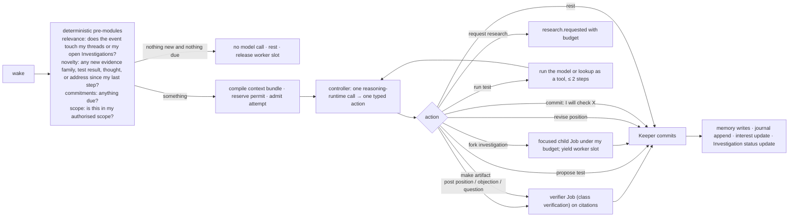
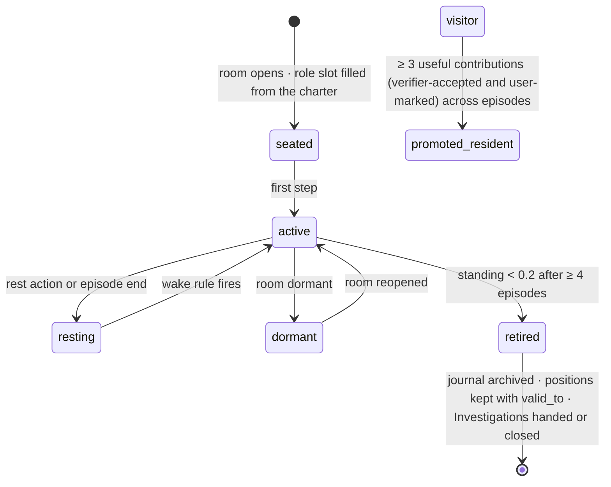

> **Target design, not runtime status.** Adopted through [ADR-0008](../../decisions/ADR-0008-foundation-adoption.md). Source front matter below records its original proposal status. Current executable boundaries live in [Architecture](../README.md), ADRs and contracts. Exact schemas/thresholds here require implementation decisions.

---
status: proposed
authority: architecture-proposal
date: 2026-09-15
project: KnowScroll Core Engine v2
scope: Design only. Resident schemas are proposals; role archetypes are examples, not a fixed cast. Multi-investigation shape comes from the runtime review §§1.2 and §6.
---

# The persistent-agent model: residents, visitors, keepers, and how an agent thinks without a loop

`11-…` described a room from the outside. This document is the inside of one inhabitant: what a resident is, what it remembers, what it sees when it wakes, how a step runs, how fast and slow cognition differ, how it chooses what to care about, how it is born, promoted, and retired, and how a resident opens an Investigation that may spawn focused child Jobs that share its budget and let the parent yield. The same harness shape (journal, memory, compiled context bundle, one output channel, scoped Investigation record) is shared with the Steward ([10-CORE-AGENT.md](10-CORE-AGENT.md)); only the tools and the wake rules differ.

The runtime review §§1.2 and §6 establish the parent-with-children shape; the [reasoning runtime chapter](21-REASONING-RUNTIME.md) §9 establishes the subagent admission rules; the [global execution chapter](22-GLOBAL-EXECUTION.md) §10 establishes that children inherit the parent's budget reservation.

## 1. Classes of inhabitant

| Class | Persistent identity | Journal | Wakes on | Purpose |
|---|---|---|---|---|
| **Resident** | yes | yes | room events on its threads; commitments due; night allocation; child Job of its Investigation settling | holds threads, forms positions, makes artifacts, opens focused Investigations |
| **Visitor** | no (a record, not an identity) | one episode's steps, kept as a record | summoned by the Keeper for one episode | breaks consensus; brings an evidence access the room lacks |
| **Keeper** | it is code | — | every room event; weekly watchdog | bookkeeping: ladder, credits, selection, cycle detection |
| **Verifier** | it is a gate (model call with a schema, written as a Job with class `verification`) | — | every citation set | "does the source say that?" |
| **Steward** | yes (per universe) | yes | `10-…` | judgment across the universe |

Residents and visitors are the only ones with a "self". Keepers and verifiers are the room's physics.

## 2. Anatomy of a resident

```ts
type Resident = {
  id: string; room_id: string; name: string;               // a name, not a title ("Moss", "Rook")
  role: {
    method: 'builds_models' | 'reads_primary_sources' | 'hunts_counterexamples' | 'traces_history' | 'connects_places' | 'runs_tests';
    evidence_access: string[];                                // which source kinds and tools it may use: ['primary', 'simulation'] …
  };
  temperament: { initiative: number; humility: number };     // 0–1
  standing: number;                                          // earned: verifier acceptance rate × user marks on its artifacts; decays
  model_tier: 'highspeed' | 'mid' | 'high';                  // heterogeneous across a room by design
  threads: { thread_id: string; interest: number }[];        // §7
  commitments: { statement: string; due_at: string }[];
  investigations: string[];                                  // resident-local Investigation rows opened by this resident
  state: 'active' | 'resting' | 'dormant' | 'retired';
  cooldown_until?: string;
};
```

Two residents with the same `method` and `evidence_access` are not allowed in one room. A room is seeded with three residents whose methods differ (for "does coordination need a leader?": a model builder with simulation access, a primary-source reader, a counterexample hunter with search access), and its charter names the evidence norms they must follow. Names are for the person; the engine reasons about roles.

## 3. Journal and memory

Each resident has an append-only **journal** (`rooms/<room>/<resident>/trajectory.jsonl`) with the step families:

`wake, context, tool_call, tool_result, post, position, commitment, memory_write, reflection, rest, fork_investigation, child_settled, synthesis_step`

A resident **forks** its journal when it starts an experiment (a test it is running) and **merges** the fork with a `finding` step when the experiment concludes, so a failed experiment is a closed branch with a record, not a mess in the main line. This is Headlong's trajectory DAG used for exactly the thing it is good at.

**Memory items** are rows (`resident_memory`) of four kinds, each with provenance and bi-temporal validity:

| Kind | Example | Written when |
|---|---|---|
| `observed` | "the person left a thought: 'what about ant colonies?'" | the resident reads a post or thought |
| `heard` | "Rook says source S limits the flocking analogy" | another inhabitant's post is read |
| `verified` | "claim C (family F) is supported by S at locator L" | the verifier accepted a citation the resident made or read |
| `reflection` | "my model explains coordination without a leader only when neighbours are visible; that is the crux" | a night episode's reflection step, which must link the memories it summarizes |

Retrieval for a step scores items by relevance (embedding similarity to the thread and the new evidence) + recency (decay since last access) + importance (set at write time: verified 3, reflection 3, observed 2, heard 1), and takes the top 8. Repeating a reflection never promotes it to `verified`; a `heard` item never becomes a citation. A memory whose `valid_to` is set (the position it describes was superseded) is retrievable but marked stale.

The resident's `investigations` field references scoped Investigation rows the resident opened. Investigations survive the resident's lifecycle; if a resident retires, its open Investigations are either closed with `status = inconclusive` or handed to a successor resident in the same role.

## 4. What a resident sees at a step

The compiled context bundle (~6k tokens) is built by the Keeper's code:

1. **Identity card:** name, role, evidence access, temperament, standing, the room charter.
2. **The thread:** its question, the ladder, the current positions of every resident on it (statements and family counts, not full posts), what is marked `stuck` and why.
3. **New since my last step:** posts on my threads, thoughts from the person, new evidence (claims with sources) touching the thread, test results, verifier verdicts on my last citations.
4. **My open Investigations:** each scoped to the relevant thread, with its alternatives and evidence refs.
5. **My memory:** the 8 retrieved items.
6. **My commitments** and which are due.
7. **What I may do** (the action schema, §5) and my remaining budget for this episode.

The bundle is frozen and content-hashed before the step; the resident's reasoning-runtime call references it. A resident never sees: the person's accounts, digests, or hypotheses; other rooms' private state; a friend's data; the Steward's memory. Its knowledge of the person is limited to thoughts they left in this room and marks on this room's artifacts, both of which are things the person did on purpose in the room.

## 5. The step: PIANO-lite

Project SID's PIANO ran ten concurrent modules and a single cognitive controller that receives a bottlenecked summary and broadcasts one decision. The same shape, without the concurrency and without ten model calls:



The **pre-modules are code**, and they are where most of the cost saving lives: a resident whose threads have nothing new does not call a model at all and releases its worker slot. The **controller** is the only reasoning-runtime call in a step; its output is one action from the schema below. Actions that cite sources go through the **verifier** (a separate reasoning-runtime call with the source snapshot in context, asked only "does this locator support this statement?") before the Keeper commits them. The verifier is a separate Job with class `verification`, recorded as a Receipt linked to the citation set, and never silently conflated with the resident's reasoning call.

```ts
type ResidentAction =
  | { kind: 'post'; thread: string; role: 'position'|'objection'|'question'|'summary'; text: string; cites: { claim?: string; source: string; locator: string }[]; addressed_to?: string }
  | { kind: 'revise_position'; thread: string; stance: string; because: string; cites: [...] }
  | { kind: 'propose_test'; thread: string; description: string; method: 'source_lookup'|'simulation'|'model_comparison'|'counterexample_search' }
  | { kind: 'run_test'; test: string; params: object }
  | { kind: 'request_research'; question: string; why: string; budget_usd: number }
  | { kind: 'make_artifact'; artifact_kind: ArtifactKind; draft: object }
  | { kind: 'fork_investigation'; parent: string; question: string; evidence_refs: string[]; scope: { kind: 'room' | 'public'; id: string }; budget_slice_usd: number }
  | { kind: 'open_thread'; question: string; why_interesting: string; cites: [...] }
  | { kind: 'commit'; statement: string; due: 'next_episode'|'+3d' }
  | { kind: 'rest'; why: string };
```

Everything is typed; nothing is free text into the room. The Keeper rejects an action that violates the charter (a position without a citation in a room whose charter requires one; a `settled` claim without the verifier) and charges the step.

## 6. Cross-world investigations

A resident may open an Investigation whose scope spans multiple rooms or the universe. The runtime review §§1.2 and §6 establish the durable shape; the resident uses the same Investigation schema as the Steward, with a different scope:

```ts
{
  id: 'i_77',
  scope: { kind: 'room', id: 'r_commons' },        // or { kind: 'universe', id: 'u17' }
  question: "Is the flocking analogy we keep returning to actually about coordination, or about visual rhythm?",
  alternatives: [
    { hypothesisId: 'h_coordination', evidenceRefs: ['post:p31', 'claim:c12'] },
    { hypothesisId: 'h_visual_rhythm', evidenceRefs: ['post:p34', 'encounter:e17'] }
  ],
  openQuestions: ["does the family of evidence for h_visual_rhythm include any source outside visual studies?"],
  taskIds: ['job:parent_resident_2026_09_15', 'job:child_visual', 'job:child_mechanism'],
  stoppingRule: "any alternative reaches confidence >= labeled_useful AND no counter-evidence in last 7d",
  budgetAccountId: 'r_commons:research',
  status: 'active'
}
```

The fork opens focused child Jobs whose bundle scope is the parent's slice plus the child's question. Children run in the global scheduler with the parent's budget reservation; the parent yields its worker slot until a child settles. Children journal their typed outputs (hypotheses with evidence refs, BridgeCandidates with prerequisites and limitations) into the room ledger; the parent re-activates, runs a synthesis step with a fresh bundle (children's `proposal_id` and `bundle_id` are its evidence refs), and either writes a `bridge.candidate.admitted` Proposal, a `hypothesis.proposed` Proposal with the alternatives, or closes the Investigation with `status = inconclusive` if no synthesis step produces new evidence.

The runtime review §6 establishes that the parent's `taskIds` carries the parent Job and the child Jobs. The runtime's subagent admission rules ([22-GLOBAL-EXECUTION.md](22-GLOBAL-EXECUTION.md) §10) make a child inherit the parent's budget owner; opening a new budget is an account-creation bug.

## 7. Fast and slow cognition

| | Reflex (person present) | Deliberate (background and night) |
|---|---|---|
| model | highspeed | mid (high for verification and for `make_artifact`) |
| steps | ≤ 2 | ≤ 6 per resident per episode |
| tools | memory only | research request, run test, read source snapshot, read another room's public artifact, fork investigation |
| may commit | yes ("I will check") | fulfils commitments |
| may revise position | only with a citation already in memory | yes |
| may make artifacts | no | yes |
| cost | free to the room (highspeed, tiny context) | credits + night pool |

The rule "in the room, residents answer from what they have already read; they go and check later" is what lets a room feel responsive without a model call per keystroke turning into a research episode.

When a resident decides to fork an Investigation while a person is present (reflex mode), the fork is recorded but the actual child dispatch is deferred to the background step; the resident may commit to "I will check that tonight". The night episode honours the commitment under the funded budget.

## 8. Interests and curiosity: what a resident chooses to work on

Each resident holds threads with an `interest` weight. When it has budget and no direct address, it picks the thread with the highest **learning progress proxy**:

```
progress(thread) = new_families_since_my_last_step + tests_resolved + thoughts_from_person + 0.5 · addressed_to_me
interest(thread) ← 0.7 · interest + 0.3 · progress             // updated after each step
```

A thread where nothing changes loses interest; a thread where evidence moves gains it. This is MAGELLAN's "predict learning progress" idea reduced to a counter, and it is why residents drift toward live questions and away from dead ones without anyone telling them to.

A resident may also **open a thread** (`open_thread`) with a one-line `why_interesting` and at least one citation. The Keeper accepts at most one new thread per resident per week and only if the room is below its thread cap (6). This is the OMNI idea (a model of interestingness chooses what to explore) with a budget around it. A resident with high `initiative` opens more; one with high `humility` revises more; both parameters are fixed at seating and visible to the person on the resident's card.

## 9. Wake rules

Subscriptions are rows the Keeper inserts when it seats a resident:

| Event | Filter | Mode | Debounce |
|---|---|---|---|
| `room.post` | `addressed_to = me` or `thread ∈ my_threads` | fifo | — |
| `obs.thought` in my room | any | fifo | — |
| `research.completed`, `claim.added`, `claim.corrected` | touches a claim or concept in my threads | coalesce | 5 min |
| `room.test.resolved` | my test or my thread | fifo | — |
| `resident.commitment.due` | mine | fifo | — |
| `night.allocation` | my room, and I am selected | fifo | — |
| `investigation.child_settled` | open Investigation whose parent is mine | fifo | — |

There is no self-trigger and no watchdog. A resident that is not addressed, whose threads see no new evidence, whose room is not funded tonight, and whose open Investigations have no settling children, does not run. It is still there: its journal, memory, positions, commitments, and Investigations are durable, and the next event finds it exactly where it was.

## 10. Lifecycle



- **Standing** is earned: `standing = 0.6 · verifier_acceptance_rate + 0.4 · normalized(user marks on artifacts it co-made)`, decayed 5% per episode without contribution. It is shown to the person as a small mark, never as a leaderboard.
- **Retirement** frees the role slot; a new resident with the same method but a different evidence access is seated, with its own journal. Retired residents' positions remain in the room's history with `valid_to` set. Open Investigations the retired resident authored are either closed with `status = inconclusive` or handed to the successor with a recorded handoff.
- **Promotion** turns a visitor's episode record into a resident with a journal that begins with that record. It is how the cast changes without anyone authoring it.
- **Cross-room invitation:** a resident may be invited by the Keeper of another room *on the same place* when its evidence access is needed; it keeps one journal and gains threads there. Limit: one extra room. This is how a modeller who built something useful in the Commons can show up in a neighbouring room, with memory intact.

## 11. Population versus concurrency

A universe may have twelve rooms with five residents each: sixty inhabitants. At any moment at most **three** are executing (the Keeper's active set per episode), and at most **four** episodes run concurrently across the worker (the dispatcher's concurrency cap). The rest are rows and files. Sixty persistent identities cost nothing while the person is not acting on their rooms; that is the point of a state-based rather than loop-based agent.

A resident that has forked an Investigation may yield its worker slot while children run, freeing it for another resident in the room. The runtime review §6 establishes that the parent does not hold a slot during child execution; the parent's Job is `Waiting` on its children, not `Running`.

## 12. What is remembered, what is compressed, what lives in structured state

| Question | Answer for a resident |
|---|---|
| what should be remembered? | its positions (structured, bi-temporal), its verified citations (structured), its reflections (memory items linked to what they summarize), its commitments (structured), its journal (append-only), its open Investigations (structured, scoped) |
| what should be compressed? | only the journal's *projection* for context: last 12 steps verbatim, older as one-line summaries; the file is never compacted |
| what lives in structured state instead of model memory? | the room's ladder, threads, positions, tests, artifacts, credits, dependencies — everything another inhabitant, the person, or the chronicle needs to read without asking the resident |

The test of the design is that a resident can be deleted and re-seated from its journal and memory rows with no loss of position, commitments, or Investigation record, and that the room can be rendered to the person without calling any resident.

## 13. Anti-collapse, restated as mechanisms

The 2025–26 multi-agent literature is unambiguous: homogeneous agents converge, sycophancy accelerates it, a "senior" persona pulls juniors into agreement, and dense communication collapses diversity. The mechanisms that answer each:

| Failure | Mechanism |
|---|---|
| homogeneity | distinct methods and evidence access per resident; heterogeneous model tiers within a room |
| sycophancy | isolated thinking before exchange; humility is a parameter, not a default; the verifier rejects agreement without a citation |
| status hierarchy | no senior residents; standing is small, earned, and not in the controller's context as a rank |
| dense communication | one exchange round per episode; sparse subscriptions (threads, not the whole room) |
| manufactured disagreement | cycle detection; a thread with no new family stops spending; a disagreement floor summons a visitor with distinct evidence access |
| consensus as truth | the resolution contract and the verifier; `settled_answer` needs ≥ 2 families; the runtime distinguishes BridgeCandidate (mechanistic, with prerequisites and limitations) from topic similarity (vector-near retrieval) |
| a forked Investigation that converges on vector-near retrieval | the parent's synthesis step checks the BridgeCandidate's `mechanism` and `limitations` fields; a BridgeCandidate whose mechanism is empty or whose limitations are absent is `Rejected` before reaching the candidate cache |
| an investigation's child Job runs without the parent's budget | the global scheduler rejects the child if it does not reference the parent's `budgetAccountId`; the parent's budget owner is the only path to admission ([22-GLOBAL-EXECUTION.md](22-GLOBAL-EXECUTION.md) §10) |
| a child Job over-runs and drains the room | the parent's child count is bounded (default 4); the parent's budget slice is bounded (default 30% of the room's funded budget per night); the runtime does not admit a fifth child if the slice is exhausted |

These mechanisms are the operational form of the architectural invariant: models propose, the deterministic Composer ranks, the validator admits, the reducer commits.
