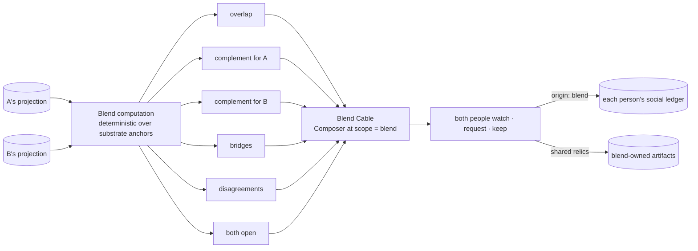

> **Target design, not runtime status.** Adopted through [ADR-0008](../../decisions/ADR-0008-foundation-adoption.md). Source front matter below records its original proposal status. Current executable boundaries live in [Architecture](../README.md), ADRs and contracts. Exact schemas/thresholds here require implementation decisions.

---
status: proposed
authority: architecture-proposal
date: 2026-09-15
project: KnowScroll Core Engine v2
scope: Design only. Phase 3 scope (D-003, D-017); the tables are designed on day one, the behaviour ships with Phase 3.
---

# Social and Blend: discovering through others without confusing their interest with yours

Friends are how a universe meets things its own engine would never propose. The engine must therefore treat social discovery as a **first-class context**, distinct from a person's own exploration, so that "I explored this because my friend showed me" is recorded as exactly that, and can become "I am interested in this" only through the person's own later acts.

The runtime review's stricter rule holds in this chapter: a Blend's shared computation must not leak either member's private inference, and the Composer's social family must never promote a friend-shared encounter into a candidate by sharing the friend's reasoning. The boundary is structural, not a rule: the Blend's projection contains only authorized artefacts, and the Composer's `social` family uses the friend's **shared items** as the input — not the friend's hypotheses, accounts, or Steward memory.

The supply plane that decides how a shared discovery enters inventory is in [23-CONTENT-DEMAND-AND-INVENTORY.md](23-CONTENT-DEMAND-AND-INVENTORY.md). The Composer that places friend-shared items in a slate is in [08-RECOMMENDATION.md](08-RECOMMENDATION.md). The Cable that surfaces them through a channel is in [09-INTERDIMENSIONAL-CABLE.md](09-INTERDIMENSIONAL-CABLE.md). This chapter stays inside the social plane: how visits and blends work, what they may share, and what they must not.

## 1. The two-context rule

Every event carries `context.origin` ([04-EVENT-ARCHITECTURE.md](04-EVENT-ARCHITECTURE.md) §2). The Accounts module routes by it:

| Origin | Written to | Effect on the chart |
|---|---|---|
| `own` | Attention Accounts ([06-USER-WORLD-MODEL.md](06-USER-WORLD-MODEL.md) §4: `attention_account`, `episode`, `mark`) | normal |
| `visit`, `shared_item`, `blend` | the **social ledger** (`social_account`, with `via_user_id`) | none directly |
| `room` (a shared room) | Accounts only for the person's own marks; social ledger for exposure to a friend's thoughts | none directly |

**Conversion** from social to own happens in exactly two ways:

1. **Own-context return.** The person, in their own universe (not visiting, not in a blend), performs a voluntary act on the concept ≥ 4 hours after the social exposure. That act is an ordinary mark; the episode is flagged `converted_from_social: via <friend>`, which the chart's lineage keeps ("you first met this through Rina").
2. **Explicit keep or ask during the visit.** A keep or ask while visiting creates a **sighting** in the person's own chart flagged `via_friend`, and a social mark. It is not attention mass. The sighting behaves like any other sighting: it disappears after 30 days without exposure and becomes a place only through the person's own marks.

Nothing else converts. Watching a friend's Cable for an hour produces social exposure rows and no change to the visitor's chart. This routing rule preserves social origin. A four-hour delay does not remove social influence or establish causal independence; the threshold is an illustrative product policy.

## 2. A visit

A visit is a read of a **projection**: an immutable snapshot of the friend's chart and inventory restricted to what their visibility policy shares (places marked shareable, published encounters in them, public room artifacts, kept things marked shareable). The projection contains no accounts, hypotheses, events, private rooms, private thoughts, sightings, dormant or archived places, or the friend's reasoning-runtime memory. It is computed by the Projector from tables marked shareable; the drift rule fails the build if it touches anything else ([03-ARCHITECTURE.md](03-ARCHITECTURE.md) §7).

Inside the visit the visitor can: pan the friend's universe; enter shared places; watch the friend's **selected** Cable (the Composer at the friend's universe scope, restricted to the projection, with the visitor's own gates for "seen" and "muted"); read public room artifacts; keep; ask; propose a co-voyage; propose a Blend.

What the friend's engine sees of the visit: a `social.visit.started` and `social.visit.ended` event with counts (items seen, kept) if the friend's policy allows visit receipts; nothing else. The friend's accounts are untouched by a visitor's watching. A friend's kept item during a visit is not a mark for the owner.

**No private inference crosses the visit boundary.** The visitor's Composer reads the friend's **shared items**, never the friend's hypotheses or family posteriors. The visitor's Steward memory and the visitor's digest are not visible to the friend. A kept item during a visit does not write to the friend's accounts. A prediction the visitor made in their own universe is not visible to the friend; the friend's reasoning runtime cannot "see what the visitor is thinking" by reading the visitor's account rows through the projection, because the projection does not include them.

## 3. Friends as a candidate source in one's own Cable

The `social` family draws from: items a friend explicitly shared with the person; the friend's public discoveries (encounters the friend kept and marked shareable), and blend bridges. It has its own Thompson posterior like every family. Its exposures are logged with `origin: shared_item` so that marks on them are social marks until converted. In the person's Cable a social item's channel reads "through a friend".

The social family is **not a path for the friend's hypotheses**. A bridge candidate the friend has proposed in their own universe is not shared as a bridge candidate; it is shared only if the friend has marked a ready encounter on that bridge as shareable. The Composer's `bridge` family never falls back to a friend's bridge proposal when the person's own evidence gate would otherwise reject it.

## 4. Blend

A Blend is a **temporary third projection** computed from two (or up to five) immutable projections. It is deterministic, over shared substrate anchors:

```
overlap        concepts anchored (as places) in both projections
complement_A   concepts anchored in A, not in B, within 2 substrate hops of something in B (bridgeable for B)
complement_B   symmetric
bridges        substrate paths of length ≤ 2 between an A-only anchor and a B-only anchor, typed
disagreements  claims on which A's and B's kept positions or predictions differ
both_open      questions kept by both (or holes in both) on overlapping concepts
```



The Blend Cable adds families: `from_friend` (a complement item, served with the label "from Rina's Compilers planet"), `bridge_between_us` (an encounter on a bridge concept, or, if none exists, a sighting card), `both_open` (a both-sides artifact or a room invitation), `disagreement` (the two positions side by side). It balances fairness: alternate whose complement is drawn, as Spotify's Blend balances two tastes, but with bridges and disagreement added, which a playlist has no notion of.

**Shared computation is bounded by the projection.** A Blend's `bridges` set is computed only over typed substrate paths between concepts that appear in at least one projection as an anchored place; `disagreements` compares only `kept positions` and `predictions` rows that the projection includes; `both_open` includes only questions that have been explicitly kept by the person whose projection is being read. The Blend computation never reads the underlying accounts, hypotheses, or reasoning-runtime memory of either member.

## 5. Requests inside a Blend

A branch request or a probe inside a Blend produces content **owned by the Blend**: a `brief` with `scope: blend`, funded from an explicitly agreed and reserved Blend sponsor split (equal shares are an optional policy), producing an encounter whose `origin_place_kind = blend` and a shared relic if kept. Each person's social ledger records the exposure; each person's own model updates only by the two-context rule. When the Blend ends, kept relics remain with lineage under the retention grant issued for that keep; private content without such a continuing grant is revoked; the Blend Cable's projection is deleted; future access is revoked for both.

The supply plane for Blend-owned content is [23-CONTENT-DEMAND-AND-INVENTORY.md](23-CONTENT-DEMAND-AND-INVENTORY.md) §3: a Blend request creates a `ContentDemand` with `scope: blend`, with its own budget reservation, with its own demand waiter links, and with its own per-user EncounterBindings when the asset completes.

## 6. Co-voyage and shared rooms

A co-voyage is a live visit where both people move through one person's universe together; it is the visit model with a shared session cursor, and every observation is origin-tagged per person. A shared room ([11-IDEA-ROOMS.md](11-IDEA-ROOMS.md) §10) is the only social object with a life of its own; its residents see both members' thoughts and neither member's engine state.

## 7. Revocation

Revocation (unfriend, end blend, change policy) invalidates projection tokens immediately, removes the friend's items from the person's candidate sources, deletes blend state, and schedules derived-cache cleanup. Social ledger rows on the revoking side are retained (they are the person's own history of what they met); the other party's projection is gone. The README’s kept-copy behavior is implemented through an explicit retention grant at keep time: an authorized retained copy can survive with lineage, while future source access is revoked. A keep cannot invent rights the original source grant did not allow.

## 8. Privacy invariants, as tests

- A visitor's session can reach no row of `attention_account`, `episode`, `mark`, `user_hypothesis`, `event`, `steward_*`, or private `room*` belonging to the owner (extends journey S-21).
- No social-origin event ever appears in an `episode` that contributes to `mass`.
- A Blend's computed state contains only concept ids, place ids marked shareable, and public artifact ids.
- Resident context in a shared room never includes a `StewardDigest`, an account row, a family posterior, or a bridge candidate that the projection did not include.
- A Blend's `bridges` set contains only paths whose endpoints are typed substrate relations with cited evidence refs that the projection includes — not inferred from substrate degree alone.
- The Composer's `social` family reads only `shared_item` rows; it does not read the friend's `family_posterior`, `steward_journal`, or `user_hypothesis` rows.

## 9. What social discovery changes in the model, honestly

The two-context rule means social discovery is *slower* to change a person's chart than their own wandering: a friend can put a sighting in your sky, but only you can make it a place. That is the intended asymmetry. The chronicle keeps the lineage, so the story "Rina's universe exposed a continent I had never thought to search for, and three weeks later it was mine" is a true sentence assembled from a `via_friend` sighting, an own-context return, and a birth delta with a cause chain.

Shared computation gives the engine no shortcut to private truth. The Blend projection is the only input the Blend Composer reads; the social family is the only input the visitor's Composer reads from the friend's universe; the visit receipt is the only output the friend's engine sees. Outside those three boundaries, every person's reasoning remains their own.
