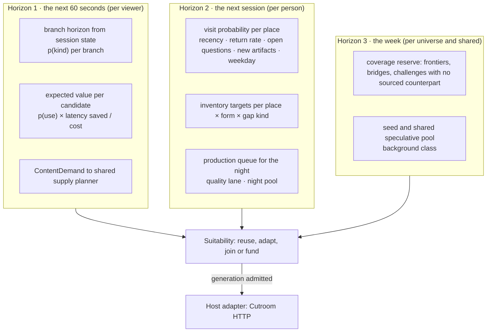
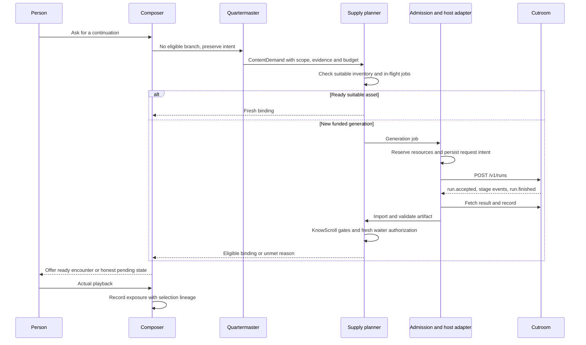

> **Target design, not runtime status.** Adopted through [ADR-0008](../../decisions/ADR-0008-foundation-adoption.md). Source front matter below records its original proposal status. Current executable boundaries live in [Architecture](../README.md), ADRs and contracts. Exact schemas/thresholds here require implementation decisions.

---
status: proposed
authority: architecture-proposal
date: 2026-09-15
project: KnowScroll Core Engine v2
scope: Design only. Describes the integration between KnowScroll and the Cutroom video harness HTTP contract as observed at the September 15 pin. Does not claim capabilities the contract does not establish; does not replace the supply-plane contract in [23-CONTENT-DEMAND-AND-INVENTORY.md](23-CONTENT-DEMAND-AND-INVENTORY.md).
---

# Video Harness HTTP integration: the Quartermaster over the current Cutroom contract

The video harness (working name Cutroom) is a separate project that produces media and verdicts. KnowScroll decides **what should exist, why, for whom, in which world, whether to retrieve or generate, whether to continue, vary or edit, what to make ahead of time, at what priority, by when**. The module that makes those decisions is the **Quartermaster**. It emits ContentDemands. The supply planner selects fulfillment, and the host adapter alone talks to Cutroom over the **V1 same-host loopback HTTP/JSON contract** documented at [23-CONTENT-DEMAND-AND-INVENTORY.md](23-CONTENT-DEMAND-AND-INVENTORY.md) §6. There is no `warm/run/estimate/invalidate` SDK; there is no cross-run partial-shot reuse API; there is no `sources` card from Cutroom. This chapter replaces the previous draft's SDK-flavoured language with that contract.

The supply-plane contract lives in [23-CONTENT-DEMAND-AND-INVENTORY.md](23-CONTENT-DEMAND-AND-INVENTORY.md): a ContentDemand, scoped inventory suitability, reuse/adapt/join/new-funded generation, the host-local Cutroom HTTP path, asset import with source/provenance validation, ContentAssetRevision, and per-user EncounterBinding. The reasoning runtime that proposes encounter intents and bridge candidates upstream of the Quartermaster is in [21-REASONING-RUNTIME.md](21-REASONING-RUNTIME.md). The global scheduler that funds each Quartermaster request is in [22-GLOBAL-EXECUTION.md](22-GLOBAL-EXECUTION.md). This chapter stays inside the Quartermaster: how it predicts demand, how it stages briefs, how it consumes Cutroom's outcomes, and what it cannot claim about the harness.

## 1. The boundary

```
KnowScroll owns                                          Cutroom owns
──────────────────────────────────────────              ────────────────────────────────────────────
why a piece of content should exist (gap kind)          how to plan shots from beats
which world and person it is for                        keyframes, clips, narration, captions, assembly
retrieve vs edit vs generate                            which provider, which endpoint, which strategy
continue vs vary vs edit                                anchors, continuity, dependency repair
claims, sources, truth state, capsule                   the witness and brief gates; verdict evidence
priority, deadline class, budget, pool, lane            its own scheduler, queues, cancellation, fencing
publication and exposure                                playable manifests, render events, receipts
ContentDemand emission · reuse vs generate decision     same-host HTTP/JSON contract (loopback, no auth)
asset import validation, provenance, rights             artifact bytes at engine-local paths
per-user EncounterBinding · shared inventory serving    nothing outside its single machine
```

The current contract carries opaque claim IDs, narration and criteria. KnowScroll retains source snapshots and final epistemic publication gates. The older proposed `ks:epistemic` registration API is not established by this V1 HTTP contract. Cutroom receives only the fields its schema accepts; private hypotheses and ranking state stay outside it.

## 2. The Quartermaster's three horizons



The three horizons are unchanged from the previous draft. The unit of interaction with Cutroom has changed: each horizon emits a ContentDemand. Only an admitted generation job becomes a POST through the host adapter. `requestId` provides idempotency; cancellation takes effect at a stage boundary rather than guaranteeing reversal of in-flight supplier work; artifacts return as engine-local paths that KnowScroll imports through the host adapter.

### Horizon 1: while the person watches

On every `serve.window` and `obs.branch_request`, inline:

1. Read the branch horizon ([06-USER-WORLD-MODEL.md](06-USER-WORLD-MODEL.md) §9) for the current item: e.g. oppose 0.45, deepen 0.30, example 0.15, counterfactual 0.10.
2. For each kind, look up readiness: is there an eligible branch (T0)? a verified local adaptation path (T1), if implemented? or does it need generation (T2)?
3. Compute expected value `EV = p(kind) · latency_saved(tier) / cost(tier)` and open a `ContentDemand` for candidates above the pool's EV line, with `needBy: '+20s'` and `maxUsd` from the nightly policy. The demand enters the singleflight generator ([23-CONTENT-DEMAND-AND-INVENTORY.md](23-CONTENT-DEMAND-AND-INVENTORY.md) §5); the generator either finds a suitable asset, joins an existing in-flight demand, or schedules a new Cutroom run.
4. On the next vertical move, cancel the obsolete speculative waiter; preserve explicit requests. A horizontal request may raise the internal job priority subject to fairness. Do not assume Cutroom can promote a submitted run or cancel unrelated waiters.

Prefetch depth follows the demand-plane rule: the fast lane keeps 1–2 items ahead per viewer for branches; vertical items come from ready inventory, which the Quartermaster keeps stocked so that the median window needs no generation at all.

### Horizon 2: before the next session

Nightly (inside the reasoning runtime's allocation, but computed by code):

```
p_visit(place) = σ( a·recency(place) + b·return_rate_30d(place) + c·open_questions(place)
                   + d·new_artifacts_since_last_visit(place) + e·weekday_pattern + f·steward_priority )
```

with coefficients from the policy table, calibrated monthly against actual visits. For the top-M places by `p_visit` (M = 6 bench) the Quartermaster sets **inventory targets**:

| Target | Bench |
|---|---|
| eligible reels per top place | ≥ 3 |
| eligible scrolls per top place | ≥ 2 |
| continuation branches ready for the place's hot branch chains (last 7 days) | ≥ 1 per chain |
| challenge item per place with a kept claim | ≥ 1 |
| frontier item per sighting the reasoning runtime probed | ≥ 1 |

Shortfalls become `ContentDemand`s with `gap_kind`, ranked by `p_visit × shortfall × (1 − inventory_share)` and produced on the quality lane in the night pool through the planner; `background` is KnowScroll scheduling metadata, not an invented HTTP request field. A place with lots of cheap inventory is *deprioritized* by the `(1 − inventory_share)` term: the coverage reserve.

### Horizon 3: the week

A weekly pass keeps a **coverage reserve**: at least one sourced item for every sighting with `reason ∈ {probe, room, friend}`, one challenge for every kept claim with a `contradicts` relation in the substrate, and the seed grid replenished. This runs at `background` priority under the seed cap (a one-time total and a weekly replenishment thereafter).

## 3. What produces a ContentDemand

| Gap kind | Source | KnowScroll urgency | Lane | Pool |
|---|---|---|---|---|
| `continuation` unmet | `obs.branch_request` with nothing ready | interactive | fast | session |
| `continuation` likely | branch horizon | speculative | fast | session |
| `depth`, `challenge`, `frontier`, `revisit` shortage | horizon-2 targets | background | quality | night |
| `room_artifact` | a gated `both_sides_scroll` that would benefit from motion (the reasoning runtime decides, ≤ 1 per night) | background | quality | room |
| `probe` | reasoning runtime or person | background | quality | night |
| `seed` | coverage reserve | background | quality | seed |
| `repair` | a correction invalidated one shot | deadline | repair | night |
| `edit` (shorter, recap, recaption after correction) | Composer or gates | deadline | T1 edit-only | session or night |

A `ContentDemand` is never opened without a gap. The Quartermaster's decision per gap is a fixed order: **T0 retrieve** (an eligible item satisfies the gap) → **T1 adapt** (only an implemented and verified local operation, with any cost admitted) → **T2 fast generation** (interactive or speculative, fast lane) → **T3 quality generation** (night). The demand-plane planner's suitability check is called first; `cannotMeet` at admission is what lets the Composer show an honest preparing state instead of a stall.

## 4. The brief

The `Brief` shape KnowScroll hands to the demand planner (the previous draft's `EncounterBrief`; the field set is unchanged in spirit, but the destination is the V1 contract, not the older SDK):

```ts
type Brief = {
  id: string; user_id: string; scope: Scope; epoch: number;
  gap_kind: GapKind; cause: string[];                     // event ids: the branch request, the forecast, the probe
  question: string; intent_act: IntentAct;               // what opportunity the encounter should create
  place_id: string; concept_ids: string[];               // which world it belongs to
  claims: { id: string; role: string }[]; sources: string[]; truth_state: TruthState;
  capsule_id?: string;                                    // for continuations: the sealed capsule
  relation_to_previous?: 'continue'|'deepen'|'explain_differently'|'example'|'oppose'|'consequence'|'character'|'counterfactual';
  form: 'reel'|'scroll';                                  // scroll briefs go to the research runner, not Cutroom
  deadline_class: 'interactive'|'deadline'|'speculative'|'background';
  lane: 'fast'|'quality'|'repair'; pool: string; tier: 'T1'|'T2'|'T3';
  budget_usd: number; priority: number;
  policy_version: string; rights: object;
};
```

The host adapter compiles this internal brief into the strict Cutroom request: `contractVersion`, `requestId`, `worldId`, narration sentences, opaque claims, criteria, style and options including positive integer `budgetCents`. It does not send the Brief object verbatim. The current contract constrains narration length and sentence/claim references; adapter validation must check those before submission. Local metadata (scope epochs, source snapshots, pool, private causes and budget reservation IDs) remains in KnowScroll.

## 5. Continue, vary, edit: how each maps

| Intended experience | Supported baseline | Integration requirement |
|---|---|---|
| Continue a Reel | A new run with approved narration and criteria compiled from the sealed capsule | Validate continuity in KnowScroll |
| Oppose, example, counterfactual or different explanation | New run with supported claims and explicit truth state retained in KnowScroll | Opposition requires evidence; hypothetical material stays labeled |
| Series with a recurring character | Related independent runs with lineage | Character continuity depends on tested media route capabilities |
| Shorter, recap, recaption or retime | Reuse a complete asset, or a verified local transformation if available | The V1 run contract is not an editing-session API |
| Correct one shot | Withdraw affected result immediately; generate a corrected complete result as baseline | Partial-shot repair/reuse requires a separate supported adapter and dependency lineage |
| Clearer diagram or animation requested by a room | New funded demand and gated result | No assumed `sessions.start` HTTP method |

These experiences remain part of the design. The table separates them from what the current external contract can execute directly.

## 6. Events back, and publication

The host adapter follows `GET /v1/runs/:runId/events?since=n` and saves `nextSince`. It records bounded operational receipts and publishes relevant normalized `cutroom.*` events to the Ledger; raw media/tool streams do not become personal evidence.

| Wire observation | KnowScroll effect |
|---|---|
| `run.accepted` | Save run/request identity and accepted state |
| `stage.started`, `stage.finished` | Update progress; progress is not publication eligibility |
| Documented verdict payload | Retain technical verdict; independently evaluate epistemic requirements |
| `run.finished` | Fetch `/result` and `/record`, inspect actual terminal status, import supported artifacts |
| Valid imported result passes KnowScroll gates | Write asset revision and eligible availability; recheck each waiter before binding |
| Failed, stopped or cancelled result | Preserve gap where relevant, reconcile cost and notify affected waiters |

The current contract does not expose `run.playable`, `run.complete`, or `budget.metered` as the wire events assumed by the earlier draft. A future progressive-readiness integration requires its own contract; V1 returns one progressive MP4 after completion.

The recording wrapper does not prove all failed internal supplier attempts were charged. The planner's estimate covers image calls and video duration, not every KnowScroll cost. Keep unknown liability and require the metered internal supplier port before claiming exact shared admission.

Exposure requires actual visibility/playback or reading according to the object type. Preparing, importing or prefetching content is never exposure.

## 7. Cancellation, epochs, and late results

Cancel obsolete speculative demand waiters when context changes. Preserve a user's explicit request with its own outcome. Cancel an unnecessary generation job only after checking other waiters and its sponsor policy. A privacy reset revokes the relevant scope epochs, private bindings and dependent artifacts in KnowScroll; request Cutroom cancellation where appropriate. A late result cannot reattach to a revoked scope, but minimal cost reconciliation still runs.

After an ambiguous POST, reconcile using the same `requestId` before considering another submission. Do not assume a project-wide invalidate API, priority-promotion API, or exact remote stop guarantee. See [23 §§5–7](23-CONTENT-DEMAND-AND-INVENTORY.md).

## 8. The session-start burst

A latency strategy to measure: on `obs.session.start`, the Quartermaster reads `p_visit` for the top 2 places and their hot branch chains and proposes up to one continuation demand per chain within the session budget; retrieval and reuse run first. Whether that improves the first branch latency must be measured; neither session prediction nor readiness is guaranteed.

## 9. Supply must not steer the person

Three guards, all in code:

- the `(1 − inventory_share)` term in horizon-2 ranking (coverage reserve);
- the Composer's calibration is over the person's mass, not over inventory counts, and a shortage produces a `supply.gap`, never a substitution from a place with surplus;
- the corpus monitor "supply-driven exposure" ([14-QUALITY-ANTI-SLOP.md](14-QUALITY-ANTI-SLOP.md) §8) alarms when exposure follows inventory.

A provider outage produces `supply.gap` rows and an honest chart; it produces no change in accounts.

## 10. Cost accounting

A demand may exist unfunded. Before generation, the planner reserves a monetary envelope; before each actual resource attempt, admission reserves its permit. Completion or reconciliation settles that attempt, retaining unknown liabilities. Internal ledger reporting must join all governed suppliers; a successful run receipt alone is not an all-in cost proof. Existing bench pool policies are retained below for review:

| Pool | Cap | Who fills it |
|---|---|---|
| session | $0.80 per session, $3 per day | fast-lane warms and interactive branches |
| night | $2.00 per night | horizon-2 briefs, repairs, probes |
| room | inside the night pool, ≤ $0.50 | artifacts the reasoning runtime chose to animate |
| seed | one-time total, then $5 per week | coverage reserve |

A reservation that would breach a cap returns `budget.refused`, and the gap stays a gap. Quality is never silently lowered to fit a cap (D-014's rule).

The runtime review's caveat applies: until the metered provider port inside Cutroom is implemented, the Quartermaster uses conservative run-level caps and explicitly partitions provider capacity between KnowScroll and Cutroom. This is a coarse temporary bound, not exact global token accounting. Never claim a hard all-in ceiling unless every supplier call and local resource charge is bounded or reserved.

## 11. Sequence: one session, end to end


