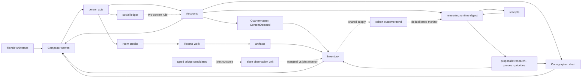

> **Target design, not runtime status.** Adopted through [ADR-0008](../../decisions/ADR-0008-foundation-adoption.md). Source front matter below records its original proposal status. Current executable boundaries live in [Architecture](../README.md), ADRs and contracts. Exact schemas/thresholds here require implementation decisions.

---
status: proposed
authority: architecture-proposal
date: 2026-09-15
project: KnowScroll Core Engine v2
scope: Design only. Every loop here has a named damper and a named monitor; a loop without both is a bug.
---

# Feedback loops: every way the engine can talk itself into something, and the damper on each

A system that observes the behaviour it causes, generates the supply it then serves, and runs agents whose output it then shows, has loops inside loops. The September 8 review named the central product risk correctly: selection, supply, and evolution feed each other. The September 15 runtime review added two more loops the previous draft did not name explicitly: **shared supply confounding** (a corpus trend that disappears once shared assets are deduplicated per cohort and generation-policy version) and **bridge-link outcome confounding** (linked encounters can produce dependent observations; preserve each exposure and use an explicit analysis unit). This chapter enumerates the loops, the damper that breaks each one, and the monitor that shows whether the damper works.

The runtime that proposes the bridge candidates that create the link confound is in [21-REASONING-RUNTIME.md](21-REASONING-RUNTIME.md). The global scheduler that admits each loop's expensive attempt is in [22-GLOBAL-EXECUTION.md](22-GLOBAL-EXECUTION.md). The supply plane that decides what enters the inventory that the loops operate on is in [23-CONTENT-DEMAND-AND-INVENTORY.md](23-CONTENT-DEMAND-AND-INVENTORY.md). This chapter stays inside the loop plane: which way the engine can talk to itself, and how it is prevented from doing so.

## 1. The map

The two dotted paths are the September 15 additions: shared supply reaches the cohort outcome trend, and a typed bridge candidate creates a joint slate observation. Both are monitored in [14-QUALITY-ANTI-SLOP.md](14-QUALITY-ANTI-SLOP.md) §8; their dampers are stated below.

## 2. The loops, one by one

### L1 · Exposure → behaviour → attention → exposure (the self-confirming universe)

The classic recommender loop: show more of X, observe more X, conclude X.

| Damper | Where |
|---|---|
| exposure alone is worth 0.5 per episode; marks are worth up to 6.5 | [06-USER-WORLD-MODEL.md](06-USER-WORLD-MODEL.md) §3 |
| structure gates need voluntary marks, distinct days and source lineage; these constrain eligibility but remain influenced by exposure policy | [07-UNIVERSE-EVOLUTION.md](07-UNIVERSE-EVOLUTION.md) §4 |
| a 15% exploration floor and a 5% random swap that the posterior cannot shrink | [08-RECOMMENDATION.md](08-RECOMMENDATION.md) §6 |
| calibration over the person's mass, not over recent exposure | [08-RECOMMENDATION.md](08-RECOMMENDATION.md) §6 |
| every served item logs family and slot propensities for later off-policy checks | [08-RECOMMENDATION.md](08-RECOMMENDATION.md) §9 |
| the Composer's `U` term saturates at 0.5 for any candidate whose `exposure_share` on the relevant account exceeds 0.8 | [08-RECOMMENDATION.md](08-RECOMMENDATION.md) §5 |

**Monitor:** `exposure_share` per anchored place; alarm when the mean over live places exceeds 0.8 (places are forming mostly from what the system offered).

### L2 · Supply → serving → attention → supply (inventory steers the person)

A place with cheap inventory gets served, gets marks, gets forecast demand, gets more inventory.

| Damper | Where |
|---|---|
| retrieve before generate; briefs need a gap | [14-QUALITY-ANTI-SLOP.md](14-QUALITY-ANTI-SLOP.md) §6, [15-VIDEO-SDK-INTEGRATION.md](15-VIDEO-SDK-INTEGRATION.md) §3 |
| the coverage reserve term `(1 − inventory_share)` | [15-VIDEO-SDK-INTEGRATION.md](15-VIDEO-SDK-INTEGRATION.md) §2 |
| shortages become `supply.gap`, never substitutions from surplus places | [15-VIDEO-SDK-INTEGRATION.md](15-VIDEO-SDK-INTEGRATION.md) §9 |
| the Composer's calibration ignores inventory counts | [08-RECOMMENDATION.md](08-RECOMMENDATION.md) §6 |

**Monitor:** supply-driven exposure > 40%; outcome-per-exposure of generated vs retrieved ([14-QUALITY-ANTI-SLOP.md](14-QUALITY-ANTI-SLOP.md) §8).

### L3 · Attention → room credits → artifacts → serving → attention (the room that pleases its patron)

A room the person likes makes artifacts the person is shown, which earn credits, which fund more artifacts.

| Damper | Where |
|---|---|
| agent activity never writes accounts; artifacts are exposure until marked | [11-IDEA-ROOMS.md](11-IDEA-ROOMS.md) §9 |
| artifacts pass the same gates as everything else; consensus is not a gate | [11-IDEA-ROOMS.md](11-IDEA-ROOMS.md) §6 |
| the disagreement floor and cycle detection stop a room from producing agreeable motion | [11-IDEA-ROOMS.md](11-IDEA-ROOMS.md) §5 |
| evidence families, not voices: two residents citing the same source are one family | [11-IDEA-ROOMS.md](11-IDEA-ROOMS.md) §5 |
| room family share is bounded by the Composer's quotas | [08-RECOMMENDATION.md](08-RECOMMENDATION.md) §6 |
| credits decay; a room with nothing new spends nothing | [11-IDEA-ROOMS.md](11-IDEA-ROOMS.md) §7 |

**Monitor:** per room, marks per served artifact; alarm when a room's artifacts are served > 3× the median with marks < 0.5× the median.

### L4 · Reasoning runtime proposals → world → digest → reasoning runtime (an agent that believes its own plans)

The reasoning runtime proposes research on X; X gets an encounter; the person is shown X; the digest shows marks on X; the reasoning runtime concludes X matters.

| Damper | Where |
|---|---|
| proposals carry receipts; the calibration block is code-owned and shows hit rates | [21-REASONING-RUNTIME.md](21-REASONING-RUNTIME.md) §10 |
| 1 of 3 research proposals must be a challenge or frontier gap | [21-REASONING-RUNTIME.md](21-REASONING-RUNTIME.md) §10 |
| the digest aggregates marks by family, so the reasoning runtime sees that marks on X came through `frontier` (its own probe) | [06-USER-WORLD-MODEL.md](06-USER-WORLD-MODEL.md) §11 |
| the reasoning runtime cannot rank or publish | [21-REASONING-RUNTIME.md](21-REASONING-RUNTIME.md) §6 |

**Monitor:** share of marks in a universe whose cause chain includes a reasoning-runtime proposal; alarm above 40%.

### L5 · Social → own model (the friend's universe becomes yours)

| Damper | Where |
|---|---|
| the two-context rule: social exposure writes the social ledger only; conversion requires an own-context voluntary act ≥ 4 h later | [13-SOCIAL-BLEND.md](13-SOCIAL-BLEND.md) §1 |
| a keep during a visit makes a sighting, not a place | [13-SOCIAL-BLEND.md](13-SOCIAL-BLEND.md) §1 |
| the social family has its own posterior and quota | [08-RECOMMENDATION.md](08-RECOMMENDATION.md) §3 |
| the Composer's `social` family reads only `shared_item` rows; it does not read the friend's family posteriors, hypotheses, or reasoning-runtime memory | [13-SOCIAL-BLEND.md](13-SOCIAL-BLEND.md) §3, §8 |

**Monitor:** share of places born with `converted_from_social` lineage; not an alarm, a report (it is the social product working), but a check that no place was born without an own-context act.

### L6 · Generated content → sources → generated content (model collapse)

| Damper | Where |
|---|---|
| the research runner's fetch blocklist excludes the engine's own outputs; claims need external families | [14-QUALITY-ANTI-SLOP.md](14-QUALITY-ANTI-SLOP.md) §6 |
| room `settled_answer` needs ≥ 2 external families | [11-IDEA-ROOMS.md](11-IDEA-ROOMS.md) §3 |

**Monitor:** count of claims whose only sources are on the blocklist; must be zero (a test, not a threshold).

### L7 · Judge → editorial score → generation style → judge (aesthetic convergence)

| Damper | Where |
|---|---|
| pairwise, blinded judging against a human reference set; monthly human calibration; judge rotation and self-preference tracking | [14-QUALITY-ANTI-SLOP.md](14-QUALITY-ANTI-SLOP.md) §5 |
| template fingerprint diversity gate | [14-QUALITY-ANTI-SLOP.md](14-QUALITY-ANTI-SLOP.md) §4 |
| the judge is one input, not the gate; the verifier is also one input; both carry the calibration-proxy caveat | [14-QUALITY-ANTI-SLOP.md](14-QUALITY-ANTI-SLOP.md) §5 |

**Monitor:** template diversity < 0.4; judge–human agreement < 0.7; per-judge self-preference drift > 10 points.

### L8 · Chart → navigation → routes → chart (the map shapes the paths that justify the map)

A place that exists gets entered; entering creates routes; routes justify systems.

| Damper | Where |
|---|---|
| routes that count for ignition are `branch`, `enter`, `bridge_used` — deliberate acts, not adjacency | [07-UNIVERSE-EVOLUTION.md](07-UNIVERSE-EVOLUTION.md) §4.4 |
| persistence gates and the model veto | [07-UNIVERSE-EVOLUTION.md](07-UNIVERSE-EVOLUTION.md) §5, §7 |
| `exposure_share` recorded per place for humility | [06-USER-WORLD-MODEL.md](06-USER-WORLD-MODEL.md) §2 |
| a typed bridge candidate that has been proposed but not used does not satisfy ignition | [07-UNIVERSE-EVOLUTION.md](07-UNIVERSE-EVOLUTION.md) §4.4 |
| numeric gates are not the sole candidate producer; semantic bridge candidates enter upstream of the gates | [07-UNIVERSE-EVOLUTION.md](07-UNIVERSE-EVOLUTION.md) §6 |

**Monitor:** the replay test (§4) plus a synthetic-user check: a scripted user who only follows what is offered must never ignite a system.

### L9 · Shared supply → cohort outcome (the supply confound)

A shared generated asset can shift a cohort's measured outcome in ways that have nothing to do with the recommender: a single asset that lands well inflates marks for everyone who saw it; a generation-policy change between two cohorts conflates supply effects with ranking effects.

| Damper | Where |
|---|---|
| the corpus monitor reports shared asset exposure, cohort overlap and policy version; deduplication handles duplicate logging but cannot remove causal interference | [14-QUALITY-ANTI-SLOP.md](14-QUALITY-ANTI-SLOP.md) §8 |
| experiment logs record policy/model versions, candidate sets or their reproducible references, exclusions, positions, branch availability, inventory state, exposure assignment, and selection probabilities where the policy actually defines them | [22-GLOBAL-EXECUTION.md](22-GLOBAL-EXECUTION.md) §11 |
| randomized, bounded exploration or appropriate controlled comparisons when testing causal benefit | [22-GLOBAL-EXECUTION.md](22-GLOBAL-EXECUTION.md) §11 |
| offline replay cannot reveal a user's response to content never shown | [22-GLOBAL-EXECUTION.md](22-GLOBAL-EXECUTION.md) §11 |

**Monitor:** shared asset and generation-policy exposure across cohorts, which can confound outcome comparisons; an outcome difference across two consecutive policy versions after shared-asset deduplication.

### L10 · Bridge-link → joint outcome (the link confound)

A typed bridge candidate that links two encounters makes a slate that contains both one observation, not two. The per-item `marks` rate is the marginal outcome; the joint outcome is `bridge_pair_marks / bridge_pair_exposures`. The two can diverge when a bridge is doing the work the items alone could not — or when the items are individually under-performing and the bridge carries the slate.

| Damper | Where |
|---|---|
| every encounter that is the source or destination of a typed bridge candidate has its `bridge_link` recorded before `eligible` | [14-QUALITY-ANTI-SLOP.md](14-QUALITY-ANTI-SLOP.md) §3 |
| the `bridge_pair_*` fields on the quality vector are computed at the same cadence as `outcome.*` | [14-QUALITY-ANTI-SLOP.md](14-QUALITY-ANTI-SLOP.md) §2 |
| the Composer's `D` term saturates at 0.6 for any candidate whose mechanism is untyped | [08-RECOMMENDATION.md](08-RECOMMENDATION.md) §5 |

**Monitor:** the per-item `marks` rate is materially higher than the `bridge_pair_marks / bridge_pair_exposures` rate; a slate whose joint outcome diverges from its marginal outcome for two consecutive observation windows.

## 3. The delayed-outcome loop, deliberately kept

One loop is desired: **useful encounters and deferred returns update family posteriors** ([08-RECOMMENDATION.md](08-RECOMMENDATION.md) §6). It is the only place the engine learns from behaviour, it learns at the granularity of families rather than items, it uses marks and returns rather than watch time, and it is logged with propensities. Its damper is the exploration floor; its monitor is the family posterior drift report (a family whose posterior collapses toward zero for 30 days is investigated, not deleted).

## 4. The replay test

Every loop above is exercised by replaying scripted histories through the whole engine in a scratch database:

| Scripted user | Expected outcome |
|---|---|
| autoplays one topic for 30 days, never marks | no place forms; mass high; `voluntary = 0` |
| follows only what is offered, marks everything offered | places form; no system ignites (no deliberate routes between children) |
| narrow deep explorer | one richer planet; no split |
| broad shallow browser | many sightings, few places, no galaxy |
| two-subdomain explorer with deliberate routes | ignition after ≥ 12 days |
| user away for 60 days | dormancy; one mark reawakens |
| ten agents repeat one source | one evidence family; no settled answer |
| friend shows a continent; user never returns on their own | a sighting that expires; no place |
| friend shows a continent; user returns on their own | a place with `via_friend` lineage |
| provider outage for a week | gaps, no account changes |
| shared-asset cohort, generation policy vN | shared asset exposure and outcome sensitivity by cohort and generation policy; deduplication alone does not remove interference |
| slate with typed bridge candidate, joint vs marginal | the bridge-pair monitor flags divergence when it exists |

These are the Stage 1 scenarios of the September 8 experiment agenda, made executable. They run before any threshold is changed, and the shared-supply and bridge-link scenarios are the September 15 additions.
