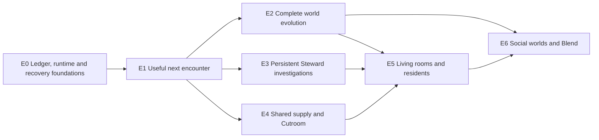

> **Target design, not runtime status.** Adopted through [ADR-0008](../../decisions/ADR-0008-foundation-adoption.md). Source front matter below records its original proposal status. Current executable boundaries live in [Architecture](../README.md), ADRs and contracts. Exact schemas/thresholds here require implementation decisions.

---
status: proposed
authority: architecture-proposal
date: 2026-09-15
project: KnowScroll Core Engine v2
scope: Refined design for founder review. Illustrative contracts and policies, not implemented behavior or approval to build.
---

# Implementation sequence: preserve the whole product, prove each boundary

This is a build sequence for the full design, not a reduction of it. Worlds, rooms, persistent residents, social visits and Blends remain in scope. The first step after architecture approval is to turn these proposals into approved feature contracts under the repository's existing gates.

D-017's phase order remains: validation gate, Phase 1 (a universe that learns), Phase 2 (living worlds), Phase 3 (worlds collide). The E0–E6 slice names are retained below, with execution safety and semantic intelligence introduced early enough that later features do not depend on a temporary architecture.

## 1. Proof starts with a real boundary

Build deterministic replay into a scratch database, transport fault injection and a small semantic evaluation set. These prove different things:

- Replay checks committed state, ordering, eligibility and privacy rules.
- Fault injection checks crashes, duplicate delivery, quota pressure and unknown external outcomes.
- Model contract tests check M3/AI SDK compatibility and typed output handling.
- Semantic review checks whether a conceptual bridge is real and its explanation useful.
- User journeys check whether the whole experience makes sense, including Return and honest pending states.

A replay pass alone cannot prove usefulness, model quality or exactly-once provider execution. A fake provider alone cannot prove paid-path behavior. Separate the evidence in every feature report.

## 2. Slices and dependencies

| Slice | Phase | Build | Demonstrate |
|---|---|---|---|
| **E0** | Validation → 1 | Scoped Ledger, outbox/cursors, reducers, Accounts, dirty markers, jobs/attempts/steps, leases and fencing, context/proposal envelopes, budget reservations, fake provider, replay and operations receipts | No lost wake when H2 arrives during H; crash-before/after-send distinguished; stale worker fenced; replay does not call vendors; privacy scope cannot cross users |
| **E1** | 1 | Ready seed inventory, Composer families and selection receipts, branch/Return state, cold-start entry points, Ask job, basic interpretation → bridge → encounter plan, sightings and place birth | Feed works during outage; explicit question survives summarization; useful bridge reaches candidates; superficial word association is rejected; quiet and active users both have usable paths |
| **E2** | 1 → 2 | Full Cartographer: regions, systems, foundational stars, moons, galaxies, holes, ruins, dormancy, rediscovery, stable identity, navigation validation and Chronicle | Numeric thresholds alone do not establish meaning; semantic proposals can introduce candidates; corrections preserve lineage and Return; no rerun redraws the world arbitrarily |
| **E3** | 2 | Steward identity, memory layers, durable investigations, focused child jobs, due commitments, wake policy, calibration, night allocation and invitations | A question persists across worker restarts and weeks; waiting parent yields; children share budget; no-new-evidence idle checks make no model call; hypotheses can influence approved encounter plans |
| **E4** | 2 | Quartermaster horizons, ContentDemand, shared inventory suitability, single flight, generation waiters, host-local Cutroom adapter, artifact import, evidence/publication checks and all-in accounting | Three compatible demands can share one render; one waiter cancellation does not cancel others; requestId recovery; late old-epoch result never attaches; no assumed SDK methods |
| **E5** | 2 | Rooms, residents, visitors, Keeper and Verifier, room-scoped investigations, quiet/active modes, commitments, independent evidence work and artifact publication | Ten agents sharing one source do not become ten sources; private memories stay private; room progress resumes after interruption; no pressure to feed a visible credit score |
| **E6** | 3 | Projector, visibility, visits, social-origin evidence, shared rooms, Blend requests/ownership/budgets, revocation | One recommender respects scope; shared artifacts do not reveal private reasons; revocation removes access and invalidates pending bindings; explicit social origin is retained after later personal exploration |

The full logical data model is designed early. A later slice implements its behavior; it does not invent a second model of identity, budgets or execution.

## 3. Provider and infrastructure dependencies

Use fake model/Cutroom ports for deterministic tests before a separately budgeted live contract spike. Semantic jobs need a real-provider quality check before being presented as meaningful intelligence. Avoid the old claim that nearly all early slices need only a naming call: E1 already needs evidence-backed interpretation and bridge planning.

For the recorded single-host phase, D-001's SQLite/WAL and D-002's table queue remain appropriate. At the hosted multi-host boundary, propose managed PostgreSQL and a worker pool with the same contracts. Shared provider quotas are enforced even with one worker. Redis, Kafka, Temporal and Kubernetes are not dependencies of these slices.

A hosted launch target may justify PostgreSQL from the outset. That is a deployment decision to record, not a reason to redesign the Ledger or defer product scope.

## 4. Policy configuration from day one

Version all weights, debounce windows, exploration shares, shape thresholds, job class allocations and budgets. Give each a reason and an evaluation plan. Numerical examples in the architecture are proposed starting settings, not measured laws.

Replaying a policy change should show changed decisions and unchanged privacy/identity invariants. Evaluating its benefit requires exposed-user outcomes or a suitable controlled study; old logs cannot reveal responses to unshown content.

## 5. What waits for evidence, not for an arbitrary user count

A learned ranker waits for suitable labels and evaluation. Graph clustering waits for a real structure problem and stable identity mapping. A workflow engine waits for complex timer/version/recovery needs. Distributed storage waits for measured scale/availability needs. A new specialist model waits for a task-quality benefit.

Multiple focused agents and the complete celestial/room design do not wait for these infrastructure choices. They use bounded jobs and stable domain contracts from the beginning. No agent gets an unlimited self-authorized loop.

## 6. Relationship to recorded decisions

| Existing decision | Treatment in this proposal |
|---|---|
| D-001 SQLite | Keep for the recorded single host; propose a superseding decision at hosted multi-host deployment |
| D-002 table queue | Keep, but add explicit effect intents, checkpoints, unknown outcomes and fencing; leases do not supply correctness for free |
| D-004 hypothesis discipline | Keep evidence, uncertainty and permission fences; propose a controlled path into encounter planning/candidate generation |
| D-005 AI SDK / job-table harness | Accepted direction; extend to multiple bounded investigations and child jobs with per-step durability |
| D-006 routing | Propose M3-first general reasoning per founder direction; preserve provider abstraction and separately evaluate embeddings/specialists |
| D-011 night tick | Preserve due work/night activity; use persistent timers and deterministic idle checks; no obligatory idle model call |
| D-014 spending caps | Preserve hard caps; improve resource reservations and complete-cost accounting; illustrative scenarios do not raise them |
| D-015 seed library | Keep ready inventory as the foundation of a responsive feed |
| D-017 full product in order | Keep full scope; the slices supply an implementation order |

None of these accepted decision records was edited in this documentation pass. Final go-ahead confirms the design direction; feature gates, model compatibility and paid-path evidence remain concrete implementation obligations.
