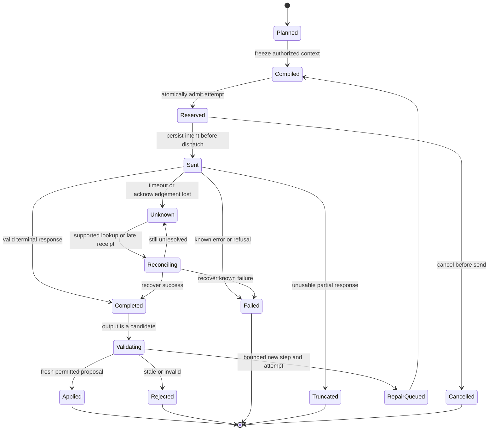

> **Target design, not runtime status.** Adopted through [ADR-0008](../../decisions/ADR-0008-foundation-adoption.md). Source front matter below records its original proposal status. Current executable boundaries live in [Architecture](../README.md), ADRs and contracts. Exact schemas/thresholds here require implementation decisions.

---
status: proposed
authority: architecture-proposal
date: 2026-09-15
project: KnowScroll Core Engine v2
scope: Design only. Type names are proposals; the AI SDK integration is a target behaviour, not yet an implemented adapter. Numbers, capabilities and prices cited are dated snapshots, not measured capacity.
---

# Reasoning runtime: one model call at a time, on durable steps

This chapter is the durable boundary around every language-model invocation. It defines the small set of operations the runtime supports, the typed contracts a model call must satisfy, the place of the AI SDK within them, and the durable step lifecycle that survives restarts and provider ambiguity. Other chapters depend on this one: [03-ARCHITECTURE.md](03-ARCHITECTURE.md) for where the runtime sits in the process graph, [22-GLOBAL-EXECUTION.md](22-GLOBAL-EXECUTION.md) for the admission and fairness boundaries that wrap every expensive attempt, [10-CORE-AGENT.md](10-CORE-AGENT.md) and [12-PERSISTENT-AGENTS.md](12-PERSISTENT-AGENTS.md) for the agents that drive the runtime, and [23-CONTENT-DEMAND-AND-INVENTORY.md](23-CONTENT-DEMAND-AND-INVENTORY.md) for the way Cutroom calls share the same boundary.

The companion [runtime review](../2026-09-15-RUNTIME-AND-GLOBAL-EXECUTION-REVIEW.md) §§1–5 and §21 are the authority for what the runtime does and does not own; this chapter deepens the parts the runtime review deliberately leaves to the application layer.

## 1. What the runtime is, and is not

A reasoning runtime is the small state machine KnowScroll runs around one or more model calls when it needs semantic interpretation, evidence synthesis, planning or verification. Its job is to make every model invocation durable, accountable, recoverable, and governable by the same admission layer as every other expensive action. Its job is **not** to be a coding harness, an unrestricted agent framework or a generic workflow engine.

| The runtime owns | The runtime does not own |
|---|---|
| one model call at a time, with a known route and a known permit | product persistence, world mutation authority, ranking, or publication |
| a typed context bundle built from authorized, versioned evidence | knowledge about the person beyond the bundle |
| a typed proposal or refusal, validated against schema, evidence and permissions | worker pool sizing or class fairness; durable waits are recorded here and resumed by the scheduler |
| a durable step journal: intent → request → response → outcome → settlement | the global scheduler's fairness decisions |
| provider capability and continuation metadata | the decision of which provider or model to use |
| repair and verification steps, with a fresh admitted Attempt for every external invocation | parent/child scheduling across jobs |
| an explicit, requestable cancellation fence for in-flight calls | Cutroom internal supplier execution; its metering integration must separately cover every supplier attempt |

Two rules give the runtime its shape. **One**, every expensive attempt crosses the runtime before it touches a provider, and the same boundary wraps repairs, retries, verification passes, summarisation that calls a model, and the subagent steps inside a focused investigation. **Two**, the runtime never pretends a model call completed when it did not: unknown provider outcomes stay unknown until the next permitted reconciliation, and a worker lease expiring does not by itself prove a remote call has stopped.

## 2. A simple worked example

A Steward investigation asks whether a person keeps returning to black holes because of visual spectacle or because of an unresolved clock-dilation question. The runtime does not answer that itself. It books one parent job in the global scheduler, the parent may spawn focused child jobs under the same budget when their separate evidence tasks justify it, each child compiles an authorized bundle and runs one model call on MiniMax M3, the parent waits, then synthesises the children into one typed BridgeCandidate proposal.

The following is an optional multi-child example, not the default fan-out for every question:

1. The Steward job is admitted. The scheduler reserves a parent credit quantum under the universe account.
2. The Steward compiles `bundle_investigation_v3` from the universe's authorised evidence; the bundle hash becomes part of the parent job's read set.
3. The Steward enqueues up to three bounded children: retrieve the exact questions, research clock mechanisms, and check the GPS connection. Each child reuses the parent budget, inherits the bundle scope, and is admitted under a the parent's scheduling class.
4. Children run, possibly out of order; each completes with a typed proposal or refusal; the parent is reactivated when all three settle or fail.
5. The Steward compiles a fourth bundle from the children's typed outputs and evidence refs and runs one synthesis call. The result is a `BridgeCandidate` proposal that names the relation (`mechanistic_analogy`), the prerequisites, the analogy limits, the evidence refs and the question it would help with.
6. The reducer validates the proposal against schema, evidence, the privacy epoch, and the read set. Only an admitted BridgeCandidate can reach the Composer's candidate cache; only the deterministic Composer decides whether it actually appears next.

What did **not** happen: the model ranked an encounter, ranked a place, ranked a room outcome, or wrote a row of personal state. It produced typed proposals; code validated; the deterministic Composer decided.

## 3. Runtime responsibilities

### 3.1 The five operations

A runtime instance supports a deliberately small set of operations. Everything a job wants to do is one of these five.

```ts
interface ReasoningRuntime {
  // Load a job's authorised context, completed steps, and child outcomes.
  load(jobId: string): Promise<{ job: Job; bundle: ContextBundle; steps: Step[] }>;

  // Run the next deterministic, model, or tool step and journal its outcome.
  step(jobId: string, plan: StepPlan): Promise<StepOutcome>;

  // Persist a typed proposal, schedule a continuation, wait for children, or finish.
  commit(jobId: string, outcome: JobOutcome): Promise<void>;

  // Reconcile an attempt after a provider ambiguity window.
  reconcile(attemptId: string, evidence: ReconciliationEvidence): Promise<AttemptOutcome>;

  // Cancel a job and fence all its in-flight attempts and provider calls.
  cancel(jobId: string, reason: CancelReason): Promise<void>;
}
```

This is the surface the scheduler, the agents and the Cutroom adapter all use. Adding a sixth operation is a deliberate design decision, not a refactor.

### 3.2 What a step looks like

A step is one durable unit of work. Three kinds exist:

| Kind | Description | Authoritative example |
|---|---|---|
| `deterministic` | Code only. No provider call. Uses bounded work and a checkpoint if it must yield. | Episode bookkeeping, fingerprint hashing, snapshot reads |
| `model` | One provider invocation, journaled end-to-end. May request a tool; executing it is a separate governed tool step | BridgeCandidate synthesis, hypothesis alternatives |
| `tool` | A domain tool call through a typed port declaring pure-read, idempotent-effect, or non-idempotent-effect semantics | `substrate_lookup`, `inventory_suitability`, `evidence_excerpt`, `fork_investigation` |

A job's plan is an ordered list of steps. The runtime executes them in order unless a step has named children, in which case the runtime pauses for the children to settle. A step that fails in a non-terminal way is retried under the job's policy; a step that fails terminally ends the job and writes a disposition with reason codes the operator can read.

### 3.3 The boundary at the model port

The runtime does not invent a transport; it adapts one. For v0.1 the port uses an established model library behind a thin provider adapter, as the runtime review §3 directs. The chosen library is the [AI SDK](https://ai-sdk.dev/docs/reference/ai-sdk-core/tool-loop-agent) with its [middleware](https://ai-sdk.dev/docs/ai-sdk-core/middleware) surface used as integration points, not as a default agent loop. AI SDK's automatic tool loop and retries are explicitly configured off; the runtime owns retry, repair, and step journaling. This is the same posture the runtime review recommends and is necessary because wrapping only the outer agent `StreamFn` does not by itself capture every internal attempt the library makes.

A provider adapter wraps one route and exposes only what the runtime port can govern:

```ts
interface ModelRoute {
  id: string;
  capabilities: ProviderCapabilityProfile;       // §6
  invokeOnce(request: CompiledRequest, permit: Permit): Promise<ModelOutcome>;
  cancel?(requestId: string, reason: string): Promise<CancelAck>; // only when remote cancellation exists
}
```

The route never "runs an agent until done". It executes one invocation with a known context, a known permit, a known deadline, and a known output ceiling. Any code that wants more must compose it from steps under the runtime.

### 3.4 What we borrow from established harnesses

| Inspiration | Keep | KnowScroll adaptation |
|---|---|---|
| Pi | Clear model/tool loop, provider abstraction and resumable conversation state | Intercept actual invocation attempts, including compaction and lower-level retries; do not grant filesystem or shell tools by default |
| Prime | Long-running task continuity, child work and context maintenance | Durable child dependencies, bounded scopes and one shared parent budget; a process registry alone is insufficient |
| Codex | Explicit turns, cancellation, state boundaries and controlled tool execution | Domain-specific evidence tools and proposal authority; no requirement to run a coding CLI as the application backend |
| AI SDK | Model invocation, streaming and provider integration | Use single calls with library retries disabled; KnowScroll owns the durable lifecycle and policy |

These are source-inspected design lessons, not compatibility claims. Commit pins and detailed comparisons live in [02](02-RESEARCH-FINDINGS.md) and the [runtime review](../2026-09-15-RUNTIME-AND-GLOBAL-EXECUTION-REVIEW.md). We choose AI SDK for the model-library role; the small durable runtime remains KnowScroll code.

## 4. Durable step lifecycle

### 4.1 The five records

A step is durable because it is five linked records, each with a distinct purpose. They are **separate durable entities**, not fields on one record:

| Record | Owns | Mutated by |
|---|---|---|
| `Job` | the work request: identity, scope, kind, payload, scheduling, class, dependencies, outcome reference | runtime, scheduler |
| `Attempt` | one actual external invocation try for a Step: route, permit, fence, request identity and outcome | runtime, global admission |
| `Step` | one logical unit inside a Job; zero Attempts for deterministic work, one or more for external work | runtime |
| `ContextBundle` | the frozen snapshot the step ran against: scope, privacy epoch, evidence refs, version hashes, token budget | context builder |
| `Proposal` | the typed result the step produced, with required evidence, preconditions and permissions | runtime, validator, reducer |

The runtime review §5 calls this separation out and the [data state model](05-DATA-STATE-MODEL.md) §12 records each entity as a logical table. The five-record shape is what lets a crash between send and response be reasoned about: both Step intent and Attempt exist before send; completion and Proposal may not exist, and the world stays unchanged.

### 4.2 State transitions for one step



The state machine deliberately distinguishes "the model finished" from "the world changed". A `Completed` step can produce a `Rejected` proposal because of stale evidence or a privacy epoch increment. The runtime writes both outcomes. Only the reducer commits a world change.

### 4.3 What gets written before, during, and after a provider call

| Phase | Record written before the next phase begins |
|---|---|
| Plan admission | `Job` row with class, dependencies, budget owner, `not_before` |
| Context compilation | `ContextBundle` with scope, privacy epoch, evidence refs, version hashes, content hash |
| Plan and route selection | Persist `Step` intent and bundle; choose eligible route. Admission atomically creates `Attempt` and reservations before send |
| Dispatch | `Attempt.status = Sent` with stable `requestId`, deadline, output ceiling |
| Stream | Bounded transient delivery; protected checkpoints only where resumable. Partial output is never a completed tool call or accepted evidence |
| Completion | `Attempt.status = Completed`, usage, settlement key, `Step.status = Completed` |
| Proposal | `Proposal` row with read set, evidence refs, preconditions, expiry, model receipt id |
| Application | `Proposal.status = Applied` (or `Rejected`, `Superseded`, `Withdrawn`) |

A row that is not written before the next phase begins is a bug. An Attempt that is `Sent` but never `Completed` is the irreducible unknown outcome the runtime review §17 names; it is not a free retry and not a successful call.

## 5. Context bundles

### 5.1 What a bundle is

A bundle is the immutable, versioned input a step ran against. It is the only thing the model sees of the world and the only thing the proposal's evidence chain points back to. The bundle record records:

```ts
interface ContextBundle {
  bundle_id: string;
  job_id: string;
  step_id: string;
  scope: { kind: 'universe' | 'room' | 'blend' | 'public'; id: string };
  privacy_epoch: number;
  investigation_id?: string; // task identity, never an authorization root
  build_version: string;
  retrieval_query: { text: string; version: string };
  evidence_refs: Array<{ ref: string; revision: number }>;
  summary_versions: Array<{ ref: string; revision: number }>;
  entity_versions: Array<{ entity_id: string; revision: number }>;
  event_high_water: number;            // the H mark used for this step
  token_budget: { input: number; output_including_thinking: number };
  omitted_material_summary: string;    // for the operator console
  prompt_version: string;
  content_hash: string;
}
```

`content_hash` covers canonical content, scope/authorization dependencies, epochs, entity and source revisions, prompt and policy versions, and required continuation state. Identical text alone is insufficient. Two steps with identical content hashes have run against materially the same context; differing hashes are the audit trail that explains why a child step's proposal does or does not inherit its parent's claim to freshness.

### 5.2 What the builder does

The context builder resolves scope and permissions first, retrieves authorised evidence, freezes a stable high-water mark, computes the bundle hash, and allocates the token budget. It never inlines personal text that the scope forbids and never assembles a bundle whose privacy epoch is older than the universe's current epoch. A bundle whose evidence has been corrected after `event_high_water` is stale and must be rebuilt before the step proceeds; this is the operational meaning of "stable scoped readsets".

Suggested order of allocation is task dependent, not a fixed ratio:

| Priority | Slice | Why first |
|---|---|---|
| 1 | Current question, the user's literal wording when in scope, constraints | The single most useful piece of information for interpretation |
| 2 | World neighbourhood and evidence refs within 2 hops | Establishes what the question lives near |
| 3 | Competing hypotheses with their evidence and counter-evidence | Stops the model from confirming its own priors |
| 4 | Proposal history and known reservations | Stops repeat mistakes |
| 5 | Supplementary retrieved material | Last because it costs the most tokens for the least specific value |

Reserve the remainder for tool definitions and output. A context budget should sit well below the provider's maximum for routine jobs; the large context window is a ceiling, not a target.

### 5.3 Embeddings are separate

Embeddings are not part of a model bundle. They live behind a separate typed port with vector dimension, model/version, distance metric, and index generation recorded. Replacing an embedding model requires a compatible index or a re-embedding; it is not a drop-in change of model name. Embedding retrieval can supply candidates to Composer and evidence to the context builder. Similarity itself is never a claim, mechanism, or permission.

## 6. Provider capability profile

The runtime never treats two providers as equivalent. Each route carries an explicit, model-and-endpoint-specific capability record:

```ts
interface ProviderCapabilityProfile {
  route_id: string;
  provider: string;
  model: string;
  endpoint: string;
  evidence_status: 'documented' | 'tested' | 'unknown';

  context_window: { tokens: number; reserved_for_thinking?: number };
  output_ceiling: { tokens: number; reserved_for_thinking?: number };

  schema_enforcement: {
    strict_json_schema: 'unknown' | 'documented_no' | 'documented_yes' | 'tested_partial' | 'tested_strict';
    tool_arguments_typed: 'unknown' | 'documented_no' | 'documented_yes' | 'tested_yes';
    forced_tool_choice: 'unknown' | 'documented_no' | 'documented_yes' | 'tested_partial';
    parallel_tool_calls: 'unknown' | 'documented_no' | 'documented_yes' | 'tested_yes';
  };

  multimodal: {
    image_input: 'unknown' | 'documented_no' | 'documented_yes' | 'tested_yes';
    audio_input: 'unknown' | 'documented_no' | 'documented_yes' | 'tested_yes';
    video_input: 'unknown' | 'documented_no' | 'documented_yes' | 'tested_yes';
  };

  token_counting: {
    endpoint_supported: boolean;
    estimator_used: boolean;
    estimator_bias: 'unknown' | 'conservative' | 'optimistic';
  };

  cache: {
    passive_prompt_caching: 'unknown' | 'documented_no' | 'documented_yes' | 'tested_partial';
    explicit_cache_control: 'unknown' | 'documented_no' | 'documented_yes';
    cache_input_bucket: boolean;     // whether the vendor reports a cache_read bucket
  };

  continuation: {
    required_thinking_blocks: 'unknown' | 'documented_no' | 'documented_yes';
    opaque_state_reference: 'unknown' | 'documented_no' | 'documented_yes';
    recompile_on_switch: boolean;
  };

  cancellation: {
    remote_cancel_guaranteed: 'unknown' | 'documented_no' | 'documented_yes';
    local_abort_stops_billing: 'unknown' | 'documented_no' | 'documented_yes';
  };

  rate_limits: {
    rpm: { published: number | null; account_verified: number | null };
    tpm_input: { published: number | null; account_verified: number | null };
    tpm_output: { published: number | null; account_verified: number | null };
    tpm_combined: { published: number | null; account_verified: number | null };
    concurrency: { published: number | null; account_verified: number | null };
    last_verified_at: string | null;
  };

  pricing: {
    input_per_million: number | null;
    output_per_million: number | null;
    cache_read_per_million: number | null;
    thinking_per_million: number | null;
    currency: string;
    tariff_version: string;
    tariff_date: string;
  };
}
```

A route whose `evidence_status` is `documented` for a capability has not yet been exercised in this codebase. `tested` means a contract test has run against the live endpoint at a recorded date; the test result and endpoint version are part of the capability profile's lineage. `unknown` means the runtime treats the capability as not available. The runtime review §4 establishes these discipline boundaries and the §22 global execution chapter enforces them at admission.

Production eligibility additionally requires a passing KnowScroll adapter contract test for every relied-on behavior; documentation alone is research evidence. A route is a candidate only if every capability the job requires has at least `documented` evidence; a route whose required capability is `unknown` cannot be selected. This is the only way to keep "AI SDK supports structured output" or "M3 supports forced tool choice" from being quietly relied on before they have been tested.

## 7. Structured output: validate what arrives, do not assume what the vendor can decode

The runtime does not assume the vendor can decode the schema it asks for. The MiniMax M3 reviewed wire schemas do not establish native strict JSON-schema output. Native forced tool choice beyond `auto` and `none` is similarly unverified. The runtime therefore:

1. Requests a typed payload as text, or accepts a matching tool call under documented `auto` mode. Neither guarantees the model will comply; `none` disables tool selection.
2. Validates the returned object against the domain schema with Zod/JSON Schema.
3. On malformed output, permits a bounded funded repair that resubmits with the validation errors in the bundle, never more than the policy limit.
4. Records the validation result on the attempt's receipt so the operator console can see what failed.

A `Output.object(schema)` call that the underlying library silently downgrades is a bug the runtime treats as a route-eligibility failure, not as a successful structured call.

The same discipline applies to forced tool selection. The MiniMax Messages schema lists `auto` and `none`. Until tested evidence for additional modes is recorded, the runtime will not plan around them. Presenting one tool under `auto` does not force selection; a missing tool call is an explicit output-validation outcome with bounded repair or refusal.

## 8. Provider continuation and M3 thinking blocks

M3 thinking blocks must survive required continuations. They are not user-visible explanations and they are not substitutes for evidence. The runtime stores them as protected runtime data with their original position in the message list. Recompiling a fresh context from canonical evidence and completed tool results is the normal path; opaque provider state is only an accelerator when the route explicitly supports it.

Three rules apply to continuation:

1. **Required reasoning blocks are kept** when the route documents them as required, in their original position in the message list, and never stripped before a tool-result round trip.
2. **Switching providers recompiles the context** from canonical evidence and completed tool results. Opaque state is not the only copy of task memory.
3. **Token accounting includes reasoning** when the provider counts it as output. The runtime recognises truncation even when no usable final answer remains, and records the outcome as `Truncated`.

No public chain of thought is ever emitted to a client, written into a proposal envelope, or used as evidence. The runtime never treats a model's chain of thought as authority for any claim in a proposal.

## 9. Repairs, retries, compactions and verification

All four kinds of expensive sub-step cross the same boundary as the primary call:

| Sub-step | What it does | When the runtime runs it | What gets reserved |
|---|---|---|---|
| `retry` | Re-send the same request after a known retryable failure | Provider 429 with valid retry advice, overload, transient 5xx | A fresh Attempt with its own permit; never reusing the previous Attempt's usage |
| `repair` | Re-send with a new bundle containing the validation errors | Structured output failed validation, schema rejection | A bounded repair budget (default one or two attempts per job) |
| `compaction` | Summarize canonical evidence for a fresh context; preserve protocol-required blocks if continuing the same conversation | Bundle exceeds the route's input ceiling | A model call under the same budget; result is journaled as a `compaction_step` |
| `verification` | Re-run with a different prompt to confirm a high-stakes proposal | High-impact claims, weak evidence, contradictory verifier | A bounded verification budget (default zero, opt-in by job class) |
| `subagent` | Spawn a focused child investigation | Parent investigation expands under the same budget | A child job with the parent's budget owner and a narrow bundle |

A retry that bypasses the runtime is a leak. A repair that reuses the previous permit is double-spending. Never splice a summary into protocol-required thinking blocks. Use either a valid same-route continuation or a fresh reconstruction from evidence and completed tool results. A verification pass that uses the same prompts and the same sources as the primary is not new evidence. A subagent that opens its own budget owner is an account-creation bug.

## 10. Cancellation and reconciliation

### 10.1 Two fences

A job has two fences, both written before any provider call is dispatched:

1. A **dispatch fence**: the runtime holds a fencing token on the Attempt. A worker that cannot present the current token cannot write a new step. A worker whose lease expired cannot commit a checkpoint.
2. A **privacy fence**: the Attempt records the universe's current privacy epoch. If the epoch advances, the Attempt is rejected at its next step boundary.

A worker that loses its lease does not by itself prove the remote call has stopped. The provider may still complete the call, return a result the runtime will journal, and the runtime must reconcile. Local abort is not a remote-cancel guarantee.

### 10.2 The unknown window

After the dispatch fence is written and before the completion is journaled, the runtime treats the call as `Sent` with an unknown outcome. It does not:

- assume success,
- retry the same call under the same Attempt (it cannot),
- declare a final charge without evidence (the reserved liability remains held),
- settle the usage,
- publish a Proposal.

It does:

- expose the Attempt in the operator console with a "sent, awaiting outcome" status,
- enforce a deadline with a route-specific operational deadline; a deadline is not proof of remote termination,
- on deadline, attempt reconciliation by lookup-by-idempotency where the provider supports it,
- if reconciliation fails, mark the Attempt as `Unknown` with bounded retry policy and a dated liability note in the budget ledger.

A lease alone is not exactly-once. The runtime contains that gap with intent-before-external-call, supported reconciliation, and explicit unknown windows; it cannot manufacture exactly-once remote execution. Anything that needs exactly-once effects is supported only by an idempotency key on the external call or by an effect-specific reconciliation that conclusively establishes whether that effect occurred; the runtime documents this requirement at every port that exposes non-idempotent operations.

### 10.3 Provider uncertainty stays unknown

Provider capability fields whose `evidence_status` is `unknown` remain `unknown`. The runtime does not promote them to "probably yes" because the model appears to have worked. It does not demote them to "no" because one call failed. The capability profile is the single source of truth, and the operator console surfaces the evidence date next to each field.

## 11. Tools the runtime exposes to the model

Domain tools are typed ports. The runtime binds tool scope and universe/room identity server-side. The model never grants its own access; a tool call is a request, the runtime validates the scope and idempotency, then dispatches. Tool output is truncated to the schema's bounded size and is itself a Step record.

| Tool | Purpose | Idempotency | Output bound |
|---|---|---|---|
| `substrate_lookup` | Resolve concept ids, claim ids and source ids to their current revisions | pure read | N refs |
| `evidence_excerpt` | Return a bounded slice of an authorised source for a claim id | pure read | bytes |
| `inventory_suitability` | Test a typed plan against ready inventory before the planner opens a brief | pure read | verdicts |
| `ledger_summary` | Return the digest schema for a scope within a window | pure read | rows |
| `hypothesis_alternatives` | List current competing hypotheses with evidence refs | pure read | rows |
| `bridge_evaluate` | Ask the verifier to judge one BridgeCandidate against a cited mechanism | bounded effect (writes a verification verdict) | one verdict |
| `fork_investigation` | Open a focused child job that inherits the parent's budget | bounded effect (creates a Job) | one child job id |
| `note_to_self` | Edit a model-owned memory block under the runtime's edit policy | bounded effect | one block edit |
| `propose_*` | The typed proposal tools: typed payloads, reducer-validated | bounded effect | one Proposal |

The runtime caps tool fan-out and returned bytes as well as model tokens. A model-selected id never grants access on its own. A tool whose result could be used to bypass a permission check is itself restricted to permitted scopes.

## 12. The boundary at the worker's process edge

Inside the worker, the runtime is a module. Outside, it is the contract the global admission layer and the API enforce. Three boundaries matter:

| Boundary | What it guarantees |
|---|---|
| API → scheduler | The API never calls a provider. Every "Ask" request enqueues a job and returns a job id or, when the scheduler admits the job promptly, a stream. The runtime, not the API, owns the model call. |
| Agent → provider | Every model invocation runs through the runtime port. The Steward, residents, researchers, the verifier, the planner, use `ModelRoute.invokeOnce`. The Cutroom host adapter uses its own HTTP port; exact shared supplier admission requires a metered port inside Cutroom, not merely wrapping its outer HTTP call. Wrapping only the outer agent `StreamFn` is insufficient. |
| Runtime → global admission | Every Attempt reserves its permit, budget and in-flight slot through the [global admission controller](22-GLOBAL-EXECUTION.md). The runtime journals the attempt outcome; admission owns its permit and settlement. Both refer to the same attempt identity. |

These three boundaries are what make every expensive attempt on the system legible to the same scheduler and the same receipt store. A model call that bypasses them is a leak in the same way an unjournaled Ledger event would be a leak.

## 13. What this runtime does not become

The runtime is intentionally small. The runtime review §§3 and 23 list the boundary and the alternative harnesses; the points worth repeating here are:

- **Not a coding harness.** There is no filesystem default, no shell default, no project/global extension loader. Tool ports are explicit. A sandboxed research sandbox, if added later, is an isolated child with a different boundary.
- **Not a workflow engine.** The supported shape is narrow: model step, bounded tool step, deterministic transition, child dependency, timer. General user-authored workflows are not in scope for v0.1. Temporal is a credible later substrate, not a default.
- **Bounded multi-agent coordination.** Multiple focused agents use the same execution machinery. The boundary between them is the durable Job record, the parent/child link, and the shared budget.
- **Not a stateful agent framework.** State is in storage, not in a transcript. Provider continuation data is an accelerator, never the only copy. Switching providers recompiles a fresh context from canonical evidence.
- **Not the authority for world truth.** World truth lives in the Ledger and the stores in [05-DATA-STATE-MODEL.md](05-DATA-STATE-MODEL.md). The runtime proposes; the reducer commits.

When these limits are too small, that is a deliberate signal to adopt a workflow engine, a separate research sandbox, or a different model library, with the world's contracts unchanged.
