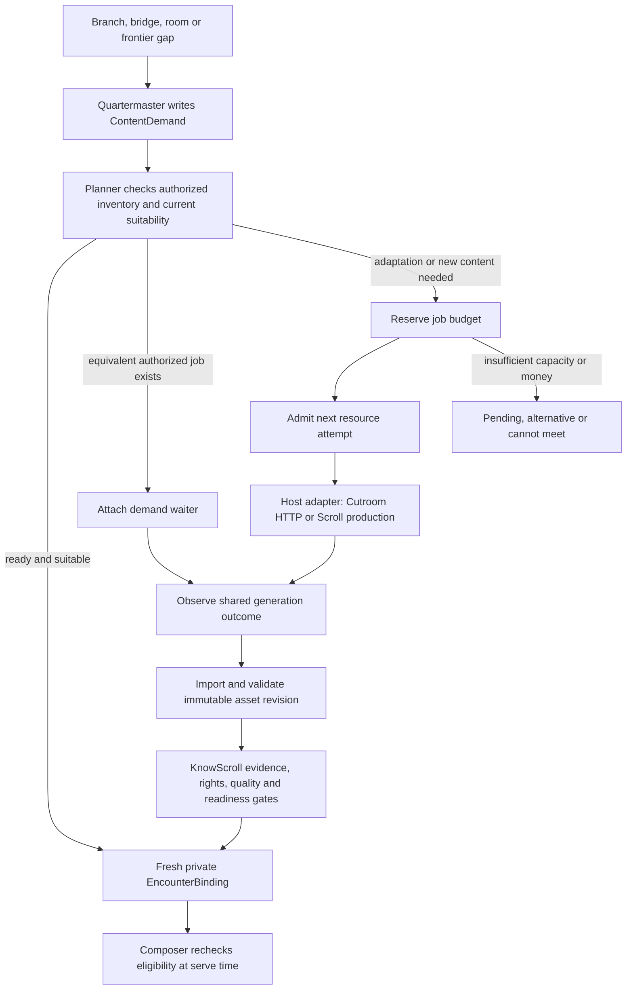

> **Target design, not runtime status.** Adopted through [ADR-0008](../../decisions/ADR-0008-foundation-adoption.md). Source front matter below records its original proposal status. Current executable boundaries live in [Architecture](../README.md), ADRs and contracts. Exact schemas/thresholds here require implementation decisions.

---
status: proposed
authority: architecture-proposal
date: 2026-09-15
project: KnowScroll Core Engine v2
scope: Logical contracts and illustrative code. Cutroom facts are pinned research; the proposed integration is not implemented.
---

# Content demand and shared inventory

**Quartermaster describes what is missing. The supply planner decides how to obtain it.** This keeps generation useful, permits reuse across eligible requests, and keeps a person's private context separate from shared media.

A Reel or Scroll can be shared inventory. The reason it appears in a particular universe, its place, invitation, exposure and personal response belong to that universe. See [09](15-VIDEO-SDK-INTEGRATION.md) for horizons and pools, [14](14-QUALITY-ANTI-SLOP.md) for gates, and the [runtime review](../2026-09-15-RUNTIME-AND-GLOBAL-EXECUTION-REVIEW.md) §§14–17 for source evidence and failure analysis.

## 1. The complete supply flow



`playable`, `complete` and `eligible` below are **KnowScroll readiness states**. They are not invented Cutroom wire events. An artifact being playable does not establish that its claims are supported or that it is eligible for publication.

## 2. ContentDemand: a need with an owner

The demand retains the literal request and its cause even if the system cannot fulfill it. It is not a rendering prompt or an instruction to spend money immediately.

```ts
type ContentDemand = {
  id: string;
  scope: AuthorizedScope;           // universe, room, blend or public + id
  scopeEpochs: ScopeEpochRef[];
  causeRefs: string[];              // exact intent, gap or investigation
  intent: { act: string; question?: string; bridgeCandidateId?: string };
  conceptRefs: RevisionRef[];
  claimRefs: RevisionRef[];
  audience: { language: string; prerequisites: string[]; level: string };
  modality: 'reel' | 'scroll';
  continuityConstraints: Constraint[];
  evidenceRequirements: EvidencePolicyRef;
  reusePolicy: 'reuse_or_adapt' | 'reuse_only' | 'new_required';
  budgetOwnerId: string;
  maxCostMicrousd: number;           // integer, not floating monetary arithmetic
  softTargetAt?: string;
  expiresAt?: string;
  status: 'open' | 'waiting' | 'satisfied' | 'cancelled' | 'expired' | 'cannot_meet';
};
```

Use `new_required` only for a concrete incompatibility such as a required original artifact. A newly discovered bridge does not automatically require newly generated media. An existing explanation might already teach it well.

A Blend or room has explicit authorized inputs and funding policy. An investigation ID is a task identity within an authorized scope, never a new permission root. Private material cannot be made public by changing this field. Sharing or publishing it requires the separate authorized publication path and rights checks.

## 3. The planner makes two different decisions

**First retrieve candidates; then test suitability.** Embeddings can find related content. They cannot establish that an asset answers this question, teaches this mechanism, meets the prerequisites, or is permitted here.

| Decision | Required checks | Result |
|---|---|---|
| Reuse | Current claims/sources, language, audience, mechanism, continuity, rights, scope, freshness, quality | Bind existing eligible revision |
| Adapt | A usable base exists and adaptation is permitted; changed explanation or media is actually needed | New funded job and derived revision |
| Join | An in-flight generation goal meets the demand's hard constraints within a compatible authorized scope | Add waiter, preserve independent demand |
| Generate | No satisfactory authorized supply; evidence and funding sufficient | New funded generation job |
| Cannot meet | Evidence, rights, deadline, budget or capacity cannot satisfy constraints | Keep reason and offer a valid alternative where available |

Per-person repetition is a separate serving check. Reusing an asset for a person who has never encountered it is not repetition merely because someone else saw it. Conversely, a technically suitable asset may be a poor next encounter for someone who just watched it.

Suitability is versioned by demand constraints, asset revision, source/claim revisions, policy, rights and authorization dependencies. Cached decisions must expire when any relevant dependency changes. No shared cache key grants permission, and there is no union of private cache keys that widens access.

## 4. Job budgets and dispatch permits are different

A generation job can reserve a monetary envelope before capacity is available. It must not hold scarce provider or GPU concurrency while waiting in a queue. Each actual external invocation gets its own permit just before dispatch, including retries, verification, repair and any paid adaptation.

Until every internal Cutroom supplier attempt is governed, the adapter can use a conservative run budget and a separate capacity allocation. That is a coarse operating bound. It does not prove exact shared token accounting or a hard all-in supplier ceiling. The required metered provider port inside Cutroom is a proposed integration change and must be demonstrated before such a guarantee is claimed.

## 5. One generation job, many independent waiters

```ts
type DemandWaiterLink = {
  id: string;
  contentDemandId: string;
  generationJobId: string;
  authorizedScope: AuthorizedScope;
  scopeEpochs: ScopeEpochRef[];
  status: 'waiting' | 'notified' | 'bound' | 'cancelled' | 'expired';
};
```

The KnowScroll supply planner owns this table and its in-flight job index. Cancelling a waiter updates this internal record; it is not a Cutroom API call. The link is the join between a demand and an attempt to satisfy it. One generation job may serve many demands; a demand can have successive links if a first job fails. Only one active fulfillment is selected for a demand unless its contract explicitly allows several parts.

Cancelling a waiter does not cancel other waiters. When all authorized consumers leave, policy may cancel unneeded work; an independently funded public-inventory job can still continue. Each remaining waiter gets its own fresh suitability and permission check before binding. Failure leaves the original request and a reason, not a fabricated answer.

A completed shared run is settled once against its recorded sponsor allocation. Joining a run does not bill its full cost again. Cost sharing must be agreed and reserved before the job spends; the model cannot assign charges to another user.

## 6. Cutroom is a host-local HTTP boundary

The reviewed V1 contract at commit `d57e0921a662a0ce976faa1b7ba190820ff11529` uses:

- `POST /v1/runs`, with positive integer `budgetCents` and stable `requestId`;
- lookup by `GET /v1/runs?requestId=...` and status by run ID;
- its documented event cursor interface;
- `POST /v1/runs/:id/cancel`;
- engine-local absolute artifact paths.

The exact request body must be compiled from the contract. KnowScroll reservation IDs are internal metadata, not invented Cutroom body fields. Wire events include `run.accepted`, `stage.started`, `stage.finished` and `run.finished`; the adapter derives KnowScroll readiness from the returned run state, artifacts and verdicts. It must not wait for fictional `run.playable` or `run.complete` events.

The adapter persists request intent **before** POST, so a lost acknowledgement can be reconciled by request ID. A known idempotency conflict is investigated, not silently given a fresh ID. Persist the association for KnowScroll's retention period; do not assume undocumented Cutroom retention guarantees.

Cutroom cancellation prevents later stage starts once effective. It does not promise to reverse completed spend or kill an in-flight supplier call. Terminal states and late receipts still need reconciliation.

### 6.1 Host-local import

The V1 server is loopback-only without authentication. The adapter runs on the engine host, validates the expected artifact root, resolves symlinks safely, rejects path escapes, checks file type/size/checksum and imports the file into KnowScroll-owned artifact storage. A remote API never sends these absolute paths to a browser.

At a multi-host deployment, an authenticated KnowScroll worker/control channel routes work to the host adapter. Cutroom can stay loopback-local behind it. Another machine's absolute path is never treated as locally readable. Managed PostgreSQL and multi-worker coordination are proposed at that deployment boundary; see [22 §13](22-GLOBAL-EXECUTION.md).

### 6.2 Provenance and unknown cost

Cutroom returns no KnowScroll sources card. KnowScroll retains source snapshots, claim references, derivation lineage and its final generation receipt, and validates the resulting explanation against them.

The reviewed recording wrapper writes after successful model returns; thrown or interrupted calls may lack a supplier receipt. The outer adapter's intent record makes the run visible but cannot by itself reveal every internal paid attempt. A metered internal port must close that observability gap. Unknown cost remains a reserved liability or explicitly unbounded uncertainty, never zero. Later settlement appends a reconciliation entry; it does not rewrite the historical unknown receipt.

## 7. An asset and its binding have different lifetimes

| Record | Owns | Scope behavior |
|---|---|---|
| `ContentAssetRevision` | Immutable media/document, source/claim revisions, derivation, checksum, license and content scope | May be public, room, Blend or private under explicit permissions |
| `AssetAvailability` | Current eligibility, withdrawal, rights/freshness policy and validation status | Mutable projection over lifecycle events |
| `EncounterBinding` | Authorized target universe/room/Blend, place, invitation, intent and selected asset revision | Private or scoped; independently revocable |
| `SelectionReceipt` | Why this candidate was selected, alternatives/exclusions, policy and any selection probability | Created when selected, not required when preparing the binding |
| `ExposureReceipt` | What was actually visible/played, origin, position and episode | Does not imply learning or endorsement |

An immutable revision's content does not change when withdrawn; its availability changes. Superseded historical bindings can remain in audit history, but every new serve checks current eligibility. An asset withdrawn for incorrect or unsafe claims must be blocked for existing active bindings too.

A public asset can be used inside a private universe if its license and the destination policy allow it. A private asset cannot be shared simply because the users are friends or in a Blend; explicit grants must cover its inputs and derivatives. Revoking a Blend removes its access and private bindings. It does not delete an independently public asset still used by others.

Epoch comparisons are against the **same scope identity** and all relevant authorization dependencies. Public epoch 7 and universe epoch 7 are unrelated numbers. A universe reset invalidates its bindings and private dependent artifacts; unrelated public supply remains usable through newly authorized bindings.

## 8. Reuse equivalence is a policy judgment

Exact file identity is a checksum comparison. Semantic equivalence is a validated relationship to a particular demand. Similar fingerprints or equal claim IDs do not by themselves prove equivalent explanation, coverage or rights.

An adaptation carries `baseRevisionId` plus source lineage and a new validation result. Derivation is not a permission grant: a private parent cannot be laundered into a public derivative. Correction propagation follows source, claim and derivation dependencies to withdraw affected inventory and reconsider active bindings.

Shared supply can influence several experiment cohorts. Record generation job, asset revision, selection policy and cohort allocation so analysts can identify interference. Deduplicating playback does not remove this causal interference; experiment design or cluster assignment may be necessary.

## 9. Refusal and degradation are normal outcomes

The supply plane refuses unauthorized reuse, expired bindings, unsupported claims and unfunded generation. It can return an existing sourced Scroll, an alternative path, a saved pending request, or `cannot_meet` with a concrete reason. It does not turn every gap into a render.

The full worlds, rooms, branches and night work remain. This contract makes them share supply without confusing ownership or forcing every surface to invent its own generation loop.

## 10. Proof required before implementation is called complete

Demonstrate: duplicate POST reconciliation; cancellation of one of two waiters; source withdrawal before serve; privacy reset during a render; safe host import; failed supplier call with unknown spend; repair/retry admission; and rejection of semantically similar but unsuitable content. Run the actual adapter contract suite before asserting provider compatibility or all-in metering.

## 11. Worked example: time dilation becomes useful

A person asks why clocks run differently near a black hole. A focused investigation proposes a connection to satellite navigation, explaining gravitational and motion-related clock effects and where the comparison stops. This is a candidate explanation of usefulness, not a declaration about the person's identity.

Quartermaster creates a bridge demand linked to the exact question. The planner first finds a public sourced Scroll that meets its prerequisites. It reuses that revision and creates a private binding in the person's universe; no render is necessary. Composer may offer it as an optional connection and records why.

If the user explicitly asks for a Reel and none is suitable, the same demand path can fund a new generation job. Another compatible public-content demand can join it. If the first user resets their universe while it runs, their waiter is cancelled and their private context is erased under policy. A separately authorized second waiter may still receive the public result. The shared asset never includes the first person's private wording unless an explicit publication grant allowed that input.

The user later says “I wanted the black-hole explanation, not navigation.” That correction suppresses this personal connection, revises the hypothesis and keeps the original topic available. A technically correct bridge can still be the wrong next experience.
