> **Target design, not runtime status.** Adopted through [ADR-0008](../../decisions/ADR-0008-foundation-adoption.md). Source front matter below records its original proposal status. Current executable boundaries live in [Architecture](../README.md), ADRs and contracts. Exact schemas/thresholds here require implementation decisions.

---
status: proposed
authority: architecture-proposal
date: 2026-09-15
project: KnowScroll Core Engine v2
scope: Reviewable design, not implemented or measured behavior. Code is illustrative pseudocode.
---

# Journey and data flows

This chapter is the textual companion to [the interactive review](core-engine-review.html). All code below is **pseudocode describing proposed boundaries**, not callable SDK methods or implemented application behavior. Diagrams show the full architecture across successful, waiting, stale, shared and revoked work.

## Main journey: from black holes to a useful clock connection

### 1. Open the Cable

**The person sees:** A ready Reel about black holes.

**The system does:** Composer resolves universe scope, filters eligible inventory and selects a slate.

**Records:** SelectionReceipt, EncounterBinding.

```ts
const slate = composer.select(eligibleInventory, authorizedScope);
recordSelection(slate); // policy, exclusions and candidate lineage
```

### 2. Watch, then ask

**The person sees:** “Why would a clock tick differently there?”

**The system does:** Record actual playback separately from the exact question. The question queues work; API does not call a model.

**Records:** ExposureReceipt, Episode, Intent, Job.

```ts
recordExposure(visiblePlayback);
const intent = recordIntent({ text: exactQuestion, scope });
enqueueJob({ kind: 'understand_question', intentId: intent.id });
```

### 3. Keep alternatives open

**The person sees:** The question is saved; ready content remains available.

**The system does:** Resume a scoped investigation. Consider unresolved clock mechanics, visual interest and a one-off question; none is a personal fact.

**Records:** Investigation, Hypothesis alternatives.

```ts
const inquiry = resumeOrOpen(scope, intent);
const alternatives = hypothesesFor(inquiry);
// Preserve counterevidence and expiry; do not infer learning.
```

### 4. Admit one bounded step

**The person sees:** A pending indicator if capacity is busy.

**The system does:** Compile authorized evidence, check route capability, reserve tokens/cost/concurrency and persist attempt intent.

**Records:** Step, ContextBundle, Attempt, Permit, BudgetReservation.

```ts
const step = planStep(job, 'bridge_research');
const bundle = compileAuthorizedContext(step);
const attempt = admission.reserveAndJournal(step, bundle);
if (!attempt) return persistWait(job);
```

### 5. Research the mechanism

**The person sees:** No claim about the person appears on screen.

**The system does:** AI SDK invokes one model request. A separate child may verify the clock connection if useful. Every extra call is separately admitted.

**Records:** UsageReceipt, Completed Step, Optional child Job.

```ts
const result = await modelRoute.invokeOnce({
  bundle, maxRetries: 0, automaticToolLoop: false
}, attempt.permit); // adapter pseudocode
journalTerminalOrUnknown(attempt, result);
```

### 6. Propose a bridge

**The person sees:** A possible connection: “The same clock question matters for GPS.”

**The system does:** Propose a mechanism, prerequisite, limitation and cited evidence. Correct physics does not prove personal usefulness.

**Records:** BridgeCandidate proposal, Evidence refs.

```ts
proposeBridge({ from: 'clock_dilation', to: 'gps',
  mechanism: 'gravitational and motion-related clock effects',
  prerequisites: ['different clocks can accumulate different time'],
  limitations: ['satellites are not near black holes'], evidenceRefs });
```

### 7. Validate and plan the explanation

**The person sees:** An optional connection, with a readable reason.

**The system does:** Check scope epochs, source revisions and relevant read set. Admit the candidate and an encounter plan; the model cannot publish it directly.

**Records:** Proposal disposition, EncounterPlan.

```ts
transaction(() => {
  assertFreshReadSet(proposal); assertAuthorized(proposal);
  validateEvidenceAndSchema(proposal);
  applyProposalAndEvent(proposal);
});
```

### 8. Find the right encounter

**The person sees:** A sourced Scroll may be ready immediately.

**The system does:** Quartermaster emits a demand. Planner tries reuse, then authorized in-flight work, then funded adaptation or new generation.

**Records:** ContentDemand, Suitability result, Optional DemandWaiterLink.

```ts
const demand = quartermaster.describeGap(plan);
const decision = supply.findSuitable(demand);
return decision.ready ? bindFresh(decision.asset, demand)
  : enqueueFundedSupplyOrRecordPending(demand);
```

### 9. Generate only when needed

**The person sees:** If a Reel is requested, its status says preparing.

**The system does:** Persist the request ID, submit through host-local Cutroom, fetch result/record and import safely. Apply KnowScroll gates before binding.

**Records:** GenerationJob, CutroomRun, ContentAssetRevision, AssetAvailability.

```ts
persistExternalIntent(requestId, generationJob);
await cutroom.submit(compileContractBody(brief));
// After run.finished: fetch result + record, then import.
const asset = importAndValidate(result, knownSourceLineage);
if (passesPublicationGates(asset)) bindCurrentWaiters(asset);
```

### 10. Offer and observe

**The person sees:** “See how this affects satellite navigation?”

**The system does:** Composer decides whether this is a suitable next experience. Record selection and actual exposure separately.

**Records:** SelectionReceipt, ExposureReceipt, Optional mark.

```ts
const candidate = composer.checkEligible(binding, currentScope);
const selection = recordSelection(candidate);
// Only actual visibility/playback creates exposure.
recordExposureIfObserved(selection, clientObservation);
```

### 11. Let the person revise it

**The person sees:** “I wanted black holes, not navigation.”

**The system does:** Suppress this personal connection, revise the hypothesis and retain the original topic. Growth of the world requires its own evidence and navigation checks.

**Records:** Correction, PersonalizationSuppression, Hypothesis revision.

```ts
applyCorrection({ kind: 'wrong_connection', bridgeId, scope });
reconsiderInvestigation(inquiry);
// Do not mute the whole topic or declare failed learning.
```

## Flow library

### Three cooperating planes

Serving uses ready state. Interpretation and supply work asynchronously, under shared admission. See [03-ARCHITECTURE.md](03-ARCHITECTURE.md).

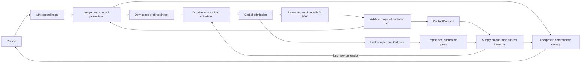
```mermaid
flowchart LR
  P[Person] --> API[API: record intent]
  API --> L[Ledger and scoped projections]
  L --> C[Composer: deterministic serving]
  C --> P
  L --> D[Dirty scope or direct intent]
  D --> J[Durable jobs and fair scheduler]
  J --> A[Global admission]
  A --> R[Reasoning runtime with AI SDK]
  R --> V[Validate proposal and read set]
  V --> L
  V --> Q[ContentDemand]
  Q --> S[Supply planner and shared inventory]
  A --> H[Host adapter and Cutroom]
  S -->|fund new generation| J
  H --> G[Import and publication gates]
  G --> S
  S --> C
```

### From behavior to a useful connection

Exact questions and alternatives constrain a proposed mechanism. A candidate must change the available experiences to be useful. See [10-CORE-AGENT.md](10-CORE-AGENT.md).

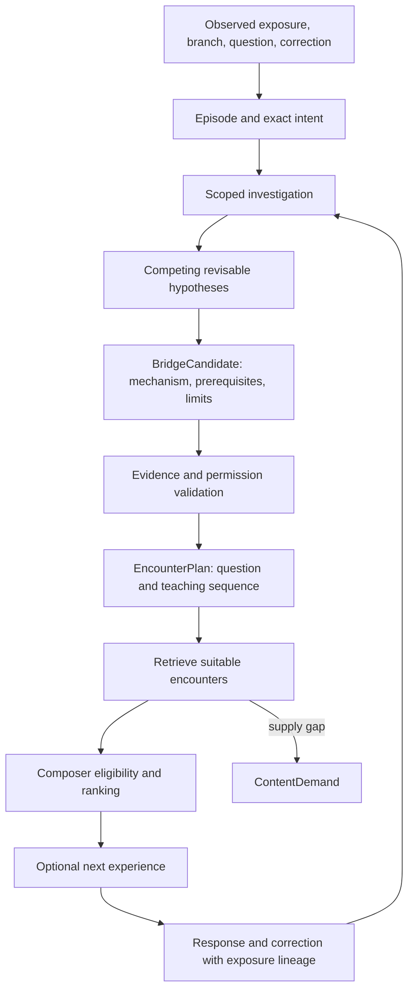
```mermaid
flowchart TD
  O[Observed exposure, branch, question, correction] --> E[Episode and exact intent]
  E --> I[Scoped investigation]
  I --> H[Competing revisable hypotheses]
  H --> B[BridgeCandidate: mechanism, prerequisites, limits]
  B --> V[Evidence and permission validation]
  V --> P[EncounterPlan: question and teaching sequence]
  P --> R[Retrieve suitable encounters]
  R --> C[Composer eligibility and ranking]
  R -->|supply gap| D[ContentDemand]
  C --> X[Optional next experience]
  X --> F[Response and correction with exposure lineage]
  F --> I
```

### Serving and branching

Reel and Scroll are the two consumption objects. Place, room, Cable and Blend select scope for the same serving machinery. See [08-RECOMMENDATION.md](08-RECOMMENDATION.md).

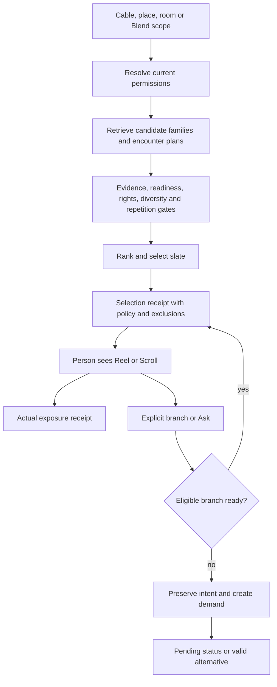
```mermaid
flowchart TD
  S[Cable, place, room or Blend scope] --> A[Resolve current permissions]
  A --> R[Retrieve candidate families and encounter plans]
  R --> G[Evidence, readiness, rights, diversity and repetition gates]
  G --> C[Rank and select slate]
  C --> SR[Selection receipt with policy and exclusions]
  SR --> U[Person sees Reel or Scroll]
  U --> O[Actual exposure receipt]
  U --> Q[Explicit branch or Ask]
  Q --> Ready{Eligible branch ready?}
  Ready -->|yes| SR
  Ready -->|no| D[Preserve intent and create demand]
  D --> Pending[Pending status or valid alternative]
```

### Long-running investigation and child jobs

An investigation can last weeks without keeping a worker alive. Children are optional, scoped evidence tasks. See [12-PERSISTENT-AGENTS.md](12-PERSISTENT-AGENTS.md).

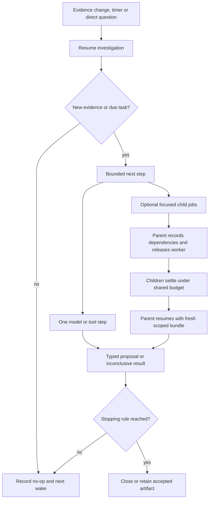
```mermaid
flowchart TD
  W[Evidence change, timer or direct question] --> I[Resume investigation]
  I --> Check{New evidence or due task?}
  Check -->|no| Sleep[Record no-op and next wake]
  Check -->|yes| Plan[Bounded next step]
  Plan --> One[One model or tool step]
  Plan --> Child[Optional focused child jobs]
  Child --> Yield[Parent records dependencies and releases worker]
  Yield --> Results[Children settle under shared budget]
  Results --> Resume[Parent resumes with fresh scoped bundle]
  One --> Prop[Typed proposal or inconclusive result]
  Resume --> Prop
  Prop --> Stop{Stopping rule reached?}
  Stop -->|yes| Close[Close or retain accepted artifact]
  Stop -->|no| Sleep
```

### Fair dispatch and resource admission

Class floors and per-user credits decide order; atomic resource checks decide whether a call can run. See [22-GLOBAL-EXECUTION.md](22-GLOBAL-EXECUTION.md).

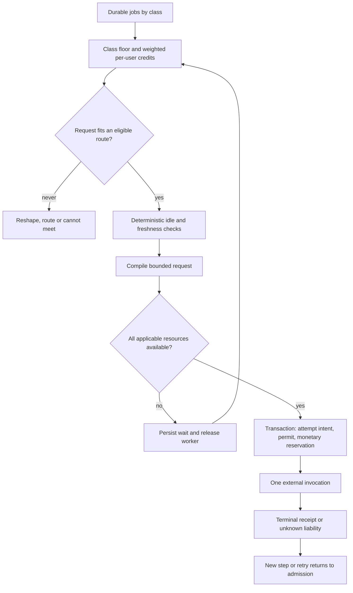
```mermaid
flowchart TD
  Q[Durable jobs by class] --> F[Class floor and weighted per-user credits]
  F --> Fit{Request fits an eligible route?}
  Fit -->|never| Shape[Reshape, route or cannot meet]
  Fit -->|yes| I[Deterministic idle and freshness checks]
  I --> B[Compile bounded request]
  B --> Gate{All applicable resources available?}
  Gate -->|no| Wait[Persist wait and release worker]
  Wait --> F
  Gate -->|yes| T[Transaction: attempt intent, permit, monetary reservation]
  T --> Call[One external invocation]
  Call --> Settle[Terminal receipt or unknown liability]
  Settle --> Next[New step or retry returns to admission]
```

### Coalescing without losing new events

Direct intents remain separate. Dirty signals can share work through a frozen high-water mark. See [04-EVENT-ARCHITECTURE.md](04-EVENT-ARCHITECTURE.md).

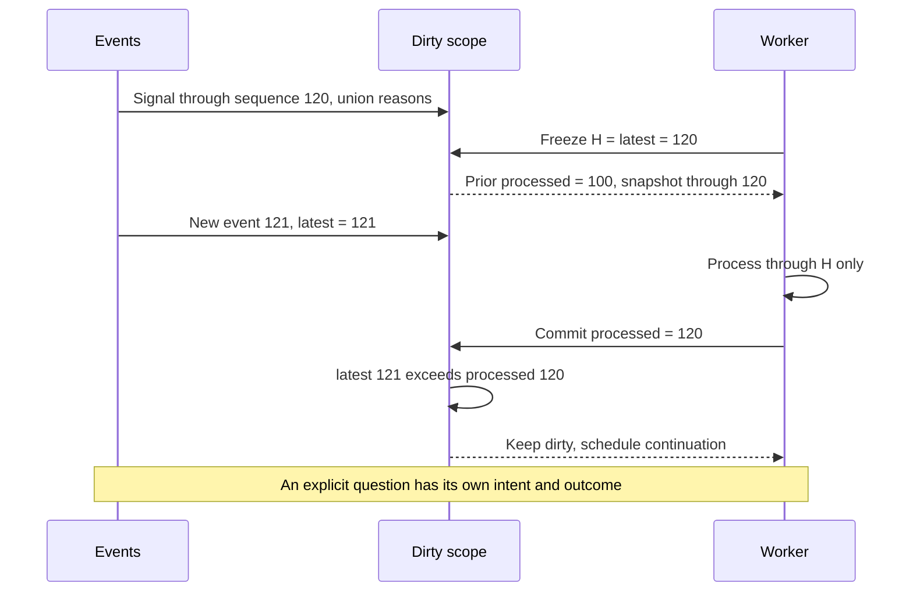
```mermaid
sequenceDiagram
  participant E as Events
  participant D as Dirty scope
  participant W as Worker
  E->>D: Signal through sequence 120, union reasons
  W->>D: Freeze H = latest = 120
  D-->>W: Prior processed = 100, snapshot through 120
  E->>D: New event 121, latest = 121
  W->>W: Process through H only
  W->>D: Commit processed = 120
  D->>D: latest 121 exceeds processed 120
  D-->>W: Keep dirty, schedule continuation
  Note over E,W: An explicit question has its own intent and outcome
```

### Crash, uncertainty and stale proposals

Remote completion and permission to apply are different decisions. A lease cannot prove that a remote call stopped. See [21-REASONING-RUNTIME.md](21-REASONING-RUNTIME.md).

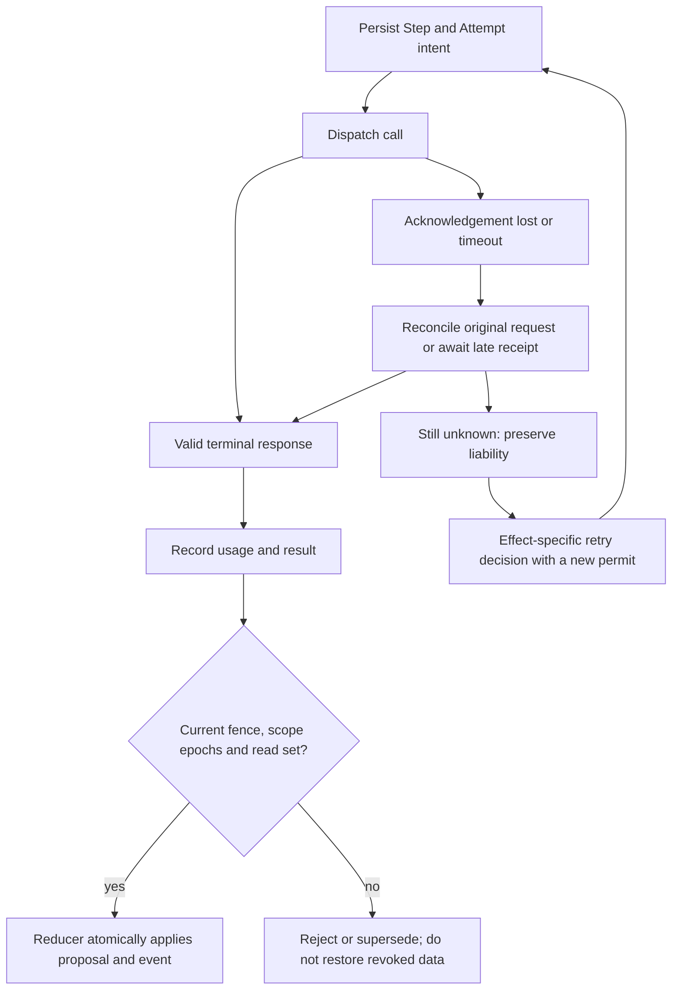
```mermaid
flowchart TD
  Intent[Persist Step and Attempt intent] --> Send[Dispatch call]
  Send --> Good[Valid terminal response]
  Send --> Unknown[Acknowledgement lost or timeout]
  Unknown --> Rec[Reconcile original request or await late receipt]
  Rec --> Good
  Rec --> Hold[Still unknown: preserve liability]
  Good --> Receipt[Record usage and result]
  Receipt --> Valid{Current fence, scope epochs and read set?}
  Valid -->|yes| Commit[Reducer atomically applies proposal and event]
  Valid -->|no| Reject[Reject or supersede; do not restore revoked data]
  Hold --> Retry[Effect-specific retry decision with a new permit]
  Retry --> Intent
```

### Reuse, adapt, join or generate

Each demand retains its own outcome. Shared production does not merge private contexts. See [23-CONTENT-DEMAND-AND-INVENTORY.md](23-CONTENT-DEMAND-AND-INVENTORY.md).

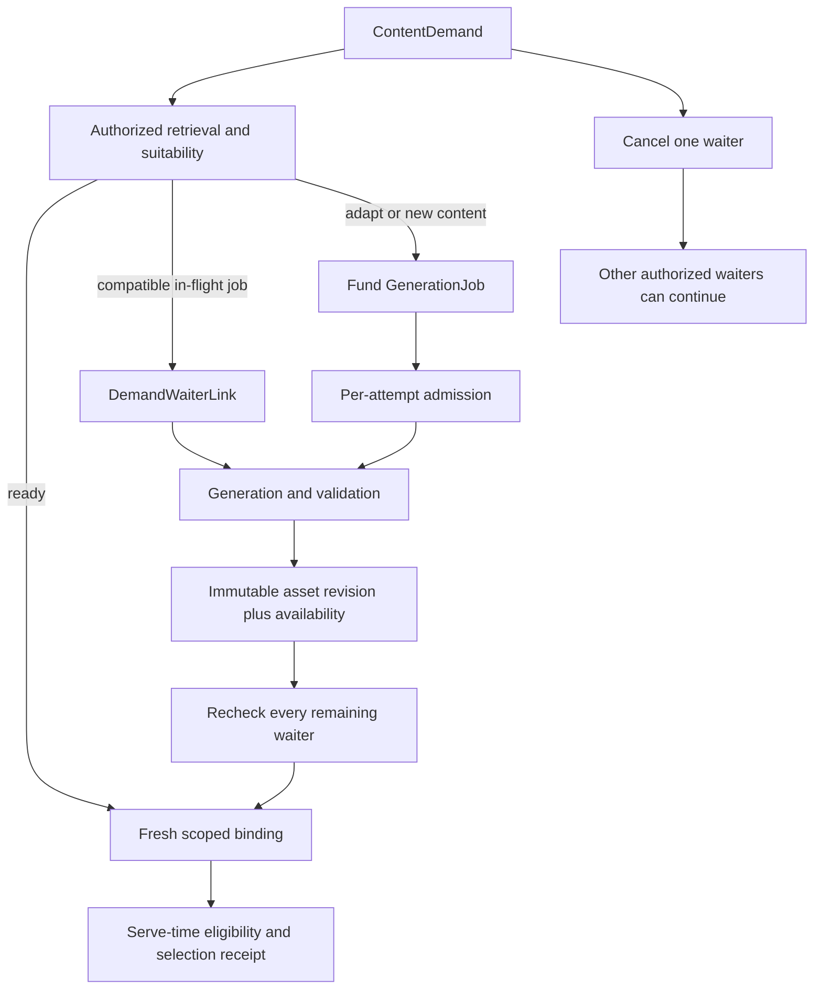
```mermaid
flowchart TD
  D[ContentDemand] --> S[Authorized retrieval and suitability]
  S -->|ready| B[Fresh scoped binding]
  S -->|compatible in-flight job| W[DemandWaiterLink]
  S -->|adapt or new content| F[Fund GenerationJob]
  F --> A[Per-attempt admission]
  A --> G[Generation and validation]
  W --> G
  G --> R[Immutable asset revision plus availability]
  R --> Check[Recheck every remaining waiter]
  Check --> B
  B --> Serve[Serve-time eligibility and selection receipt]
  D --> Cancel[Cancel one waiter]
  Cancel --> Other[Other authorized waiters can continue]
```

### The real Cutroom HTTP boundary

The V1 engine is local to its host. KnowScroll owns sources, safe import, publication and cost reconciliation. See [15-VIDEO-SDK-INTEGRATION.md](15-VIDEO-SDK-INTEGRATION.md).

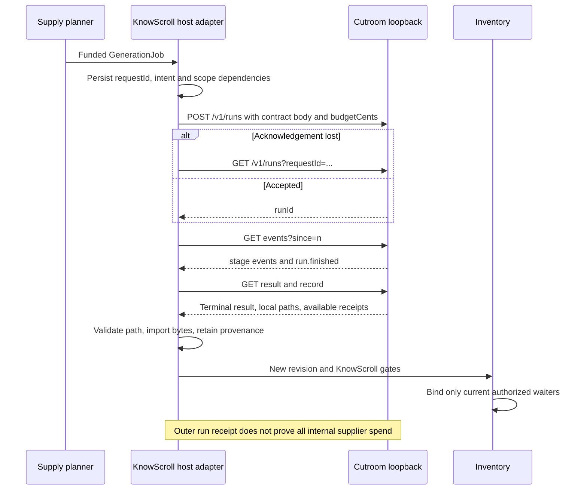
```mermaid
sequenceDiagram
  participant S as Supply planner
  participant H as KnowScroll host adapter
  participant C as Cutroom loopback
  participant I as Inventory
  S->>H: Funded GenerationJob
  H->>H: Persist requestId, intent and scope dependencies
  H->>C: POST /v1/runs with contract body and budgetCents
  alt Acknowledgement lost
    H->>C: GET /v1/runs?requestId=...
  else Accepted
    C-->>H: runId
  end
  H->>C: GET events?since=n
  C-->>H: stage events and run.finished
  H->>C: GET result and record
  C-->>H: Terminal result, local paths, available receipts
  H->>H: Validate path, import bytes, retain provenance
  H->>I: New revision and KnowScroll gates
  I->>I: Bind only current authorized waiters
  Note over H,C: Outer run receipt does not prove all internal supplier spend
```

### Rooms that investigate and make artifacts

Residents retain methods, positions and commitments. A group agreeing is not evidence of truth. See [11-IDEA-ROOMS.md](11-IDEA-ROOMS.md).

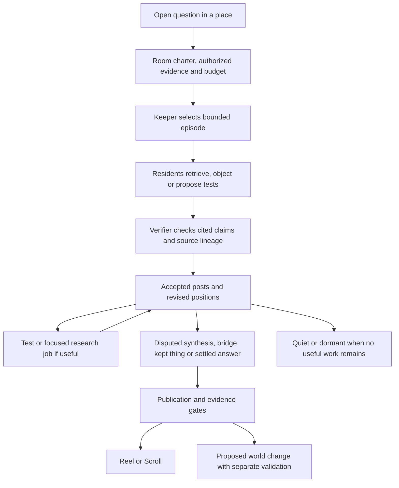
```mermaid
flowchart TD
  Q[Open question in a place] --> R[Room charter, authorized evidence and budget]
  R --> K[Keeper selects bounded episode]
  K --> A[Residents retrieve, object or propose tests]
  A --> V[Verifier checks cited claims and source lineage]
  V --> P[Accepted posts and revised positions]
  P --> T[Test or focused research job if useful]
  T --> P
  P --> Artifact[Disputed synthesis, bridge, kept thing or settled answer]
  Artifact --> G[Publication and evidence gates]
  G --> S[Reel or Scroll]
  G --> World[Proposed world change with separate validation]
  P --> Quiet[Quiet or dormant when no useful work remains]
```

### Friend visits and Blend

A projection grants a view, not access to the underlying private universe. Social exploration retains its origin. See [13-SOCIAL-BLEND.md](13-SOCIAL-BLEND.md).

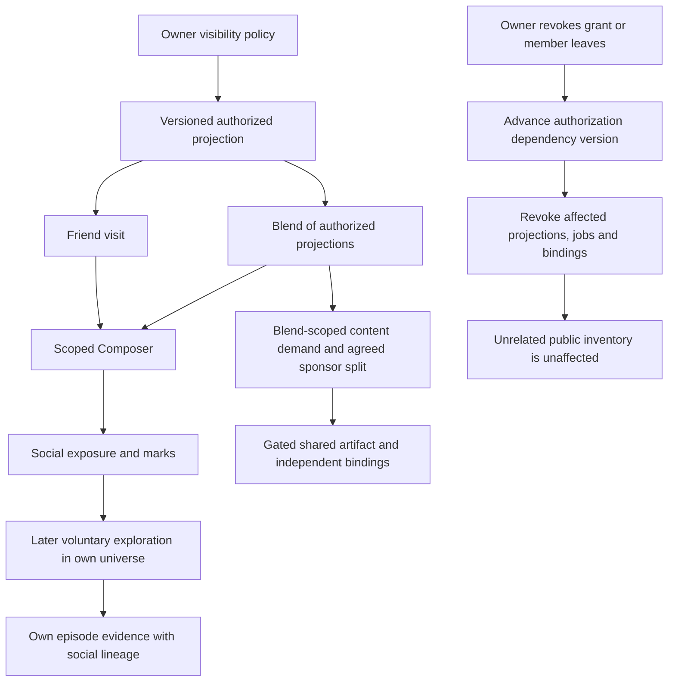
```mermaid
flowchart TD
  A[Owner visibility policy] --> P[Versioned authorized projection]
  P --> V[Friend visit]
  P --> B[Blend of authorized projections]
  V --> S[Scoped Composer]
  B --> S
  S --> E[Social exposure and marks]
  E --> Own[Later voluntary exploration in own universe]
  Own --> Accounts[Own episode evidence with social lineage]
  B --> D[Blend-scoped content demand and agreed sponsor split]
  D --> G[Gated shared artifact and independent bindings]
  Revoke[Owner revokes grant or member leaves] --> Fence[Advance authorization dependency version]
  Fence --> Cancel[Revoke affected projections, jobs and bindings]
  Cancel --> Public[Unrelated public inventory is unaffected]
```

### World evolution with meaningful structure

Numeric history gates are eligibility evidence, not proof of learning or a useful hierarchy. See [07-UNIVERSE-EVOLUTION.md](07-UNIVERSE-EVOLUTION.md).

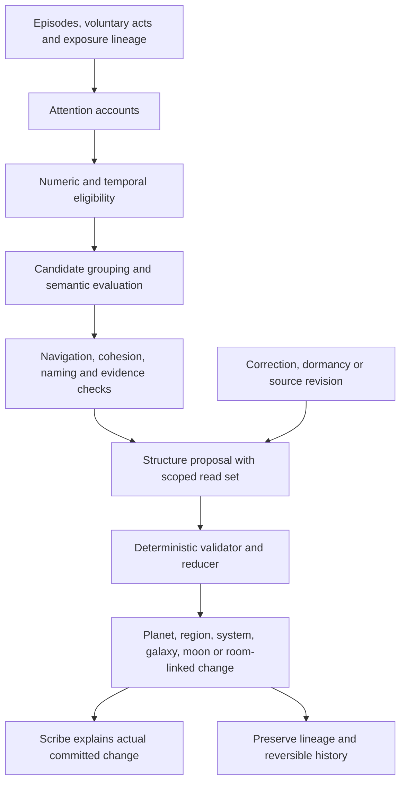
```mermaid
flowchart TD
  E[Episodes, voluntary acts and exposure lineage] --> A[Attention accounts]
  A --> N[Numeric and temporal eligibility]
  N --> M[Candidate grouping and semantic evaluation]
  M --> Use[Navigation, cohesion, naming and evidence checks]
  Use --> P[Structure proposal with scoped read set]
  P --> V[Deterministic validator and reducer]
  V --> W[Planet, region, system, galaxy, moon or room-linked change]
  W --> S[Scribe explains actual committed change]
  C[Correction, dormancy or source revision] --> P
  W --> L[Preserve lineage and reversible history]
```

### Privacy reset while work is running

Revocation immediately fences future use. Late usage can be recorded without restoring private content. See [04-EVENT-ARCHITECTURE.md](04-EVENT-ARCHITECTURE.md).

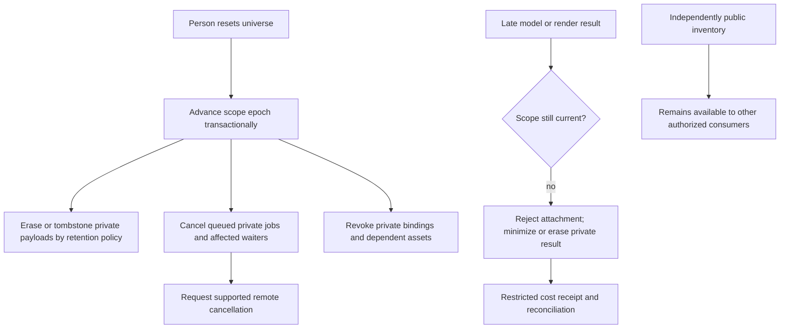
```mermaid
flowchart TD
  Reset[Person resets universe] --> Epoch[Advance scope epoch transactionally]
  Epoch --> Data[Erase or tombstone private payloads by retention policy]
  Epoch --> Jobs[Cancel queued private jobs and affected waiters]
  Epoch --> Bind[Revoke private bindings and dependent assets]
  Jobs --> Cancel[Request supported remote cancellation]
  Late[Late model or render result] --> Check{Scope still current?}
  Check -->|no| Drop[Reject attachment; minimize or erase private result]
  Drop --> Cost[Restricted cost receipt and reconciliation]
  Public[Independently public inventory] --> Safe[Remains available to other authorized consumers]
```

### Observe outcomes without inventing learning

Operational attribution and causal evidence are different. Shared inventory can interfere across experiments. See [16-FEEDBACK-LOOPS.md](16-FEEDBACK-LOOPS.md).

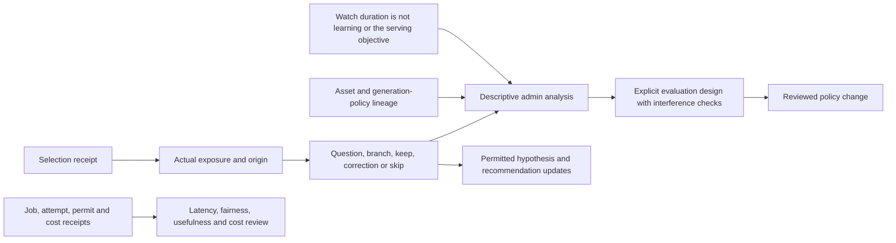
```mermaid
flowchart LR
  Sel[Selection receipt] --> Exp[Actual exposure and origin]
  Exp --> Act[Question, branch, keep, correction or skip]
  Act --> Desc[Descriptive admin analysis]
  Act --> Hyp[Permitted hypothesis and recommendation updates]
  Asset[Asset and generation-policy lineage] --> Desc
  Job[Job, attempt, permit and cost receipts] --> Ops[Latency, fairness, usefulness and cost review]
  Desc --> Eval[Explicit evaluation design with interference checks]
  Eval --> Policy[Reviewed policy change]
  Note[Watch duration is not learning or the serving objective] --> Desc
```

## Logical ER diagrams

These are logical entities, not approved migrations. PK means primary key; FK means foreign key. Optional relations allow deterministic work, imported assets, and jobs outside investigations. Polymorphic scope IDs require explicit typed ownership and authorization dependencies in the eventual SQL design; a matching ID or epoch number alone never grants access. Source/evidence joins and retention indexes are detailed in [05](05-DATA-STATE-MODEL.md).

### World, evidence and selection

Private observations and hypotheses are scoped. Shared claims are supported by versioned sources.

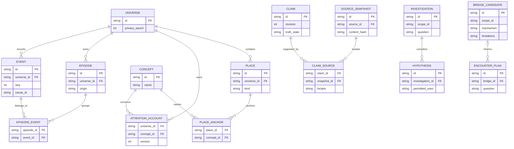
```mermaid
erDiagram
  UNIVERSE {
    string id PK
    int privacy_epoch
  }
  EVENT {
    string id PK
    string universe_id FK
    int seq
    string cause_id
  }
  EPISODE {
    string id PK
    string universe_id FK
    string origin
  }
  EPISODE_EVENT {
    string episode_id FK
    string event_id FK
  }
  CONCEPT {
    string id PK
    string name
  }
  ATTENTION_ACCOUNT {
    string universe_id FK
    string concept_id FK
    int version
  }
  PLACE {
    string id PK
    string universe_id FK
    string kind
  }
  PLACE_ANCHOR {
    string place_id FK
    string concept_id FK
  }
  SOURCE_SNAPSHOT {
    string id PK
    string source_id FK
    string content_hash
  }
  CLAIM {
    string id PK
    int revision
    string truth_state
  }
  CLAIM_SOURCE {
    string claim_id FK
    string snapshot_id FK
    string locator
  }
  INVESTIGATION {
    string id PK
    string scope_id
    string question
  }
  HYPOTHESIS {
    string id PK
    string investigation_id FK
    string permitted_uses
  }
  BRIDGE_CANDIDATE {
    string id PK
    string scope_id
    string mechanism
    string limitations
  }
  ENCOUNTER_PLAN {
    string id PK
    string bridge_id FK
    string question
  }
  UNIVERSE ||--o{ EVENT : records
  UNIVERSE ||--o{ EPISODE : owns
  EPISODE ||--o{ EPISODE_EVENT : groups
  EVENT ||--o{ EPISODE_EVENT : belongs_to
  UNIVERSE ||--o{ ATTENTION_ACCOUNT : owns
  CONCEPT ||--o{ ATTENTION_ACCOUNT : concerns
  UNIVERSE ||--o{ PLACE : contains
  PLACE ||--o{ PLACE_ANCHOR : anchors
  CONCEPT ||--o{ PLACE_ANCHOR : names
  CLAIM ||--o{ CLAIM_SOURCE : supported_by
  SOURCE_SNAPSHOT ||--o{ CLAIM_SOURCE : locates
  INVESTIGATION ||--o{ HYPOTHESIS : considers
  BRIDGE_CANDIDATE o|--o{ ENCOUNTER_PLAN : informs
```

### Jobs, steps, attempts and money

A deterministic step has no external attempt. Every retry has a new attempt and permit; a repair is a new step.

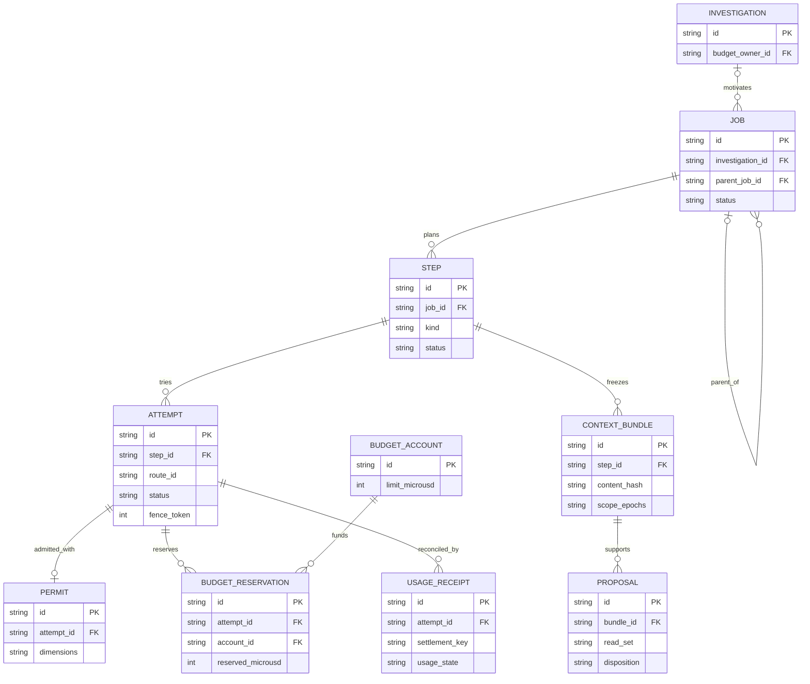
```mermaid
erDiagram
  INVESTIGATION {
    string id PK
    string budget_owner_id FK
  }
  JOB {
    string id PK
    string investigation_id FK
    string parent_job_id FK
    string status
  }
  STEP {
    string id PK
    string job_id FK
    string kind
    string status
  }
  ATTEMPT {
    string id PK
    string step_id FK
    string route_id
    string status
    int fence_token
  }
  CONTEXT_BUNDLE {
    string id PK
    string step_id FK
    string content_hash
    string scope_epochs
  }
  PROPOSAL {
    string id PK
    string bundle_id FK
    string read_set
    string disposition
  }
  PERMIT {
    string id PK
    string attempt_id FK
    string dimensions
  }
  BUDGET_ACCOUNT {
    string id PK
    int limit_microusd
  }
  BUDGET_RESERVATION {
    string id PK
    string attempt_id FK
    string account_id FK
    int reserved_microusd
  }
  USAGE_RECEIPT {
    string id PK
    string attempt_id FK
    string settlement_key
    string usage_state
  }
  INVESTIGATION o|--o{ JOB : motivates
  JOB o|--o{ JOB : parent_of
  JOB ||--o{ STEP : plans
  STEP ||--o{ ATTEMPT : tries
  STEP ||--o{ CONTEXT_BUNDLE : freezes
  CONTEXT_BUNDLE ||--o{ PROPOSAL : supports
  ATTEMPT ||--o| PERMIT : admitted_with
  ATTEMPT ||--o{ BUDGET_RESERVATION : reserves
  BUDGET_ACCOUNT ||--o{ BUDGET_RESERVATION : funds
  ATTEMPT ||--o{ USAGE_RECEIPT : reconciled_by
```

### Shared supply and private bindings

The waiter join permits shared generation. Selection and actual exposure are recorded after preparation.

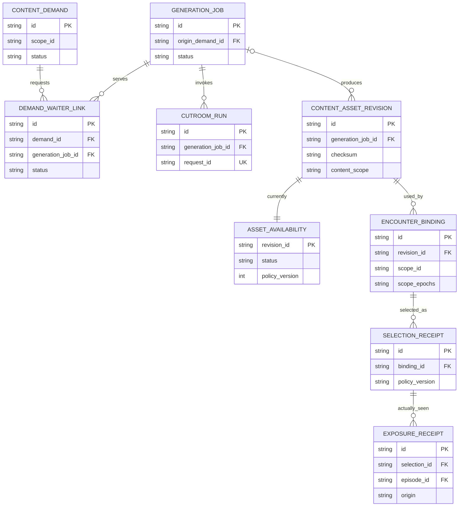
```mermaid
erDiagram
  CONTENT_DEMAND {
    string id PK
    string scope_id
    string status
  }
  GENERATION_JOB {
    string id PK
    string origin_demand_id FK
    string status
  }
  DEMAND_WAITER_LINK {
    string id PK
    string demand_id FK
    string generation_job_id FK
    string status
  }
  CUTROOM_RUN {
    string id PK
    string generation_job_id FK
    string request_id UK
  }
  CONTENT_ASSET_REVISION {
    string id PK
    string generation_job_id FK
    string checksum
    string content_scope
  }
  ASSET_AVAILABILITY {
    string revision_id PK
    string status
    int policy_version
  }
  ENCOUNTER_BINDING {
    string id PK
    string revision_id FK
    string scope_id
    string scope_epochs
  }
  SELECTION_RECEIPT {
    string id PK
    string binding_id FK
    string policy_version
  }
  EXPOSURE_RECEIPT {
    string id PK
    string selection_id FK
    string episode_id FK
    string origin
  }
  CONTENT_DEMAND ||--o{ DEMAND_WAITER_LINK : requests
  GENERATION_JOB ||--o{ DEMAND_WAITER_LINK : serves
  GENERATION_JOB ||--o{ CUTROOM_RUN : invokes
  GENERATION_JOB o|--o{ CONTENT_ASSET_REVISION : produces
  CONTENT_ASSET_REVISION ||--|| ASSET_AVAILABILITY : currently
  CONTENT_ASSET_REVISION ||--o{ ENCOUNTER_BINDING : used_by
  ENCOUNTER_BINDING ||--o{ SELECTION_RECEIPT : selected_as
  SELECTION_RECEIPT ||--o{ EXPOSURE_RECEIPT : actually_seen
```

### Rooms, residents and authorized sharing

Membership, projection versions and artifact permissions are explicit dependencies of every scoped read.

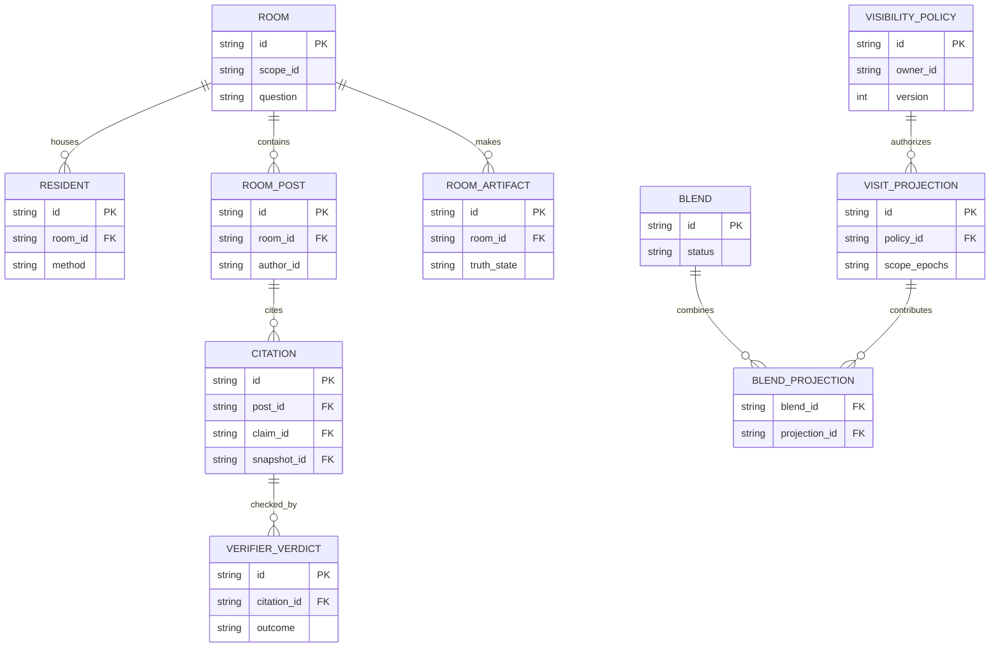
```mermaid
erDiagram
  ROOM {
    string id PK
    string scope_id
    string question
  }
  RESIDENT {
    string id PK
    string room_id FK
    string method
  }
  ROOM_POST {
    string id PK
    string room_id FK
    string author_id
  }
  CITATION {
    string id PK
    string post_id FK
    string claim_id FK
    string snapshot_id FK
  }
  VERIFIER_VERDICT {
    string id PK
    string citation_id FK
    string outcome
  }
  ROOM_ARTIFACT {
    string id PK
    string room_id FK
    string truth_state
  }
  VISIBILITY_POLICY {
    string id PK
    string owner_id
    int version
  }
  VISIT_PROJECTION {
    string id PK
    string policy_id FK
    string scope_epochs
  }
  BLEND {
    string id PK
    string status
  }
  BLEND_PROJECTION {
    string blend_id FK
    string projection_id FK
  }
  ROOM ||--o{ RESIDENT : houses
  ROOM ||--o{ ROOM_POST : contains
  ROOM_POST ||--o{ CITATION : cites
  CITATION ||--o{ VERIFIER_VERDICT : checked_by
  ROOM ||--o{ ROOM_ARTIFACT : makes
  VISIBILITY_POLICY ||--o{ VISIT_PROJECTION : authorizes
  BLEND ||--o{ BLEND_PROJECTION : combines
  VISIT_PROJECTION ||--o{ BLEND_PROJECTION : contributes
```
