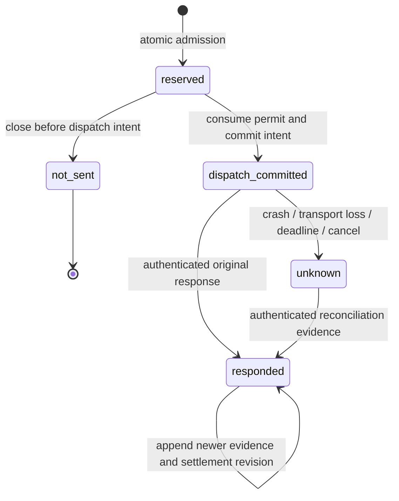

# ADR-0012 — Durable reasoning admission and uncertain outcomes

Date: 2026-09-16. Status: accepted as a design contract in [#42](https://github.com/KnowScroll/knowscroll/issues/42). Protocol and metadata contracts only; no database runtime, paid dispatcher or proposal application is implemented by this ADR.

## Context and decision

[ADR-0011](0011-minimax-certification.md) proved three bounded development cases. Its file journal is not a production scheduler. The existing `job` table is exclusively a deterministic `project_keep` projection, tied to a Ledger event, with an aggregate retry counter. Widening it would mix transactional replay with externally billed uncertainty. Add a separate reasoning record family in a future ordered migration, retaining the existing worker unchanged.

KnowScroll owns admission, immutable request identity, reservations, fencing, reconciliation and deterministic application. The SDK executes exactly one already-admitted request with retries disabled. A returned answer is evidence of a transport result; it does not establish an applicable semantic proposal. Chapter [21](../architecture/target/21-REASONING-RUNTIME.md) and [22](../architecture/target/22-GLOBAL-EXECUTION.md) remain the full target. This ADR replaces their illustrative job-first/SQLite-style transaction recipe with PostgreSQL universe-first locking.

## Records, identities and ownership

The strict [shared metadata schemas](../../packages/contracts/src/reasoning.ts) specify version-1 metadata. They are internal contracts, not public request bodies. Parsing validates shape; it does not authenticate a receipt, authorize dispatch, prove foreign-key ownership or acquire a lock.

| Record | Identity and invariant | Owner |
|---|---|---|
| Job | UUID; one universe/epoch, class, deadline, budget owner and direct intent or frozen dirty high-water | Scheduler/runtime |
| Step | UUID; one Job, ordered logical operation and context bundle; retries keep the Step and create new Attempts | Runtime |
| ContextBundle | UUID; immutable hash, scoped entity/source/permission/policy revisions; payload separate | Context compiler |
| Attempt | UUID per external invocation; immutable request UUID/hash, route/profile, context, output ceiling and captured fence | Runtime |
| Permit | UUID, Attempt, reservation-set identity and dispatch expiry; consumed at most once | Admission |
| Reservation | UUID per applicable bucket, typed unit, amount and window; one aggregate row per bucket/Attempt | Admission |
| Dispatch intent | UUID unique per Attempt; committed before transport; never reused after recovery | Runtime |
| Receipt | UUID and original Attempt/dispatch/request identities; authenticated evidence source, nullable usage | Restricted receipt sink |
| Settlement | UUID; unique Attempt/revision and Attempt/receipt; append adjustments, never overwrite history | Admission accounting |
| Proposal | Separate future identity and typed read set; provider content has no direct mutation authority | Steward/apply validator |

All private Job/Step/context/Attempt rows carry universe and epoch. Composite foreign keys reject cross-universe/epoch links. Step ordinal is unique per Job; Attempt ordinal is unique per Step; request and dispatch identities are globally unique. At most one Attempt per Step may remain reserved, possibly live or awaiting reconciliation. A Job has one monotonic lease fence, serialized as a decimal string to preserve PostgreSQL bigint precision. Exhausting the counter fails closed. Lease renewal changes expiry, never the fence; every new claim increments it.

An immutable private Attempt detail and a separate minimal accounting identity are created together. Accounting identity survives private graph deletion without a foreign key to Job/Step/context. Its restricted universe/epoch binding lets late usage be reconciled after history clear. Attempt ordinal and previous-Attempt identity belong to each Attempt, not its reusable Step; storage enforces that the predecessor belongs to the same Step and precedes it. This is not a public event history or evidence source for personalization.

## State machine and exact guards

`dispatch_committed` means the request **might** have left the process. It is deliberately written before network I/O. Neither that state nor `unknown` may return to `reserved`, create another dispatch for the same Attempt, or be inferred as `not_sent` from silence. `responded` records an observed response; a malformed response or an error without terminal guarantees can still have `remoteDisposition=unconfirmed`. Response success, complete usage, released remote capacity and eligible output are separate facts.

| From → to | Required evidence/guard |
|---|---|
| reserved → dispatch_committed | Current unexpired lease fence, matching universe/epoch, uncancelled Job/Step, current permissions/read set, valid route/profile and unexpired permit; all reservations exist; immutable serialized-body hash and output ceiling match; atomically consume permit and persist one dispatch ID |
| reserved → not_sent | No dispatch intent exists; cancel/deadline/privacy/fence/permit closure wins the same row locks. Reservations can be released according to bucket semantics because transport authority was never issued |
| dispatch_committed → unknown | Local timeout/abort, lost transport, crash recovery or expired lease without a conclusive receipt. Hold uncertain liabilities and possibly-live remote concurrency |
| dispatch_committed/unknown → responded | Authenticated evidence bound to original Attempt/request/dispatch, route and privileged transport/reconciler identity. Nullable usage is validated independently of response content |
| responded → responded | New evidence identity and append-only settlement revision; same receipt retries are a no-op, conflicting same-ID receipts are rejected; contradictory terminal outcomes freeze automatic reconciliation for review |

Output authority only moves `eligible → withdrawn`, never back. A not_sent Attempt is withdrawn; deadline/local-cancel unknown observations are withdrawn too. Storage CAS guards enforce monotonicity across records; schema parsing alone cannot compare the prior version. Cancel, deadline, privacy epoch change or invalid context withdraw it even if the provider later succeeds. Withdrawn output is discarded; a usage receipt may still settle the original liability. No transition closes an unknown liability merely because a retry succeeded.

| Record | Legal transitions and completion guard |
|---|---|
| Job | queued → running/cancelled/expired; running → waiting/completed/failed/cancelled/expired; waiting → queued/cancelled/expired. A terminal Job never reopens; no completed state until required Steps have completed their deterministic acceptance gates |
| Step | pending → active/cancelled/superseded; active → succeeded/failed/awaiting_reconciliation/cancelled; awaiting_reconciliation → succeeded/failed/cancelled; failed → pending only through an explicit new retry decision after the previous Attempt is conclusively terminal. Superseded/cancelled/succeeded do not reopen |
| Permit | reserved → consumed or revoked/expired; consumed never becomes available again. Expiry does not release a consumed permit's remote concurrency/liability |
| Settlement | held → partially_settled → settled, or held → settled, using measured evidence or a recorded conservative liability charge. Unknown fields remain null; revisions may increase a previously charged amount without issuing a new dispatch |

After lease loss, the replacement can move a running Job to waiting while preserving the active Step/Attempt, or requeue only a Step whose unconsumed Attempt has been closed as not_sent. It may reconcile; it cannot resend a consumed Attempt. First implementation excludes child jobs and coalesced work consumers, but preserves these target boundaries rather than inventing an alternative loop.

## Short PostgreSQL operations

Use database `clock_timestamp()` for deadline/lease predicates. Scheduler candidate discovery takes no global mutable lock. Every mutating operation locks in this order: universe → Job → Step → Attempt/accounting identity → all affected scheduler/quota/budget rows in one canonical bucket-ID order. Multiple rows within a level are ordered by UUID. Never acquire a universe after a shared budget row. Restricted late settlement after private erasure locks universe → retained accounting identity → buckets; it does not recreate deleted Job/Step rows. Schema constraints and CAS predicates duplicate ownership/fence checks at the write boundary.

1. **Claim:** select an eligible universe using `FOR UPDATE OF universe SKIP LOCKED`, then re-read Job/epoch/permissions under that lock. Atomically advance the lease fence if the prior claim expired and no cancellation forbids work. A blocked universe must not block another candidate. A replacement still cannot dispatch while an earlier Attempt remains possibly live.
2. **Reserve:** with current lease/epoch and Step intent, lock all applicable buckets. Conditional balance updates plus insertion of Attempt, Permit, reservations and minimal accounting identity commit together. A failure creates none of them. Inserts without balance checks are insufficient. No network I/O occurs in this transaction.
3. **Authorize dispatch:** fresh short transaction rechecks authority, context read set, DB deadlines and fence, consumes the Permit and commits its dispatch ID and body hash. Only the worker receiving this transaction's successful result may enter one transport invocation. If commit acknowledgement is lost, the worker stops: reading a committed intent later never grants permission to resend.
4. **Dispatch:** immediately check local abort/deadline, perform one transport invocation, and never hold a DB transaction during network I/O. The gap after authorization and before remote receipt is unavoidable with the current provider: a pause/clear can occur there. Local fencing does not prove prevention of all post-clear egress, exactly-once remote execution or remote cancellation.
5. **Receive/reconcile:** a restricted authenticated sink accepts evidence only for an existing accounting identity and dispatch/request binding. An old worker fence cannot change a Job/Step, dispatch again or apply output, but may submit the original transport receipt to this sink. The sink locks the current universe for serialization, then authorizes accounting by the retained identity’s universe, original Attempt/request/dispatch, route/profile and privileged evidence origin. It must not require the retained old epoch to equal the current universe epoch: that would lose legitimate late usage after clear. It records minimal usage and appends settlement only; current permissions/epoch/fence still gate every private checkpoint or output application. The current lease holder alone advances private execution state after revalidation.
6. **Cancel/expire/clear:** withdraw output and close unconsumed Attempts as not_sent; consumed Attempts retain uncertainty. Request local abort, and remote cancellation only if the route profile proves it. Preserve late-usage collection without retaining stale private payloads.

The old `ReasoningProvider.execute` interface returns a proposal directly and has no durable reservation/fence protocol. It remains unready. Product dispatch needs a replacement adapter boundary that takes already-authorized immutable invocation data and returns observations into the receipt sink. Certification code is evidence for that future adapter, not permission to bypass admission.

## Budgets, quota and reconciliation

Applicable route/profile dimensions include global and owner/job budget, provider account, route quota, request/input/output/combined rate and remote concurrency. Different keys can share the same provider-account buckets. Every applicable bucket must appear once, with the profile's unit and window; the strict schema does not infer which dimensions apply. Missing profile/capability/price information must block any policy requiring it. A token-plan cap is not a price or a guaranteed cash cap.

Reserve conservative input units plus the full requested output ceiling, including billed reasoning. Units are explicit (`tokens`, `requests`, `slots`, `micro_usd`); do not add unlike units. Monetary reservations require a versioned price basis or an explicit conservative ceiling and spending authority. Nullable measured usage and cost stay independent. Cache counters follow the certified route's semantics; do not add them to input blindly. Unknown usage retains that dimension's liability. A confirmed response can free proven terminal remote capacity while still holding unknown monetary liability; local lease expiry cannot do either.

Settlement is serialized per accounting identity. A unique receipt ID and canonical fingerprint of the strictly parsed minimal receipt (never the raw response) make identical delivery idempotent and conflicting reuse an error. The shared settlement view carries the prior settlement identity, receipt fingerprint and unique typed bucket adjustments. Reservation rows carry Attempt/set identities and held/accounted/released state; Permit lifecycle records its one consumed dispatch identity. Database uniqueness/CAS, not schema parsing, prevents re-consumption or duplicate settlement across requests. For revised cumulative usage, append a settlement revision and post only the difference from the prior recognized cumulative totals; do not sum duplicate full receipts. Usage beyond reservation is recorded as overage and pauses admission under the affected policy. Never clamp actual usage to the reservation. Conservative charges do not change unknown usage fields to measured values. Rate-window replenishment follows the provider's window rule; a budget refund does not refill a rate bucket early.

A possible remote invocation without a certified completion bound continues consuming conservative remote capacity until terminal evidence or an explicit operator risk decision. The decision records unresolved liability and pauses the route if capacity cannot be justified. It is not proof that a call stopped. First implementation has no automatic retry of unknown outcomes and no hidden SDK retry. Even an authorized retry after a conclusively retryable error gets a fresh Attempt/Permit/reservation under the same Step; first implementation requires an explicit retry policy decision.

## Fair scheduling and wake identity

Accept weighted deficit round robin across the five classes with initial policy quanta `5:6:4:3:2` (interactive, active continuity, accumulated interpretation, background inquiry, housekeeping), and equal per-universe quantum within each class. These are tuning defaults, not measured capacity promises. Charge a fixed-point conservative dominant share of the applicable constrained resource estimates, record the estimation/profile version and settle corrections. No engagement-derived user weight is introduced.

Cap idle credit; its cap must cover the largest admissible request. Reject permanently impossible requests explicitly. Idle class capacity is borrowable only while that class has no eligible backlog; its next admission restores service opportunity. Already-running remote calls are not preempted. Eligibility rechecks route capacity and per-universe caps; a repeatedly blocked head cannot prevent trying another eligible universe. Guarantee eventual scheduling opportunity only under finite eligible backlog, fitting request sizes and replenishing capacity. Unknown remote work can saturate capacity: report that and deadline misses instead of promising bounded response latency.

Direct intent UUIDs never coalesce. Dirty work freezes high-water H, commits progress only through H, and retains H2 > H for a later Job; a completion cannot unconditionally clear a dirty bit. First storage/attempt implementation does not yet implement these queues, fairness or optional children. Their later proof is a prerequisite for enabling general background reasoning.

## Privacy, retention and stale output

Every context includes universe/epoch and typed entity/source/permission/policy revisions. Recheck permissions and epoch before dispatch; recheck typed read dependencies and operation preconditions before proposal acceptance/application. A whole-universe or Accounts revision is not a substitute for these dependencies. New unrelated explicit keeps must not invalidate an independent proposal solely because the global revision increased. Stale dependencies require refusal or a newly admitted re-evaluation, never silent read-set rewriting.

In the future storage migration, extend `clearScrollHistory` in the **same release** as the new tables. Under its existing universe lock, advance epoch, withdraw all old private reasoning output, close unconsumed Attempts, and delete private Job/Step/context/read sets/request hashes/lineage/output/proposal/native-tool blocks in FK-safe order. Preserve current session rollover, retry receipts, other universes and shared assets exactly. An exact prior clear receipt replay returns before any reasoning withdrawal, reservation/bucket adjustment, accounting mutation or deletion. Only a new clear, after the existing-receipt and expected-epoch checks, may change reasoning state; later work must survive replay of an older clear request. Do not add CASCADE that erases unresolved liability or RESTRICT that prevents clearing.

Retain only the restricted accounting identity, original random Attempt/request/dispatch IDs, universe/old epoch, route/profile version, reservation dimensions/units, minimal timestamps/status, nullable usage/cost and idempotent settlement evidence. No context hash, source/entity references, prompts, outputs, native thinking, provider error text or deleted-row snapshots survive clear. After erasure the attempt schema above no longer describes a private row; the receipt sink uses the minimal accounting identity, never a recreated private Attempt.

Retention policy v1: erase private context/output at history clear immediately; for the first runtime slice, do not persist raw native continuation at all. An accounting identity becomes purge-eligible only after financial/usage liability, remote-capacity/disposition, reconciliation and idempotency holds are all closed. Start the 30-day retention clock at that final all-duties-closed transition, then purge individual identities/receipt fingerprints under a scheduled cleanup job. Financial settlement alone cannot start the clock. An explicit operator risk closure must record the remaining uncertainty and its decision to end late-receipt acceptance before this clock starts; it does not relabel uncertainty as measured success. After eventual purge, unknown identities are rejected and never recreated by late input. Unknown liabilities have no automatic expiry; review after seven days and pause affected admission when unresolved capacity cannot be justified. They remain restricted until evidence or an explicit conservative accounting closure resolves financial liability; unresolved remote capacity is tracked separately. Age alone releases neither. This potentially longer minimal retention is explicit and must be disclosed in privacy copy before private product calls are enabled. Full account deletion and backup erasure still need their own policy; this ADR does not promise them.

Late responses after cancel/deadline/clear are parsed only enough for minimal receipt/usage, discard all raw content and may not restore a private row or create/apply a Proposal. Hashes are correlation metadata, not anonymization. Receipts accept no arbitrary JSON or raw error strings. Provider-originated data never chooses universe authority or a replacement request identity. Public clients cannot submit these internal receipts.

## Alternatives and consequences

- **Extend bootstrap jobs:** rejected for paid work because their Ledger FK, retry counter, states and clear behavior have different semantics. Separate reasoning tables leave deterministic replay intact.
- **One global database lock:** rejected as the scheduler design; canonical short bucket locks enforce caps while universe-first selection avoids blocked-user head-of-line blocking. Contention must be measured later.
- **Release on timeout/lease expiry:** rejected because it permits concurrent duplicate external work and discards unknown liability.
- **Require current worker fence for every receipt:** rejected for the restricted evidence sink because it loses late usage. Current fence remains mandatory for execution/checkpoint/application, while receipt authenticity and original identity authorize accounting only.
- **Persist all model transcripts for replay:** deferred. It would enlarge privacy/retention and key-management scope. The first runtime slice stores metadata only and cannot claim resumable private multi-turn reasoning.
- **Adopt a workflow service now:** deferred until PostgreSQL contention/recovery evidence demonstrates need. One shared database protocol is the first implementation target.

## Verification and implementation release order

[#42](https://github.com/KnowScroll/knowscroll/issues/42) closes on reviewed protocol, strict shared schemas and the linked [implementation/verification plan](../operations/reasoning-implementation-plan.md), not on production execution. Contract tests exercise malformed identities, cross-scope context, duplicate reservations, nullable uncertainty, integer precision and restricted receipt fields. CI checks existing behavior. No new user journey is claimed by these tests.

First release: coordinated schema, private-erasure integration and metadata-only accounting primitives; then atomic admission/dispatch authorization/receipt settlement against that schema; then J004 with a local fake transport in disposable runtimes, including crash windows and late usage after clear. All three must integrate before their new runtime is considered usable even for a synthetic protocol harness. No provider credentials in those tests. Fair scheduler, context compiler/proposal validation, privacy disclosure/cleanup and a separately authorized bounded product-provider experiment are later gates. Full #7 remains open.
