# FlowWalk: KnowScroll codebase, architecture, program design, and data flow

> **Source snapshot:** `c9c3e72c9a428059625d25906280a51b96b45fde` on 2026-09-21.
>
> **Scope:** the current KnowScroll repository, plus the separate Cutroom HTTP boundary.
>
> **Honesty rule:** the target architecture is the map of intended responsibilities; code, migrations, tests, and observed runtime determine what exists today.

This guide answers four questions:

1. What system was KnowScroll designed to become?
2. What code and database structures actually exist now?
3. What happens, in execution order, when a person signs in, encounters a Scroll, records exposure, keeps it, sees a world, changes privacy state, or requests generated media?
4. Where does the current implementation match the planned architecture, where is it deliberately narrower, and where are the dangerous gaps?

It is written as a guided reading path rather than a directory listing. The unit of explanation is a product feature and its runtime flow.

---

## 1. Start here

Open [the target architecture index](../architecture/target/00-README.md#L11) first. It gives the vocabulary and the intended division of responsibility:

- the **Ledger** records what happened;
- the **Composer** chooses an immediately available Reel or Scroll without a model call;
- the **Steward** and reasoning plane investigate possible meaning asynchronously;
- the **Cartographer** proposes changes to the personal universe;
- the **Quartermaster** identifies missing experiences and looks for supply;
- the **Inventory/Gates** boundary decides what content is safe and eligible to serve.

Then open [the implemented architecture index](../architecture/README.md#L1). Its key distinction is that solid arrows describe implemented bootstrap paths while dashed arrows describe target paths.

The best first code file is [apps/api/src/app.ts](../../apps/api/src/app.ts#L92). It is the narrow waist of the current system: almost every user-visible flow enters there, authentication is applied there, and calls fan out into deterministic core logic and PostgreSQL-owned state.

### Recommended first reading path

1. [docs/architecture/target/00-README.md](../architecture/target/00-README.md#L11) — intended vocabulary and full design.
2. [docs/architecture/target/01-OVERVIEW.md](../architecture/target/01-OVERVIEW.md#L17) — the six intended responsibilities and three logical planes.
3. [apps/api/src/app.ts](../../apps/api/src/app.ts#L92) — real HTTP entry points and transactions.
4. [packages/db/src/identity.ts](../../packages/db/src/identity.ts#L71) — universe-first authentication and privacy-epoch authority.
5. [packages/core/src/composer.ts](../../packages/core/src/composer.ts#L149) — the pure deterministic ranking function.
6. [apps/worker/src/project.ts](../../apps/worker/src/project.ts#L19) — the actual deterministic projection worker.
7. [packages/db/src/worlds.ts](../../packages/db/src/worlds.ts#L45) — the implemented, deliberately modest world derivation.
8. [packages/db/src/privacy.ts](../../packages/db/src/privacy.ts#L27) — clear, pause, export, and reset behavior.
9. [apps/worker/src/generation/worker.ts](../../apps/worker/src/generation/worker.ts#L1) — the Cutroom reconciliation chain.
10. [apps/web/vite.config.ts](../../apps/web/vite.config.ts#L1) and [apps/web/src/api/client.ts](../../apps/web/src/api/client.ts#L1) — the browser-no-bearer-token design.
11. [apps/mobile/app/src/main/kotlin/com/knowscroll/mobile/ui/AppViewModel.kt](../../apps/mobile/app/src/main/kotlin/com/knowscroll/mobile/ui/AppViewModel.kt#L1) — Android's state machine and recovery rules.
12. [docs/product/v1-release.md](../product/v1-release.md#L1) — the actual release bar, which remains much larger than the implemented slice.

---

## 2. How to interpret status in this guide

| Label | Meaning |
| --- | --- |
| **Implemented** | A real source path exists and has direct tests or journey evidence. This still does not prove the owner database is migrated or that a process is running. |
| **Implemented, local/dev only** | Code works under the loopback or disposable environment but is deliberately blocked from production. |
| **Contract-only** | Types, tables, interfaces, or helper primitives exist, but no product consumer completes the flow. |
| **Stand-in** | A real integration boundary runs, but one or more upstream components use synthetic implementations. |
| **Blocked** | The code intentionally cannot advance because an authority, provider, witness, identity carrier, or product decision is absent. |
| **Target-only** | The idea exists in the adopted target documents but has no current implementation. |
| **Defect/risk** | Current source contradicts a product rule or can produce stale, misleading, or unsafe behavior. |

The repository has several different kinds of truth. Use them in this order:

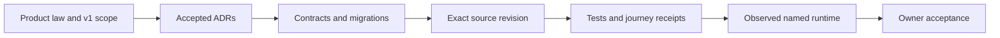

No step automatically proves the one after it. A migration in source does not prove the owner database has applied it. A green test does not prove a real provider was called. A working backend route does not prove either UI exposes it.

---

## 3. The planned architecture, in plain language

The planned system has three logical planes, not necessarily three services:

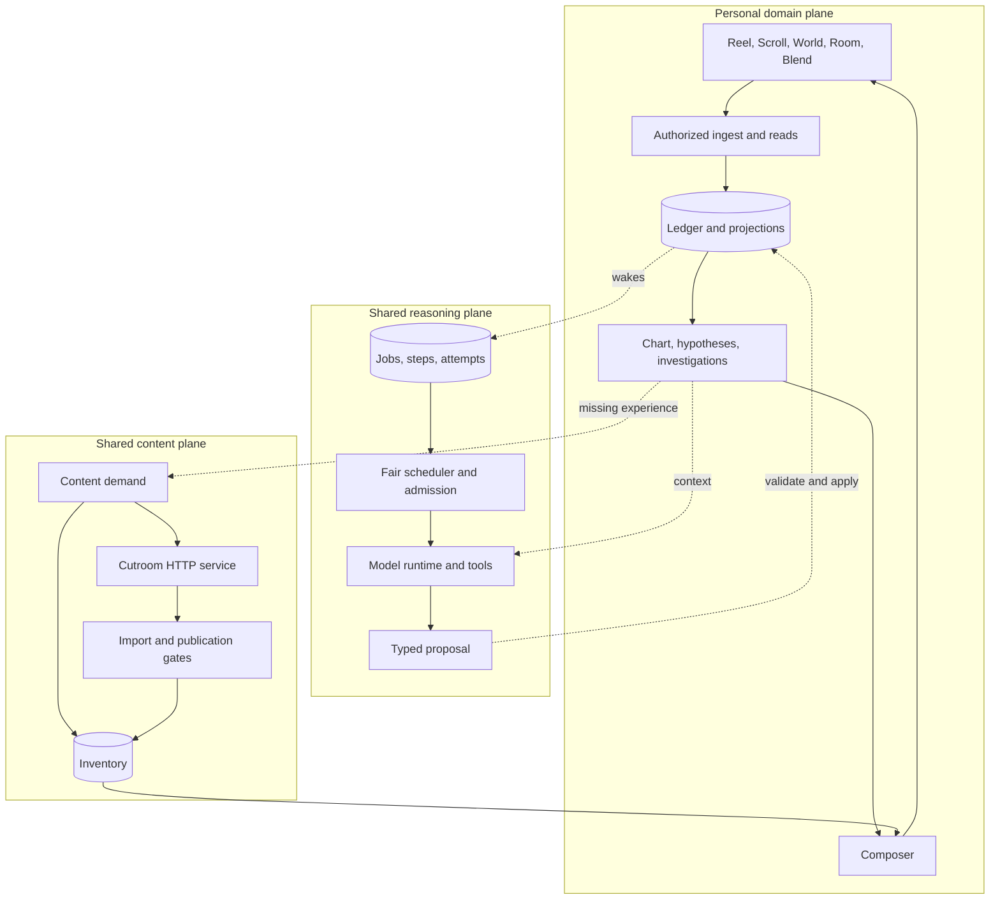

The essential design idea is not “lots of agents.” It is controlled separation:

- immediate serving is deterministic and fast;
- observations are stored with causal lineage;
- expensive interpretation happens later through bounded jobs;
- models propose; deterministic code validates and applies;
- generated content enters the same inventory only after import, evidence, and quality gates;
- private reasons stay separate from shared content;
- a behavior is evidence, never proof of a belief, identity, or learning state.

That conceptual shape is still sound. The current source implements a useful subset of the personal plane, much of the execution safety spine, and a surprisingly deep generation/import/publication chain. It does **not** implement the semantic interpretation, Steward, full Cartographer, Quartermaster planning, rooms/residents, or social plane.

---

## 4. Current system at one glance

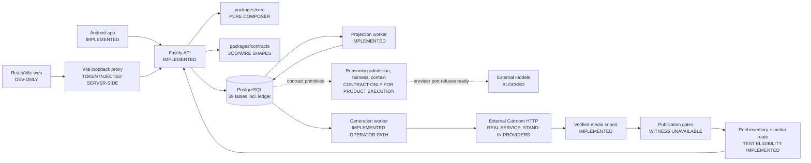

### Component map

| Component | What it owns now | Status | Important limitation |
| --- | --- | --- | --- |
| `packages/contracts` | Zod contracts for API-adjacent domain data, reasoning, Cutroom wire, generation, publication, inventory, worlds | **Implemented** | Not every browser response is generated directly from one shared schema; client/server drift has already caused a dead web surface. |
| `packages/core` | Pure Composer ranking and explanation rendering | **Implemented** | This is not the target multi-term utility engine. It uses exposure count, recency, unread state, and source coverage only. |
| `packages/db` | Pool/transactions, migrations, authentication, privacy, reasoning storage/admission/fairness/context, worlds, composer signal reads | **Implemented**, with some **contract-only** consumers | It carries far more capability than the currently wired product. Several rows describe legal future work rather than live behavior. |
| `apps/api` | Authentication, admission, idempotency, reads, response shaping, media serving | **Implemented** | No provider or Cutroom calls by design. Production web identity is unresolved. |
| `apps/worker` | Keep projection, maintenance, generation reconciliation/import, publication evaluation/minting, bounded certification tools | Mixed **implemented** and **contract-only** | There is no ordinary product reasoning loop; generation/publication is operator-oriented and blocked at real eligibility. |
| `apps/web` | Universe, Scroll reader, Keep, Trace revisit, systems, privacy panel | **Implemented, local/dev only** | It cannot build for production by default because the browser must never hold a bearer token and no server session carrier exists. |
| `apps/mobile` | Native Android reader, exposure, Keep, saved Trace revisit, privacy clear, device sign-out, worlds/system UI | **Implemented** for the current slice | No real magic-link enrollment UI, Reel playback, Ask, rooms, or social. |
| Cutroom | Separate run engine reached over HTTP | **Real boundary with stand-in providers** | ffmpeg is real; model/image/video/voice inputs are not real providers in the current proof. KnowScroll does not modify Cutroom. |
| Visual Witness | Vision-backed evidence/continuity inspection | **Blocked / absent** | `witness_alignment` returns unavailable, so a real generated Reel cannot become eligible. |

### A subtle monorepo detail

`apps/api`, `apps/worker`, `packages/core`, `packages/db`, and `packages/contracts` are logical source boundaries compiled from the root TypeScript project. Only `apps/web` currently has its own `package.json`. The server-side modules import each other through relative source paths. This keeps the early system simple, but it means ownership rules are enforced by review and tests rather than by package-manager dependency declarations.

---

## 5. Program design and dependency rules

### 5.1 Direction of dependency

The intended dependency direction is:

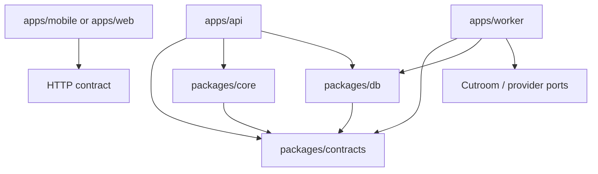

Important prohibitions:

- `packages/core` must not import database, HTTP, provider, or UI code.
- API request handlers do not call models or Cutroom.
- provider credentials live only in worker-side processes.
- Cutroom host filesystem paths are never mobile/browser URLs.
- models never directly mutate domain state.
- every authenticated mutation locks the universe before locking session/domain/job rows.

### 5.2 Why the universe lock is central

The universe row is the serialization point for privacy and authority.

[authenticateAndLock](../../packages/db/src/identity.ts#L71) does this:

1. Hash the supplied bearer token.
2. Read only the candidate `universe_id`.
3. Lock that universe row.
4. Re-read and lock the `device_session`.
5. Confirm it is unrevoked, unexpired, and has the same privacy epoch as the universe.
6. Only then allow the route body to read or write private state.

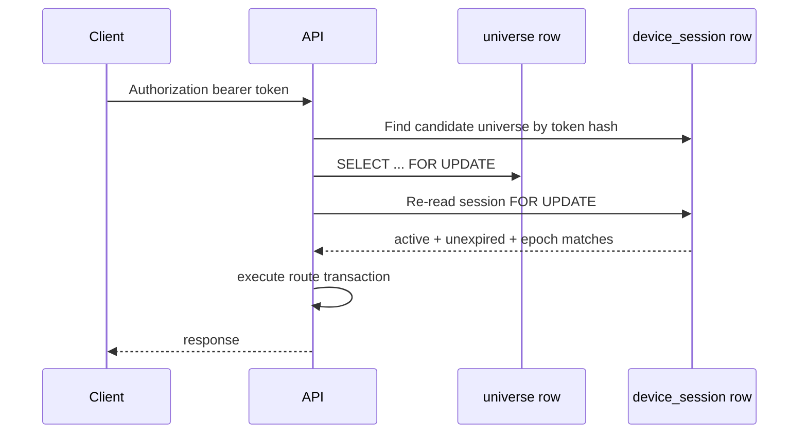

This solves a common race: a request may have looked authorized before waiting, while a reset or revocation commits during that wait. The second read under the universe lock prevents the stale request from continuing.

### 5.3 Transaction boundaries

The API wraps authenticated handlers in one PostgreSQL transaction ([app.ts](../../apps/api/src/app.ts#L115)). This means a feed decision and its `decision_signal` rows commit together, and an exposure event, `exposure` row, and world recomputation commit together.

The deterministic projection worker also uses a short transaction. External calls are explicitly outside database transactions. The generation worker persists exact request bytes and dispatch identity before HTTP, then records accepted/refused/unknown outcomes after the call. This avoids holding database locks across network time and preserves the uncertainty window instead of pretending delivery is exactly once.

---

## 6. Feature map

| Feature | Entry point | Core implementation | Persistent state | Current result |
| --- | --- | --- | --- | --- |
| Magic-link request | `POST /v1/auth/magic-link` | `registerSignInRoutes` → `requestMagicLink` → sender | `account`, `sign_in_token` | Real single-owner issuance; generic 202; delivery through sink or AgentMail |
| Magic-link confirmation | `GET /v1/auth/confirm` | `confirmSignInToken` | read-only `sign_in_token` | Safe for link-scanner prefetch; does not consume |
| Session creation | `POST /v1/auth/session` | `consumeSignInToken` | `device_session`, `sign_in_token`, `universe.account_id` | One-time token consumption; returns bearer session |
| Feed | `GET /v1/feed` | candidate query → signals → pure Composer | `decision`, `decision_signal` | Three-item deterministic slate; Scroll default; Reel opt-in |
| Exposure | `POST /v1/exposures` | decision check → causal event → world projection | `ledger`, `exposure`, `world*` | Visibility becomes recorded evidence and updates geography |
| Keep | `POST /v1/interactions` | exposure validation → event + job | `ledger`, `job` | Accepted asynchronously and idempotently |
| Keep projection | projection worker | `projectOne` | `trace`, `accounts`, `universe`, `job` | Saved Trace and kept-set update, exactly-once by constraints/idempotency |
| Trace revisit | `GET /v1/traces/:eventId` | `readTraceRevisit` | read-only causal join | Returns original verified snapshot or fails closed |
| Ask | `POST /v1/asks` | `recordExplicitAsk` | `ledger`, `explicit_ask` | `recorded_only`; no answer or provider job |
| Worlds/system | exposure hook; `GET /v1/worlds` | `projectWorldsForEncounter`, `readWorldSystem` | `world`, `world_member`, `world_system`, `world_system_member` | Worlds grouped by exact shared source URL; one system per universe |
| Pause/resume | privacy routes | `setRecordingPaused` | `universe`, `privacy_recording_receipt` | DB refuses new Ledger writes while paused |
| Export | `POST /v1/privacy/export` | `exportUniverse` | live reads + `privacy_export_receipt` | Partial personal export; known omission of world projection rows |
| Reset | `POST /v1/privacy/reset` | `resetPersonalUniverse` | erases personal event/projection families, increments epoch, revokes sessions | Stronger than Clear, but leaves stale world-system rows today |
| Reasoning safety spine | internal factories/tests | admission, fairness, contexts, attempts, settlement, retirement | 30+ reasoning tables | Deep primitives exist; ordinary product dispatch remains disabled |
| Generation | generation worker/CLI | brief → budget → attempt → Cutroom → import | generation tables + media store | Reconciliation/import implemented; upstream providers stand in |
| Publication | publication CLI/helpers | seven gates → availability → mint inventory asset | gate rows, `generated_reel`, `asset` | Test eligibility works; real eligibility blocked by Visual Witness |
| Web product | browser navigation | `ReaderStore` + React components | namespaced browser state; no token | Local/dev only; production identity carrier absent |
| Android product | `AppViewModel` + Compose | state machine + `ApiClient` + `StateStore` | private device state fenced by universe/epoch | Strong recovery for current Scroll slice; broader v1 absent |

---

## 7. Database architecture

### 7.1 Why PostgreSQL is more than storage here

The database is an active correctness boundary. Application code proposes transactions; PostgreSQL independently rejects states that violate identity, lineage, immutability, privacy, accounting, publication, and projection rules.

There are 58 product tables across the migration source, plus `schema_migrations`, for 59 total tables in a fully migrated database. The physical files are numbered through `0024` with deliberate gaps; there are 21 SQL files, not 24 files.

### 7.2 Schema families

#### Encounter, identity, and causal history

`account`, `universe`, `device_session`, `sign_in_token`, `asset`, `accounts`, `decision`, `exposure`, `ledger`, `job`, `trace`, `explicit_ask`, `history_clear_receipt`, `worker_heartbeat`

This is the shortest path through the product:

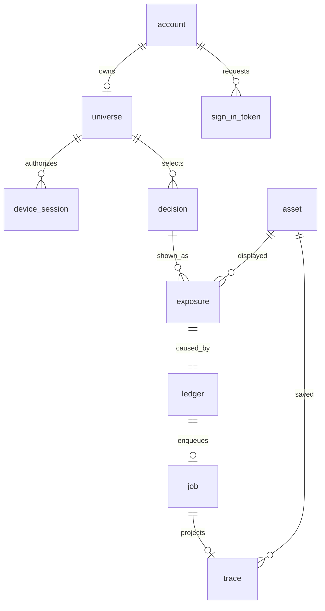

The Ledger row is the causal event. `exposure` is the structured fact about a visible item. A Keep is another Ledger row whose `causation_id` points to the exposure event. `job` makes deterministic projection asynchronous. `trace` is a rebuildable projection, not the source event.

#### Reasoning private graph and retained accounting

`reasoning_job`, `reasoning_context`, `reasoning_context_read`, `reasoning_context_payload`, `reasoning_context_dependency`, `reasoning_context_job_session`, `reasoning_context_job_ask`, `reasoning_step`, `reasoning_attempt`, `reasoning_accounting`, `reasoning_bucket`, `reasoning_permit`, `reasoning_reservation`, `reasoning_receipt`, `reasoning_settlement`, `reasoning_settlement_adjustment`

These tables separate private work from minimal retained cost/liability evidence. A privacy clear can remove context and private outputs while preserving enough accounting to reconcile a provider receipt that arrives late.

#### Fair scheduling

`reasoning_fairness_policy`, `reasoning_fairness_scheduler`, `reasoning_fairness_class`, `reasoning_fairness_universe`, `reasoning_fairness_ready`, `reasoning_fairness_attempt`, `reasoning_fairness_delta`

This family implements bounded class turns and per-universe turns, not a process-local queue. It is durable across restart and designed so unknown remote work cannot be accidentally refunded as though it were never sent.

#### Generated media supply

`cutroom_engine`, `generation_brief`, `generation_budget_grant`, `generation_job`, `cutroom_attempt`, `cutroom_event`, `media_object`, `generated_reel`, `publication_policy`, `publication_gate_result`

The key distinction is between:

- an editorial **brief**;
- permission and budget to attempt generation;
- one exact **Cutroom request** and its uncertain remote outcome;
- imported, content-addressed bytes;
- an evaluated generated Reel;
- a separately minted inventory `asset` that clients can receive.

#### Worlds and systems

`world_derivation_method`, `world`, `world_member`, `world_system`, `world_system_member`

Current geography is intentionally modest. A unique source URL becomes one shared world. A universe gets a system when it has exposures to Scrolls belonging to one or more worlds. This is evidence-backed grouping, not semantic clustering.

#### Privacy receipts

`privacy_recording_receipt`, `privacy_export_receipt`, `privacy_reset_receipt`

These provide exact retry identities and immutable evidence that an operation was applied. A receipt is not automatically proof that every intended downstream side effect occurred; the transaction and database constraints must make that correspondence true.

#### Composer evidence

`composer_policy`, `composer_explanation_template`, `decision_signal`

The selected policy and each candidate's inputs, score, rank, and explanation key are persisted so the ranking can be independently recomputed.

### 7.3 Examples of rules enforced in PostgreSQL

The following are not merely TypeScript promises:

- session ownership and privacy epoch are represented by composite foreign keys;
- Ledger client keys are unique within a universe;
- one `job` belongs to one causal event;
- immutable policies cannot be updated or deleted;
- reasoning receipts and settlements are append-only evidence;
- permits, reservations, attempts, and closure states have shape constraints;
- sign-in tokens are immutable except for one legal consumption transition;
- live generation spend is capped and stand-in outputs are confined to disposable databases;
- imported media objects and Cutroom events are immutable;
- publication policies and gate results are immutable;
- a Reel inventory asset must match its generated-Reel provenance;
- Composer rank/score/input shapes and policy versions are checked;
- world and system counts are recomputed by triggers when projection rows are written;
- pause is enforced by a `BEFORE INSERT` trigger on `ledger`.

This is a deliberate and mostly good choice: the database protects invariants even if a caller bypasses normal application helpers.

### 7.4 Important database weaknesses found in the current source

1. **Reset leaves world projection rows behind.** `resetPersonalUniverse` deletes `exposure`, `ledger`, `decision`, `trace`, and `job`, but does not delete or recompute `world_system` and `world_system_member` ([privacy.ts](../../packages/db/src/privacy.ts#L246)). `GET /v1/worlds` is a pure read of those projection rows ([worlds.ts](../../packages/db/src/worlds.ts#L190)). After reset, stale personal geography can still be returned.
2. **Export omits worlds.** `exportUniverse` does not select `world_system` or `world_system_member` ([privacy.ts](../../packages/db/src/privacy.ts#L151)). The export therefore does not contain every personal projection the application can display.
3. **World count triggers validate projection writes, not every source mutation.** Changing underlying membership or exposure rows later can leave already-written counts stale unless the projection is recomputed.
4. **A generated-Reel availability guard is update-focused.** A direct insertion path can potentially start a row in an eligible state before the normal update guard runs. Application helpers do not do this, but the schema claim is stronger than the schema currently proves.
5. **Composer constraints verify the recorded row shape, not the full calculation.** PostgreSQL checks ranks, scores, required inputs, and immutability, but it does not independently recompute the TypeScript score formula or coverage comparison.

---

## 8. Flow 1 — magic-link sign-in

### Purpose

Turn possession of the configured owner's mailbox into an ordinary `device_session`, without exposing whether an arbitrary submitted address is the owner and without letting email scanners consume the link.

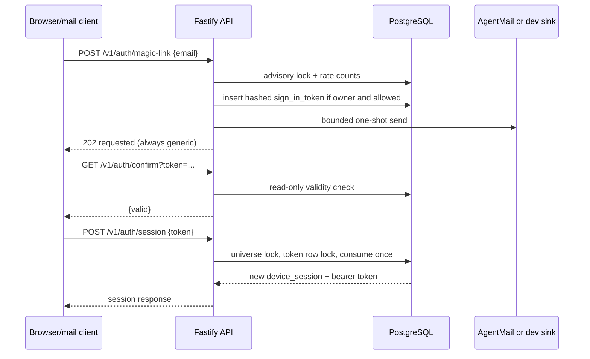

### Code path

1. [registerSignInRoutes](../../apps/api/src/sign-in-routes.ts#L33) parses the request and always returns a generic `202`.
2. [requestMagicLink](../../packages/db/src/sign-in.ts#L124) normalizes the address, takes an advisory lock, enforces account/fingerprint windows, creates random material on both owner and non-owner paths, and stores only the token hash.
3. The sender is either a development sink or bounded AgentMail client. Delivery failure is sanitized and not reflected differently to the caller.
4. [confirmSignInToken](../../packages/db/src/sign-in.ts#L180) is read-only. An automated link preview cannot consume the token.
5. [consumeSignInToken](../../packages/db/src/sign-in.ts#L223) discovers the candidate account/universe, locks the universe, locks the token row, rechecks expiry/consumption, optionally adopts the bootstrap universe, mints a new device session, and consumes the sign-in token exactly once.

### What is implemented and what is not

- **Implemented:** backend magic-link lifecycle, AgentMail delivery boundary, one-time consumption, ordinary session issuance.
- **Implemented evidence:** the repository records a real-mail disposable proof and replay refusal.
- **Not implemented on web:** a lawful production mechanism for carrying the resulting session without exposing its bearer token to browser JavaScript.
- **Not implemented on Android:** a complete owner-facing magic-link enrollment/consume experience.

---

## 9. Flow 2 — encounter, exposure, Keep, and deterministic projection

This is the most important implemented vertical slice.

```mermaid
sequenceDiagram
    participant UI as Mobile/Web
    participant API as apps/api
    participant Core as packages/core Composer
    participant DB as PostgreSQL
    participant W as projection worker

    UI->>API: GET /v1/feed
    API->>DB: authenticate + lock universe
    API->>DB: assets, account, signal snapshots, policy, templates
    API->>Core: rankSignalCandidates(...)
    Core-->>API: ranked slate + reasons + inputs
    API->>DB: decision + decision_signal rows
    API-->>UI: decisionId, epoch, items

    UI->>API: POST /v1/exposures
    API->>DB: validate decision and epoch
    API->>DB: ledger(exposure) + exposure
    API->>DB: recompute worlds/system in same transaction
    API-->>UI: exposureId + eventId

    UI->>API: POST /v1/interactions kind=keep
    API->>DB: validate exposure and exact asset
    API->>DB: ledger(keep) + job atomically
    API-->>UI: accepted

    W->>DB: claim pending job with SKIP LOCKED
    W->>DB: lock universe, recheck epoch and causation
    W->>DB: insert trace; update accounts + universe; complete job
    UI->>API: GET /v1/universe or GET /v1/events/:eventId
    API-->>UI: projected Trace/current revision
```

### Step-by-step

#### A. Feed selection is not exposure

`GET /v1/feed` starts at [app.ts](../../apps/api/src/app.ts#L215). It creates a decision and persists the exact slate, but it does not claim the person saw any item.

This distinction matters because network prefetch, a hidden tab, or a rendered-but-occluded component is not evidence of attention. Both clients send `POST /v1/exposures` only when their UI-specific visibility rule says the item was genuinely visible.

#### B. Exposure has causal lineage

The API confirms:

- the decision belongs to this universe;
- the decision privacy epoch matches the current session;
- the asset was actually in that decision;
- a reused client exposure ID has the same payload.

It then inserts both the generic `ledger` event and structured `exposure` row in one transaction ([app.ts](../../apps/api/src/app.ts#L250)). The exposure row points back to its decision and event.

#### C. Keep requires the exposure

`POST /v1/interactions` refuses an asset without the matching exposure. The Keep Ledger event points to the exposure event through causation. The event and projection `job` are inserted atomically, so there cannot be an accepted Keep with no durable work item.

#### D. Projection is short and deterministic

[projectOne](../../apps/worker/src/project.ts#L21) never calls a provider. It:

1. selects a pending job;
2. locks the universe;
3. re-reads the job and causal event;
4. discards the job if its privacy epoch is stale;
5. creates the `trace` idempotently;
6. updates `accounts.kept_asset_ids` and revisions only when the trace was newly inserted;
7. completes the job.

The worker's `SKIP LOCKED` query distributes independent universes, but correctness still comes from the universe lock, rechecks, unique keys, and one transaction—not from the lease/select query alone.

### Failure behavior

- Reusing an idempotency key with different content returns `409`.
- A stale decision/exposure returns `409` rather than attaching old evidence to a new privacy epoch.
- A projection failure increments attempts and retries; after five attempts it becomes failed.
- A privacy reset that wins the lock makes old work discard instead of recreating erased state.

---

## 10. Flow 3 — Composer ranking (`composer-signals-v2`)

### What the current Composer actually optimizes

It is a deterministic exposure-aware library selector, not the target architecture's full recommendation system.

The score is:

```text
(unread ? 100 : 0) - 10 × exposureCount + 1 × recencyDays
```

The policy then selects at most three items and at most two from the same source. The immutable row is registered by migration `0024`.

### Inputs

[loadComposerSignalCandidates](../../packages/db/src/composer-signals.ts#L36) reads:

- exposure count for this asset;
- most recent exposure time;
- whether it is unread;
- source URL/title;
- total exposures for the candidate's whole source in this universe;
- one database clock reading used for every candidate's recency.

It does **not** read inferred interests, dwell time, likes, embeddings, model output, or social behavior.

### Ordering

[rankSignalCandidates](../../packages/core/src/composer.ts#L149) applies:

1. exclude kept assets;
2. compute the score;
3. higher score first;
4. if tied, lower `sourceExposureCount` first;
5. if still tied, stable FNV-1a hash of `assetId`;
6. if the 32-bit hashes collide, raw `assetId`;
7. walk the ordered list and enforce `maxPerSource=2` until the three-item slate is full.

### Coverage guarantee, precisely stated

The v2 tie-break fixes a real starvation defect in v1: once a person records exposures, a source that has fewer recorded exposures gets priority among score-tied candidates. The test fixture showed every source by decision 3 against an asserted bound of 6.

The guarantee is conditional:

- the client must record exposure after the offer;
- candidates must remain eligible;
- the comparison must reach the tie-break;
- the library and slate policy must satisfy the diversity assumptions.

Repeatedly calling `GET /v1/feed` without recording an exposure does not advance `sourceExposureCount`; the same order may repeat forever. Therefore “every source is eventually offered” is not a theorem about feed reads alone. It is a property of the closed loop **offer → visible exposure → next decision**.

### Explainability

Each selected candidate gets a registered explanation key and a rendered reason based on stored inputs. `decision_signal` persists rank, score, inputs, and key. This is strong auditability: a later reader can recompute the explanation and ordering from recorded evidence.

---

## 11. Flow 4 — evidence-backed worlds and systems

The target architecture describes semantic planets, routes, systems, galaxies, rooms, hypotheses, and Cartographer proposals. The implementation is intentionally smaller.

### Current derivation

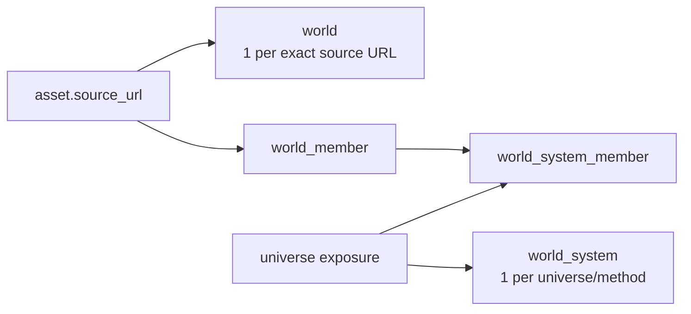

[deriveWorlds](../../packages/db/src/worlds.ts#L61) groups all assets by exact `source_url`. That gives a shared world catalog. No model, embedding, topic classifier, or inferred meaning is involved.

[deriveWorldSystemForUniverse](../../packages/db/src/worlds.ts#L129) includes a world in a universe's system when that universe has at least one exposure to one of the world's Scrolls.

[projectWorldsForEncounter](../../packages/db/src/worlds.ts#L185) runs inside `POST /v1/exposures`' transaction. This is why a system is current immediately after a recorded exposure rather than waiting for the background Keep worker.

`GET /v1/worlds` calls [readWorldSystem](../../packages/db/src/worlds.ts#L194), which is deliberately read-only and does not repair stale state.

### What this proves

- which exact sources exist in the library;
- which source-backed worlds this universe has actually encountered;
- counts of source Scrolls and distinct seen Scrolls;
- deterministic reconstruction from stored evidence.

### What it does not prove

- that two sources are semantically related;
- that a person understands or cares about the source;
- that a “system” has conceptual meaning;
- that target Cartographer evolution, place lineage, routes, moons, rooms, or galaxies exist.

The user interface may look cosmic, but the current geography is an evidence-backed source grouping. That is honest and useful as a first layer, as long as the visual metaphor is not mistaken for semantic intelligence.

---

## 12. Flow 5 — privacy lifecycle

### Pause and resume

`POST /v1/privacy/pause` and `/resume` use the same authenticated universe-lock transaction as other private routes. [setRecordingPaused](../../packages/db/src/privacy.ts#L101) updates `universe.recording_paused_at` and appends an immutable receipt.

Migration `0020` adds a `ledger_pause_guard`. While paused, inserts for exposure, Keep, and Ask events fail in PostgreSQL even if an application path forgets to check.

Important nuance: feed reads still create `decision` and `decision_signal` rows. Pause therefore means **stop recording new Ledger observations**, not “the system stores no new rows whatsoever.” Product copy should make this scope explicit.

### Export

`POST /v1/privacy/export` checks the expected epoch every time, re-reads current data, and returns:

- account email when one is bound;
- universe revision/epoch/pause status;
- Accounts kept set;
- decisions, Ledger, exposures, Traces, jobs;
- device-session metadata without token hashes;
- limited reasoning job/step/receipt/accounting facts.

It intentionally omits internal private reasoning context. It unintentionally or at least dangerously omits world-system projection rows that the UI can show.

### Clear history

`POST /v1/history/clear` advances the privacy epoch, rolls the caller's session forward, erases scoped event/projection/reasoning-private rows, clears Accounts, and preserves the shared library and the calling session.

### Reset

`POST /v1/privacy/reset` performs the same central erasure and epoch advance but revokes **every** session, including the caller. That makes reset stronger than Clear.

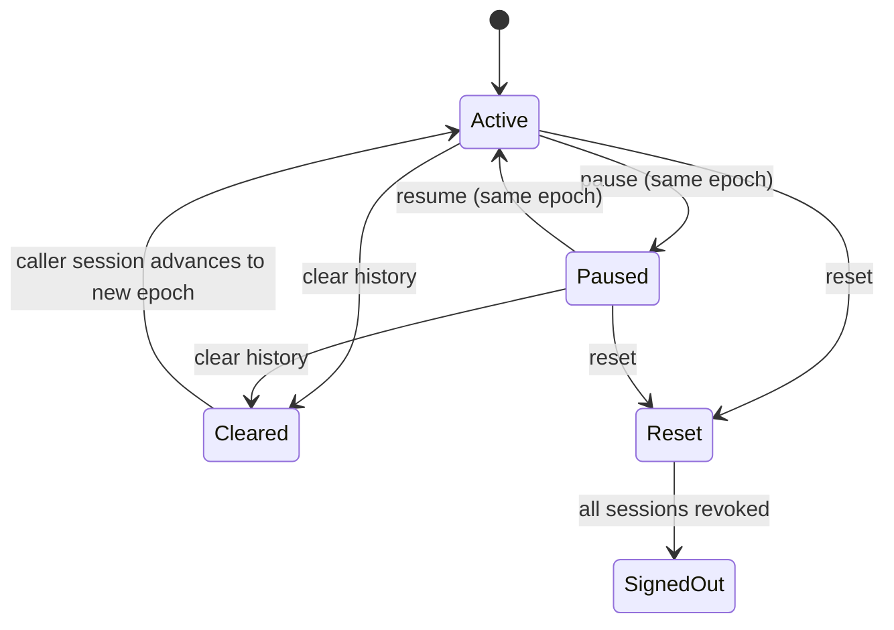

### Critical defect

Reset deletes exposures but leaves the already-projected `world_system` and membership rows. Because the read path does not recompute, the UI can still receive worlds derived from erased exposures. This is a v1 privacy blocker, not merely cleanup debt.

The correct repair should be decided explicitly:

- delete per-universe system projection rows during Clear/Reset;
- or recompute them after erasure and prove the result is empty;
- and include the world projection in export or explain why it is excluded.

The database receipt should also structurally prove the intended effect, not only the new epoch and session count.

---

## 13. Flow 6 — reasoning safety spine

This is the easiest subsystem to overstate because it has many migrations and tests.

### What exists

- durable reasoning jobs, steps, attempts, contexts, read sets, receipts, settlements, permits, and reservations;
- privacy-epoch fences and session-bound context compilation;
- exact input/policy hashes;
- atomic capacity reservation;
- durable class/universe fairness;
- single-use dispatch authorization;
- explicit unknown remote outcomes;
- cumulative settlement and late accounting;
- idle cancellation/deadline closure;
- seven-day private-graph retirement for safely terminal work;
- thirty-day retained accounting cleanup only after all duties close;
- maintenance process;
- a single-invocation transport seam;
- a separate MiniMax certification path using synthetic cases.

### What does not exist

[reasoningReadiness](../../apps/worker/src/providers/port.ts#L8) returns `adapter_not_implemented`. [invokeReasoningOnce](../../apps/worker/src/reasoning/invoke.ts#L27) has no ordinary worker wiring or real product transport. Explicit Ask remains `recorded_only` and does not authorize a job or answer.

```mermaid
flowchart LR
    Ask[Explicit Ask] --> Fact[(explicit_ask)]
    Fact -. separate authorization required .-> Job[(reasoning_job)]
    Job --> Context[sealed context]
    Context --> Fair[fair claim + reservations]
    Fair --> Permit[dispatch permit]
    Permit -. UNWIRED .-> Provider[real model adapter]
    Provider -. no product path .-> Proposal[typed proposal]
    Proposal -. absent validation/apply consumer .-> World[domain state]
```

### Why build so much before the provider loop?

The difficult problems are not “call a model” but:

- do not send work after a privacy reset;
- do not double-charge or double-dispatch after a lost response;
- preserve unknown liabilities;
- bind context to exact evidence and session authority;
- prevent one universe or job class from monopolizing shared capacity;
- retire private content without deleting accounting evidence needed for late reconciliation.

The repository has addressed these deeply. The architectural risk is the opposite: the safety spine may become expensive to evolve before a real semantic consumer demonstrates which abstractions are necessary. The next product reasoning slice should be narrow and end-to-end, not another layer of unused primitives.

---

## 14. Flow 7 — generated Reel through Cutroom

### Current chain

```mermaid
flowchart LR
    Brief[generation_brief] --> Budget[generation_budget_grant]
    Budget --> Job[generation_job]
    Job --> Attempt[cutroom_attempt\nexact bytes persisted]
    Attempt --> HTTP[Cutroom HTTP]
    HTTP --> Events[cutroom_event cursor]
    Events --> Result[finished result]
    Result --> Import[verify path + MP4 + ffprobe + hash]
    Import --> Media[(media_object)]
    Media --> Reel[generated_reel imported]
    Reel --> Gates[7 publication gates]
    Gates -->|test stand-in only| TestEligible[test_eligible]
    Gates -. witness unavailable .-> Blocked[real eligible blocked]
    TestEligible --> Mint[asset kind Reel]
    Mint --> Feed[GET /v1/feed?kinds=Scroll,Reel]
    Feed --> MediaRoute[GET/HEAD /v1/media/:sha256]
```

### Dispatch and uncertainty

The generation worker persists the canonical request body, request ID, digest, engine identity, and attempt before authorizing a send. It never holds a PostgreSQL transaction across the HTTP call.

If the submit response is lost, it records `unknown`, looks up the original request ID, and only resends the identical bytes under a bounded policy. A 404 is an observation, not proof the original request never arrived.

### Import

The import port verifies that:

- the result path is absolute and contained within the configured Cutroom artifact root;
- it is not a symlink, directory, missing, empty, or oversized;
- the file is a real MP4 with the required shape/duration/fast-start properties;
- the content hash and byte size are computed from the imported file;
- the final storage key belongs to KnowScroll's content-addressed media store;
- database lineage matches the completed attempt and provider mode.

This is a real host boundary, not a fake file-copy helper.

### Publication

The publication evaluator runs a versioned list of gates. Current gates cover lineage, sources, engine record, media conformance, truth label, repetition, and witness alignment.

`witness_alignment` is structurally unavailable because Visual Witness does not exist. Real availability therefore remains blocked. Stand-in output can reach `test_eligible` only in disposable test databases. Minting is a separate explicit step ([mint.ts](../../apps/worker/src/publication/mint.ts#L53)).

### Serving

An eligible/test-eligible generated Reel can be minted as an `asset` of kind `Reel`. Existing clients see Scrolls only. A client must explicitly request `kinds=Scroll,Reel`. Media is served from KnowScroll's own authenticated content-addressed route with `GET`, `HEAD`, and Range support—not from a Cutroom filesystem path.

### Where the chain is blocked

1. Cutroom's upstream model/image/video/voice/sensor providers are stand-ins.
2. Visual Witness is absent.
3. There is no owner-facing generation request flow.
4. Neither released UI plays Reels.
5. The current mint/publication sequence is operator-oriented rather than one joined autonomous supply loop.

The chain is much more implemented than old documents claim, but it is still not a real generated-Reel product journey.

---

## 15. Web architecture and ADR-0022

### The security rule

Browser JavaScript must never hold a bearer token.

[vite.config.ts](../../apps/web/vite.config.ts#L1) keeps the development token in the Node-side Vite process and injects the `Authorization` header only on the proxied request. The browser calls relative `/v1/*` URLs. [ApiClient](../../apps/web/src/api/client.ts#L1) has no token field or authorization-header code.

The Vite server:

- binds loopback only;
- refuses a non-loopback API target;
- injects the bearer token from server-side environment only;
- refuses a production build by default;
- has a test-only build escape hatch used to inspect the bundle for secret leakage.

### Browser program design

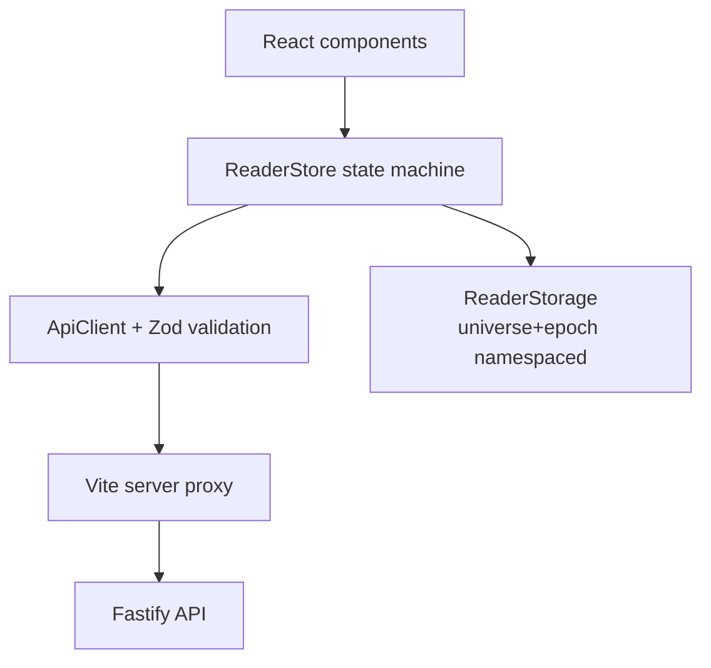

The state machine lives in a framework-independent class, not inside React components. React subscribes and renders. This makes retries, stale-response rejection, and privacy reconciliation testable without a browser.

The store owns:

- Universe/Scroll/Trace/System/Privacy screens;
- visible exposure identity;
- idempotent Keep identity;
- discovery retry/rest behavior;
- reading-position persistence;
- stale private-state purging on universe/epoch changes;
- pause/resume/export/reset state.

### Production block

A real web sign-in cannot simply put the returned session token in local storage, a cookie readable by JavaScript, or a React state object. The missing design is a server-carried session such as an HTTP-only secure cookie/BFF boundary that maps browser requests to a server-held KnowScroll device session while preserving CSRF, rotation, revocation, expiry, and recovery behavior.

Until that exists, the production build refusal is correct. Removing it or copying the token into browser code would violate the accepted boundary rather than complete identity.

### Drift risk

The web app validates responses with local Zod schemas. A prior merge added a server field while the hand-written client fixture and client schema remained mutually consistent but wrong, producing a dead surface while typecheck/unit/CI were green. Shared contract derivation and a real web journey in CI are critical, not optional cleanup.

---

## 16. Android architecture

### Layering

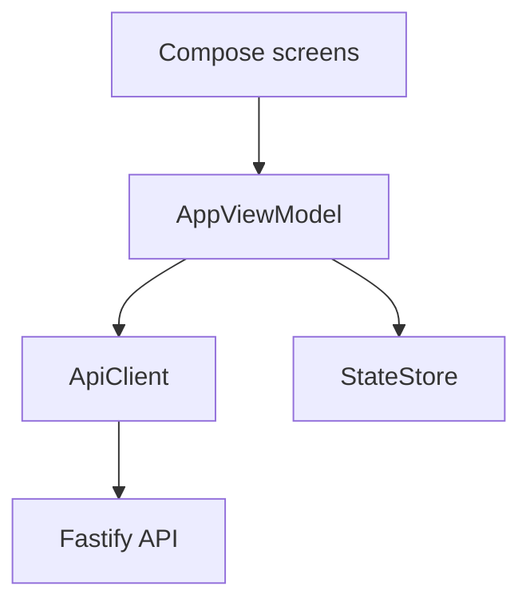

`AppViewModel` is the central state machine. It owns the current universe, screen, Scroll/revisit session, Keep state, system state, clear-history state, sign-out state, navigation version, and observed privacy scope.

### Recovery principles

- An exposure is recorded only after a resumed, visibly drawn Scroll.
- Ambiguous actions reuse the same saved request/client identity.
- A response is ignored if its navigation version, universe, epoch, or item identity is no longer current.
- A higher observed privacy epoch purges private cached state.
- An older server epoch fails closed.
- A restored ambiguous sign-out is resolved before the token is used for another request.
- Trace revisit is read-only and never records a new exposure.

This is careful mobile program design. The main limitation is scope: the state machine implements the current reader slice, not the full target interaction system of continuous horizontal branches, Ask results, Reel playback, rooms, or social travel.

---

## 17. Target architecture versus implemented architecture

| Target chapter/responsibility | Current match | Status and divergence |
| --- | --- | --- |
| Ledger/event architecture | Events, causation, epochs, decisions, exposures, idempotency, projection jobs exist | **Strong partial match.** No general outbox/subscription/high-water event fabric for all target modules. |
| Accounts | Kept asset IDs and revision exist | **Narrow implementation.** No episode model, decay, semantic accounts, or broader observation tallies. |
| Composer | Deterministic fast path, recorded receipt/signals, diversity, coverage | **Useful partial match.** No candidate families, bridge candidates, exploration policy, learned evaluation, or target multi-term utility. |
| Substrate | Asset source fields and causal source lineage | **Mostly target-only.** No shared concept/claim/relation graph. |
| Cartographer/Chart | Source-derived worlds/system and Traces | **Early stand-in for geography.** No proposal/apply lifecycle, semantic routes, splits/merges, galaxies, holes, ruins, or Chronicle. |
| Steward | Reasoning storage/context primitives | **Target-only product role.** No persistent coordinating identity or investigation loop. |
| Reasoning runtime | Admission, fairness, attempts, receipts, one-call seam, maintenance | **Deep contract-only spine.** No ordinary provider adapter, proposal consumer, or product result. |
| Ask | Literal source fact with exact exposure/session lineage | **Implemented source capture only.** Returns `recorded_only`; no answer. |
| Quartermaster | Generation briefs/budgets/jobs can be created by operator helpers | **No target planner.** No content-demand detection, reuse/adapt/join decision, or horizon planning. |
| Inventory/content plane | Scroll inventory, Reel minting, media objects, eligibility states | **Substantial partial match.** No shared-demand waiter/binding model or complete autonomous supply flow. |
| Cutroom adapter | Strict HTTP client, reconciliation, operator host, import | **Real boundary with stand-ins.** Real providers and live content-quality proof absent. |
| Gates/quality | Versioned publication gates, fingerprints, hard database rules | **Partial match.** Visual Witness unavailable; broader corpus/editorial monitoring absent. |
| Rooms/residents | None | **Target-only.** |
| Social/Blend/Projector | None | **Target-only.** |
| Mobile experience | Cosmos reader, Keep, Traces, sources, worlds/system, clear/sign-out | **Implemented slice.** No complete journeys B–H. |
| Desktop experience | Cosmos reader/system/privacy on React/Vite | **Local/dev implementation.** Production identity and deployment blocked. |

### Does the current system still match the original plan?

At the level that matters most, yes:

- immediate serving is deterministic;
- models do not sit in the swipe path;
- events retain causation;
- privacy epochs fence stale work;
- providers and Cutroom are worker-side boundaries;
- models cannot directly write domain state;
- inventory eligibility is separate from generation completion;
- behavior is not promoted into inferred belief.

At the product-capability level, only a minority of the plan exists. The current system is best described as:

> a robust evidence and execution foundation with a polished sourced-reader slice, early evidence-backed geography, a contract-heavy reasoning spine, and a mostly implemented but honestly blocked generated-media supply chain.

It is not yet the emergent semantic universe described by the target documents.

---

## 18. Where the architecture is strongest

### 18.1 Causal and privacy lineage

Decisions, exposures, Keep events, jobs, Traces, contexts, and provider attempts carry explicit ownership and epoch lineage. This makes “why does this row exist?” answerable and lets reset invalidate old work without guessing.

### 18.2 Deterministic/model separation

The design consistently keeps auth, budgets, ranking, state transitions, publication eligibility, and proposal application in code/database control. The model boundary is treated as uncertain external execution rather than magical trusted computation.

### 18.3 Failure honesty

Unknown remote outcomes are first-class. The system does not translate transport loss into “not sent” or silently retry a possibly-paid call with fresh identity. This is unusually good.

### 18.4 Database-backed invariants

Critical policies survive a buggy caller. Immutable evidence, privacy pause, provider-mode constraints, spend caps, lineage, and projection counts have database enforcement rather than only comments.

### 18.5 Client recovery design

Both UI clients preserve request identities, validate response shapes, and discard stale responses. Android's universe/epoch fencing and cold-start ordering are particularly careful.

### 18.6 Honest integration boundaries

Cutroom stays a separate service. KnowScroll imports bytes into its own storage, never exposes host paths, and does not call a finished remote run “published.” That separation is exactly right.

---

## 19. Where the architecture will strain

### 19.1 The database is carrying the future product before the product exists

Reasoning has many tables, constraints, and lifecycle paths without one ordinary end-to-end semantic result. This protects future execution, but it raises change cost. A narrow live reasoning slice may reveal that some abstractions were optimized too early.

### 19.2 One API file is becoming the orchestration hub

`apps/api/src/app.ts` contains authentication wrappers, feed assembly, ranking orchestration, exposure admission, world projection calls, Keep admission, Ask, events, privacy routes, and media route registration. The behavior is readable today, but continued growth will make transactional ownership and contract review harder. Split by feature while keeping one shared authenticated transaction helper.

### 19.3 Logical packages are not mechanically isolated

The pure-core rule is documented and respected, but server modules use direct relative source imports. Dependency boundaries could drift without an import-graph check or actual package manifests.

### 19.4 Projection freshness is not uniform

Worlds update synchronously on exposure; Traces update asynchronously on Keep; privacy deletion manually enumerates tables; reads do not repair projections. This mixture is valid, but every projection needs an explicit lifecycle matrix: creation trigger, rebuild source, update event, erase rule, export rule, and read consistency.

### 19.5 Client/server contracts can drift

The dead-web incident proved unit fixtures can agree with a stale client schema while both disagree with the server. Shared schemas or generated contract tests should replace hand-copied shapes.

### 19.6 The current system view may over-communicate meaning

Exact source grouping is a safe derivation, but “planet/system” language can feel semantically richer than the data. The UI must preserve the explanation that geography is derived from recorded sources, not inferred mastery or affinity.

### 19.7 Current operational state can be ambiguous

The state command can read one configured database while detecting an API process that points at another. Runtime inspection should bind the listening process, database name, migration head, source revision, and worker heartbeat into one receipt.

---

## 20. Decisions this review would change or tighten

1. **Keep ADR-0022's no-token rule, but finish its server-session architecture before more web product work.** The boundary is correct; leaving the production carrier unspecified creates a permanent local-demo trap.
2. **Treat world projection erase/export as part of the projection contract, not a privacy-route detail.** Every personal projection should declare how it is rebuilt, erased, and exported.
3. **Add the Composer coverage condition to product language.** Coverage advances on recorded exposure, not on feed generation.
4. **Make the database prove real-eligibility entry on both INSERT and UPDATE.** Application discipline is insufficient for a rule advertised as database-enforced.
5. **Require one thin end-to-end reasoning result before broadening the runtime spine.** For example: one authorized Ask, one sealed context, one bounded real/fake provider call, one validated evidence-linked proposal, one visible result, and full reset/recovery proof.
6. **Derive browser response schemas and fixtures from shared contracts.** The cost is small compared with another green-CI dead surface.
7. **Run a real web journey in CI.** Unit tests and typechecking cannot prove the app boots against the API contract.
8. **Do not call source-derived systems “semantic worlds” without a qualifier.** The implementation is evidence-backed geography, not semantic clustering.

---

## 21. Critical path to full v1

The accepted release is all journeys A–I on mobile and desktop with real video integration and owner acceptance. The shortest credible dependency order is:

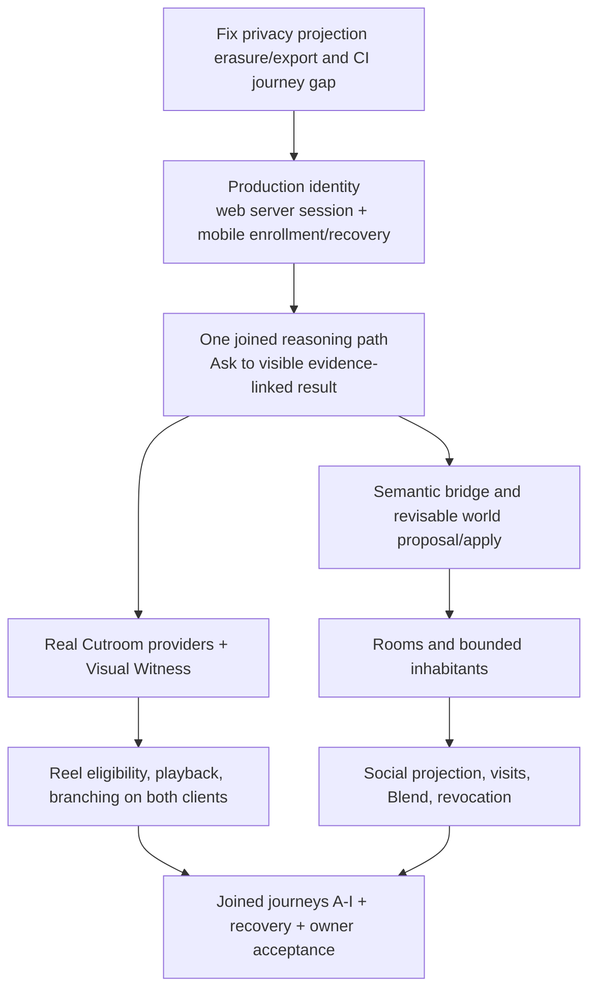

### Immediate blockers

- owner database remains behind current migration source and must be rolled forward through an evidence-backed operational plan;
- privacy reset/export has a world-projection correctness gap;
- CI does not run the web journey;
- timing-sensitive tests have produced repeated flakes;
- production web identity has no token-free browser carrier;
- ordinary reasoning provider execution is not wired;
- Cutroom real providers and Visual Witness are upstream blockers;
- rooms/inhabitants and social are not started;
- neither client implements the full Reel/Scroll/branch/Ask/room/social experience.

---

## 22. Tests and evidence: what each layer proves

| Evidence | What it proves | What it does not prove |
| --- | --- | --- |
| Typecheck | Static TypeScript/Kotlin shape consistency | Runtime integration or UX |
| Unit/contract tests | Pure policies, parsers, state machines, individual SQL constraints | Real process boundaries or provider behavior |
| PostgreSQL integration tests | Actual transactions, locks, triggers, constraints | A deployed owner database or complete UI |
| Isolated journeys | Joined API/worker/database behavior in disposable environments | Owner runtime or live providers |
| Web Playwright | Browser/API/worker journey, layout and accessibility when included | Android behavior or production auth |
| Android emulator journey | Real Compose lifecycle, process death/rotation, API behavior | Desktop or real media quality |
| Cutroom stand-in journey | HTTP protocol, restart/reconciliation, import | Real upstream model/video execution |
| Live provider proof | One real external call and returned evidence | Product usefulness or full journey |
| Owner acceptance | Experience meets the intended product judgment | Exhaustive correctness |

### Useful commands

```sh
pnpm typecheck
pnpm test
pnpm verify:journey
pnpm --filter web typecheck
pnpm --filter web test
pnpm --filter web e2e
pnpm state
```

Run destructive privacy verification only against disposable universes. A passing build is never a substitute for a joined journey.

---

## 23. Guided IDE reading sequence

### Session 1 — understand the target and the real boundary

1. Open [target 00 README](../architecture/target/00-README.md#L26). Focus on the six ideas.
2. Open [target overview](../architecture/target/01-OVERVIEW.md#L17). Compare the six responsibilities with the component table in this guide.
3. Open [apps/api/src/app.ts](../../apps/api/src/app.ts#L92). Scan route registration from top to bottom; do not inspect SQL details yet.
4. Open [packages/db/src/identity.ts](../../packages/db/src/identity.ts#L71). Trace the exact lock order.

Stop when you can explain why the universe row must be locked before the session row.

### Session 2 — trace one encounter

1. Start at [GET `/v1/feed`](../../apps/api/src/app.ts#L215).
2. Move to [signal loading](../../packages/db/src/composer-signals.ts#L36).
3. Move to [pure ranking](../../packages/core/src/composer.ts#L149).
4. Return to [decision persistence](../../apps/api/src/app.ts#L235).
5. Continue through [POST `/v1/exposures`](../../apps/api/src/app.ts#L250).
6. Continue through [POST `/v1/interactions`](../../apps/api/src/app.ts#L283).
7. Finish at [projectOne](../../apps/worker/src/project.ts#L21).

Stop when you can identify the decision ID, exposure ID, exposure event ID, Keep event ID, job ID, and Trace identity.

### Session 3 — understand privacy and projection

1. Read [clearScrollHistory](../../packages/db/src/privacy.ts#L27).
2. Read [pause/resume](../../packages/db/src/privacy.ts#L96).
3. Read [exportUniverse](../../packages/db/src/privacy.ts#L151).
4. Read [resetPersonalUniverse](../../packages/db/src/privacy.ts#L246).
5. Read [world projection](../../packages/db/src/worlds.ts#L117).
6. Compare the deletion list with `world_system` and `world_system_member`.

Stop when you can explain exactly why stale worlds survive reset today.

### Session 4 — understand reasoning without mistaking it for a product

1. Open [provider port](../../apps/worker/src/providers/port.ts#L1) and observe readiness is false.
2. Open [reasoning admission](../../packages/db/src/reasoning-admission.ts#L15) to understand claim/reserve/authorize/recover.
3. Open [reasoning context](../../packages/db/src/reasoning-context.ts#L247) to see evidence sealing.
4. Open [single invocation seam](../../apps/worker/src/reasoning/invoke.ts#L33).
5. Open [maintenance](../../apps/worker/src/reasoning/maintenance-main.ts#L17).

Stop when you can distinguish durable primitives from an actually wired provider loop.

### Session 5 — trace generated media

1. Start at [generation worker](../../apps/worker/src/generation/worker.ts#L1).
2. Follow the Cutroom HTTP client and storage transition helpers.
3. Read the import tests around real MP4 containment, hashing, probing, and idempotency.
4. Open [publication evaluation](../../apps/worker/src/publication/evaluate.ts#L172).
5. Find `witness_alignment` and see why it returns unavailable.
6. Open [mintReelAsset](../../apps/worker/src/publication/mint.ts#L53).
7. Return to [feedCandidates](../../apps/api/src/app.ts#L59) and the media route.

Stop when you can name the exact boundary between “Cutroom finished,” “KnowScroll imported,” “publication gates passed,” “inventory asset minted,” and “client can play.”

### Session 6 — compare clients

1. Web: [vite.config.ts](../../apps/web/vite.config.ts#L1), [ApiClient](../../apps/web/src/api/client.ts#L1), then `ReaderStore`.
2. Android: `ApiClient.kt`, `StateStore.kt`, then [AppViewModel.kt](../../apps/mobile/app/src/main/kotlin/com/knowscroll/mobile/ui/AppViewModel.kt#L1).
3. Compare how both preserve retry identity and purge stale private state.
4. Note where web has privacy controls Android does not, and where Android has device sign-out not present in web.

---

## 24. File-by-file reference

| File | Role | Easy misunderstanding |
| --- | --- | --- |
| `docs/architecture/target/00-README.md` | Index to intended complete engine | It is explicitly target design, not runtime truth. |
| `docs/architecture/README.md` | Current architecture boundary | Some status prose lags later implementation; verify code. |
| `apps/api/src/app.ts` | Main HTTP composition root | A successful route does not imply either UI exposes it. |
| `packages/db/src/identity.ts` | Session authority and lock ordering | The initial token lookup is not durable authorization; the re-read after universe lock is. |
| `packages/core/src/composer.ts` | Pure ranking | It is not the full target Composer. |
| `packages/db/src/composer-signals.ts` | Bounded signal snapshot | Coverage uses recorded exposures, not feed decisions. |
| `apps/worker/src/project.ts` | Keep projection | This worker is not the reasoning runtime. |
| `packages/db/src/worlds.ts` | Source-backed geography | “World” currently means a source URL group. |
| `packages/db/src/privacy.ts` | Clear/pause/export/reset | Current deletion/export lists omit world projections. |
| `packages/db/src/reasoning-*` | Execution correctness primitives | A rich schema does not mean product reasoning is active. |
| `apps/worker/src/providers/port.ts` | Product provider seam | Readiness deliberately remains false. |
| `apps/worker/src/generation/*` | Cutroom job/reconciliation/import | Real service integration still uses stand-in providers. |
| `apps/worker/src/publication/*` | Gate evaluation and inventory minting | `test_eligible` is not real eligibility. |
| `apps/web/vite.config.ts` | Token-hiding local proxy | This is not a production auth solution. |
| `apps/web/src/state/readerStore.ts` | Web state machine | React components are views; most behavioral logic is here. |
| `apps/mobile/.../AppViewModel.kt` | Android state machine | UI recovery depends on navigation version + universe + epoch checks. |
| `packages/db/migrations/*.sql` | Structural truth and database enforcement | Migration files in source do not prove a named database applied them. |

---

## 25. Glossary

- **Account:** The single-owner sign-in identity. It can own a universe.
- **Universe:** The private authority and serialization scope for one person's state.
- **Privacy epoch:** A monotonically increasing generation number. Old sessions/jobs/data references cannot act in a new epoch.
- **Ledger:** Ordered causal domain events such as exposure, Keep, and Ask. It records what happened, not why the person cared.
- **Decision:** One persisted Composer slate. It is not evidence of visibility.
- **Exposure:** Evidence that a selected item became genuinely visible according to the client contract.
- **Keep:** An explicit action causally linked to an exposure.
- **Trace/Relic:** A saved, rebuildable projection of a Keep that lets the person revisit the verified source snapshot.
- **Accounts:** Recomputable policy inputs. Currently a kept-asset set and revision, not a psychological model.
- **Composer:** Pure deterministic policy selecting eligible Reel/Scroll encounters.
- **Projection:** Derived state that can be recomputed from authoritative events or evidence rows.
- **Universe lock:** `SELECT ... FOR UPDATE` on the universe row, used to serialize privacy and authority-sensitive work.
- **Privacy receipt:** Immutable record of an idempotent privacy operation.
- **Context:** Canonical, hashed, typed evidence supplied to a reasoning job.
- **Attempt:** One potentially paid model request identity.
- **Permit/reservation:** Durable authorization and capacity/budget held before dispatch.
- **Unknown outcome:** A remote call may have happened, but the local process cannot prove its result.
- **Settlement:** Accounting interpretation of durable provider evidence.
- **World:** In current code, a deterministic group keyed by exact source URL.
- **System:** The collection of source-backed worlds a universe has exposed evidence for.
- **Steward:** Target persistent coordinating intelligence for a universe; not implemented as a product actor.
- **Cartographer:** Target role that proposes semantic world structure; current source grouping is not it.
- **Quartermaster:** Target role that identifies missing content and chooses reuse/adapt/join/generate; not implemented.
- **Cutroom:** Separate HTTP video-generation service. KnowScroll integrates but does not own its implementation.
- **Visual Witness:** Required vision/evidence inspection step for real Reel publication; absent today.
- **Eligibility:** Permission for an imported asset to enter inventory. It is separate from generation completion.
- **Stand-in:** A synthetic upstream component used to verify integration mechanics without claiming real provider output.

---

## 26. Target chapter-by-chapter implementation map

This table connects every chapter in `docs/architecture/target` to current source. It is useful when a target term appears in a design discussion and you need to know whether there is a real consumer behind it.

| Target chapter | Intended subject | Current implementation status |
| --- | --- | --- |
| `00-README` | Whole-engine index and vocabulary | **Adopted direction.** Still explicitly a target index. |
| `01-OVERVIEW` | Six responsibilities and three planes | **Architectural shape retained.** Personal plane is partial; reasoning and supply planes have foundations; social/rooms absent. |
| `02-RESEARCH-FINDINGS` | External patterns and rejected alternatives | **Decision background only.** It informs ADRs but is not executable evidence. |
| `03-ARCHITECTURE` | Processes, subscribers, wake rules, call graph | **Partially realized.** API, projection worker, maintenance, and generation worker exist. Steward/Cartographer/Quartermaster/Projector subscriber graph does not. |
| `04-EVENT-ARCHITECTURE` | Ledger envelope, topics, cursors, dirty scopes, proposals | **Bootstrap subset.** Ordered Ledger/causation/epochs exist; a generic subscription/cursor/dirty-scope fabric does not power product modules. |
| `05-DATA-STATE-MODEL` | Eleven logical stores | **Some stores implemented deeply.** Ledger, Accounts subset, execution spine, and media supply exist; Substrate, hypotheses, rooms, Steward memory, and social do not. |
| `06-USER-WORLD-MODEL` | Evidence, episodes, accounts, routes, hypotheses | **Very narrow.** Exposure/Keep evidence and a kept set exist. Episodes, semantic credit, hypotheses, and route/state-line model do not. |
| `07-UNIVERSE-EVOLUTION` | Planets, systems, moons, galaxies, holes, lineage | **Source-backed first layer only.** Exact-source worlds and one system exist; semantic evolution/state machine does not. |
| `08-RECOMMENDATION` | Candidate families and transparent multi-term utility | **Small real Composer.** Exposure/recency/source coverage and diversity exist; candidate families, bridge supply, exploration, and richer utility do not. |
| `09-INTERDIMENSIONAL-CABLE` | Global discovery surface and branching | **Reader/feed fragment only.** Deliberate next and rest exist; continuous branch stack/channel system does not. |
| `10-CORE-AGENT` | Persistent Steward and investigations | **Target-only.** Context/admission primitives are prerequisites, not a Steward. |
| `11-IDEA-ROOMS` | Rooms, residents, commitments, artifacts | **Not started.** |
| `12-PERSISTENT-AGENTS` | Bounded resident/visitor agent lifecycle | **Not started as product.** General job lifecycle ideas exist but no inhabitants. |
| `13-SOCIAL-BLEND` | Visits, projections, Blend, revocation | **Not started.** Session revocation is not social revocation. |
| `14-QUALITY-ANTI-SLOP` | Hard gates, soft ranking, fingerprints, monitors | **Partial.** Publication hard gates and two fingerprints exist; wider judge/corpus/admin loop does not. |
| `15-VIDEO-SDK-INTEGRATION` | Quartermaster-to-Cutroom lifecycle | **Lower half implemented.** Strict HTTP, reconciliation, import, gates, minting, serving exist; demand horizons and real providers do not. |
| `16-FEEDBACK-LOOPS` | Self-confirmation and supply/social/model-collapse dampers | **Mostly design safeguards.** Some are embodied in source/exposure discipline; no complete evaluation system measures the loops. |
| `17-SCALING-COST` | Capacity, price assumptions, growth path | **Admission/accounting primitives implemented.** Scale scenarios remain illustrative and unproved. |
| `18-IMPLEMENTATION-PHASES` | E0–E6 sequencing | **E0 partially deep; E1 partial; E4 lower chain partial.** E2/E3/E5/E6 remain largely open. |
| `19-OPEN-QUESTIONS` | Settled and experimental decisions | **Historical review guide.** Later ADRs supersede some open points. |
| `20-WORKED-TRACES` | Fourteen target failure/user journeys | **A few mechanics covered.** Privacy reset and unknown dispatch have primitives; most user-level traces are not product journeys. |
| `21-REASONING-RUNTIME` | Durable steps and provider boundary | **Strong contract implementation, unwired product execution.** |
| `22-GLOBAL-EXECUTION` | Fair scheduling, admission, receipts, observability | **Strong SQL foundation.** No active fleet/ordinary provider traffic proves the full plane. |
| `23-CONTENT-DEMAND-AND-INVENTORY` | Demand, reuse/adapt/join/generate, shared waiters | **Inventory/generation artifacts exist.** Demand planning, reuse equivalence, bindings, and multi-waiter lifecycle are absent. |
| `24-REVIEW-GUIDE` | Founder decision path | **Historical architecture approval aid.** Current v1 scope and ADRs now control delivery. |
| `25-JOURNEY-AND-DATA-FLOWS` | Target sequence and logical ER views | **Reference comparison.** Several names map to current tables, but the document remains a proposed complete engine, not a runtime trace. |

## 27. Bottom line

KnowScroll's current architecture still follows the strongest parts of the adopted target:

- deterministic serving;
- causal evidence;
- privacy-fenced authority;
- bounded external execution;
- models as proposers, not state owners;
- separate content generation and publication;
- no inference of inner state from behavior alone.

The implementation is also much deeper than “a feed prototype”: it has serious session/epoch locking, deterministic projection, audited ranking receipts, source-backed geography, a rich reasoning execution safety spine, and a real Cutroom reconciliation/import boundary.

But it is not yet the target product. The semantic bridge, Steward, Cartographer proposal loop, content-demand planner, rooms, residents, social projection, real generated media, Reel playback, production web identity, and journeys B–H remain absent or blocked. Before adding more architecture, fix the privacy projection gap, make web integration unavoidable in CI, complete production identity, and prove one narrow reasoning result end to end.

That sequence preserves the original architecture's intent while forcing the next work to create visible product truth rather than additional unused machinery.
