# FlowWalk: KnowScroll architecture and codebase guide

> **Source reviewed:** `df8ff2fb4fe1ef66e5283ece3b45b192dc776e97` (`origin/main`) on 2026-09-27.
>
> **Runtime observed:** no listener on `127.0.0.1:4310` or `127.0.0.1:4392`; `pnpm state` could not reach PostgreSQL on `127.0.0.1:55432`. This is only a dated observation, not a guarantee about another machine or a later process.
>
> **Owner database:** the last repository receipt still says migrations `0001`–`0009`. Source now contains 37 ordered migration files through `0040`. This review did not connect to, migrate, or modify the owner database.
>
> **Honesty rule:** target documents explain the intended product. Code and migrations explain what can execute. Tests and receipts explain what was proved in a named environment. None alone proves production deployment or owner acceptance.

This guide starts with the architecture KnowScroll planned in [the target index](../architecture/target/00-README.md), then follows the implementation that now exists. The language is simple, but the links and diagrams go down to real routes, functions, locks, tables, and failure boundaries.

---

## 1. The shortest accurate explanation

KnowScroll is a personal discovery system. A person encounters a **Reel** or **Scroll**, and the system records defensible facts: what was offered, what became visible, and what the person explicitly kept, asked, followed, doubted, or set aside. It does not turn those acts into claims about the person's identity or beliefs.

The central design rule is:

> A model may suggest text or a relationship. Deterministic code and PostgreSQL decide whether it may become product state.

The implementation now has four substantial paths:

1. a fast encounter path: feed → visible exposure → Keep/Ask/branch;
2. a deterministic personal-world path: attention → semantic Places → foundations, Rooms, Relics, and return changes;
3. a bounded reasoning path: authorized Ask answers and background connection inquiries through the worker;
4. a shared supply path: record content demand → reuse/join/fund → write and validate a Scroll.

Generated video has a deep lower-half integration, but it is still blocked before real release eligibility. Social/Blend is deliberately deferred.

---

## 2. Target architecture versus implementation

The target architecture describes three logical planes. They are responsibilities, not necessarily separate services.

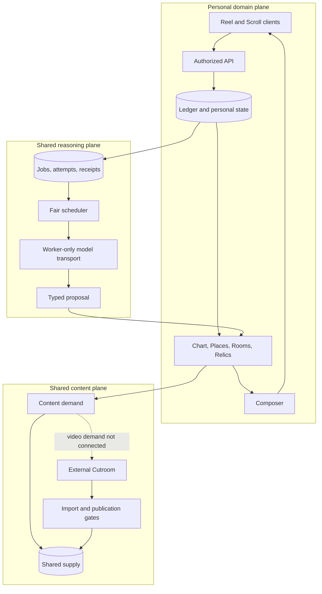

The big change since the first guide is that the semantic middle is no longer merely planned. Concepts, claims, corrections, admitted bridges, attention accounts, hypotheses, Places, foundation Stars, Ask answers, background inquiries, Rooms, Relics, and Scroll demand now have implemented code and database state.

The whole target is still not implemented. A persistent Steward, rich long-running inhabitants, predictions, full Chronicle, galaxy/hole/ruin evolution, social projection and Blend, video demand through the Quartermaster, real Cutroom providers, Visual Witness, production deployment, and complete desktop parity remain absent, deferred, or blocked.

### Status words

| Status | Meaning |
| --- | --- |
| **Implemented** | Real source path plus direct tests or journey evidence exists. |
| **Implemented, conditional** | The path runs only when configuration, consent, or a worker transport is enabled. |
| **Stand-in** | The boundary is real but an upstream provider or input is synthetic. |
| **Contract-only** | Tables, types, or primitives exist without a complete product consumer. |
| **Blocked** | Code deliberately cannot advance without an external dependency or owner input. |
| **Target-only** | Described in target architecture, with no present implementation. |

---

## 3. Current system architecture

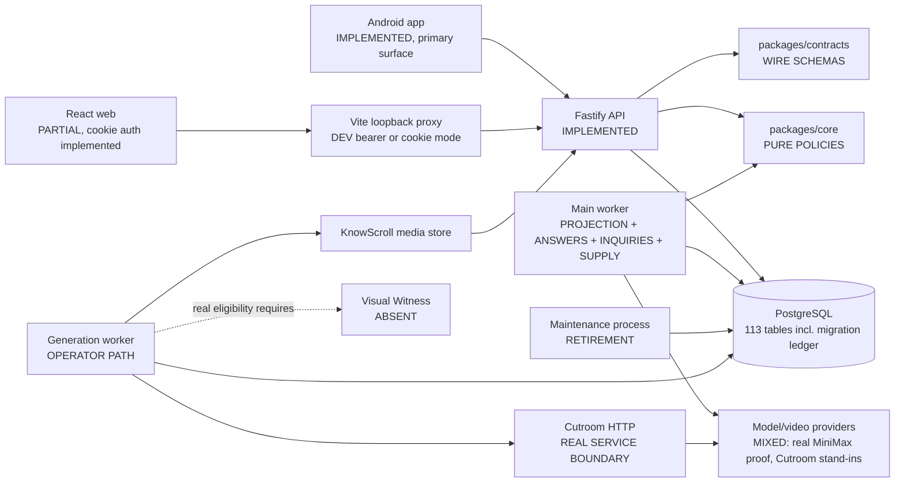

### Component ownership

| Component | What it owns now | Current truth |
| --- | --- | --- |
| `packages/contracts` | Wire shapes for bootstrap, semantic branches, Composer explanations, Atlas, away state, inquiries, Rooms, Relics, inventory, reasoning, generation and Cutroom | **Implemented.** Clients still have local parsers, so drift tests remain necessary. |
| `packages/core` | Pure policies: Composer v2/v3/v4, bridge validator, attention/hypotheses, Cartographer, Chronicle wording, answer/inquiry validation, Room keeper, Relic state, Scroll checks, Quartermaster | **Implemented.** It imports no DB, HTTP, provider, or UI code. |
| `packages/db` | Transactions, authority, migrations, encounter ledger, privacy, semantic state, reasoning, worlds, Atlas, Rooms, Relics, return and inventory | **Implemented.** It is the largest correctness boundary. |
| `apps/api` | HTTP admission, authentication, idempotency, same-transaction writes, response shaping, CSRF and media authorization | **Implemented.** It never calls a model or Cutroom. |
| `apps/worker` | Keep projection, Ask answers, inquiries, correction catch-up, Scroll supply, reasoning maintenance, Cutroom generation/import and publication tools | **Implemented in distinct loops.** Some loops require configured transports. |
| `apps/web` | Cookie sign-in, Scroll reader, Keep, privacy/account deletion, system view and “What led here” | **Implemented but behind Android.** Production hosting and feature parity are unfinished. |
| `apps/mobile` | Sign-in, private session vault, Cable, Scroll/Reel readers, Ask, branches, Atlas/Places, return, Rooms, Relics, privacy/account controls | **Implemented for the current personal slice.** Release inputs and physical-device acceptance remain. |
| Cutroom | Separate HTTP video engine | **Real boundary with stand-in upstream providers in recorded proof.** |

### Dependency direction

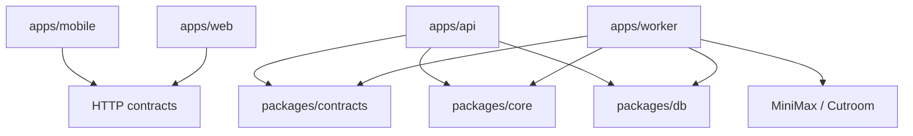

The useful boundary is what each area is allowed to know:

- `core` receives facts and returns decisions. It cannot read PostgreSQL or call a provider.
- `db` loads facts, holds locks, applies decisions, and records history.
- `api` authenticates and admits user-facing operations.
- `worker` owns slow, asynchronous, external, or catch-up work.
- clients render state and preserve retry identities; they do not own policy or provider keys.

### API route map

This is the current user-facing HTTP surface, grouped by job rather than file:

| Job | Routes | Implementation |
| --- | --- | --- |
| Health and authority | `GET /health`, `GET /v1/session`, `POST /v1/session/revoke`, `GET /v1/session/csrf` | `app.ts`, `identity.ts`, `web-session.ts` |
| Sign-in | `POST /v1/auth/magic-link`, `GET /v1/auth/confirm`, `POST /v1/auth/session`, `POST /v1/auth/web-session` | `sign-in-routes.ts`, `sign-in.ts` |
| Encounter | `GET /v1/feed`, `POST /v1/exposures`, `POST /v1/interactions`, `POST /v1/asks`, `GET /v1/events/:eventId` | `app.ts` plus Composer/Ask DB modules |
| Saved state | `GET /v1/universe`, `GET /v1/traces/:eventId`, `GET /v1/worlds` | `app.ts`, `trace-revisit.ts`, `worlds.ts` |
| Explanations/corrections | `GET /v1/decisions/:decisionId/why`, `POST /v1/encounters/feedback`, `GET /v1/assets/:assetId/branches`, `POST /v1/branches`, `POST /v1/connections/feedback` | `composer-routes.ts`, `semantic-routes.ts` |
| Ask answer | `POST/GET /v1/asks/:askId/answer`, `POST /v1/asks/:askId/answer/cancel` | `answer-routes.ts` |
| Places | `GET /v1/atlas`, `GET /v1/atlas/deltas/:deltaId`, `POST /v1/atlas/places/:placeId/reject` | `atlas-routes.ts` |
| Background inquiry | `PUT /v1/inquiries/consent`, `GET /v1/inquiries` | `inquiry-routes.ts` |
| Return/Relics | `GET /v1/away`, `POST /v1/away/acknowledge`, `GET/POST /v1/relics`, `POST /v1/relics/:relicId/release`, `POST /v1/objections`, `GET /v1/scrolls/:assetId/passages` | `return-routes.ts` |
| Rooms | `GET /v1/rooms/:roomId`, `GET /v1/rooms/deltas/:deltaId`, `POST /v1/rooms/:roomId/set-aside` | `room-routes.ts` |
| Inventory | `GET /v1/inventory` | `inventory-routes.ts` |
| Privacy/account | `POST /v1/history/clear`, `POST /v1/privacy/pause`, `resume`, `export`, `reset`, `POST /v1/account/delete` | `app.ts`, `privacy.ts` |
| Media | `GET/HEAD /v1/media/:sha256` | `app.ts`, `media.ts` |

All private routes converge on the same authenticated transaction helper. Route modules do not create weaker side doors around the universe lock.

---

## 4. The universe lock and privacy epoch

Every private mutation uses one row as the serialization point: `universe`.

[authenticateAndLock](../../packages/db/src/identity.ts) hashes the credential to find a candidate universe. It then locks the universe, re-reads the session under that lock, and checks revocation, expiry, ownership, and privacy epoch. A session read before waiting is not durable authorization.

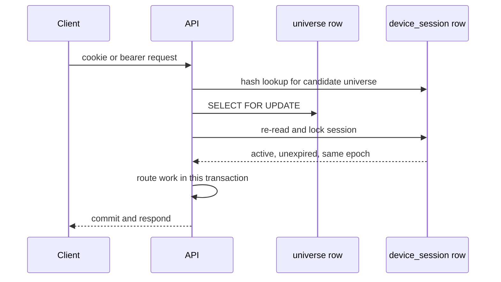

The worker follows the same rule. It may discover a candidate without locking it, but it locks the universe before the job and rechecks the epoch and source rows. Old-epoch work is discarded, not applied.

The common lock order is:

```text
universe → session/domain row → reasoning job → shared scheduler/resource rows
```

This is why Reset, Clear, an Ask result, an inquiry, and a Keep projection cannot legally race past one another into a newer privacy epoch.

---

## 5. Database: complete shape at source head

There are **37 SQL migration files** through `0040`, creating **112 product tables**. `schema_migrations`, created by the runner, makes **113 tables** in a fully migrated database. The runner takes an advisory transaction lock, validates checksums, requires the applied rows to be an ordered prefix, and applies remaining files in lexical order. [RELEASED.txt](../../packages/db/migrations/RELEASED.txt) prevents a migration from being inserted behind a released one.

This describes source. The last owner receipt still reports `0001`–`0009`.

### 5.1 Every table, grouped by responsibility

For exact column types, defaults, every check, and every index, the named migration family is the authority.

| Family | Tables | Migrations |
| --- | --- | --- |
| Identity and encounter | `account`, `universe`, `device_session`, `sign_in_token`, `asset`, `accounts`, `decision`, `exposure`, `ledger`, `job`, `trace`, `explicit_ask`, `worker_heartbeat` | `0001`–`0003`, `0009`, `0016` |
| Privacy receipts | `history_clear_receipt`, `privacy_recording_receipt`, `privacy_export_receipt`, `privacy_reset_receipt`, `account_deletion_receipt` | `0003`, `0020`, `0030` |
| Reasoning private graph/accounting | `reasoning_job`, `reasoning_step`, `reasoning_attempt`, `reasoning_context`, `reasoning_context_read`, `reasoning_context_payload`, `reasoning_context_dependency`, `reasoning_context_job_session`, `reasoning_context_job_ask`, `reasoning_accounting`, `reasoning_bucket`, `reasoning_permit`, `reasoning_reservation`, `reasoning_receipt`, `reasoning_settlement`, `reasoning_settlement_adjustment` | `0004`, `0005`, `0007`, `0008`, `0010`–`0012` |
| Fair scheduling | `reasoning_fairness_policy`, `reasoning_fairness_scheduler`, `reasoning_fairness_class`, `reasoning_fairness_universe`, `reasoning_fairness_ready`, `reasoning_fairness_attempt`, `reasoning_fairness_delta` | `0006` |
| Generated Reel supply | `cutroom_engine`, `generation_brief`, `generation_budget_grant`, `generation_job`, `cutroom_attempt`, `cutroom_event`, `media_object`, `generated_reel`, `publication_policy`, `publication_gate_result` | `0013`, `0014` |
| Original source worlds | `world_derivation_method`, `world`, `world_member`, `world_system`, `world_system_member` | `0017`, `0025` |
| Composer records | `composer_policy`, `composer_explanation_template`, `decision_signal`, `attention_account`, `attention_transition`, `personal_hypothesis`, `encounter_feedback`, `composer_reason_template`, `decision_candidate`, `decision_context` | `0022`–`0024`, `0027`, `0037` |
| Shared semantic substrate | `semantic_seed_load`, `evidence_family`, `semantic_source`, `source_snapshot`, `concept`, `claim`, `claim_concept`, `claim_support`, `concept_relation`, `asset_concept`, `asset_claim`, `semantic_proposal`, `bridge`, `bridge_evidence`, `semantic_correction`, `semantic_correction_effect` | `0026` |
| Private semantic actions | `branch_open`, `connection_feedback`, `correction_catch_up` | `0026`, `0034` |
| Ask answers | `ask_answer_route`, `ask_answer_owner_bucket`, `ask_answer_request`, `ask_answer` | `0028` |
| Atlas | `atlas_place`, `atlas_delta` | `0029`, `0031` |
| Background inquiries | `background_inquiry_route`, `background_inquiry_owner_bucket`, `background_inquiry_consent`, `background_inquiry_consent_request`, `inquiry_mail`, `background_inquiry`, `background_inquiry_continuation` | `0032`, `0036` |
| Return and Relics | `away_acknowledgement`, `relic`, `reader_objection` | `0033`, `0039` |
| Model-written Scrolls | `source_material`, `scroll_writing` | `0035` |
| Idea Rooms | `room`, `room_delta`, `room_inhabitant` | `0038` |
| Inventory/demand | `content_demand`, `scroll_writing_route`, `scroll_material_candidate`, `supply_request`, `demand_waiter`, `encounter_binding` | `0040` |

### 5.2 Encounter, authority, and projection

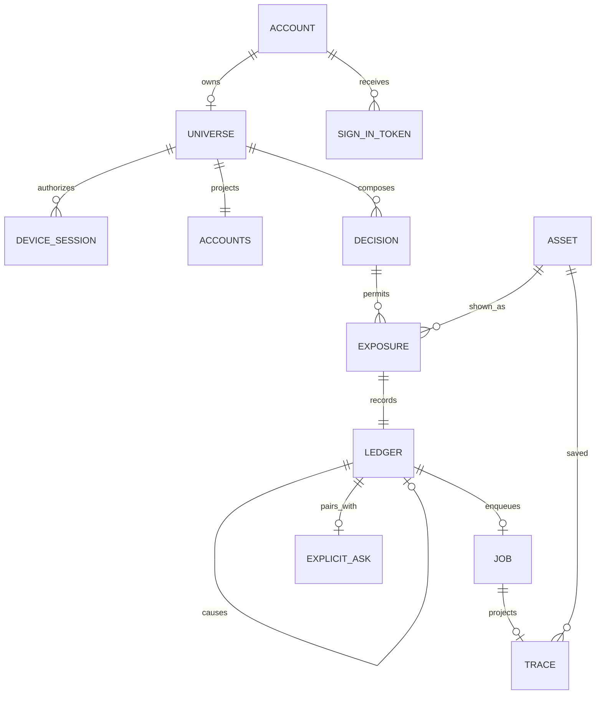

Key facts:

- `universe.id` is the private scope and lock key; `privacy_epoch` only moves forward.
- session/token hashes are unique SHA-256-shaped values; raw session tokens are not stored.
- `decision` records one Composer slate and policy/ranking version.
- `ledger` is ordered by `seq`, idempotent by `(universe_id, client_key)`, and stores causation.
- one Keep event creates one projection `job`; `trace` is derived state.

### 5.3 Semantic model, Atlas, Rooms, and Relics

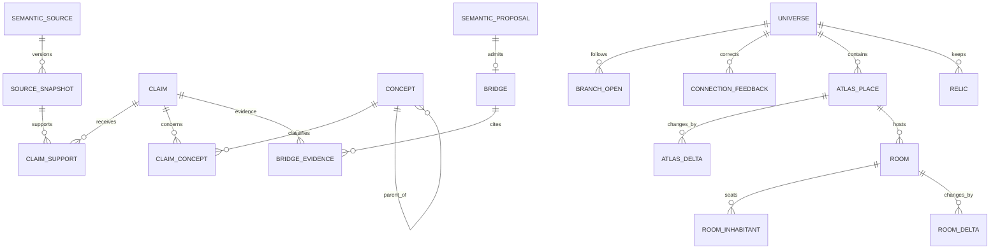

The shared substrate and private universe are separate. Sources, claims, concepts, and shared bridges can be reused. Branches, feedback, hypotheses, attention, Places, Rooms, Relics, demands, and bindings are private. A reader correction changes that reader's path; it does not rewrite shared knowledge. An operator source correction can invalidate shared evidence and trigger deterministic catch-up.

### 5.4 Reasoning

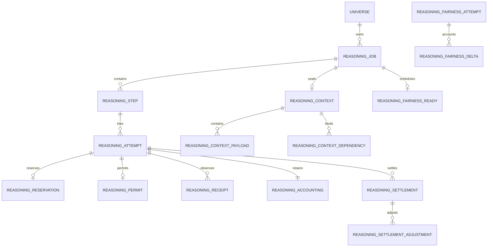

Private context may be erased while minimal accounting survives. A late provider receipt may still create a financial obligation even when it no longer has authority to create personal output.

### 5.5 Demand and shared supply

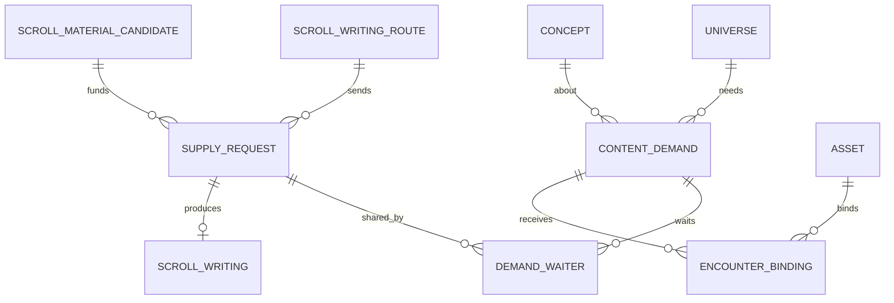

Demand, waiters, and bindings are private. Supply requests and written Scrolls are shared and name no universe. Two readers can wait on one request without sharing why they needed it.

### 5.6 Rules PostgreSQL enforces itself

- `ledger_pause_guard` refuses new Ledger events while recording is paused.
- migration checksums and prefix ordering prevent silent schema-history rewrites.
- sign-in tokens expire within 15 minutes and are consumed once.
- Ask event/fact pairs must agree, and Ask facts are immutable.
- reasoning policies, receipts, settlements, sealed contexts, attempts, and fairness deltas have append-only or one-way guards.
- Composer policies/templates are immutable; deferred constraints verify candidate coverage, scores, ranks, and diversity.
- a bridge requires an admitted proposal and the evidence slice the validator used.
- source correction propagation is a deferred database invariant.
- an Atlas Place/foundation change requires its matching delta in the same transaction.
- Room and inhabitant changes require matching Room history.
- an admitted model-written Scroll needs a matching snapshot hash and asset; a refusal cannot carry an asset.
- real generated-Reel eligibility needs the publication-gate set; `test_eligible` is confined to disposable databases.
- live generation grants are capped, and job/attempt identity cannot be rebound after dispatch.
- account deletion is allowed only inside its guarded transaction and leaves an address-free receipt.

This makes development failures louder, but prevents a second writer or later refactor from bypassing product law.

---

## 6. Magic-link sign-in without a browser bearer token

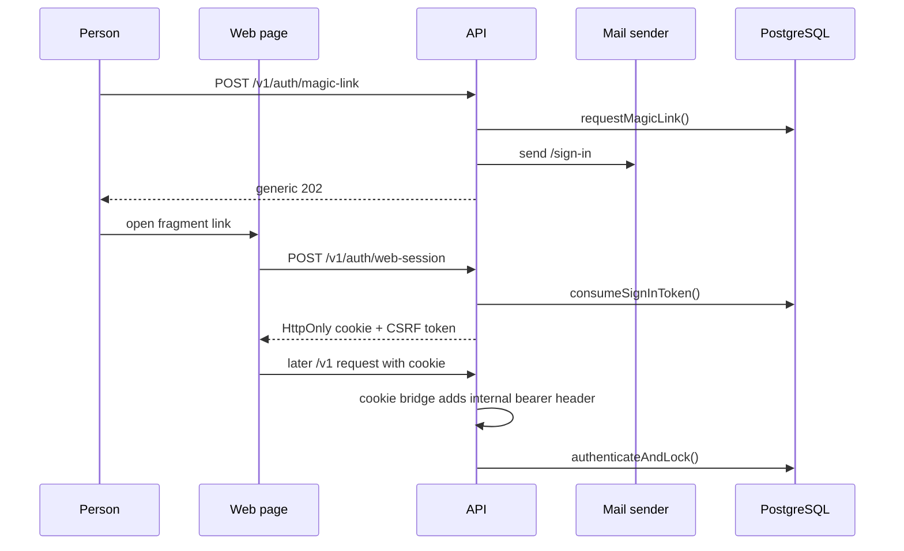

Real code: [sign-in-routes.ts](../../apps/api/src/sign-in-routes.ts), [sign-in.ts](../../packages/db/src/sign-in.ts), [web-session.ts](../../apps/api/src/web-session.ts), and [Root.tsx](../../apps/web/src/Root.tsx).

The browser never receives the session bearer token. It gets an unreadable cookie and derived CSRF token. Unsafe cookie requests need same-origin evidence and `X-CSRF-Token`. Android uses `/v1/auth/session` and stores its bearer credential in encrypted `SessionVault`.

Implemented: owner magic link, generic response, scanner-safe confirmation, one-time use, web cookie, CSRF, Android vault, sign-out, and deletion. Open: production domain/mail, owner keystore, deployed same-origin web, recovery operations, and final acceptance. Vite still refuses an ordinary production build because deployment is unfinished; its loopback proxy supports dev bearer and cookie modes.

---

## 7. Encounter → exposure → Keep → projection

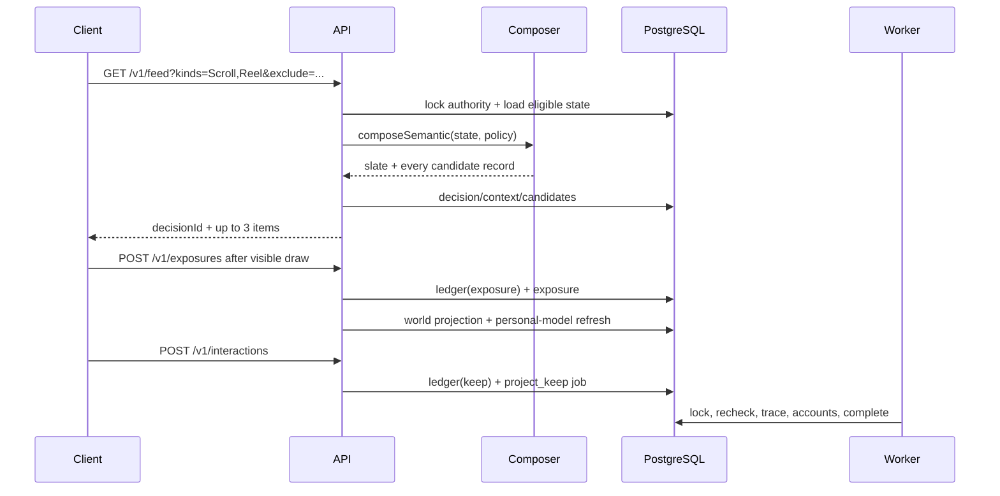

Selection is not exposure. The client records exposure only after visible draw; for a Reel it is tied to the first media frame. Keep requires that exact exposure and creates a causally linked Ledger event. Replaying the same request ID returns the first result; reusing it with different content is a conflict.

[projectOne](../../apps/worker/src/project.ts) makes no external call. It locks the universe, rechecks job/event/epoch, inserts the Trace once, increments projection revisions, and completes the job. Stale work is discarded.

The exposure transaction also updates the legacy exact-source world projection and the newer semantic personal model, making evidence and immediate deterministic effects atomic.

---

## 8. Composer v3, v4 shadow, and explanations

The default is `composer-semantic-v3`. `composer-signals-v2` remains selectable and immutable. `composer-semantic-v4` is registered and compared in shadow; it changes only final hash mixing so sequential editorial IDs and random Reel IDs do not cluster differently.

| Family | Meaning |
| --- | --- |
| `continue` | more about a recent explicit act, question, or fulfilled demand |
| `deepen` | a narrower idea inside something acted on |
| `bridge` | cross an admitted sourced relationship |
| `challenge` | show supported contradictory evidence |
| `revisit` | return after later activity made an old encounter relevant |
| `frontier` | deliberately enter an unseen root domain |
| `seed` | cold-start frontier |
| `fallback` | keep the remaining library reachable |

The score in [semantic.ts](../../packages/core/src/composer/semantic.ts) is:

```text
continuity + useful + depth + novelty + return relevance + prior
- redundancy - fatigue - 10 × exposure count
```

All weights are `1`; term sizes live in the immutable policy. The seen penalty is larger than any relevance swing, so fewer-showing tiers come first. Hard gates remove kept items, current-trip items, and routes the reader suppressed. Selection then enforces three items, at most two per source, at most one per concept, and a rolling exploration floor.

Every candidate is stored in `decision_candidate`, including gates, terms, score, rank, evidence, explanation key, concept, bridge, and family. `decision_context` stores seed, quotas, and served window. `GET /v1/decisions/:decisionId/why?assetId=...` reconstructs the sentence only from that record.

The older v2 coverage guarantee prefers, after score ties, the source with fewer recorded exposures, then a deterministic hash. Coverage advances only after exposure, not feed generation. V3 strengthens this with the `10 × seen count` tier.

Honest limit: mechanics are tested and emulator-inspected, but the owner has not completed multi-day usefulness judgment or selected v4 as default.

---

## 9. Semantic substrate → Places → foundations → Rooms

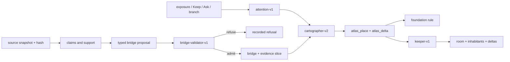

The substrate is shared and evidence-backed. A bridge exists only if [bridge-validator.ts](../../packages/core/src/semantic/bridge-validator.ts) accepts a typed proposal against a recorded read set. Corrections can revoke support and bridge eligibility.

[refreshPersonalModel](../../packages/db/src/semantic/personal-model.ts) recomputes bounded attention and rule-based hypotheses from explicit acts. Watch time is not a positive signal. It applies Cartographer deltas, Rooms, and correction-sensitive inventory changes in the same locked transaction.

[planPlaces](../../packages/core/src/atlas/cartographer.ts) forms planets, narrower regions, and nearby sightings. Every transition has an `atlas_delta` with causal class and evidence. A foundation is a live planet/region with sourced support to at least three things across at least two other live Places. Attention alone cannot create one.

[planRooms](../../packages/core/src/rooms/keeper.ts) opens a Room when the same question is carried on separate days in one Place. Inhabitants are deterministic sourced positions: reader-of-record, doubter, connector. This is a narrow v1 Room, not the target's long-running autonomous society.

Android renders Places and Rooms. Positions, orbits, moons, continents, currents, and clouds are labelled illustrative. Mapped identities and relationships are source-backed; decorative geometry is not evidence.

---

## 10. Ask answers and background inquiries

There are two product model paths, both worker-owned.

### Deliberate Scroll Ask

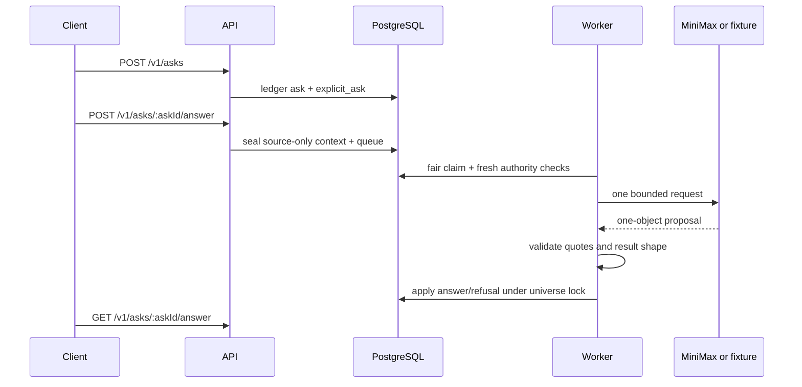

The answer is limited to the current Scroll. Quotes are matched against source text. A proposal becomes `answered`, `not_in_source`, `rejected`, or `failed`. The API queues and reads; it never calls the provider.

### Background bridge inquiry

Consent is scoped to a universe/epoch with a daily limit. When the Cartographer forms or changes a Place, `inquiry_mail` records a coalesced cause. The worker opens due work, seals pair/claim context, makes one request, and submits any relationship through the deterministic bridge validator. A weak suggestion is refused or recorded as none; it does not become a connection.

Pause, consent-off, Clear, Reset, expiry, and stale context prevent application. An in-flight reply can settle accounting but is discarded if authority is gone.

Bounded live MiniMax calls prove named transport and validation runs, not universal answer quality, continuous availability, or a general Steward.

---

## 11. Return, typed Relics, and corrections

`GET /v1/away` lists changes the reader did not cause since their acknowledgement: inquiry outcomes, correction-driven Place changes, Room changes, and changes to connections seen or kept. `POST /v1/away/acknowledge` only moves the marker forward.

Relics preserve a connection, Place, passage, or accepted answer. [relicState](../../packages/core/src/relics.ts) derives `current`, `corrected`, or `doubted` when read. Kept wording remains visible, but current evidence decides whether it still stands. “Let go” removes the private Relic, not shared source history.

Correction catch-up compares each universe's `corrections_seen` with the shared correction count. A failure defers that universe rather than holding the batch. Paused universes do not evolve in the background.

---

## 12. Privacy lifecycle

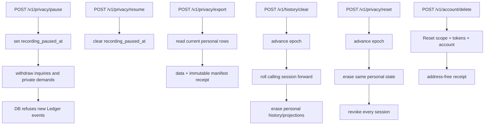

All routes enter through `authenticateAndLock`. Clear/Reset now erase inventory bindings, Relics, away markers, answers, inquiries, reasoning private state, projection jobs, Traces, personal model, semantic history, exposures, world systems, Ledger, decisions, and Accounts projection. The old guide's stale world-system defect was fixed by migration `0025`.

Export includes semantic history, attention/hypotheses, answers, inquiries, away state, Relics/objections, and inventory demand. It excludes shared source material and supply because they are not one person's history.

Pause does not advance the epoch or erase history. Reset does, and revokes every session. Account deletion removes sign-in identity while preserving a non-identifying receipt.

---

## 13. Content demand and Quartermaster

A demand is created by real reading: a Place has no unseen Scroll left, or a continuation reaches a concept with nothing unseen.

The pure [decideDemand](../../packages/core/src/inventory/quartermaster.ts) uses fixed order:

1. **reuse** an eligible unseen Scroll in the subtree;
2. **join** an open shared request for that concept;
3. **fund** one request from unwritten allowlisted material if budget remains;
4. **cannot_meet** with `no_route`, `no_budget`, `request_failed`, `checks_failed`, or `no_material`.

Adaptation and video have no v1 route here. The decision records `adapt: unavailable`.

When configured, the Scroll supply loop takes the oldest request. It passes quota/readiness, marks it `sending`, consumes its held unit, and invokes one transport. An ambiguous request is never retried. [write-scroll.ts](../../apps/worker/src/scrolls/write-scroll.ts) accepts only one object passing `scroll-checks-v2`; invented/copied quotes are refused.

One bounded live inventory request was sent and refused by the checks. Mechanics and refusal are proved; current evidence does not show a model-written Scroll served through this demand loop.

---

## 14. Generated Reel through Cutroom

```mermaid
flowchart LR
  Intent[editorial brief] --> Grant[budget grant]
  Grant --> Job[generation_job]
  Job --> Attempt[exact bytes + request id]
  Attempt --> Cutroom[Cutroom HTTP]
  Cutroom --> Events[cursor-checked events]
  Events --> Import[contained MP4 + probe + hash]
  Import --> Media[media_object]
  Media --> Gates[publication gates]
  Gates -->|disposable stand-in only| Test[test_eligible]
  Gates -. Witness absent .-> Block[real eligible BLOCKED]
  Test --> Mint[asset kind Reel]
  Mint --> Feed[GET /v1/feed]
  Feed --> Player[/v1/media/:sha256]
```

The worker persists exact dispatch identity before HTTP. After ambiguous submission it reconciles by the original request ID; it does not invent a second. Events need monotonic cursors. Import rejects paths outside the Cutroom root, symlinks/non-files, oversized or invalid MP4s, probe mismatch, and changed hashes. Bytes move into KnowScroll-controlled storage.

A finished Cutroom run is not automatically eligible. Release is blocked because:

1. joined Cutroom proof uses upstream stand-in providers;
2. Visual Witness is absent, so `witness_alignment` is unavailable;
3. real eligibility therefore cannot complete;
4. Quartermaster does not route video demand here;
5. no owner production host/provider run or real-media quality acceptance exists.

Android playback, first-frame exposure, Why, and Scroll continuation work with supplied/test-eligible media. That does not prove real generated video.

---

## 15. Client program design

### Android

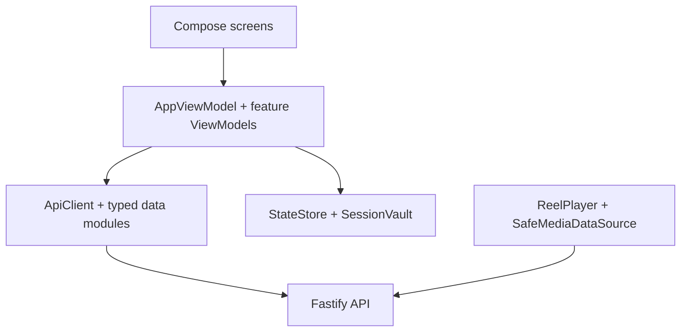

[AppViewModel.kt](../../apps/mobile/app/src/main/kotlin/com/knowscroll/mobile/ui/AppViewModel.kt) owns navigation and authority fencing. Separate view models own account/privacy, return, and inquiries. `StateStore` preserves retry/navigation envelopes; `SessionVault` encrypts the session. Responses are discarded if navigation version, universe, or epoch changed.

`SpatialAtlas` owns camera, pan, pinch, travel, and Place interaction. `ScrollScreen` renders typed blocks and Ask/connection/passage sheets. `ReelScreen` owns playback, Why, and continuation. Release refuses without HTTPS API, signing values, and App Links host.

Emulator evidence is extensive, but physical-phone performance and owner usefulness/visual acceptance remain open.

### Web

The web client is React/Vite. `ReaderStore` is the state machine; components are mainly views. `ApiClient` uses same-origin `/v1`, strict parsers, cookie credentials, and in-memory CSRF. `Root` replaces the reader tree after real session loss.

The earlier CI hole is fixed: reader, owner, and Why journeys now run in CI. The earlier claim that web identity had no design is obsolete; HttpOnly cookie + CSRF is implemented. Feature catch-up, hosting/configuration, deployment proof, and acceptance remain. Owner direction defers catch-up to `#171` near Cutroom completion.

---

## 16. Worker versus API

| API owns | Worker owns |
| --- | --- |
| authenticate the current request | claim asynchronous work fairly |
| hold universe lock for request admission | re-lock and recheck after waiting |
| validate body and idempotency | call configured provider transports |
| record exposure, Keep, Ask, branch, feedback, consent | validate proposals before apply |
| queue Ask-answer work | settle success/refusal/failure/unknown |
| return Atlas, Rooms, Relics, away and inventory | Keep projection, catch-up, Scroll supply |
| authorize media before streaming | own provider credentials |
| never call model or Cutroom | never expose provider keys to clients |

Generation is a separate worker entry point because its lease/reconciliation/import loop differs. Reasoning retirement is a separate maintenance process so cleanup cannot silently become projection.

---

## 17. Match to the planned architecture

| Target role | Current match |
| --- | --- |
| Ledger | **Strong.** Causation, idempotency, epochs, explicit acts, projection separation. |
| Accounts | **Partial but real.** Keep projection, attention, narrow hypotheses; not a psychological profile. |
| Composer | **Substantial.** Families, gates, terms, exploration, explanations, corrections, immutable policies. |
| Substrate | **Substantial.** Sources, hashes, claims, concepts, support, bridges, read sets, corrections. |
| Cartographer/Chart | **Useful first version.** Places, sightings, foundations, deltas. No galaxies, holes, ruins, full history explorer. |
| Steward | **Not a persistent actor.** Ask/inquiry workers are bounded tasks. |
| Reasoning plane | **Deep and partly live.** Fair admission, contexts, attempts, Ask/inquiry consumers; not a general agent runtime. |
| Idea Rooms | **Narrow v1.** Repeated questions, sourced positions, correction effects; no resident memory/planning. |
| Quartermaster | **Scroll v1.** Reuse/join/fund/cannot-meet; no adaptation or video demand. |
| Inventory | **Two real halves.** Scroll supply and generated-Reel inventory are not yet one planner. |
| Cutroom | **Lower chain implemented; real release blocked.** |
| Social/Blend | **Deferred, not implemented.** |

The architecture still follows the original direction. The useful divergence is that narrow, rule-based roles were built instead of waiting for one intelligent Steward. This creates inspectable behavior while preserving future boundaries.

---

## 18. Architecture drift: planned versus current

### The short judgment

The project has **moderate architecture drift**.

That does not mean the implementation has abandoned the plan. Its most important laws remain recognizably intact: events retain causation, private authority is guarded by a universe lock and privacy epoch, recommendation is deterministic, models return proposals rather than writing product truth, expensive work is admitted before it runs, and generated media must pass gates before publication.

The material drift is in **how those laws are assembled into a running system**. The target described a general event-driven engine with reusable subscribers, dirty scopes, one persistent Steward, a generic model runtime, a unified content-demand planner, and rich autonomous Rooms. The current code usually reaches each product capability through a narrower feature-specific path: direct transactional projection, specialized queues, bounded Ask and inquiry workers, deterministic Room positions, Scroll-only demand, and a separate operator-created Reel-generation chain.

The fairest summary is:

| Dimension | Drift | Judgment |
| --- | --- | --- |
| Product laws and safety boundaries | **Low** | The implementation still follows the target's deepest constraints. |
| Package and service boundaries | **Low to moderate** | Core, database, API, worker, clients, and Cutroom still have distinct roles; worker responsibilities have split into more processes. |
| Event and projection topology | **Moderate** | Direct feature calls and specialized catch-up paths replaced much of the planned generic subscriber/reducer machinery. |
| Steward and reasoning design | **High** | Real bounded reasoning exists, but the persistent Steward and general agent runtime do not. |
| World and Room behavior | **Moderate to high** | Atlas is real; autonomous residents, journals, and independent Room work are not. Two world representations also coexist. |
| Content demand and generation | **High** | Scroll demand and generated-Reel production are two separate systems rather than one Quartermaster-controlled supply path. |
| Client and social scope | **High in completeness, lower in architecture** | Android leads, web is behind, and Social/Blend is deferred. These are explicit delivery choices, but they leave the target experience incomplete. |
| Persistence choice | **Low and mostly beneficial** | PostgreSQL arrived earlier than the target's small-host progression, strengthening invariants at the cost of operational weight. |

These labels are evidence-based judgments, not percentages calculated by a tool. In plain language: **the foundation still points in the planned direction, but several intended general systems have become separate vertical feature implementations.**

### Planned end-to-end flow

The target architecture in [the overview](../architecture/target/01-OVERVIEW.md), [the detailed architecture](../architecture/target/03-ARCHITECTURE.md), and [content demand design](../architecture/target/23-CONTENT-DEMAND-AND-INVENTORY.md) described this logical path:

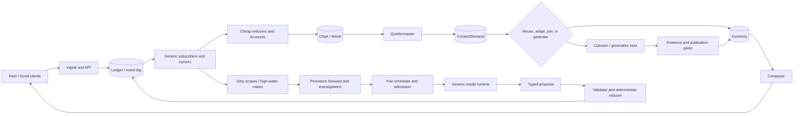

The important architectural idea was not the boxes' names. It was a repeated control loop:

1. record an immutable fact;
2. let deterministic subscribers update cheap state;
3. mark expensive scopes dirty instead of running a model inline;
4. admit and schedule expensive work fairly;
5. accept only a typed proposal;
6. validate and apply it deterministically;
7. record the result back into the ledger;
8. satisfy content demand through one inventory system;
9. let Composer choose only from eligible inventory.

### Current end-to-end flow

The current source implements a more direct collection of vertical paths:

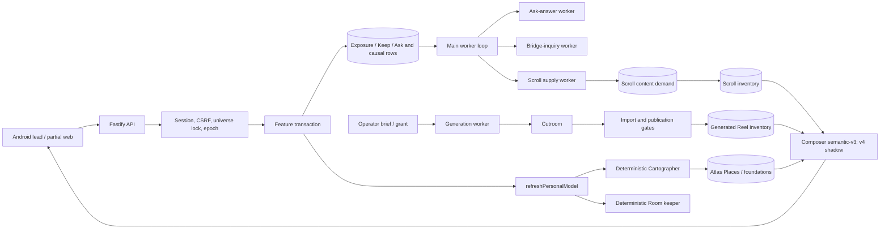

The two diagrams end at a similar user loop, but the middle is materially different:

- There is no single generic event-subscriber bus coordinating every projection. API and database functions often call the next deterministic projection directly inside the request transaction.
- `refreshPersonalModel` and the Cartographer form a concrete semantic path, not a generic “all world state is written by one reducer” mechanism.
- Ask answers and bridge inquiries use real admission, attempts, validation, and post-wait authority checks, but they are specialized consumers rather than children of one persistent Steward.
- The main worker multiplexes projection, answer, inquiry, correction, and Scroll-supply loops. Generation and reasoning retirement use separate process entry points.
- Scroll demand can reuse, join, fund, or refuse supply. Generated Reel work begins from an operator brief and grant; it is not created by that demand planner.
- Composer can rank both eligible object types, but that shared last mile should not be mistaken for unified upstream supply planning.

### Current versus expected, flow by flow

#### A. Encounter and world update

| Step | Expected flow | Current flow | Meaning |
| --- | --- | --- | --- |
| Selection | Composer reads eligible inventory and an Account/World view. | Semantic Composer reads candidate families, evidence, policy and current personal state. | **Aligned.** Current ranking is narrower and concrete. |
| Visibility | A ledger event records the encounter. | `POST /v1/exposures` records actual visibility separately from the feed decision. | **Strong alignment.** This preserves the central evidence law. |
| User act | Keep/Ask enters Ingest and the Ledger. | API locks the universe, checks epoch/idempotency, and writes the causal act. | **Strong alignment.** |
| Projection | Generic subscribers advance cheap reducers and dirty scopes. | Feature code directly calls deterministic projection; worker catch-up handles missed/asynchronous work. | **Moderate topology drift.** Simpler now, but each new projection needs its own recovery design. |
| World change | Cartographer proposes; validator/reducer applies; change returns to Ledger. | `refreshPersonalModel` supplies evidence to the pure Cartographer; database code applies Atlas changes and records deltas in the transaction. | **Principle aligned, mechanism drifted.** The model still cannot author geography. |
| Room change | Persistent residents can investigate and update Rooms over time. | The Room keeper derives sourced positions and correction effects deterministically. | **Large capability gap.** Current Rooms are useful views, not autonomous rooms. |

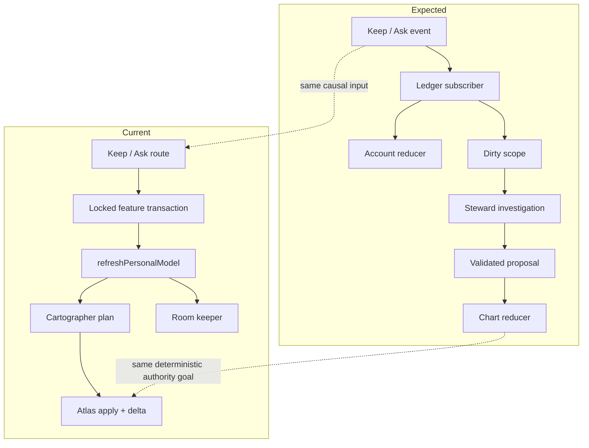

#### B. Reasoning and the planned Steward

| Expected | Current | Drift judgment |
| --- | --- | --- |
| One persistent Steward per universe notices dirty scopes and owns investigations. | No persistent Steward identity or continuous per-universe process exists. | **High drift/incompleteness.** |
| Investigations can create bounded children through a generic scheduler/runtime. | Ask-answer and bridge-inquiry jobs are separate bounded schemas and workers. | **Useful specialization.** It proves the safety pattern without general agency. |
| One model runtime owns provider invocation and typed proposal handling. | Shared reasoning primitives exist, but consumers and proposal contracts remain feature-specific; the provider transport is not a general tool-using agent runtime. | **Moderate to high drift.** |
| Reducers alone turn accepted proposals into engine state. | Specialized database functions validate and apply accepted results, usually with their own stale-authority checks. | **Law preserved; abstraction changed.** |

This is one place where the current code may be healthier than an early literal implementation of the target. A persistent agent would add cost, nondeterminism, recovery state, and harder privacy erasure before the product has proved that it needs autonomous investigation. The risk is not that Steward is absent. The risk is allowing every future model feature to invent another private queue, lease protocol, and result lifecycle instead of extracting the common runtime once repetition is clear.

#### C. Content demand and generated supply

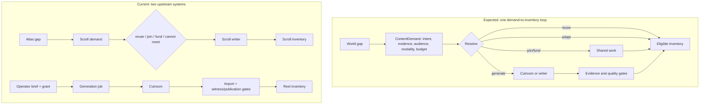

This is the most consequential structural drift because it can become permanent duplication:

- The planned `ContentDemand` was modality-aware and could decide whether to reuse, adapt, share, or generate either consumption object.
- The implemented demand path is currently Scroll-specific.
- The generated-Reel path has serious grant, lease, receipt, import, and publication machinery, but begins from an operator-controlled request rather than a discovered inventory gap.
- The two paths finally meet at eligible inventory and Composer, not at planning, budgeting, or reuse.

The safe direction is not to force both workers into one process. It is to give both a common demand and settlement language while keeping Scroll writing and Cutroom generation as separate executors.

#### D. Clients, Rooms, and Social

| Target | Current | Classification |
| --- | --- | --- |
| Mobile and desktop expose the full personal universe. | Android is the leading product surface; web identity is correct but feature catch-up and deployment remain. | **Sequencing drift** until web catches up; architecture drift only if Android-only assumptions enter contracts. |
| Rooms contain persistent residents with memory, journals, and independent work. | Rooms show deterministic, sourced positions derived from current evidence. | **Major planned capability absent.** The name is ahead of the implementation. |
| Projector and Social/Blend connect shareable projections without leaking private state. | Social/Blend is explicitly deferred. | **Scope deferral**, not a secretly implemented subsystem. |
| The universe can be explored as a rich historical Chart. | Atlas Places, sightings, foundations, deltas, returns, Relics, and corrections exist; legacy exact-source worlds also remain. | **Partial convergence with duplication risk.** |

### What is drift, and what is merely unfinished?

This distinction matters when judging the project:

| Situation | Classification | Why |
| --- | --- | --- |
| Social/Blend is intentionally deferred and has no hidden substitute. | **Unfinished scope** | The planned boundary has not been contradicted. |
| Persistent Steward is absent while bounded reasoning workers exist. | **Simplification plus incompleteness** | The current mechanism covers a subset without claiming full agency. |
| Direct projection calls replace the planned generic subscriber/reducer topology. | **Architecture drift** | The same responsibility is now owned through a different runtime path. |
| Scroll demand and Reel generation use separate planners and entry conditions. | **Architecture drift** | Two systems own what the target assigned to one Quartermaster/demand loop. |
| PostgreSQL is used from the start. | **Deliberate implementation drift** | It strengthens locks and constraints but raises local/operational cost. |
| Main worker duties are split from generation and retirement processes. | **Healthy operational refinement** | Lease and recovery shapes differ; the logical ownership boundary remains. |
| Composer uses a three-item slate and concrete semantic signals rather than the target's richer eight-item sketch. | **Policy-level drift** | It is replaceable behind the same pure selection boundary. |
| Legacy `world*` and Atlas both survive. | **Accumulated architecture debt** | Two representations compete for vocabulary, privacy work, and future ownership. |

### Healthy drift versus concerning drift

Healthy drift:

1. **PostgreSQL early.** It makes universe locks, unique idempotency keys, constraints, leases, and destructive privacy operations enforceable now.
2. **Small deterministic roles before autonomous roles.** Cartographer, Composer, Room keeper, and Quartermaster decisions are testable and inspectable.
3. **Separate generation process.** Cutroom work has a distinct lease, reconciliation, and import lifecycle and should not block the encounter loop.
4. **Specialized first consumers of reasoning.** Ask and inquiry establish real admission and stale-authority patterns before a generic agent runtime is justified.
5. **Android-first delivery.** This is a reasonable sequencing choice as long as public contracts and auth remain client-neutral.

Concerning drift:

1. **No common projection substrate.** Every direct or worker projection needs its own cursor, catch-up, idempotency, correction, and erasure reasoning.
2. **Split supply planning.** Scroll and Reel supply can develop incompatible budget, sharing, demand, and settlement semantics.
3. **Two world models.** Legacy worlds and Atlas invite duplicated UI language and inconsistent privacy handling.
4. **A broad main worker loop.** One process coordinates several queues with different latency and failure characteristics.
5. **Feature-specific reasoning protocols multiplying.** A third or fourth consumer would be the signal to extract shared job/runtime semantics rather than copy another lifecycle.
6. **Names outrunning behavior.** Steward, inhabitants, Rooms, and Quartermaster can make a deterministic first version sound more autonomous than it is.

### Is the implementation still converging on the target?

**Yes, but convergence is no longer automatic.** The project remains aligned at the level that is hardest to retrofit later: authority, evidence, privacy, deterministic application, provider isolation, and publication gates. That is valuable. The divergence is in seams that can still be joined, but only through explicit decisions.

The next architecture checkpoints should be observable, not aspirational:

1. **One world vocabulary:** Atlas becomes the sole user-facing geography and legacy `world*` is retired or formally quarantined.
2. **One projection contract:** synchronous and asynchronous projections share a documented idempotency, cursor/catch-up, correction, and epoch protocol even if no message broker is introduced.
3. **One demand language:** Reel and Scroll supply settle against a shared demand identity, budget, evidence, and outcome model; executors remain separate.
4. **One reasoning lifecycle:** new model consumers reuse admission, attempts, unknown outcomes, authority rechecks, validation, and settlement instead of adding private variants.
5. **Explicit Room decision:** either build resident identity/memory/journal semantics or rename the current deterministic feature so product language matches fact.
6. **Client-neutral contracts:** Android can lead delivery, but no core capability should require Android-only state.
7. **Steward stays earned:** introduce a persistent Steward only when multiple dirty scopes need durable cross-feature investigation that the smaller workers cannot express.

If those seams are joined, today's specializations are stepping stones. If they are not, the codebase will keep the target's vocabulary while operating as several parallel products.

---

## 19. Honest assessment

### What is genuinely strong

1. **Authority survives races.** Universe-first locks and post-wait checks are consistent.
2. **Explanation is data.** Composer evidence and Atlas/Room deltas are recorded at decision time.
3. **Models have narrow power.** Each model path has one-call rules, closed shapes, validators, and stale-authority refusal.
4. **Private/shared state is separated.** Personal reasons can be erased while shared supply survives; accounting can survive private-context deletion.
5. **PostgreSQL enforces product law.** Many invariants are not merely handler comments.
6. **Failure is honest.** Unknown, refusal, expiry, stale epoch, missing witness, no route/budget, and correction withdrawal are distinct.
7. **The product is visible.** Android exposes Ask, Places, returns, Rooms, Relics, Reels, explanations, and privacy controls.

### Where it will strain

1. **The schema is large for a single-user pre-release product.** 112 product tables increase migration, deletion-order, onboarding, and operations cost.
2. **`apps/api/src/app.ts` is still a hotspot.** Route modules helped, but key encounter orchestration stays concentrated.
3. **The main worker is a scheduler of schedulers.** Projection, answers, inquiries, catch-up, and supply share one process loop.
4. **Two world models coexist.** Legacy exact-source worlds and semantic Atlas Places duplicate language and privacy work.
5. **Client parity is intentionally broken.** Android leads; web catch-up is deferred, while full v1 still requires desktop.
6. **Evidence volume can hide product quality.** Tests prove mechanics, not that recommendations or Rooms are useful.
7. **Target names can overstate agency.** “Inhabitant” and “Quartermaster” need plain evidence labels in UI and docs.

### Decisions I would tighten

1. Retire or quarantine legacy `world*` once Atlas fully owns user-facing geography.
2. Split worker loops into independently deployable processes before real traffic, keeping fairness in PostgreSQL.
3. Join generated video and generated Scroll supply under one explicit demand-to-inventory design.
4. Generate a database reference from a migrated disposable DB so all columns, constraints, indexes, and relationships cannot drift from this guide.
5. Make usefulness evaluation a release gate with a repeatable owner protocol.
6. Keep the persistent Steward deferred until a visible need cannot be solved by a smaller deterministic worker.

---

## 20. Critical path to personal v1

Social/Blend and journey F are deferred. Personal journeys A–E and G–I remain on mobile and desktop, with real Cutroom for C.

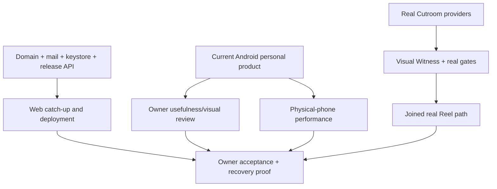

Actual blockers:

- owner domain, mail, signing key, release API origin, and App Links verification;
- physical-device performance/accessibility judgment;
- multi-day recommendation usefulness judgment and v3/v4 decision;
- web catch-up and production deployment proof;
- real Cutroom providers, Visual Witness, and one joined generated-Reel journey;
- prediction journey H is not built;
- final owner acceptance and recovery/rollback evidence.

No longer blockers:

- basic web token-free identity: cookie + CSRF exists;
- stale world projection after Clear/Reset: migration `0025` fixes it;
- CI never exercising web: reader, owner, and Why journeys run;
- basic Rooms/inhabitants: narrow Idea Rooms v1 exists;
- all product reasoning being disabled: bounded Ask-answer and inquiry consumers exist.

---

## 21. Best code-reading path

### Session 1: authority and an encounter

1. [target README](../architecture/target/00-README.md)
2. [API composition](../../apps/api/src/app.ts)
3. [identity lock](../../packages/db/src/identity.ts)
4. [pure Composer](../../packages/core/src/composer/semantic.ts)
5. [Composer persistence](../../packages/db/src/composer/semantic.ts)
6. [Keep projection](../../apps/worker/src/project.ts)

Explain why selection is not exposure and Keep needs an exposure event.

### Session 2: evidence becomes geography

1. [semantic seed](../../packages/db/src/semantic/seed.ts)
2. [bridge validator](../../packages/core/src/semantic/bridge-validator.ts)
3. [personal model](../../packages/db/src/semantic/personal-model.ts)
4. [Cartographer](../../packages/core/src/atlas/cartographer.ts)
5. [Atlas persistence](../../packages/db/src/atlas.ts)
6. [Room keeper](../../packages/core/src/rooms/keeper.ts)

Separate a shared claim, private act, bridge, Place, and decorative geography.

### Session 3: bounded model work

1. [answer validator](../../packages/core/src/reasoning/ask-answer.ts)
2. [answer admission/storage](../../packages/db/src/reasoning-answers.ts)
3. [answer worker](../../apps/worker/src/reasoning/answer-worker.ts)
4. [inquiry contract](../../packages/core/src/reasoning/bridge-inquiry.ts)
5. [inquiry worker](../../apps/worker/src/reasoning/inquiry-worker.ts)
6. [main loop](../../apps/worker/src/main.ts)

Find the last authority check before result application.

### Session 4: privacy and supply

1. [privacy](../../packages/db/src/privacy.ts)
2. [inventory demand](../../packages/db/src/inventory/demand.ts)
3. [Quartermaster](../../packages/core/src/inventory/quartermaster.ts)
4. [Scroll writer](../../apps/worker/src/scrolls/write-scroll.ts)
5. [supply worker](../../apps/worker/src/scrolls/supply-worker.ts)

Explain which rows are private/shared and what Pause/Clear/Reset do.

### Session 5: clients and generated media

1. [web Root](../../apps/web/src/Root.tsx), [ApiClient](../../apps/web/src/api/client.ts), then `ReaderStore`
2. Android `ApiClient.kt`, `SessionVault.kt`, `StateStore.kt`, then [AppViewModel.kt](../../apps/mobile/app/src/main/kotlin/com/knowscroll/mobile/ui/AppViewModel.kt)
3. [generation worker](../../apps/worker/src/generation/worker.ts)
4. [verified import](../../apps/worker/src/generation/import.ts)
5. [publication evaluation](../../apps/worker/src/publication/evaluate.ts)
6. [Reel player](../../apps/mobile/app/src/main/kotlin/com/knowscroll/mobile/ui/reel/ReelPlayer.kt)

Distinguish “Cutroom finished,” “imported,” “eligible,” “minted,” “served,” and “played.”

---

## 22. Glossary

- **Account:** single-owner sign-in identity.
- **Universe:** private authority, epoch, and lock scope.
- **Privacy epoch:** generation number; old authority cannot act in a new epoch.
- **Ledger:** ordered causal exposure, Keep, and Ask facts.
- **Decision:** persisted Composer slate; not visibility evidence.
- **Exposure:** evidence that a selected encounter became visible.
- **Trace:** derived saved projection of a Keep.
- **Substrate:** shared sources, snapshots, claims, concepts, support, and bridges.
- **Attention account:** bounded decaying evidence tally; not an identity claim.
- **Hypothesis:** revisable rule state with limited permitted uses.
- **Place:** private semantic geography anchored in acts and supported structure.
- **Sighting:** nearby supported structure not yet a personal Place.
- **Foundation:** Place with enough sourced load-bearing relations.
- **Room:** persistent question in a Place with deterministic sourced positions.
- **Relic:** kept connection, Place, passage, or answer with derived current state.
- **Composer:** pure deterministic selection policy.
- **Cartographer:** pure planner for Place/foundation changes.
- **Quartermaster:** pure decision over recorded content demand.
- **Reasoning job:** bounded external-work identity, not an autonomous agent.
- **Unknown outcome:** provider may have received a call, but local result is unproved.
- **Cutroom:** separate HTTP video-generation service.
- **Visual Witness:** required evidence/continuity inspection for real Reel publication; absent.
- **Stand-in:** synthetic provider proving mechanics without claiming real output.

---

## 23. Bottom line

KnowScroll is no longer mainly “a careful backend plus a Scroll demo.” It now has a coherent personal path from recorded acts through semantic discovery, Places, explanations, bounded reasoning, return changes, Rooms, Relics, and demand-driven Scroll supply, with a substantial Android experience over it.

The strongest decision remains separation of suggestion from authority: pure policies decide from recorded facts, PostgreSQL enforces invariants, and models cannot directly write product truth. The newer work follows the target without pretending its grander agents already exist.

The main risk has changed. It is no longer that nothing consumes the architecture. It is that implementation has become broad and structurally expensive before real-use quality, production deployment, desktop parity, physical-device performance, and real video are accepted. The next work should be integration and judgment work—not another layer of abstract machinery.
