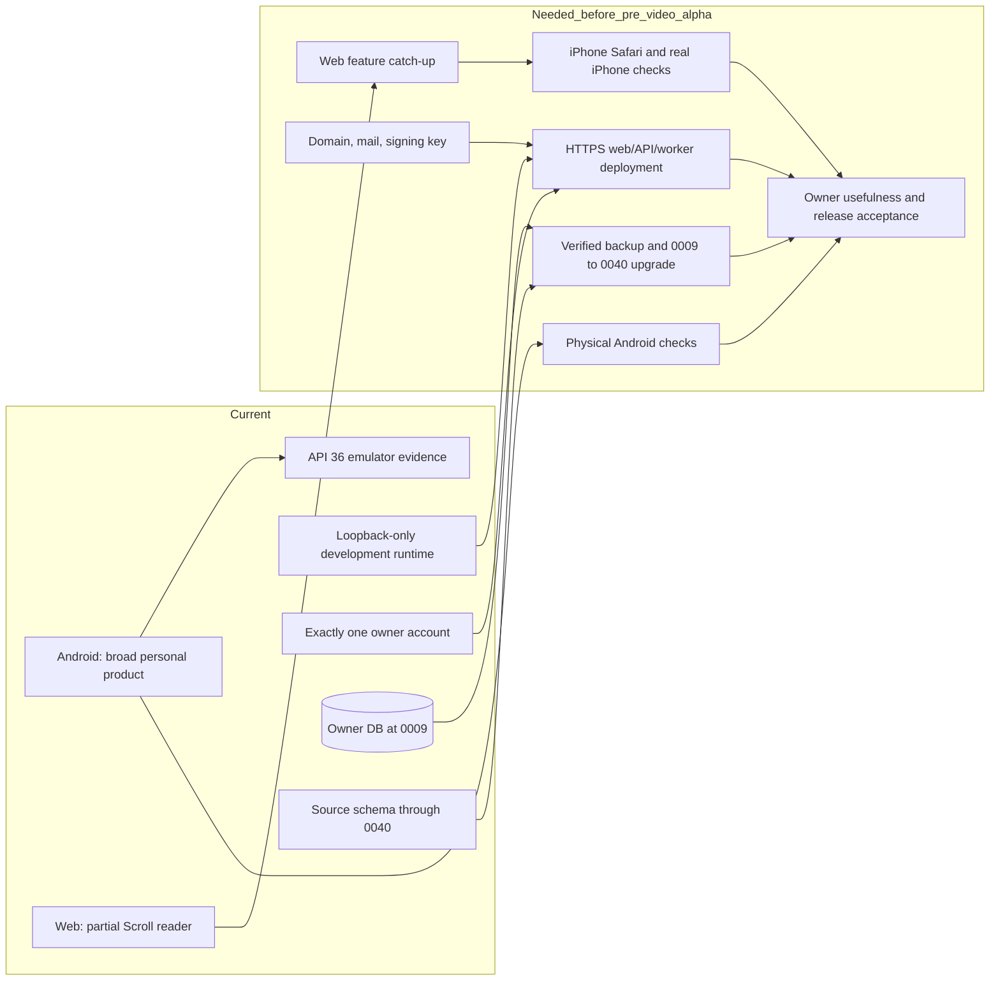
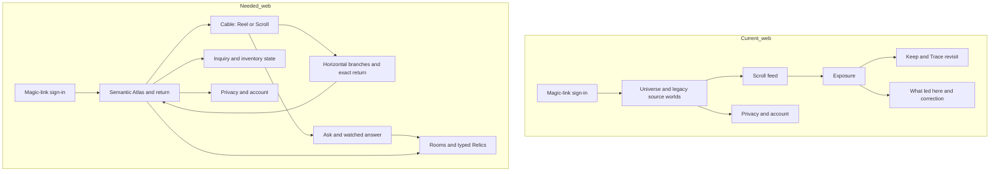
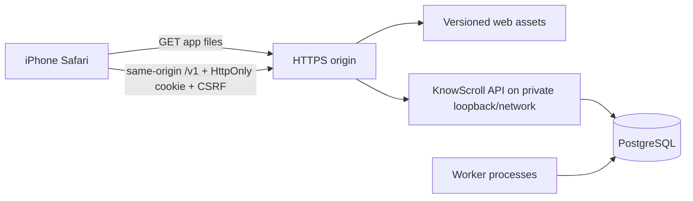
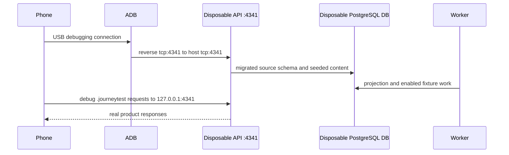
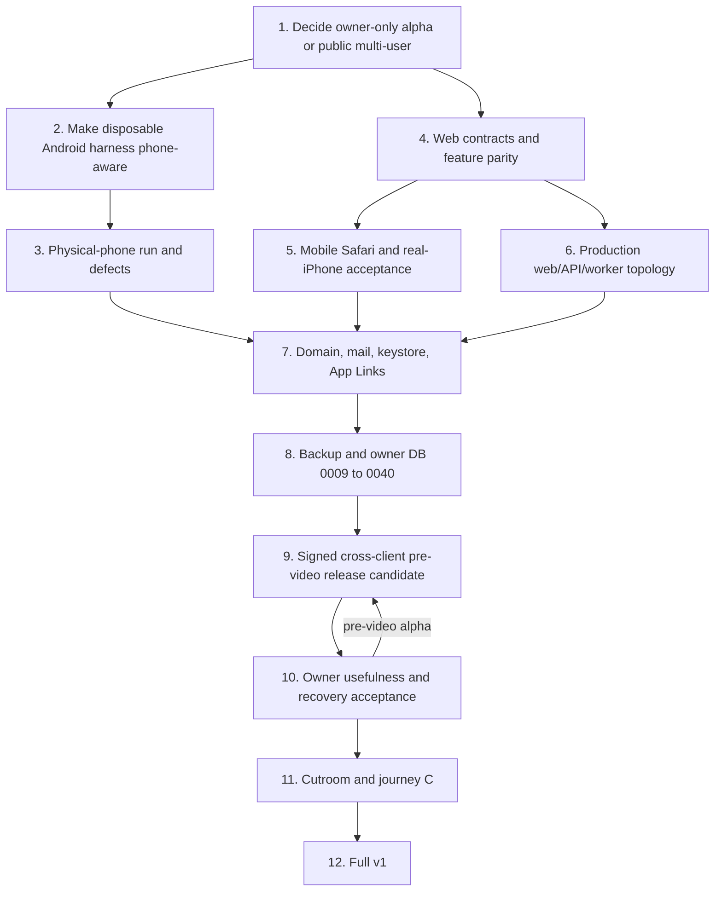

# FlowWalk: Web, physical Android, and v1 readiness

Observed on **2026-09-29** at source revision `36fb07c2`. This guide answers three practical questions:

1. What work is needed to make the web client the product surface for iPhone/iPad users?
2. What is needed to run and judge the Android app on a physical phone safely?
3. After those two pieces, can KnowScroll launch without Cutroom?

This is a source and live-state review, not a release receipt. At observation time PostgreSQL was running, but the API and workers were stopped, no Android device was attached, and the owner database `knowscroll` was still at migrations `0001`–`0009`. Source contains migrations through `0040`. Nothing in this review migrated or changed the owner database.

---

## 1. Short answer

### Web for iOS users

The current web application is a **real but partial desktop Scroll reader**, not the web version of the current Android product and not a deployable iPhone product yet.

It already has good foundations:

- email magic-link sign-in;
- an HttpOnly session cookie, same-origin requests, and in-memory CSRF protection;
- Scroll discovery, genuine exposure recording, Keep, Trace revisit, privacy controls, account deletion, and “What led here” corrections;
- responsive CSS and keyboard/accessibility work;
- unit tests and real Chromium journeys in CI.

It is missing most of the product added after the original reader slice:

- Reels and video playback;
- horizontal continuations and exact return;
- Ask and watched answers;
- the semantic Atlas with Places, sightings, foundations, and deltas;
- While You Were Away;
- typed Relics and passage/answer actions;
- Idea Rooms;
- background-inquiry controls and results;
- inventory-demand status;
- the current Android rule that sources stay hidden from the reader;
- predictions, which are not implemented on Android either.

There is also no production web delivery path. [`vite.config.ts`](../../apps/web/vite.config.ts) refuses a production build, binds the dev server to loopback, and only supports its development proxy. [`apps/api/src/main.ts`](../../apps/api/src/main.ts) refuses `NODE_ENV=production` and listens only on `127.0.0.1`. There is no checked-in TLS/reverse-proxy, static hosting, process supervision, or public deployment configuration.

### Android on a physical phone

The app can be built and installed, and its broad personal journeys have passed on an API 36 emulator. A physical phone has not been tested. The current safe hands-on harness is emulator-specific because it builds the test app with a `10.0.2.2` API address. The first small implementation task should make that harness accept a physical-device address such as `http://127.0.0.1:4341`, paired with `adb reverse`.

The phone run must use the separate `.journeytest` app and a disposable `knowscroll_test_hands_*` database first. It must not upgrade or exercise destructive controls against the owner database just to obtain evidence.

### Are we ready to launch without Cutroom?

**No—not under the current meaning of “v1”, and not yet as a production release.**

There are three different possible goals:

| Goal | Current judgment |
| --- | --- |
| Owner-only local preview | **Available on Android; partial on web.** This is development software, not a launch. |
| Owner-only pre-video alpha over the internet | **Reachable, but not ready today.** Web parity, physical-phone proof, production hosting, release inputs, the database upgrade, prediction scope, and owner usefulness acceptance remain. |
| Public release for multiple users | **Not architecturally ready.** The database enforces exactly one account and only `KS_OWNER_EMAIL` can receive a valid sign-in link. Public identity, onboarding, isolation, operations, and support are a separate project. |
| “Full v1” under the accepted release contract | **Not ready without Cutroom.** The contract explicitly says pre-video completion is not full v1; journey C requires the real joined video path. |

If the intended product is “single-owner v1 without generated video,” that can be a valid new scope, but it must be named honestly—such as **pre-video alpha**—or explicitly change [the v1 release contract](../product/v1-release.md) and issue `#72`. Simply skipping Cutroom while retaining the current contract would make the release claim false.

---

## 2. The current delivery shape



The green CI result at current `main` proves source checks, backend tests, three Chromium web journeys, Android debug build/lint/unit tests, and a throwaway-signed release build. It does **not** prove Safari, a physical phone, public hosting, real owner signing, real mail, the owner database upgrade, useful recommendations, or a public multi-user service.

---

## 3. Workstream one: make web the iOS surface

### 3.1 Start from the real boundary

Start at [`apps/web/src/state/readerStore.ts`](../../apps/web/src/state/readerStore.ts). Its opening comment states the current scope directly: no Ask, Reel, Friends, or branch flow. It is the browser's framework-independent state machine, so web parity is not primarily a CSS exercise. It requires new client contracts and new state transitions.

Then read:

1. [`apps/web/src/App.tsx`](../../apps/web/src/App.tsx) — the current screen graph.
2. [`apps/web/src/api/client.ts`](../../apps/web/src/api/client.ts) — the small subset of API routes the web can call.
3. [`apps/mobile/app/src/main/kotlin/com/knowscroll/mobile/data/ApiClient.kt`](../../apps/mobile/app/src/main/kotlin/com/knowscroll/mobile/data/ApiClient.kt) — the much broader current client contract.
4. [`apps/mobile/app/src/main/kotlin/com/knowscroll/mobile/ui/AppViewModel.kt`](../../apps/mobile/app/src/main/kotlin/com/knowscroll/mobile/ui/AppViewModel.kt) — the Android interaction and recovery states the web has not caught up with.
5. [`apps/web/src/Root.tsx`](../../apps/web/src/Root.tsx) — the correct token-free browser identity boundary that must be preserved.

### 3.2 Current browser flow versus the needed iOS flow



### 3.3 Recommended implementation order

#### A. Agree on the iOS product form

Choose one of these explicitly:

- **Mobile website:** opens in Safari; no installation promise. This is the smallest honest target.
- **Installable PWA:** adds a web app manifest, icons, standalone display behavior, service-worker/update policy, storage rules, and home-screen acceptance.
- **App Store wrapper:** adds native distribution and review obligations and should not be treated as “just the web UI.”

The repository currently implements the first one only in development. It has no manifest or service worker and no evidence from Mobile Safari.

#### B. Add web contracts before screens

Extend the strict web schemas and `ReaderApi` in coherent slices. Do not copy Android JSON parsing by hand without contract-drift tests.

Recommended slices:

1. Reel feed, authenticated ranged media, playback state, and Scroll/Reel mode.
2. Branch listing/opening and exact return.
3. Ask recording, answer request/cancel/watch/recovery.
4. Atlas Places, deltas, foundation evidence, place rejection.
5. Away feed and acknowledgement.
6. Typed Relics, passages, objections, and release.
7. Rooms and set-aside.
8. Inquiry consent/results and inventory-demand state.

#### C. Split the browser state machine

`ReaderStore` was designed for the original reader slice. Adding every Android capability to that single class would recreate `AppViewModel` as a browser monolith. Keep one navigation coordinator, but give long-lived features focused stores or reducers:

- encounter/playback;
- Atlas and Rooms;
- Ask/answer;
- return and Relics;
- privacy/account.

Every state machine needs explicit loading, empty, unavailable, retry, stale-epoch, and signed-out transitions.

#### D. Rebuild the visual surface around the current product

The present web Atlas still shows legacy source-backed worlds and source links. That conflicts with the current Android decision that sources remain internal and that semantic Places are the user-facing geography. Replace it rather than layering new Places beside it.

The web UI needs:

- Cable mode switch for Reel and Scroll;
- inline iPhone-safe video with visible truth/generated labels;
- vertical encounter navigation and horizontal continuation without browser-history confusion;
- a semantic Atlas, place/Room sheets, Keep/Relics, return changes, inquiry controls, and demand states;
- exact return to the encounter/branch/place and restored reading/playback position;
- compact layouts that remain usable around Safari's dynamic toolbars, notches, and software keyboard.

#### E. Make the web deployable without violating ADR-0022

The browser must still never hold a bearer token. The production topology should be:



Required production work:

- allow a reviewed production web build with no secret injection;
- serve the SPA and `/sign-in` fallback;
- route same-origin `/v1` requests to the API;
- add a production API entry point instead of weakening the current guard accidentally;
- terminate TLS and set HSTS/CSP/referrer/permissions headers;
- provide stable CSRF/session secrets and real mail configuration;
- run API, main worker, reasoning maintenance, and any enabled provider workers under supervision;
- add health, logs, restart policy, backup, restore rehearsal, and alerting;
- serve `/.well-known/assetlinks.json` for Android App Links from the same owner domain.

#### F. Verify iOS as iOS

Current browser journeys run Chromium. Add:

- Playwright WebKit journeys for the main flows;
- iPhone viewport and touch/pointer journeys;
- a real iPhone Safari pass for media playback, scrolling, gestures, dynamic viewport, keyboard, downloads/export, background/foreground, expired cookies, and magic-link return;
- VoiceOver, reduced motion, large text/page zoom, contrast, and 44-point touch-target review;
- slow/offline/retry and process/tab eviction behavior.

Playwright WebKit is useful regression evidence. It is not proof of real iOS Safari behavior.

### 3.4 Web completion gate

Web catch-up is complete only when the applicable personal journeys A, B, D, E, G, H, and I can be performed through the deployed web UI against a disposable release-like backend, and then accepted on a real iPhone. Journey C remains outside a pre-Cutroom milestone. Journey F is deferred Social/Blend.

---

## 4. Workstream two: run Android on a physical phone

### 4.1 What exists already

- A native Kotlin/Jetpack Compose application.
- A release variant that requires HTTPS and refuses missing signing/API inputs.
- A separate `.journeytest` application ID for destructive and acceptance work.
- A disposable database/API/worker hands-on harness.
- Emulator evidence for personal journeys, text sizes, reduced motion, startup, memory, and accessibility labels.

What does not exist is physical-device evidence. At observation time `adb devices -l` returned no attached device.

### 4.2 First make the safe harness phone-aware

[`scripts/android-hands-on.py`](../../scripts/android-hands-on.py) currently writes an emulator-only address:

```text
KS_JOURNEY_API_URL=http://10.0.2.2:<port>
```

Add a small explicit option such as:

```text
--device-api-base http://127.0.0.1:4341
```

It should remain emulator-default, validate loopback HTTP for a debug build, write no token to output, and record the non-secret selected base in `runtime.json`. Add a test for both emulator and phone configuration. Do not make the development API listen on the LAN.

### 4.3 Safe first phone run

The intended flow is:



Operator sequence after the harness option exists:

```sh
cd <repo>
. ./scripts/env.sh
adb devices -l
adb reverse tcp:4341 tcp:4341
python3 scripts/android-hands-on.py up --port 4341 --device-api-base http://127.0.0.1:4341
```

The phone must show one authorized device in `adb devices -l`. The installed package should be `com.knowscroll.mobile.journeytest`, not `com.knowscroll.mobile` and not the owner's `.journey` preview. The stack should report a `knowscroll_test_hands_*` database. When the review ends:

```sh
python3 scripts/android-hands-on.py down
adb reverse --remove tcp:4341
```

The `down` receipt should confirm the disposable database was dropped and the owner's preview stayed untouched.

### 4.4 What to test on the phone

#### Functional journey

- sign in through the local safe link path;
- switch Reel/Scroll mode and play a supplied test Reel;
- record a genuine exposure, Keep, Ask, and answer recovery;
- follow a continuation and return to the exact prior place;
- create/open a Place and an Idea Room;
- inspect Away and typed Relics;
- pause/resume and export through the system document picker;
- use Clear/Reset only on the disposable universe;
- force-stop/relaunch during reading, playback, and an answer wait;
- disconnect/reconnect the USB/API path and verify honest recovery.

#### Physical behavior

- cold start and warm resume;
- frame timing on Cable, Atlas pan/zoom, sheets, and Reel playback;
- memory before/after a long session and after video;
- battery/heat during sustained use;
- real two-finger pinch, back gesture, rotation, keyboard, and system picker;
- TalkBack traversal and gestures;
- 0.85× through 2.0× font size, display scaling, reduced motion, and dark appearance;
- phone-call/audio interruption, screen lock, background/foreground, and low-memory restoration.

The release gate should use a signed or profileable release-like build as well as debug. Debug emulator timing is not release performance.

### 4.5 Move from phone test to Android release

The release needs the owner inputs in [release-inputs.md](../operations/release-inputs.md):

1. domain and HTTPS API address;
2. real AgentMail credentials;
3. release keystore and passwords;
4. verified `assetlinks.json` using the release/Play signing certificate.

Then build, verify, install, and exercise the signed release APK. A public Play release additionally needs an explicit distribution decision and evidence not currently present in this repository: Play Console setup, store listing/assets, privacy policy, Data Safety answers, support contact, staged rollout/rollback, crash reporting decision, and release/version policy. The current version is `0.1.0-bootstrap` with `versionCode = 1`.

---

## 5. Workstream three: decide what “launch” means

### 5.1 Current identity boundary

[ADR-0026](../decisions/0026-magic-link-single-user-identity.md) is unambiguous:

- a database index permits exactly one account;
- only the configured `KS_OWNER_EMAIL` can produce a token;
- the existing universe is adopted by that owner;
- multi-user identity and onboarding are explicitly outside the decision.

Therefore “iOS users will use web” cannot mean public users under the current architecture. Before implementation starts, choose:

#### Track A — owner-only pre-video alpha

One person uses Android and web against one private universe. This matches the current identity architecture.

#### Track B — invited/public multi-user product

Many people each get a private universe. This requires a new product/architecture phase before launch:

- remove the one-account constraint through a reviewed migration;
- define signup/invite eligibility, account recovery, abuse/rate limits, and support;
- prove universe/session/privacy isolation under concurrent users;
- partition provider budgets and fair scheduling by user/universe;
- define account deletion and backup-retention behavior at service scale;
- add production observability without logging private content;
- load/capacity test API, workers, PostgreSQL, media delivery, and provider limits.

This is not a web-only task.

### 5.2 Readiness matrix without Cutroom

| Area | Source status | What still blocks a pre-video alpha |
| --- | --- | --- |
| Core encounter loop | Implemented and heavily tested | Owner usefulness review; longer real-use observation. |
| Android personal UI | Broadly implemented; emulator journeys pass | Physical phone, release-like performance, full TalkBack gestures, owner acceptance. |
| Web/iOS UI | Partial | Major feature parity, Mobile Safari design/verification, deployed runtime. |
| Identity | Real single-owner magic link exists | Domain, real mail, production entry point, recovery/expiry acceptance. Multi-user is absent by design. |
| Privacy | Strong source/database coverage | Deployed cross-client verification, owner backup/retention decision in practice. |
| Database upgrade | Populated disposable `0009` to head was tested | Verified owner backup, upgrade from `0009` to `0040`, health checks, rollback readiness. |
| Reasoning and generated Scrolls | Bounded Ask/inquiry/Scroll machinery exists | Deployment/provider configuration, useful live outcomes; the observed inventory attempt was refused by checks. |
| Composer | Semantic v3 live, v4 shadow | Owner usefulness review and explicit v3/v4 decision. |
| Prediction journey H | Not implemented | Product contract, persistence, UI, revisit/revision and evidence-safe language. |
| Operations | Backup/rollback instructions exist | HTTPS ingress, process supervision, secrets, monitoring/alerts, release runbook execution. |
| Cutroom/video generation | Client/import/publication foundations only | Excluded from pre-video alpha; still mandatory for current full-v1 contract. |
| Social/Blend | Deferred | Not a blocker for current single-user scope. |

### 5.3 What I would call ready

#### Pre-video alpha ready

All of the following are true:

- the web parity journey is deployed and accepted on a real iPhone;
- the signed Android app is accepted on a real phone;
- the backend is reachable through HTTPS with token-free browser auth;
- API and all required workers restart safely under supervision;
- real mail and App Links work;
- the owner database has a verified backup, is upgraded to `0040`, and restore has been rehearsed on a clone;
- journeys A, B, D, E, G, and I pass on both applicable clients;
- journey H is either implemented or explicitly removed from this milestone;
- Composer usefulness and model-written content are judged by the owner, not merely accepted by tests;
- limitations say plainly that there is no generated-video journey and no multi-user support.

#### Full v1 ready under today's contract

Everything above, plus:

- real Cutroom providers and the joined generation/reconciliation/import path;
- Visual Witness/truth/continuity gates;
- eligible playable Reels with recovery and cost proof;
- journey C accepted end to end;
- issue `#72` release evidence and owner acceptance.

#### Public multi-user ready

Full v1 readiness does not automatically establish this. Public multi-user identity, tenant isolation, capacity, abuse controls, operations, legal/privacy disclosures, and distribution/support must be separately delivered and accepted.

---

## 6. Recommended execution order



Practical grouping:

1. **Now:** clarify owner-only versus public; make the physical-phone lane safe; run it and fix device-only failures.
2. **Largest implementation block:** complete web parity in vertical journeys, not one giant UI rewrite.
3. **Release engineering:** production topology, domain/mail/signing, WebKit/iPhone proof, signed Android proof.
4. **Data transition:** only after the release candidate is stable, back up and migrate the owner database using the documented runbook.
5. **Acceptance:** use the product for days, judge recommendations and model-written Scrolls, settle prediction scope.
6. **Final v1:** integrate Cutroom and accept journey C—or explicitly change the release contract and name the smaller release honestly.

---

## 7. Guided reading sequence

1. Open [the v1 contract](../product/v1-release.md). Focus on “September 24 current scope,” the real-video gate, and journeys A–I.
2. Open [ADR-0026](../decisions/0026-magic-link-single-user-identity.md). Focus on the one-row account constraint and `KS_OWNER_EMAIL`.
3. Open [`ReaderStore`](../../apps/web/src/state/readerStore.ts). Compare its stated slice with the Android API and ViewModel.
4. Open [`vite.config.ts`](../../apps/web/vite.config.ts). Observe the production-build refusal and loopback-only proxy.
5. Open [`apps/api/src/main.ts`](../../apps/api/src/main.ts). Observe the production-mode refusal and loopback listener.
6. Open [`android-hands-on.py`](../../scripts/android-hands-on.py). Find `KS_JOURNEY_API_URL` and the `.journeytest` package.
7. Open [release inputs](../operations/release-inputs.md) and [deployment](../operations/deployment.md). Separate “build can be signed” from “service is deployed.”
8. Open [the acceptance matrix](../journeys/evidence/acceptance-matrix-2026-09-25/README.md). Read both the passed journeys and “Not proven here.”

---

## 8. Important terms

- **Pre-video alpha:** A deliberately smaller milestone without real generated-video journey C. This is not full v1 under the current contract.
- **Single-owner:** Exactly one account and one configured email, enforced in PostgreSQL; not merely a UI limitation.
- **Same-origin:** The browser loads the web app and calls `/v1` through the same HTTPS origin, allowing an HttpOnly cookie without exposing a bearer token to JavaScript.
- **CSRF token:** A second proof required for browser mutations. KnowScroll keeps it in memory, not browser storage.
- **App Link:** A verified HTTPS link that Android may open directly in the installed app.
- **`adb reverse`:** A USB bridge making a phone's `127.0.0.1:<port>` reach the Mac's same port without exposing the API on Wi-Fi.
- **`.journeytest`:** The disposable Android test package, separate from the owner's preview and final release application IDs.
- **Release-like:** Signed/minified and configured close to release, but possibly still using a disposable backend and test identity.
- **Owner acceptance:** A human judgment that the product is useful, understandable, and pleasant; automated correctness cannot substitute for it.

---

## 9. Verification performed for this guide

Read and compared:

- root instructions, checkpoint, README, project state, v1 contract, release inputs, deployment guide, and Android-first handoff;
- current web Root, App, API client, state machine, screens, Vite configuration, tests, and CI journey job;
- current Android API client, build configuration, release manifest configuration, physical-device instructions, and hands-on harness;
- identity ADR, current issues `#72`, `#171`, `#9`, and `#168`;
- latest `main`, GitHub CI, migration source, local service state, and attached-device state.

Observed:

- `main` and `origin/main`: `36fb07c2`;
- latest main CI: successful;
- source migrations: through `0040_content_inventory.sql`;
- owner database: only `0001`–`0009` applied;
- PostgreSQL: running;
- API/workers: not running;
- attached Android devices: none;
- reasoning, Cutroom, and world-evolution runtime capabilities: reported false by `pnpm state` for the selected owner runtime.

No application tests were rerun for this review. Existing CI and evidence were inspected, not reproduced. No database, app, account, or external service was changed.

---

## 10. Final judgment

KnowScroll has enough implemented Android product to justify moving from emulator development to a real phone. That is the next best reality check.

The web is not a thin finishing layer. It is a second client implementation currently several product waves behind Android, followed by a missing production-hosting layer and missing iOS-specific acceptance. Treat it as a major release workstream.

Without Cutroom, the project can aim for a useful **single-owner pre-video alpha**. It cannot honestly claim the currently defined full v1. It also cannot launch to multiple public users without first replacing the deliberate single-account architecture and adding service-scale operations.

The critical decision is therefore not “Can we skip Cutroom for now?”—yes, for a named alpha. It is: **Are you launching one private owner universe, or a product that other people can sign up for?** Those are different architectures and different release plans.
