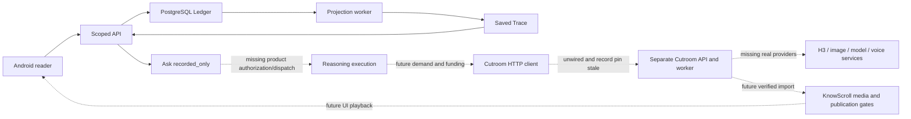

# One shared model of KnowScroll

Status: current navigation and steering protocol, #88, 2026-09-19. This is an index over existing
authorities, not another architecture. Start with [CHECKPOINT](../CHECKPOINT.md).

| Question | Current authority | What it does not prove |
|---|---|---|
| What are we building? | [Product definition](../product/definition.md), [v1 release contract](../product/v1-release.md), #72 | That it is implemented |
| Which architecture was selected, and why? | [Accepted ADRs](../decisions/README.md), [architecture index](../architecture/README.md) | That a deployment uses it |
| Who owns a responsibility? | [Component map](../architecture/component-map.json), scoped AGENTS/CLAUDE files | That all target components exist |
| What exists in source? | Exact Git revision plus [PROJECT-STATE](../PROJECT-STATE.md) and relevant code | Owner/runtime deployment |
| Which migrations are live? | Timestamped `schema_migrations` read from the named database, compared with immutable SQL checksums | Other databases or later moments |
| What executes now? | Observed listener/process build, configured DB, heartbeat, request/causal trace and selected provider adapter | A green CI run or hard-coded state flag |
| What changed, and why? | [Delivery history](delivery-history.md), PR/issue decisions and receipts | A chat summary's unstated assumptions |
| What happens next? | Checkpoint + assigned existing GitHub issue and Project status | An old worker's plan |
| What is historical? | Dated receipts, superseded ADR text, old handoffs, `architecture/target`, SSD archives | Current implementation instructions |

The imported `docs/migration-manifest.json` describes **historical document adoption**. It is
not the SQL migration ledger. SQL source is `packages/db/migrations`; deployment truth comes from
the selected database's `schema_migrations` table.

## Expected runtime and the current divergence

This diagram describes source paths and named gaps, not a currently running deployment. In the
Sept 19 observation the owner API itself did not answer and the projection heartbeat was stale.
The first observed divergence therefore depends on the environment: owner runtime stops at the
API; disposable tests execute farther; generated-video product flow remains unwired.

## A navigable steering record for every joined journey

Each assigned issue/receipt must record: desired user outcome; selected ADR and owner component;
expected UI → API → job → provider → storage → UI path; exact revisions/configuration and database;
actual path with causal IDs or sanitized traces; visible result/screenshots or media review;
first divergence; known risks; owner decisions pending; next smallest experiment.

Use explicit evidence levels: **source**, **implementation checks**, **fixture integration**,
**real local service**, **live provider/media**, **release UI**, **owner acceptance**. Passing one
does not imply the next. Label stand-ins, reused outputs and scripted observations. A rendered
video is not proof of H3 use; a provider call is not proof of acceptable content.

When reality contradicts a plan, record the contradiction and resolve which authority changes.
Never silently rewrite the old receipt, mutate an applied migration, or delete failure evidence.
Link superseding plans from their replacements. Avoid reading broad historical archives at startup.
