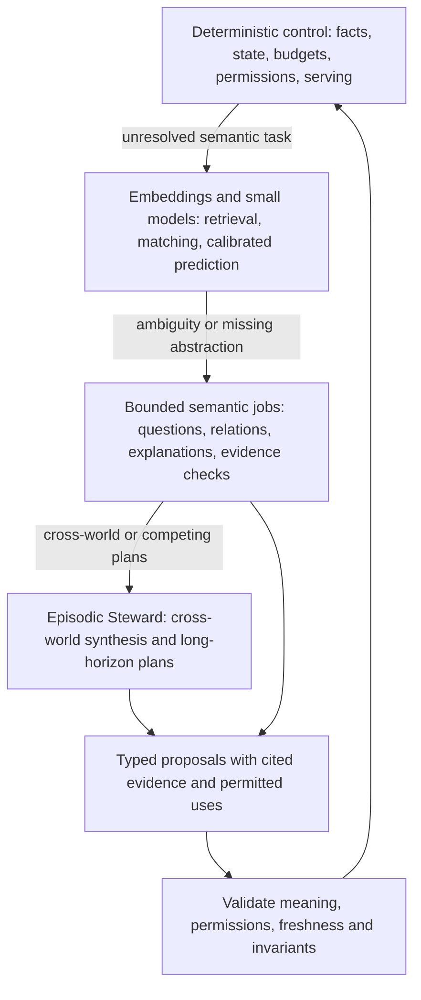
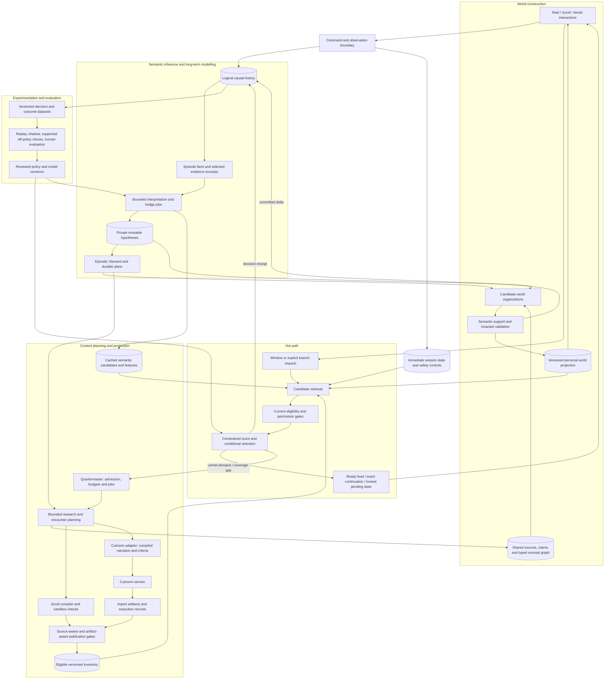

> Research snapshot from 2026-09-15. Findings informed target direction; provider/contract details may drift. Current decisions and pinned boundaries take precedence.

---
status: proposed
authority: architecture-research-review
scope: Independent review and proposed design; does not amend product authority, accepted decisions, or implementation.
source_snapshot: KnowScroll-v2 3e8991ea62ee5f5abb28ec8b9417fe292b961e95; Cutroom 401f36fa1d80bd309de29a6b9000818dba877f10
research_date: 2026-09-15
---

# KnowScroll core engine: critical architecture review

> **2026-09-15 extension — updated product scope and execution design.** Read [Persistent intelligence, shared execution](2026-09-15-RUNTIME-AND-GLOBAL-EXECUTION-REVIEW.md) for the 23-section harness, MiniMax M3, scheduling, generation and scaling review. It incorporates the founder's clarification: retain the complete worlds, rooms and inhabitants architecture; simplify deployment while supporting long-horizon investigations and multiple bounded agents. It supersedes this review's recommendation to postpone celestial machinery/agent societies as product scope, and refines the earlier runtime, recovery and Cutroom recommendations. The original analysis below is preserved as the preceding review snapshot.

**Reading paths:** [Verdict](#1-executive-verdict) → [failure cases](#4-what-is-likely-to-fail) → [proposed architecture](#14-proposed-architecture) → [v0.1](#16-what-should-be-built-for-v01-vs-postponed). For integration work, start with [Cutroom](#11-cutroom-reel-contract-review).

## 1. Executive verdict

**The current design is a useful control skeleton, but it is not yet sufficient to deliver the founding product.** It can organize observed activity, preserve reasons for decisions, ration generation, and create conservative geography. It does not yet adequately connect semantic interpretation, uncertain understanding, encounter design, recommendation, and personal world evolution.

The right response is **more precisely placed intelligence, not more persistent agents**. Keep fast deterministic serving and transactional state ownership. Add a bounded semantic pipeline that interprets encounters and selected interaction evidence, proposes conceptual bridges, compiles useful content plans, and supplies versioned features and candidates to the serving system. Keep the Steward as an episodic cross-world synthesizer and planner.

The slogan “nine ordinary programs plus one LLM” is inaccurate even as a description of the proposal. Cartographer naming/veto, Quartermaster drafting, research, editorial judgment, visual reconciliation, Scribe wording, citation verification, Ask, and residents already call models. Composer is explicitly not a subscriber in the event specification. The relevant design unit is a **decision with evidence, an owner, a deadline, and a failure policy**, not the number of named modules. [C01 §2; C03 §§2–5; C04 §5]

### Decisions recommended

| Disposition | Decision | Why |
|---|---|---|
| **Keep** | One logical causal history, typed proposals, materialized views, privacy fences, explicit branch routing | These make fallible intelligence governable and navigation recoverable. |
| **Modify** | Accounts, ranking objective, semantic candidate production, world transitions, Steward context | Current simplifications lose meaning or mistake interaction opportunities for independent evidence. |
| **Reject** | Marks/returns as the final objective; degree or hop distance as expansion; a system hub automatically meaning a foundational star | Each can optimize a measurable substitute while violating the product meaning. |
| **Replace** | The assumed Cutroom SDK integration | The current contract is a strict same-machine HTTP rendering service, not the older `warm/run/estimate/invalidate` SDK. |
| **Validate** | Semantic model quality, quiet-user experience, adaptive recommendation, world changes, actual generation latency | None follows from event replay or a successful schema test. |
| **Postpone** | Broad multi-agent societies, full celestial promotion machinery, learned end-to-end ranking, fleet infrastructure | The initial product is for the owner and a few friends. Prove one valuable loop first. |

**Preferred architecture:** a modular monolith with durable jobs, a shared evidence graph, separate personal observations and hypotheses, a small number of bounded semantic jobs, a constrained multi-stage recommender, a versioned world projection, and a narrow Cutroom adapter. At scale, partition execution and storage while preserving causal references; do not preserve a globally serialized physical queue.

**Evidence boundary.** The KnowScroll core-engine folder describes proposals. The recorded repository STATE is at Phase 0/validation gate; this review is not a live deployment audit. The current Cutroom contract reports 41 passing contract tests against a stand-in; that does not prove production video generation or all renderer behavior. Numerical examples below are calculations from published design rules, and the five journeys are constructed stress scenarios, not observations of real users. [L2; X1]

## 2. What KnowScroll is actually trying to build

### 2.1 The experience and the outcome

A person arrives for an effortless discovery. A Reel makes an idea immediate; a Scroll lets the person manipulate a mechanism, compare claims, follow sources, make a prediction, or question an explanation. Vertical movement discovers another path; horizontal movement continues, varies, deepens, or opposes the present one. Enter World locates the encounter in a persistent place; Return restores the previous position and context. Reels and Scrolls are the only consumption objects. [P §§2, 6–10]

The product is successful when these encounters change what the person later notices, asks, makes, predicts, discusses, or revises, including something they recognize about their own thinking. A larger map or a longer session is not that outcome. A quiet session with one consequential question can outperform a highly interactive session with many shallow branches. [P §§1, 16]

This requires two interacting models:

1. **A model of the subject matter:** what concepts, claims, mechanisms, traditions, disagreements, and sources exist, and how they relate.
2. **A provisional model of this person's encounter with that subject matter:** what was offered, encountered, requested, attempted, revisited, expressed, or corrected, and what remains unknown.

A third representation—the visible universe—expresses useful parts of those models. It is not itself a measurement of knowledge.

### 2.2 What can legitimately be inferred

The engine may infer that an explanation might help, that a question is recurring, that two paths may share a premise, or that a new area might be approachable. It needs to preserve several alternatives: replay might be confusion, visual pleasure, verification, or interest; a saved argument might be valued, disputed, or saved for someone else.

It must distinguish **exposure**, **current intention**, **durable curiosity**, **observed reasoning**, **possible understanding**, and **explicitly expressed positions**. Political history consumption does not license a political-identity inference. Fitness consumption does not license a health or body-image diagnosis. The founding laws explicitly prohibit those hidden character judgments. [P Laws 4, 5, 11; §5.2]

The system can know a source was opened. It cannot know the source was evaluated well. It can record a correct prediction under one set of conditions. It cannot turn that into general mastery. Missing evidence should remain missing.

### 2.3 How the universe should emerge

Topics are retrieval entry points. Concepts identify reusable meaning. Claims state something that can be supported, disputed, corrected, or scoped. Stories organize a sequence of encounters; they are not proof of conceptual structure. A planet is a substantial navigable domain; a star represents an explanatory foundation; a moon or constellation represents a meaningful connection; a black hole holds an unresolved question or contradiction; a ruin preserves supersession. [P §4]

These structures should emerge because a new representation makes the person's paths more intelligible and usable. For example, repeated encounters with Rome may first produce a historical place. A researched comparison of institutional transitions may expose a connection to modern governance. That connection can exist as a proposed route before there is evidence that the person cares about it or understands it.

The world may also change while the person is absent: a source is corrected, a room finds a counterexample, or an existing question receives a new explanation. Those are changes in available evidence and world activity. They are not changes in the person's knowledge. [P §§4.2, 5.5]

### 2.4 What should appear next

Selection should consider the present request, continuity, credible depth, approachable surprise, serious alternatives, unresolved questions, and useful return. Exploration has two purposes: expose the person to worthwhile possibilities and reduce uncertainty about which encounters help. These purposes overlap, but the system must not make the person perform work merely to improve its model.

Exploitation means offering a path already likely to be useful, not repeating the dominant topic indefinitely. Adjacent exploration follows a grounded bridge. Distant exploration uses diverse external entry points rather than assuming that everything valuable is near today's graph. Over weeks, the system should reopen dormant questions, revisit claims with new evidence, and notice when its own supply and map have narrowed the available choices. [P §§5.3–5.4, 16]

## 3. What the current architecture gets right

The current design has substantial strengths. A review that simply asks for agents everywhere would discard them.

- **Serving and expensive reasoning are separated.** A ready inventory, branch preparation, and a bounded window are the right foundation for an immediate feed. A language model need not inspect every candidate on every swipe. [C08; C15]
- **Facts, personal hypotheses, and shared evidence are conceptually distinct.** Exposure lineage, evidence families, permitted uses, corrections, and privacy epochs are unusually valuable foundations. [C04–C06]
- **Models propose and code commits.** This is the correct authority boundary. Semantic correctness still needs additional validation, but changing the writer to an agent would make matters worse. [C03]
- **There is a real attempt to govern feedback loops.** Supply concentration, agent self-reinforcement, social origin, map-induced routes, and judge convergence are all named. The missing part is proving the dampers work, not discovering that loops exist. [C16]
- **Persistence means durable identity and state.** The Steward and residents are not specified as continuously running processes. Empty nights can avoid model calls. [C10–C12]
- **World identity is preserved across changes.** Stable IDs, lineage, hysteresis, and exact return are better than periodically redrawing clusters and calling that personal evolution. [C07]
- **Generation is tied to a gap and competes with retrieved material.** Cost already paid should not improve ranking. Generation should create a missing encounter, not fill an arbitrary quota. [C09; C14–C15]
- **The initial deployment stays small.** SQLite and a job table are appropriate starting choices for the stated user count. They do not prevent later partitioning if ownership boundaries are clear. [L2 D-001–D-002; R16]

Keep these properties. Improve the evidence and semantics flowing through them.

## 4. What is likely to fail

### 4.1 The system can become a click-oriented intellectual feed

C08 defines immediate success as a mark and delayed success as a return. This is easier to compute than mental-model expansion, but it is still an engagement objective. Ambiguous cliffhangers, repeated “choose a branch” prompts, and unresolved explanations can all increase marks. An excellent complete explanation might produce none.

The proposed utility is also not a model of the stated objective: `fit × expansion × quality + continuity − penalties` has no direct estimate of marks or returns. The family bandit and the item scorer optimize different quantities. This is acceptable only if presented as an explicit baseline, not a solved objective. [C08 §§1, 5–6]

**Consequence:** the model may become excellent at generating evidence of its own success. Track marks as observations and intermediate predictions; evaluate useful residue, recognized value, delayed use, correction responsiveness, and regret separately.

### 4.2 “Voluntary” is not “independent of the recommender”

The claim that structural evidence cannot be increased by showing more content is false. More offers create more opportunities to branch, save, ask, and enter. Source diversity also does not make a person's choices causally independent: the system can offer two independent sources itself.

A constructed user follows every offered horizontal bridge on multiple days, keeps items, and returns through recommended cards. Both children can meet C07's birth criteria, and the offered branch supplies the required route. Two separated evaluations then allow ignition. This contradicts C16's expected result that an offered-only user who marks everything never ignites a system. The rule distinguishes clicks from autoplay; it does not distinguish autonomous exploration from offered exploration. [C06 §4; C07 §4.4; C16 L1, L8, §4]

A concrete counterexample can satisfy the published numeric rules without any unoffered discovery:

| Evidence | Constructed schedule | Gate satisfied |
|---|---|---|
| Parent P | Primary-concept episodes with marks on days 0, 1, 2 and 8; two source families | Birth by day 2; four active days; eight-day span |
| Child R1 | Separate primary-concept episodes on days 3, 4 and 5; at least one mark each; two families | Three episodes, three active days, at least three marks, mass above 4 |
| Child R2 | Equivalent episodes on days 6, 7 and 8 | Same independent concept-credit thresholds |
| Connection | User takes a system-offered branch between the two genuine subtopics | An allowed `branch` or `bridge_used` route |
| Evaluation | Proposal passes on days 8 and 9 | Parent age exceeds three days; evaluations are 24 hours apart |

Each marked daily episode can contribute 2 initially and 4 on later separated returns before decay; the final child masses comfortably exceed 4. All encounters and routes can have been offered by the system. If the semantic veto accepts the genuine distinction and return anchors survive, **no listed gate rejects the shared recommendation origin**. This is a logical counterexample to the claimed guarantee, not an executed replay test.

Keep the behavior and its causal origin. Do not claim independence that the data cannot identify.

### 4.3 The semantic input is destroyed before the semantic reasoner sees it

“Why do people trade institutional checks for short-term stability?” and “Which Roman soldiers wore this helmet?” might both become counts near Roman history. C10 expressly excludes the original wording of Ask from the digest, and its read tools do not provide a general evidence-excerpt retrieval surface.

Once distinct questions have been reduced to the same representation, a stronger model cannot reconstruct the lost distinction. Giving the Steward more tokens does not fix this. Preserve selectively retrievable, permissioned excerpts and typed question/argument records, with original context and counterevidence. [C10 §§5–6]

### 4.4 Semantic reasoning arrives after the candidate space has already closed

The Cartographer primarily proposes from taxonomy and route structure; its model can name or veto but cannot change members or invent a missing concept. The Composer primarily follows short graph paths. Model-generated hypotheses cannot directly supply ranking priors except through restricted rule paths. Useful abstract connections therefore depend disproportionately on the Steward's limited research/probe throughput. [C06 §10; C07 §§3, 6–7; C08 §3]

The repair is not to give models direct ranking control. Let semantic jobs propose evidence-backed relations, encounter candidates, and bounded suitability features before numeric selection. Keep acceptance and publication separate.

### 4.5 The world grammar drifts away from product authority

The founding star is an explanatory foundation. C07 makes the parent of any qualifying system its rendered star and demotes foundation to a brightness flag. A Technology hub is not necessarily a concept that explains Robotics and Vision. This is a substantive change of meaning, not a harmless implementation detail. The same design privileges a single containment parent and nearest taxonomy ancestor, which can hide cross-disciplinary meaning. [P §4; C07 §§1–2]

Preserve a primary navigation parent for orientation, but allow several semantic memberships and keep hub role separate from foundational-star meaning.

### 4.6 Quiet users either disappear or distort salience

An exclusively passive user never gains an anchored place, regardless of repeated active viewing across weeks. Yet passive episodes still accumulate mass, and mass is a calibration target. One passive episode per day converges to about **15.40 mass units** under the proposed 21-day decay. A place that already exists can remain prominent through passive repetition even when no new deliberate return occurs. [C06 §§3–5; C08 §6]

The product need not invent understanding for this user. It does need an intelligible world of encounters and opportunities. Separate “encountered territory” from “sustained exploration,” and separate both from understanding.

### 4.7 Quality gates can certify well-labelled error

A claim reference proves a link exists, not that the source supports the statement. A `claim_coverage ≥ 0.6` threshold can leave a consequential false claim in the uncovered portion. Two sources from different tiers need not be independent or correct. An available branch button is not necessarily a meaningful cognitive opportunity. [C14 §§2–3]

Verification must inspect the important claims, relation semantics, and rendered content. Uncertainty and known limitations must survive into publication. Good schemas are necessary but not sufficient.

### 4.8 The integration assumes a different product from current Cutroom

The September 9 integration assumes projects, refs, warming, tiered edits, deadlines, invalidation, playable events, and an epistemic hook. The current contract supplies strict `POST /v1/runs`, status, polling, result, record, and cancellation. Sources and truth state stay in KnowScroll; results are local paths. Continue/edit/reference continuity are not first-class inputs. [C15; X1–X2]

This is a build-blocking compatibility issue. More prompt fields in KnowScroll cannot create missing renderer capabilities.

### 4.9 Operational elegance is being mistaken for a durability proof

A lease and a completed-step journal do not close the crash window after a provider accepts a request but before the result is persisted. A single monotonically increasing sequence does not prevent stale semantic proposals. Replaying seven days into an empty database does not reconstruct years of accumulated state. [C03 §6; C04 §§4, 9]

The older video-harness design already specifies `submission_unknown`, provider lookup, fencing and a stop when neither lookup nor idempotency is available. Preserve those mechanisms. The gap is that C03's generic job summary and the current external contract do not establish their end-to-end application to every model/provider effect. These are repairable engineering contracts, detailed in §6. [L4, `03-HOW-IT-WORKS.md` §3.1]

## 5. Component-by-component critique

### 5.1 Ledger and reducer

**Current role:** canonical ordered events, causal references, epochs, consumer cursors, and idempotent folds. **Valid assumption:** durable facts and decisions are a strong audit foundation. **Invalid extension:** every operational detail must travel through one serialized dispatcher, or one event log by itself guarantees recoverability.

Keep schema validation, append, sequence allocation, deduplication, cursor updates, version checks, and atomic state transitions deterministic. No LLM belongs here. Use a command boundary for authorization and preconditions, then record committed facts. Distinguish a model proposal from an accepted world delta in the event type system. Persist versioned reducer inputs, external outcomes, and a small causal decision record. Detailed job streams and media bytes can live elsewhere with stable references. [C03–C05]

**Timing/state:** small durable writes online; large projections and audit analysis asynchronous. State includes inbox/outbox records, projection checkpoints, aggregate versions, producer dedupe keys, and retention policies. The hard problems are atomicity and ownership, not meaning.

### 5.2 Composer

**Current role:** source, hydrate, filter, score, diversify, serve eight descriptors; route explicit branches separately. **What works:** staged retrieval, hard eligibility, consistent navigation grammar, and logged decisions. **What breaks:** hop-based expansion, scalar mass fit, poorly specified viability estimates, competing quotas, and uncomputed slot probabilities after Thompson sampling and reranking. [C08]

Keep eligibility, caps, distinctness checks, conditional sampling, fallback, and receipts deterministic. Use embeddings for candidate retrieval; a small calibrated classifier or ranker can estimate appropriateness, likely continuation, and fatigue once data supports it. Cached semantic features should describe what an encounter explains and what it requires. The Composer need not call a generative LLM during serving.

**Timing/state:** online, with an initial server-side p95 target under 200 ms; a warm-cache goal under 50 ms is plausible but unmeasured. It reads session state, compact personal evidence features, ready inventory, semantic candidate caches, current permissions, and a versioned policy. Novelty and comprehension are not inferred from graph distance alone.

### 5.3 Accounts

**Current role:** group observations into episodes, assign weighted concept credit, apply decay, and maintain viability. **What works:** distinguishing exposure from actions and limiting duplicate credit. **What breaks:** one weight cannot encode request meaning, confidence, source dependence, comprehension, or the opportunity to act. [C06]

Keep arithmetic, episode/session bookkeeping, duration normalization, late-event handling, and separate signal channels deterministic. Use small models for concept/entity resolution, action-intent classification, and language normalization. Escalate ambiguous text or a potential cross-world pattern to a bounded LLM job. Store its interpretation separately; never rewrite the raw action into the inferred meaning.

**Timing/state:** observed facts and temporary intent update online; semantic annotations arrive nearline; durable hypotheses update only with adequate evidence. Preserve requests even if supply fails: “wanted a counterargument” is valid intent before a counterargument is served. Understanding remains unknown unless suitable reasoning evidence exists. Credit maps need versioning and exposure spans; mentioning quantum mechanics at the end of an unwatched clip should not credit it equally with a viewed explanation.

### 5.4 Cartographer

**Current role:** numerical eligibility, taxonomy placement, routes, occasional clustering, naming/veto, stable identity, and morphology transitions. **What works:** hysteresis, no false mastery, return preservation, causal classes. **What breaks:** taxonomy is treated as personal geography, repeated evaluations can be counted as fresh support, and the semantic call sees titles rather than enough argument/evidence content. [C07]

Keep identity assignment, layout stability, relation constraints, version checks, rate limits, and lifecycle state deterministic. Embeddings and graph algorithms can propose clusters. Bounded LLM jobs should propose alternative semantic organizations, explain inclusion/exclusion, and cite evidence for a bridge or foundational role. Compare each proposal with leaving the representation unchanged. A human-like persistent Cartographer agent is unnecessary.

**Timing/state:** asynchronous, usually minutes to hours; display at an orientation boundary. Inputs include typed concept/claim relations, observed routes, proposal evidence, competing partitions, and the current chart version. Separate newly available material from personally explored material. A model endorsement does not count as an independent later observation.

### 5.5 Quartermaster

**Current role:** forecast supply needs, select retrieve/edit/generate, reserve budget, draft briefs, and manage the harness. **What works:** explicit unmet demand outranks speculative demand; generation has a reason; ready inventory hides latency. **What breaks:** “a new explanation is needed” is semantic, and the current branch horizon models kind conditional on branching rather than the unconditional probability of branching at all. [C15; C06 §9]

Keep budgets, priorities, leases, deduplication, expiry, cancellation and scheduling deterministic. Use a small calibrated model for demand and time-to-use when sufficient observations exist. Use a bounded content planner for educational intent, explanation alternatives, source coverage, narrative continuity and criteria. The job should return a compiled encounter plan, not just attractive beats.

**Timing/state:** admission online; planning nearline/asynchronous; forecast periodically. Memory consists of unresolved requests, capsule revisions, inventory equivalence evidence, content plans, reservations, actual costs, and measured time distributions. An existing item on the same concept is not necessarily a valid substitute. Explicitly selected opposition or a difficulty change requires semantic compatibility.

### 5.6 Gates

**Current role:** rights, publication eligibility, evidence/truth and editorial quality. **What works:** multiple gates and a quality vector prevent some compensating-score failures. **What breaks:** counting links and applying a scalar witness threshold cannot establish factual fidelity. [C14]

Keep mandatory policy and lifecycle checks deterministic. Use specialized classifiers for inexpensive routing and obvious failures. Use source-grounded entailment checks for claims; use multimodal models for rendered visuals, speech and chronology; use bounded editorial reasoning for coherence and meaningful opportunity. Calibrate each task separately and allow abstention. A stronger generic agent is not a substitute for the right evidence.

**Timing/state:** publication-blocking asynchronous checks, with cached results bound to artifact hash, source revisions, and policy/model versions. Retain observations, verdicts, coverage, uncertainty, and required labels. Claim corrections invalidate dependent releases immediately; finished rendering never implies eligible publication.

### 5.7 Scribe

**Current role:** turn committed deltas into Chronicle sentences and invitations. **What works:** it narrates a receipt rather than inventing the event. **What breaks:** free prose can upgrade “you encountered” into “you understand,” and another model's rewrite does not eliminate overclaiming. [C03; C10]

Default to deterministic templates for common changes and corrections. Use a small language model for genuinely complex summaries, constrained to supported event facts and permitted verbs. Validate referenced objects and the difference between world activity and personal change.

**Timing/state:** asynchronous, cached before display. Store the exact delta/evidence IDs, output text, approved wording policy, and any model receipt. A separate persistent Scribe is overengineering. The Kiosk/Hybrid prototype copy includes “you lean here” and “you changed your mind”; these phrases require explicit, scoped position/revision evidence. They must not be populated from viewing or source-opening counts. [L6]

### 5.8 Projector

**Current role:** construct authorized social snapshots and deterministic overlap/complement/bridge views. **What works:** private hypotheses and raw history stay private. **What breaks:** different saved claims need not represent opposing personal positions; four hours outside a friend's universe does not magically remove social influence. [C13]

Permissions, membership, revocation, snapshotting and ownership must remain deterministic. Embeddings and bounded semantic comparison can help describe a bridge or a disagreement **between artifacts**, using only authorized material. Never pass private inference to a model as a shortcut to building a projection.

**Timing/state:** cached snapshot reads online, semantic comparison asynchronous. Persist policy versions and dependency scope. Social discovery is valid contextual evidence immediately; preserving its origin is better than setting its personal relevance to zero until a later arbitrary conversion. Broader behavioral meaning remains uncertain.

### 5.9 Keeper

**Current role:** manage rooms, wake residents, track credits, update the ladder, select participants, and enforce episode caps. **What works:** a deterministic room manager avoids another expensive personality. **What breaks:** “new source,” “different position,” “useful reframing,” and “test narrowed the question” cannot all be established by counters. [C11–C12]

Keep scheduling, credit accounting, commitments and authorized transitions in code. Let bounded semantic evaluators propose novelty/disagreement/test-result interpretations. Use source-family dedupe and small pairwise classifiers first; escalate ambiguity. A settled result requires the room's explicit resolution contract, not a number of voices or a forced disagreement quota.

**Timing/state:** bookkeeping immediately, semantic evaluation asynchronously. Store question versions, positions, evidence dependencies, commitments and budgets. Credit is an internal budget hint, not a user-facing score or an obligation to feed inhabitants. Reserve a bounded discovery allocation so unfamiliar questions do not starve solely because they have no marks yet.

### 5.10 Verifier

**Current role:** compare a cited statement with a source locator and issue a verdict. It is already a model gate, not an ordinary deterministic program. [C12 §§1, 5]

Validate identifiers and source integrity in code. Small entailment models can triage straightforward passages; difficult qualification, causal inference, historical interpretation or visual claims need stronger bounded reasoning or human review. Verify source independence through provenance, not domain count. A mathematical argument may need executable checking; a simulation needs its assumptions and test record. Source support is not universal truth.

**Timing/state:** asynchronous before release, except reuse of a still-valid cached verdict. Keep exact claim, source snapshot and locator, support/refutation/insufficient result, scope, version, and uncertainty. A wrong acceptance triggers dependency invalidation and a correction; it must not be buried as an old judge score.

### 5.11 Steward

**Current role:** cross-universe pattern noticing, research/probe proposals, structure endorsement, allocations, memory, and invitations. **What works:** episodic identity, bounded tools, and typed output. **What breaks:** a sparse digest is asked to support deep inference; absence of a correction is treated as calibration; one agent is made the discovery bottleneck while its semantic output has weak serving pathways. [C10]

Keep one logical Steward identity if it helps continuity. Implement it as bounded jobs with durable plan state, selective evidence retrieval, and a typed proposal registry. Routine interpretation, claim extraction and brief construction belong to specialized job types that can run without waking it. The Steward synthesizes across them and revisits unresolved hypotheses. It should not adjudicate its own semantic correctness or commit state.

**Timing/state:** event-triggered nearline synthesis and periodic consolidation, only when new evidence or a due plan makes work useful. Model-owned memory remains evidence-linked, revisable and deletable. Code-owned memory includes facts, budgets, permissions and pending commitments. Detailed design is in §10.

### 5.12 Research, Scrolls, and the missing semantic production layer

The eleven names omit a central product responsibility: designing an encounter that actually lets a person reason. Research must produce supported claims and competing interpretations. A content planner must choose an explanation, prerequisites, example, playable interaction and possible continuation. A Scroll compiler must turn that into safe, tested blocks. Cutroom only handles the audiovisual realization of a compiled brief.

Use bounded LLM calls for synthesis and composition, retrieval/embeddings for finding existing material, and deterministic compilers and sandboxes for delivery. Persist the semantic intent, evidence, expected affordance and evaluation rubric. This layer should be a first-class part of the architecture, not incidental text inside Quartermaster beats.

## 6. Does one Ledger + ten subscribers hold up?

### 6.1 Yes to one logical history; no to mandatory global serialization

A logical Ledger is a common event vocabulary plus a reconstructible causal history. It can encompass a user event stream, a shared-substrate stream, room streams, and linked provider execution histories. That does not require one physical topic, one database, or one reducer process for every user.

For five users, retain one SQLite database, short transactions, a durable job table, and materialized projections. WAL permits concurrent reads and a writer, but only one write transaction at a time. Long work must never hold that transaction. [R16]

At scale, partition personal streams by user/universe, shared rooms by room, and substrate updates by their own authority. Preserve order within an aggregate. Cross-stream references capture causality; a globally meaningful `seq` is no longer promised. Physical movement is not merely a deployment change: subscription checkpoints, shared ownership, consistent snapshots and event contracts need a deliberate migration. Kafka's transactional boundaries likewise do not extend automatically to arbitrary external effects. [R17]

### 6.2 Required execution contracts

| Concern | Gap or failure case | Contract to build |
|---|---|---|
| Volume | Every playback heartbeat and every SDK detail enters the same log | Compact visible intervals into semantic observations; retain bounded diagnostics separately; link detailed run streams. |
| Ordering | Arrival order differs from event time; events from two devices race | Preserve both times, producer session/sequence and late-arrival rules; never rewrite committed history to sort clocks. |
| Idempotency | A retry receives a new ULID | Client command ID and content hash; unique producer/scope key; same key/different body is a conflict. |
| Atomic folding | State updates succeed but `applied`/cursor writes fail | In one DB transaction: check dedupe, update projection, append emitted facts/outbox rows, record application, advance checkpoint. |
| Dispatch | Crash after wake enqueue but before dispatcher cursor advances | Unique `(subscription, event)` dispatch key; persist enqueue and dispatch checkpoint atomically. |
| Coalescing | News about region A is replaced by news about B | Retain a dirty-scope set or high-water mark; worker drains changes through a captured revision and reschedules if newer work exists. |
| Slow consumers | One poisoned event or full FIFO blocks unrelated users | Per-domain/user progress, quarantine with recorded reason, bounded retries, deadlines and backlog alarms. Never silently drop a direct request. |
| Long-running jobs | Lease expires while old worker is still running | Renew leases and use attempt fencing tokens; only the current token may commit. |
| Provider ambiguity | Provider accepts before worker crashes; output was not journaled | Persist a stable request intent before calling; use provider idempotency or lookup; unresolved outcome stays `unknown`, not automatically retried. |
| Stale reasoning | Source corrected or user muted topic while model was running | Proposal carries epoch, relevant evidence/policy revisions and expected aggregate versions; revalidate at commit. |
| Concurrent deltas | Two proposals move the same region under different parents | Compare-and-swap on affected versions, validate the union of dependencies atomically, reject/rebase the loser. |
| User snapshots | Composer reads Accounts at n and Chart before a correction | Capture a coherent DB snapshot or explicit version vector; current suppression/permission checks override stale recommendation caches. |
| Model changes | A new model rewrites the interpretation of old evidence | Append new inference versions with supersession; keep old outputs for historical explanation where retention permits. |
| Replay | Seven-day tail lacks older accounts, pending jobs and graph state | Start from a verified checkpoint immediately before the tail; replay to the same logical time and dependency versions. |
| Side effects on replay | Rebuild triggers generation, notifications or budget reservations | Replay mode folds recorded outcomes into isolated projections; no outbound effects. Counterfactual re-inference is a different experiment. |
| Deletion | “Append-only” files contain deleted personal text | Delete/tombstone scoped payloads, vectors, prompts, excerpts, journals, caches and backups per policy; retained envelopes must themselves be reviewed for personal data. |
| Experimentation | New model sees tomorrow's corrected claim during yesterday's evaluation | Pin corpus, inventory, feature and inference versions as known at decision time; track both effective and recorded timestamps. |

Durable execution makes retry management easier; it does not make a non-idempotent external call safe to repeat. This limitation is explicit in durable-system engineering practice. [R18]

### 6.3 Event scale: useful estimates, not a reason to adopt a broker today

The design estimates 200,000 events per heavy user-year. At 30 minutes per day, **one emitted event per second alone produces 657,000 events/year**, before decisions and derived events. Whether that occurs depends on client batching and payload design; the documentation should say which it assumes. [C03 §4; C05 §12]

Illustrative scale scenario: one million daily active users × 500 compact events/day = **500 million events/day**, averaging about **5,787 events/second**. At 1 KB per event that is approximately 500 GB/day before indexes, replication, receipts and media. A tenfold busy-hour multiplier is a planning scenario, not a measurement. This belongs in partitioned storage and independent worker pools, not a single SQLite writer.

Receipts can dominate raw events. If eight families each return 100 candidates and a recorded candidate uses 300 bytes, that is about **240 KB per window** before full text or embeddings. Persist a compact decision record and immutable references to sampled/debug candidate detail. Keep exact policy support and probabilities for randomized decisions; do not discard the data needed to evaluate them merely to reduce storage.

### 6.4 An append-only cause graph is not an inference engine

A chain longer than 32 is not necessarily a loop. A long series or years of corrections legitimately has deep ancestry. Conversely, short events can repeatedly re-trigger each other while each link remains shallow. Replace ancestry-length rejection with bounded work per root episode, idempotency, explicit suppression of self-trigger classes, and time/budget limits. Keep causal edges for explanation. [C04 §4]

Likewise, one reducer may own commit discipline without one giant function owning all domain meaning. Domain reducers can be synchronous library functions inside one transaction. Forbidding every direct module call encourages artificial events and makes local invariants harder to express. Prohibit ungoverned side effects and cross-domain writes, not useful function calls.

### 6.5 Counterfactual evaluation needs more than replay

Distinguish four things:

1. **State replay:** reproduce recorded state from the same events and versions.
2. **Policy replay/shadow:** compute what another policy would choose on recorded contexts.
3. **Off-policy outcome estimation:** estimate results for supported alternative actions using the actual logging probabilities and appropriate assumptions.
4. **Closed-loop simulation:** invent a response model and evolve hypothetical users; useful for discovering failure modes, not proving real outcomes.

RecSim offers a useful way to make sequential response assumptions explicit and stress-test feedback loops. Its simulator remains an assumed environment. A model-generated simulation cannot establish human learning. [R25] A counterfactual generated Reel never shown historically has no observed reward. Source corrections and deleted records may make some historical reconstructions unavailable; report that explicitly.

## 7. Where language models should and should not be used

### 7.1 Four levels, with escalation based on the decision



This is not a mandatory four-stage call chain. Most facts stop at level one. Most candidate retrieval stops at level two. A difficult explicit question may start at level three. The Steward coordinates exceptional synthesis instead of becoming the route through which all intelligence must pass.

| Decision | Minimum useful intelligence | Escalate when | Never delegate to model authority |
|---|---|---|---|
| Deduplicate a play or charge | Code | Never | Final count/charge ledger |
| Match “Augustus” to an entity | Lexical match + embedding/entity model | Context implies a different person or new concept | Canonical ID creation without validation |
| Classify “show a different explanation” | Parser or small classifier | Compound or ambiguous request | Ignoring the explicit request |
| Find similar sourced material | Embeddings + lexical retrieval | Similarity hides an important distinction | Publication approval |
| Infer institutional-transition abstraction | Bounded LLM over selected episodes and content | Competing cross-world hypotheses need comparison | Personal political identity |
| Predict near-term branch demand | Smoothed statistics, then small learned model | Calibration poor; use conservative prior | Spending beyond reservation |
| Propose a bridge or explanation | Bounded semantic reasoning with sources | Hard causal or disputed relation | Treating analogy as established equivalence |
| Check claim support | Small entailment model for triage | Nuance, negation, weak evidence, visual assertion | Truth promotion solely from confidence |
| Allocate a daily budget | Code; optional planner proposals | Many competing useful plans | Cap changes |
| Commit world structure | Code + verified semantic proposal | Novel semantics require review | Direct database mutation |

Embeddings are valuable semantic indices, but similarity is not support, contradiction, prerequisite or personal understanding. Sentence-transformer documentation describes similarity computation, not those stronger semantics. [R13]

### 7.2 The Roman-history abstraction, correctly scoped

The sequence `Republic → Caesar → collapse → Augustus` is compatible with several explanations: an interest in biography, chronology, institutions, warfare, visual reconstructions, or political transitions. Content understanding can detect institutional themes even without personal text, but the personal hypothesis must remain weak.

A bounded job should return something like:

```json
{
  "kind": "conceptual_bridge_candidate",
  "fromConcepts": ["roman-republic", "augustan-transition"],
  "toConcept": "institutional-concentration-of-power",
  "relation": "comparative-mechanism",
  "evidenceRefs": ["encounter:E12:claims", "episode:E17"],
  "alternatives": ["biographical narrative", "chronological continuation"],
  "permittedUses": ["candidate-retrieval", "research-planning"],
  "forbiddenConclusion": "personal political identity",
  "expiresAfterEvidenceChange": true
}
```

The object proposes a path, not a diagnosis. Retrieval finds several grounded comparisons. Selection offers an understandable bridge with “Why this appeared?” tied to the actual path. Later behavior can support, reject or leave the hypothesis unresolved. The visible world changes only when the connection is useful enough to represent, with a separate causal label for researched availability versus personal exploration.

### 7.3 Smaller models need task-specific evidence

Start with embeddings and lightweight matching where the output is a shortlist. Use small classifiers where labels are narrow and a reviewable evaluation set exists. Do not use an LLM's confidence as a calibrated probability. Route ambiguity and high-impact mistakes to a stronger model, further evidence, or review.

Recent small-model judge research distinguishes binary correctness from open-ended quality: a model's strength on one does not establish the other. Bias-mitigation research also remains benchmark-specific. These results support measuring tasks separately, not choosing one “smart enough” verifier for everything. [R22–R23]

## 8. Recommended recommendation/learning algorithm

### 8.1 An objective family rather than one convenient proxy

Treat the true outcome—richer, more coherent and revisable mental models with preserved agency—as partly latent. Optimize a declared vector of observable outcomes and constraints, and keep its limitations visible to operators.

**Outcome vector over an appropriate horizon:**

- recognized usefulness or worthwhile discovery, when voluntarily reported;
- delayed use, return for a new reason, or a carried question/artifact;
- grounded connections and serious comparison with alternatives;
- observable reasoning revision or transfer in an embedded activity, when available;
- meaningful frontier encounters over weeks;
- fatigue, regret, repetition, harmful inference and correction burden.

YouTube satisfaction research supports collecting voluntary satisfaction evidence alongside interactions, rather than assuming interactions contain the whole objective. Its learned/imputed satisfaction estimates remain predictions, and satisfaction itself does not establish understanding. [R24]

Clicks, branches and saves are intermediate signals. They predict these outcomes imperfectly. Opening a source is evidence of source access, not truth-seeking competence. Revising a prediction is useful evidence only with its question, assumptions and explanation; agreement with the system is not a desired label.

A practical serving formulation is:

```text
Choose an eligible slate S to maximize estimated, bounded usefulness:

J(S | context) = Σ_i [wU·U_i + wC·C_i + wD·D_i + wR·R_i
                     + wN·N_i + wI·min(I_i, I_max)]
                − redundancy(S) − fatigue(S) − unsupported_leap(S)

subject to:
  current permissions, suppression, evidence and artifact gates;
  acceptable interestingness and accessibility;
  bounded repeated-topic share and protected exploration support;
  readiness and operating budgets.
```

Here `U` is useful-encounter suitability; `C` continuity to the chosen path; `D` depth or conceptual connection; `R` a relevant later-return opportunity; `N` meaningful novelty; and `I` expected information about a permitted uncertainty. In v0.1 these are **explicit rubric features and hypotheses**, not calibrated numerical promises of learning. Weights are versioned developer policy, not user profile sliders.

Do not optimize the count of planets, the model's confidence, or agreement with its claims. Hard safety/source constraints cannot be traded away for an aggregate score. Interestingness is assessed conservatively as a constraint; an uncalibrated estimate must not exclude all cold-start frontier material.

### 8.2 Candidate generation

Retrieve candidates through independent routes, then deduplicate their provenance:

1. Exact requested continuation, when applicable.
2. Same question with a different explanation, example, perspective or difficulty.
3. Unfinished threads and familiar domains with new material.
4. Grounded semantic bridges, including analogies with explicit limits.
5. Diverse distant discovery from a reviewed external catalog and research proposals.
6. New evidence bearing on a prior encounter or prediction.
7. Dormant questions and optional re-encounters.
8. Gated room artifacts and, later, authorized social material.

Use lexical search, stable concept relations and embeddings together. Precompute content embeddings and relevant neighborhoods. Retain multiple long-term interests and select relevant episodes for each candidate rather than averaging the whole person into one vector. YouTube's candidate/ranking split, Meta's cached multi-stage retrieval, and TWIN V2's target-conditioned history compression are useful patterns; their engagement objectives and industrial data assumptions do not transfer. [R1–R3, R5]

Monolith adds a complementary lesson: fresh features and consistent training/serving representations matter as interests change. Borrow freshness and version discipline; its large-scale embedding machinery and industrial recommendation results do not justify a TikTok-like reward objective here. [R4]

A diversity reranker cannot discover something omitted by every candidate source. Audit retrieval coverage before adjusting ranking weights.

### 8.3 Concrete baseline selection

For the initial small catalog, use bounded candidate pools and a transparent score. Do not train a personal deep ranker on five people. An initial recipe is:

1. Read current scope and immediate intent; apply current mute/correction controls.
2. Gather ready candidates and cached semantic plans; log shortages separately.
3. Reject ineligible items and exact duplicates. Treat repetition of a concept differently from repetition of the same argument or rendering.
4. Score the remaining candidates with rubric features and conservative priors.
5. Construct each slot from a feasible candidate set that leaves remaining constraints satisfiable.
6. Sample with a known distribution and record the probability after exclusions and prior slots.
7. Persist the window and versioned context before serving; later record actual visibility/exposure.

For a slot with feasible set `F_k`, one implementable policy is:

```text
p_k(i) = (1 − ε_k) · softmax(score_i / temperature over F_k)
         + ε_k · exploration_distribution(i | F_k)
```

The exploration distribution can use only designated eligible discovery candidates, while the softmax gives supported alternatives positive probability. If no eligible exploration candidate exists, log the coverage failure and use the declared fallback distribution (for example, `ε_k = 0` for that slot); do not divide by an empty set or claim the exploration target was met. Floors, weights and quotas are experimental policy—not inherited truths. If feasibility is empty, relax aesthetic/form targets first, preserve evidence and privacy gates, log the shortage, and return fewer items or a clear rest state if necessary.

An eight-item slate can be impossible under current quotas. With only two available places and a maximum of two items per place, at most four items fit. The specification needs a fallback order, not another arbitrary penalty. The frontier share must also be measured at actual exposure: a protected slot always placed eighth may never be seen.

### 8.4 Exploration and uncertainty

Keep distinct uncertainty about the **content**, the **personal hypothesis**, and the **outcome prediction**. High factual uncertainty is not automatically a good recommendation. A conceptual bridge with weak personal evidence can still be offered if the content itself is well-grounded and approachable.

Use contextual bandits only for a bounded decision, such as which eligible explanation family to offer. Begin with fixed, auditable randomization; adopt learned family/context policies after support and calibration exist. The current `(scope, family)` Beta posterior is mostly a contextual partition of a simple bandit, not a full session-aware model. Family success also changes with inventory and user state.

Thompson samples and normalized sampled scores are not automatically the marginal probabilities of the actions ultimately selected through quotas and MMR. Use a sampling algorithm whose logged distribution is actually implemented, or compute/estimate Thompson action propensities explicitly and disclose approximation. Do not claim off-policy validity from logging a number named probability. [C08 §6; R6–R7]

### 8.5 Delayed outcomes and attribution

Maintain one outcome record per eligible exposure/decision and outcome definition. It records maturity, censoring, interim evidence and final observation. An item offered but never visible does not become a failure. A seven-day outcome is not zero on day one. A user who never returns may be busy rather than dissatisfied.

Use early signals to predict the same delayed outcome and update that prediction as information arrives; do not blindly add an early save and a later return as independent successes to a Bernoulli posterior. Impatient Bandits uses a predictive/filtering model for progressive feedback; the proposed fractional-update heuristic is not equivalent to its validated method. [C08 §6; R8]

Longer-term evaluations should separate recommendation effects from content availability. Freeze inventory for some ranking comparisons, then evaluate the joint selector–producer loop separately. Generation changes the action space; off-policy estimates cannot identify the reward of entirely new unseen content.

### 8.6 Knowledge tracing, curriculum, spacing, and curiosity

| Idea | Borrow | Do not borrow |
|---|---|---|
| Knowledge tracing | Task-specific uncertain state updated by observed reasoning, including difficulty and hints | Infer mastery from watch duration; reuse classroom benchmark accuracy as proof for free exploration |
| Curriculum learning | Local scaffolding and prerequisite-aware alternative explanations | A compulsory course order, a skill tree, or blanket prerequisite locks |
| Spaced repetition | Optional revisits when a prior question, claim or mental operation becomes useful again | A recall half-life derived from attention decay; flashcard obligation mechanics |
| Active learning | Choose between competing permitted hypotheses using useful encounters with low burden | Treat the person as an annotation worker or maximize psychological information extraction |
| Curiosity/information gain | Prefer learnable, grounded surprise and test whether a bridge becomes useful | Raw unpredictability, sensationalism, or the model merely becoming more confident |
| Reinforcement learning | Recognize that sequences and long-term outcomes matter | Deploy an unconstrained policy before reward validity and data support exist |

Deep Knowledge Tracing is evaluated on coursework interactions; half-life regression learns from practice/recall observations. Neither establishes that passive viewing measures understanding. Curriculum-learning results for machine training are an analogy, not a human-product trial. [R9–R11]

An optional simulation action can reveal reasoning without becoming a quiz. For example, the person changes a parameter, predicts an outcome, then investigates the discrepancy. Record the evidence and conditions rather than issuing a mastery score. If the person chooses only watching, keep uncertainty and still provide useful discoveries.

Curiosity research's “noisy TV” problem is a useful warning: rewarding prediction error can trap an agent in unlearnable randomness. KnowScroll can analogously over-select baffling or dramatic material. That analogy motivates a guard; it is not empirical evidence about KnowScroll users. [R12]

### 8.7 Evaluation that could reject the algorithm

Run three comparisons with the same sourced inventory: a diverse editorial baseline; transparent rules plus embeddings; and the proposed semantic pipeline. Use equal serving and generation budgets. Measure useful discovery, continuity failures, false personal inferences, recognized residue and regret—not merely click lift.

Use time-forward evaluation with source and feature versions as known then. Off-policy estimation requires support and correct propensities; report effective sample size and uncertainty. Small owner/friend trials provide qualitative and repeated within-person evidence, not a population-scale causal claim. For adaptive systems, account for carryover: yesterday's treatment changed today's user state. [R6–R7, R19]

Human spot checks should include quiet users and users who habitually click everything. A win that disappears when branch buttons or interaction effort are equalized is evidence that the system optimized affordances rather than encounter value.

## 9. Recommended user/world-model architecture

### 9.1 Five distinct representations

| Representation | Contents | Authority and uncertainty |
|---|---|---|
| **Evidence history** | Offers, actual visible spans, explicit requests, actions, excerpts, corrections and outcomes | Observed facts with origin; imperfect instrumentation is recorded |
| **Session state** | Active question, branch/capsule, recent concepts, current mode, fatigue, last acknowledged action | Short-lived; does not become durable preference automatically |
| **Long-term personal model** | Multiple interests, recurring questions, explanation response, scoped familiarity/understanding hypotheses, counterevidence | Private, versioned, decaying, permitted-use controlled |
| **Shared epistemic graph** | Concepts, claims, relations, sources, disagreement, explanatory mechanisms, source revisions | Evidence-backed but revisable; never inferred from popularity |
| **Personal world projection** | Stable navigable places, relationships, history and currently available paths | An explainable representation, not a score of the person |

Stories and series form an additional content-continuity graph: episodes, narrative roles, shared characters, divergence points, and semantic objectives. They link into concepts but do not replace the epistemic graph.

### 9.2 Personal hypotheses with usable semantics

A hypothesis needs more than a statement and confidence. Store:

```text
id, revision, kind, scope, statement,
supporting evidence with roles and original contexts,
counterevidence and plausible alternatives,
observed-time / recorded-time / valid-until,
uncertainty status and calibration group,
permitted uses, prohibited uses, sensitivity,
source/inference/model/policy revisions,
supersedes, pending test or useful next encounter.
```

For understanding, store a scoped claim such as “could predict this conservation effect in this simulation with these hints.” Unknown, familiar, demonstrated-in-context, contradicted and stale are more useful than one global mastery percentage. Generalization to another problem is another hypothesis requiring evidence.

For preferences, maintain a distribution over useful explanations and contexts, not fixed traits. For positions, preserve what was explicitly expressed and the object it concerned. Do not deduce belief from a saved counterargument.

### 9.3 Entity identity and graph growth

Use stable opaque IDs for concepts; keep names, aliases and hierarchical paths as versioned attributes. A stable path such as `tech.ml.perception` cannot also express unrestricted reparenting without aliasing. Normalize duplicate entities and claims with candidate matching plus semantic review. Record merge/split lineage.

Keep relation types and direction explicit: `explains(A,B)` means A helps explain B; `prerequisite_for(A,B)` means A is a prerequisite for B. C07's load-bearing description refers to incoming `explains`/`prerequisite_for` edges, which risks reversing this meaning. A direction test should accompany each relation. Similarity and co-navigation stay different edges.

Represent contradiction at the claim level with scope, date, assumptions and evidence. Opposing values are not necessarily factually contradictory. A historical change in a source may supersede rather than contradict. A semantic model can propose these distinctions; the graph should never collapse them into a generic negative link.

GraphRAG supplies a useful pattern of graph extraction and reusable community summaries. Its summarization results do not validate a personal cognitive map. Leiden offers structural community guarantees, not guarantees of meaningful concepts or useful navigation. [R14–R15]

### 9.4 Proposed cosmic rules

| Object/change | Semantic requirement | Deterministic control | Model role |
|---|---|---|---|
| Sighting/frontier | A grounded, potentially useful region with an honest availability label | Scope, expiry, ready-path check | Suggest and explain the bridge; researched evidence required |
| Encountered territory | Material the person actually encountered, without a claim of affinity | Exposure lineage and stable return anchors | Optional summary; no inference required |
| Planet/region | A coherent domain worth navigating separately, supported by sustained exploration or an explicitly scoped available world | Minimum evidence, identity, lifecycle, limits | Compare grouping and placement alternatives |
| System | Several useful related domains whose grouping improves orientation | Distinct members, valid relations, preserved returns | Explain organizing relation and competing alternatives |
| Foundational star | A supported explanatory role across several regions | Typed relation direction, dependency checks | Validate explanatory role, not just common ancestry |
| Moon/constellation | A useful cross-domain connection with stated limits | Multiple memberships and stable routes | Propose analogy/mechanism/relationship and evidence |
| Black hole | A meaningful unresolved question or tension | Keep question, chronology, attempts and status | Distinguish ambiguity, contradiction, missing evidence and value choice |
| Ruin | A superseded expressed prediction/model or corrected world artifact | Preserve original and superseding evidence | Explain what changed without inventing a belief revision |
| Supernova | Rare reorganization across several supported relations | Versioned multi-object delta, rollback/supersession, preserved anchors | Propose coherent reorganization; never award for activity volume |
| Galaxy | Stable higher-level navigation with a defensible organizing idea | Hierarchical view and identity constraints | Explain why grouping is useful; no required lifetime quota |
| Dormancy/return | Reduced current salience and later relevance | Separate salience from retained evidence and identity | Assess whether renewed content/context warrants emphasis |

These are not mastery transitions. The user need not approve ordinary appearance, but should be able to inspect its reason and correct a wrong connection. Preserve the founding distinction between non-authoring safety controls and manually constructing the universe. [P Laws 1, 6, 12–14]

### 9.5 Decay, dormant interests, and negative evidence

Use different clocks for session intent, salience, an uncertain affinity hypothesis, source freshness and demonstrated reasoning evidence. A 21-day attention half-life is a tunable UI/ranking policy, not a biological memory law. Open questions may remain unresolved even after their salience fades.

A correction should suppress the rejected relationship immediately while leaving unrelated evidence intact. Mute controls override all proposals. A return reopens the place without erasing its history or converting its old kind into a planet. Revalidate time-sensitive sources before reusing an old artifact.

### 9.6 Abstract bridges without reductive profiling

Allow the same concept to participate in several explanations. Metabolism can connect fitness to energy balance, evolutionary constraints, and systems regulation. A primary parent helps navigation; secondary memberships express meaning. The semantic pipeline can propose a bridge from a new encounter, even before the destination has accrued marks.

A distant seed does not need a pre-existing link to the user's chart. It needs quality and a usable entry point. Once experienced, a bridge is evaluated by its usefulness and the person's response, not merely by a model's elegant explanation.

## 10. Steward redesign, if necessary

### 10.1 Keep the identity; change the workload boundary

The founding README explicitly says the World Engine is not one endless model process. One logical Steward per universe is compatible with this. Implement it as a durable **plan and synthesis state**, executed by a shared pool of workers when justified. A persistent model process or continuously growing transcript is unnecessary. [P §5; C10]

Specialized roles should initially be job types, not additional social personalities: interpret an episode, compare explanations, propose a bridge, investigate a source gap, synthesize a week, or reassess a world organization. They can use the same underlying model and provider port. Their separate schemas and evaluations matter more than role names.

### 10.2 Wake policy

| Trigger | Response |
|---|---|
| Explicit question or correction | Acknowledge and apply safety control immediately; interpret/reroute asynchronously as needed |
| New question that cannot be matched or explained by cached semantics | Nearline bounded semantic job |
| Several independent-in-time evidence episodes suggest a cross-world pattern | Steward synthesis, with causal dependence still acknowledged |
| A material source correction | Invalidate affected outputs immediately; reason about repair afterward |
| A due commitment or previously requested research result | Resume the corresponding bounded plan |
| Repeated supply gap with clear demand | Plan alternatives or research; do not simply repeat generation |
| Periodic consolidation with meaningful delta | Refresh summaries and hypotheses |
| No change, no due work | Code records a no-op; no model heartbeat |

“Independent-in-time” describes separated observations, not causal independence. A threshold should schedule work, never certify the interpretation.

### 10.3 Context and memory

Compile a bounded digest plus retrievable evidence bundles. Include current questions in their original wording when relevant and permitted, encountered claims, explicit alternatives, exposure origin, corrections, unresolved hypotheses, proposal outcomes and budget. Give the model the minimum context needed for this task. Do not broadcast private wording to shared rooms.

Summaries should retain provenance pointers and contradiction markers. Retrieval should deliberately include counterevidence and older unresolved questions, rather than only the most recent or most similar records. Pin product law and permissions in code-owned context; model notes cannot override them. A reset/delete must reach these notes, embeddings and excerpts as well as the main event rows.

Sleep-time compute supports precomputing useful context, especially when future queries are predictable. Its reported gains come from specific benchmarks and cost assumptions; it does not establish that a nightly five-turn ritual is optimal for KnowScroll. [R20]

### 10.4 Proposal lifecycle

```text
proposed → schema-valid → evidence/meaning-reviewed → policy-valid
         → current-version check → accepted/committed
         → exposed if relevant → observed outcome → revised/expired
```

Every proposal includes its expected state/dependency versions, supporting evidence roles, alternatives, intended effect, permitted uses, estimated cost, expiry and evaluation criterion. Code validates IDs and policy. A separate evidence-aware semantic check evaluates whether the evidence actually supports the proposed connection. For low-risk discovery, uncertainty may be shown; for consequential factual claims, uncertainty may block publication.

A wrong proposal gets a negative outcome, is superseded, and invalidates dependent cached candidates or world changes. Do not infer correctness from “the user never corrected it” or “the planet remained live.” Users may not notice or understand the inference, and continued exposure can keep its mass high. [C10 §9]

### 10.5 Millions of users

At that scale, one row of durable Steward state per user is reasonable; one daily reasoning ritual per inactive account is not. Use event admission, shared content understanding, incremental retrieval, caching, batched compatible requests with strict user isolation, and per-tenant fair queues. Preserve a no-work path for inactive accounts.

Do not batch private narratives into shared semantic content or reuse personalized generations across users without explicit scope checks. Public evidence and generic explanations are reusable; personal hypotheses are not. Residents remain a separate optional product feature, justified by useful artifacts under equal-budget comparison with a single researcher. Generative Agents demonstrates believable simulated behavior, not epistemic reliability or user learning. [R21]

## 11. Cutroom reel-contract review

### 11.1 What is current

The inspected GitHub snapshot is `401f36fa1d80bd309de29a6b9000818dba877f10`. The feature document is marked verified, records a passing journey with 41 tests, and explicitly separates stand-in contract behavior from real-engine proof. Its historical review sections retain stale “not yet moved” and gate-status language; the current header and evidence should govern interpretation. The request, response, event, record and version source files agree with the core v1 shapes described below. [X1–X2]

V1 accepts:

```text
contractVersion, requestId, worldId,
narration[] { text, claimIds[] },
claims[] { id, role: main | supporting },
criteria { mustShow[], mustNotShow[], depictionPolicyVersion },
style { id, version, text },
options { until: plan | stills | video, budgetCents, planVaryOn? }.
```

It returns acceptance/refusal, a durable run identity, numbered pollable events, terminal result, generation cost, picture-level checks/degradations and local output paths. Cancellation prevents further stages after it takes effect. Identical request IDs with identical JSON content replay; changed content conflicts. Planning and actual generation use different request IDs. Sources, claim text fields, truth state and exposure fields are forbidden. [X1 Gate 2; X2]

**This is a coherent narrow rendering contract. It is not the broad harness API assumed by C15.** A strict schema will reject the old integration's metadata, epoch, lane, deadline, warming or source fields. A wrapper can preserve local ownership, but cannot manufacture engine operations that do not exist.

### 11.2 Capability matrix against actual product needs

| Scenario | V1 support | Correct responsibility / remaining gap |
|---|---|---|
| Reel for a concept | Yes, after KnowScroll compiles narration and criteria | Keep concept IDs and educational intent in KnowScroll; Cutroom need not know ontology semantics |
| Alternative explanation | New independent request | KnowScroll rewrites explanation from the same evidence; `planVaryOn` is not semantic explanation variation |
| Easier/harder explanation | New compiled narration | Difficulty and prerequisites stay local; changing camera angle does not change conceptual difficulty |
| Counterargument/perspective | New request with appropriate narration/criteria | KnowScroll selects credible counterclaims and labels perspective; no belief inference from the request |
| Historical simulation | Can render supplied narrative | Does not itself provide a causal historical model or uncertainty; model/simulation record remains local |
| Continue a thought | Narration/style can continue semantically | No typed previous run, terminal frame, reusable character assets or accepted continuity state |
| Continue visual characters/world | Style text only | Prompt-based best effort is weaker than a reference/continuity contract |
| Series or sequence | Several independent runs | Sequence manifest, episode lineage and semantic plan stay local; visual constraints need added renderer support |
| Regenerate one shot | Not expressed by V1 | A new full run is possible; targeted repair requires an explicit operation and dependency semantics |
| Citations and provenance | Opaque claim IDs and checks | Correctly keep sources/truth in KnowScroll; publication must link them to the returned artifact |
| Model/config/version lineage | Contract version and local request retained | Execution model/config and attempt details are not exposed by current `RunRecord` |
| Quality scoring | Picture-level gate outcomes and degradations | No factual source validation, final-video semantic coverage or generic calibrated quality probability |
| Early playable media / deadline admission | Not promised | A progressive MP4 is not an early playable event stream; do not promise 25-second readiness from this contract |
| Reset during generation | Run cancellation only | Local epoch fence must reject attachment/publication; cancellation is not erasure or guaranteed refund |

### 11.3 The ownership split to keep

**KnowScroll owns:** generation intent, learning opportunity, target context, concept/claim/source IDs, truth state, prerequisites, difficulty assumptions, question, capsule, narrative/series lineage, exposure, rights/publication policy and the user's private state.

**Cutroom owns:** executable visual plan, provider execution, media creation, render-level checks, measured cost and execution lineage. It receives prepared instructions, not authority over sources. Criteria may contain semantic instructions; a strict schema alone cannot prevent a careless author from putting sensitive or evidence-like text in those strings. Use a reviewed compilation boundary and data minimization, not an impossible promise that strings reveal no meaning.

A dedicated KnowScroll `GenerationIntent` record should bind the above to a stable request/body hash and the returned run ID. There is no need to add all that metadata to Cutroom's request. For example:

```ts
// KnowScroll-owned record; NOT a Cutroom request.
type GenerationIntent = {
  id: string;
  userScope: string;
  privacyEpoch: number;
  causeIds: string[];
  encounterRevision: string;
  operation: 'new' | 'continue' | 'alternative' | 'repair';
  question: string;
  cognitiveOpportunity: string;
  conceptIds: string[];
  evidenceBundleRevision: string;
  audienceContextRef?: string; // local, permissioned, never sent verbatim
  prerequisiteConceptIds: string[];
  difficultyAssumption: 'unknown' | 'introductory' | 'intermediate' | 'advanced';
  capsuleRevision?: string;
  narrativeId?: string;
  seriesId?: string;
  predecessorEncounterRevision?: string;
  requestId: string;
  requestBodyHash: string;
  cutroomRunId?: string;
};
```

Fields are justified by selection, continuity, exposure accounting or invalidation. Unknown difficulty is valid; this is not a numeric declaration about the user.

### 11.4 Minimal integration that can be built against V1

1. Resolve a gap and retrieve alternatives; compile a source-grounded encounter plan in KnowScroll.
2. Reserve local total budget; create a durable intent and stable `requestId`; validate against the actual strict contract.
3. Submit over configured loopback HTTP. If the response is lost, look up by the same request ID; resend only the identical body where the documented idempotency applies.
4. Poll events with the durable per-run cursor. Deduplicate by `(runId, seq)` and link to the local intent. Do not mirror arbitrary job detail into personal evidence.
5. On terminal completion, retrieve result and record. `until: plan` is an estimate, never an asset. A requested video returning `unsupported` remains unavailable.
6. Import completed media into KnowScroll-controlled storage immediately, validate the file/path and bytes, compute hashes, and record failure if the promised file is absent. V1 gives no retention guarantee; a successful result is not proof that a later copy will work.
7. Run KnowScroll's source-aware reconciliation and final artifact checks, attach citations/truth presentation, then commit publication and eligible readiness atomically under the current epoch and evidence revisions.
8. On reset/correction, invalidate local readiness immediately and cancel affected runs where possible. Quarantine late output and account for any charge. Do not release a reservation as refunded merely because cancellation was requested.

There is also local schema drift: `db/PLAN.md` requires a caller-generated seed and records model, resolution, expanded prompt and usage; current V1 does not expose the seed/control or execution metadata needed to populate that receipt faithfully. Inspect measurable media properties after import, but never invent a seed or provider version. Resolve the existing schema/decision assumptions explicitly; a seed alone would not guarantee reproducibility across changing hosted models anyway. [L7; X2]

This can support isolated sourced Reels and some narrative continuations. It does not meet strong visual continuation, targeted repair, early streaming or production version reproducibility by itself.

### 11.5 Concrete contract changes, staged by demonstrated need

**First required extension: an exportable execution record.** The caller needs to explain which runtime produced an encounter and validate the actual finished artifact. Extend the output with a release-bound record, not a user-profile payload:

```diff
 RunRecord
+ engineVersion: string
+ configHash: string
+ requestHash: string
+ artifacts: Array<{
+   artifactId: string
+   kind: 'picture' | 'clip' | 'video'
+   sha256: string
+   shotId?: string
+   path: string
+ }>
+ attempts: Array<{
+   attemptId: string
+   artifactIds: string[]
+   provider: string
+   model: string
+   modelVersion?: string       // absent if the provider does not disclose it
+   effectiveConfigHash: string
+   promptRef: string           // redacted, durable export reference
+   seed?: string              // only when actually supported/returned
+   status: 'succeeded' | 'failed' | 'cancelled' | 'unknown'
+ }>
+ observations: Array<{
+   observationId: string
+   artifactId: string
+   coverage: string           // frames/intervals/audio inspected
+   content: string            // blind observed content, not source truth
+ }>
+ checks: Array<{
+   checkId: string
+   artifactId: string
+   observationIds: string[]
+   gate: string
+   gateVersion: string
+   outcome: 'accept' | 'accept_with_label' | 'fail'
+   requiredLabel?: string
+   detail: string
+ }>
```

The semantic meaning and access/retention of `promptRef` must be specified; a dangling internal ID is not an export. If exporting the witness is unavailable initially, KnowScroll can independently inspect the copied final video, at extra cost. The extension avoids duplicate inspection and exposes coverage; it does not transfer source authority. Final-video/clip records also address a gap the current contract explicitly defers.

**Second extension, only when visual continuation and repair enter scope:**

```ts
// Proposed future Cutroom input. Requires a new strict contract version.
type Operation =
  | { kind: 'new' }
  | {
      kind: 'continue';
      fromRunId: string;
      fromArtifactId: string;
      fromArtifactHash: string;
      atMs: number;
      referenceAssetIds: string[];
      continuityConstraints: string[];
    }
  | {
      kind: 'repair';
      baseRunId: string;
      baseArtifactHash: string;
      targetShotIds: string[];
      preserveShotIds: string[];
    };
```

References must resolve within an authorized project, be immutable and retained, and fail explicitly if unavailable. A repair creates a new revision, reports which dependencies were regenerated, and preserves the base artifact. Changed output outside `preserveShotIds` must be declared or refused. A continuation should export an opaque continuity-state/reference handle for later runs; its claims and narrative truth remain in the local Capsule.

Do **not** add universal `conceptIds`, `learningObjective`, `prerequisites`, `targetUserState`, `seriesId`, `truthState` or `sources` fields to the renderer just because the product uses them. Keep those in the local intent unless the renderer actually consumes a documented subset. Most alternative explanations need new narration, not a new operation enum.

Strict v1 parsers reject unknown fields, so additions are not automatically backward compatible. Negotiate a new version or separate record/capability endpoint; retain unchanged v1 routes for existing callers. A capability response becomes useful once several engine versions or operations coexist. Deadline/warm/priority APIs should wait until the real scheduler can uphold them.

### 11.6 Acceptance scenarios for the boundary

Before claiming end-to-end readiness, test the real adapter/engine boundary for: identical-ID retry after lost response; content conflict; restart with event continuation; unsupported video; budget refusal versus mid-run stop; failed versus cancelled; copy-after-result failure; source correction during render; reset before publication; label propagation; final-video mismatch; and unavailable continuation reference. Stand-in tests prove the caller's protocol logic; a small authorized production experiment proves actual behavior. This review does not claim those experiments were run.

## 12. User-flow simulations

These are deliberately constructed architectural traces. They show what the existing design would miss and what the proposed design should do. Named concepts and generated requests are illustrative, not factual research outputs or predictions about actual people.

### User A: black holes → general relativity → time dilation → quantum mechanics

| Stage | Proposed behavior |
|---|---|
| Raw interaction | Three actively viewed Reels, a time-dilation example branch, then a quantum-mechanics discovery; no claim of mastery |
| Ledger event | Separate offer/visible-span/branch-request/exposure records, each linked to policy, item revision and Capsule |
| Short-term update | Session thread follows gravity and time; explicit example preference affects this branch; unfamiliarity with prerequisite math remains unknown |
| Semantic interpretation | Content model distinguishes gravitational time dilation, motion-related effects and quantum topics; job proposes “limits of classical descriptions” as one possible bridge, with alternatives such as visual fascination |
| Candidate generation | Source-backed intuitive example, interactive clock comparison, a clear relativity/quantum distinction, or a different frontier |
| Ranking/exploration | Honor the selected example; use a ready Scroll if it fits better than another dramatic Reel; preserve distant discovery without forcing difficulty escalation |
| World update | Encountered paths appear with lineage; sustained coherent exploration can form a physics region; no star solely because several physics labels accumulated |
| Generation request | Only if no suitable example exists: local intent specifies the distinction and assumed prerequisites; Cutroom receives compiled narration and depiction criteria |
| New experience | A visual encounter with a playable Scroll continuation; any prediction is recorded in its specific setup, and uncertainty about broader understanding remains |

**Failure exposed:** hop distance cannot tell whether quantum mechanics is the right next conceptual step. A common Physics ancestor is too broad to establish a useful organizing relation. Primary/secondary concept credit must respect which content was actually encountered. **Falsifier:** the engine starts presenting advanced prerequisites as already understood because the user completed four Reels.

### User B: Roman history → Caesar → institutions → authoritarianism → modern governance

| Stage | Proposed behavior |
|---|---|
| Raw interaction | User asks why emergency powers persist, branches to institutions, and opens a counterexample |
| Ledger event | Preserve the exact question privately, its encounter context, requested relation and visible source access; do not store a political identity |
| Short-term update | Current question becomes institutional persistence; history remains one context, not a compulsory long-term topic |
| Semantic interpretation | A bounded job proposes concentration of authority and institutional transitions as abstract themes; cites encountered arguments and the question; retains chronology/biography as alternatives |
| Candidate generation | Retrieve several carefully scoped historical comparisons, an institutional mechanism, and a source-backed counterexample |
| Ranking/exploration | Favor the requested mechanism and credible contrast; introduce a modern comparison only when its analogy limits are explicit |
| World update | Add a candidate connection between historical and institutional regions; promote a navigable bridge after useful exploration; never infer the user's ideology |
| Generation request | Compile an interpretive comparison, assumptions and `mustNotShow` constraints locally; sources and truth labels remain attached to the encounter outside Cutroom |
| New experience | A Reel introduces the comparison; a Scroll lets the user inspect where it holds and fails; “Why” cites the actual institutional question |

**Failure exposed:** a digest containing only concept counts loses the abstraction-bearing sentence. Conversely, an unrestricted LLM can overreach into political profiling. **Falsifier:** the explanation says “because you support strong leaders” or treats two eras as equivalent because both involve concentrated power.

### User C: fitness → protein → metabolism; unexpectedly lingers on evolutionary biology

| Stage | Proposed behavior |
|---|---|
| Raw interaction | A longer foreground view of an evolutionary-biology encounter, with no explicit act |
| Ledger event | Record actual visible content and duration alongside its offered origin, presentation and quality; no explicit-interest event is invented |
| Short-term update | Raise a weak, short-lived candidate for a new direction; do not replace the existing model or credit understanding |
| Semantic interpretation | Reuse content-level annotations to propose a metabolism/evolution bridge; alternative explanations include unusual visuals or temporary curiosity; no personal health inference |
| Candidate generation | One accessible evolutionary mechanism, one grounded link to metabolism, existing fitness material and an unrelated discovery |
| Ranking/exploration | Offer a limited probe with known probability; one long watch does not trigger expensive speculative series production |
| World update | Show encountered territory or an available path; persistent interest remains unconfirmed until richer evidence arrives |
| Generation request | Prefer a ready sourced Scroll; if the user subsequently asks a specific question with no good answer in inventory, compile that precise gap |
| New experience | A low-pressure comparison can reveal whether the connection is useful; ignoring it expires the weak direction hypothesis without a diagnosis |

**Failure exposed:** the current constant exposure weight discards potentially useful passive variation, while a conventional dwell-maximizer would overreact. **Falsifier:** one linger creates a durable biology identity, or the system refuses to explore biology because there was no mark.

### User D: many Reels, very few explicit actions

| Stage | Proposed behavior |
|---|---|
| Raw interaction | Repeated foreground viewing across sessions, varying skips, almost no branching or saving |
| Ledger event | Observed exposure plus known action opportunities; never fabricate preference labels from silence |
| Short-term update | Maintain light session context and repetition/fatigue estimates; normalize observations by duration and content presentation |
| Semantic interpretation | Mostly reuse content metadata; occasional low-cost consolidation retains several possible interests and unknown understanding; no per-Reel LLM |
| Candidate generation | A diverse reviewed catalog, gentle conceptual bridges, occasional ready interactive Scrolls and new domains |
| Ranking/exploration | Protect discovery and keep the experience effortless; do not flood the user with prompts to improve the reward signal |
| World update | A legible map of encountered paths and available territory can grow; personal-understanding claims remain absent; no clicks-to-unlock cosmos |
| Generation request | Shared generic supply only unless an actual gap justifies more; no personalized video on every watch |
| New experience | Something worth encountering without homework; later voluntary recognition or use can provide stronger evidence, but is not required to keep browsing |

**Failure exposed:** under the current gates this person's world can remain empty indefinitely, while passive mass still feeds calibration if places already exist. **Falsifier:** the product either rewards invented learning or makes quiet use feel like failure. For this user, real understanding may be unidentifiable; the correct architecture must tolerate that.

### User E: alternatives, series, sources and branches

| Stage | Proposed behavior |
|---|---|
| Raw interaction | User requests a counterargument, continues a series, opens two sources and asks for a simpler mechanism |
| Ledger event | Record each typed request and its content context; group correlated actions without pretending they are independent discoveries |
| Short-term update | Honor immediate request kind and Capsule; “simpler” may indicate explanation mismatch, not low intelligence |
| Semantic interpretation | Distinguish source verification, collecting alternatives, narrative interest and genuine confusion; use excerpts where needed |
| Candidate generation | Retrieve exact continuations and alternative explanations; evaluate their compatibility with the current question, claims and assumptions |
| Ranking/exploration | Explicit requests bypass generic diversity quotas; exploratory discovery resumes when the user returns vertically |
| World update | Stable series paths and grounded conceptual bridges can become richer geography; many buttons do not justify a knowledge upgrade |
| Generation request | Current V1 can generate a new explanation; visual series continuity or targeted repair must be capability-checked and use a future typed operation, otherwise disclosed as unsupported |
| New experience | A coherent continuation with preserved origin, sources and return state; a failed generation remains unmet intent, not disinterest |

**Failure exposed:** C14's any-fingerprint repetition filter can block a deliberately requested alternative using the same claims. V1 Cutroom cannot guarantee visual continuity merely from the same style text. **Falsifier:** every source opening earns “understanding,” or the user is pushed away from an explicit request to satisfy slate quotas.

### Cross-user adversarial checks

| Stress case | Required outcome |
|---|---|
| Same visible history, opposite reasons for watching | Preserve competing hypotheses; no confident personal conclusion |
| Offered-only user takes every branch for 12 days | May create navigational structure, but never label the evidence independent or the structure as understanding |
| User requests a branch during an outage | Record explicit intent immediately; no unseen-content exposure or preference failure |
| Source is corrected while semantic job runs | Reject/reassess stale proposal; withdraw affected eligibility before next exposure |
| Two jobs reorganize overlapping worlds | Exactly one compatible version commits; no lost update or broken return |
| A model cites real IDs that do not support its claim | Schema passes; semantic support fails |
| A cached window contains a now-muted item | Current gate blocks it while preserving the historical receipt |
| No eligible frontier inventory | Log supply limitation; do not infer disinterest or insert a new consumption type |

## 13. Cost and latency model

### 13.1 Serving latency and work placement

These are **engineering targets and qualitative bands**, not measured SLA claims. They refer to server processing unless otherwise stated; network and media transfer add latency.

| Work | Placement | Expected band / target | Budgeting principle |
|---|---|---|---|
| Local UI acknowledgment, cached descriptor lookup | Synchronous | <50 ms warm target | No external model dependency |
| Durable ingest and immediate suppression | Synchronous | <50 ms target on small local workload | Short transactions; measure storage tails |
| Candidate retrieval, compact feature hydration, constrained selection | Synchronous | <200 ms p95 initial target; <50 ms warm stretch | Bounded pools; degrade individual source failures |
| Small query embedding/classifier | Online only if local and benchmarked; otherwise nearline | <200 ms possible; not guaranteed | Ready fallback on timeout |
| Ask explanation / explicit complex intent parsing | User-facing streamed response | Seconds | Visible acknowledgment first; cached/source-backed response when available |
| Episode interpretation or branch-plan compilation | Nearline | Seconds to tens of seconds | Trigger on ambiguity or useful evidence, not every play |
| Concept/claim extraction and bridge evaluation | Asynchronous | Seconds to minutes | Reuse across encounters and users when public |
| Research with retrieval and verification | Asynchronous | Minutes | Bounded pages, tool steps, deadline and cost |
| World synthesis and competing-structure review | Event-triggered/periodic | Minutes to hours | No-op without meaningful changes |
| Steward consolidation | Periodic/event-triggered | Minutes; schedule over hours if not urgent | Work budget tied to useful delta |
| Video generation and repair | Asynchronous | Tens of seconds to minutes or longer; provider-dependent | Measure queue, generation, review and import separately |
| Full artifact reconciliation | Asynchronous before publication | Seconds to minutes | Mandatory checks are not bypassed for deadline |
| Model calibration / evaluation / index rebuild | Periodic | Minutes to hours | Isolated from serving and provider priority |

A 500 ms worker poll cannot itself uphold a 200 ms queued response. Immediate serving reads and request acknowledgment must bypass that queue; expensive work receives an honest pending response. Existing “≤60 ms” Composer and “~25 s” branch estimates are proposed targets, not measurements. [C03; C08; C15]

### 13.2 Every proposed model call and why it is worth making

| Job | Trigger | Typical illustrative input/output tokens | Reuse and stop rule |
|---|---|---|---|
| Content semantic annotation | New/changed sourced encounter | 2–6k / 0.3–1k | Once per content revision; small model first |
| Ambiguous episode interpretation | Explicit question, conflicting signals, multi-concept event | 2–4k / 0.3–0.8k | No call for routine factual bookkeeping |
| Semantic bridge proposal | Missing useful relation or clustered questions | 4–8k / 0.5–1.5k | Grounded candidate only; expire if evidence changes |
| Encounter plan / alternative explanation | Confirmed inventory gap | 3–8k / 1–2k | Reuse evidence bundle and Capsule; bounded revision |
| Research synthesis | Admitted source gap | Variable; page cap controls context | Stop at evidence sufficiency or declared unresolved result |
| Source-support verification | New claim/relationship or changed source | Passage-dependent | Cache by claim/source revision; abstain on uncertainty |
| Visual witness / reconciliation | New render revision | Modality-dependent, not reliably a fixed text-token count | Artifact-hash-bound; blind observation before intent comparison |
| Steward synthesis | Material cross-world delta or due plan | 6–12k / 0.8–2k | No idle model heartbeat; retrieve selectively |
| Chronicle wording | Complex committed change | Usually template; optional 1–2k / <0.3k | No model for routine factual sentence |
| Ask / resident response | Explicit user interaction | 2–6k / 0.3–1k | Separate user-facing cap; not unlimited because “reflex” |

These ranges are capacity scenarios. Model choice, tokenizer, retrieved context, cache behavior and retries change actual usage. A token-plan subscription is not a zero marginal capacity constraint.

### 13.3 Magnitude and admission

C17's listed rows sum to approximately **409k tokens per active person-day**, reasonably rounded to 410k. At one million daily active users that is **410 billion tokens/day** before unspecified retries; at 100,000 it is 41 billion. A 5k-token idle allowance across a million idle accounts is another 5 billion/day. This argues for shared content understanding and no-op admission, not continuous individualized cognition. [C17]

An illustrative lean personal day might contain four episode jobs at 2.5k tokens, one 9k-token synthesis, and two 4.5k-token content plans: **28k text tokens**, before research, Ask, room activity, vision and generation. This is a design scenario, not a forecast; compare its quality against the richer policy before adopting the saving.

Use:

```text
C_total = Σ_jobs (uncached_input·rate_in + cached_input·rate_cache
                 + output·rate_out + tool_cost + retry_cost)
          + image/video/audio_cost + storage/egress + operating_cost

C_per_useful_release = total production + verification + repair cost
                      divided by eligible releases actually used meaningfully
```

Use current provider invoices/rates and measured workloads before giving a dollar budget. This review does not treat older H3 prices, subscription quotas or 25-second generation assumptions as verified-current facts.

C17's $2–4 daily video scenario implies **$60–120 for 30 active days**, not a universal $60–90 month. Five per-person $5 caps also do not fit inside the recorded shared $10/day cap unless a global admission layer arbitrates them. Sub-caps must be children of one authoritative operating budget, with reservations across all users. [C15 §10; C17 §§1–3; L2, BUDGET.md]

### 13.4 Fix speculative generation probability

C06's horizon normalizes over branch kinds. It approximates `P(kind | a branch occurs)`, not `P(use this generated branch)`. For speculation use:

```text
P_use = P(branch before leaving) × P(kind | branch)
        × P(still valid and reachable when ready)

net_value = P_use × value_of_latency_saved
            − expected_total_generation_and_check_cost
            − incremental_storage_or_displacement_cost
```

Unused generation is already part of total compute cost; report its fraction without subtracting it twice.

For illustration, a kind probability of 0.45 with an overall branch probability of 0.05 gives at most 0.0225 before readiness/expiry, not 0.45. Using the conditional number alone can overstate demand twentyfold. Measure unconditional branch rate, deadline misses and actually consumed warms. Prefetch depth based only on average generation/watch duration ignores jitter, cancellation and multiple branches. [C06 §9; C15 §2]

Reserve before submission, meter actual outcomes, and retain uncertain charges. Prioritize explicit user requests, corrections and publication checks over optional nightly work. For scale, stagger periodic work rather than waking every universe at 03:00.

## 14. Proposed architecture



### Ownership and deployment

The initial deployment needs an API, a worker with several bounded job kinds, a scheduler, SQLite, media storage, and the separate Cutroom service. The boxes are logical responsibilities, not a request for fifteen services. Keep the API free of direct provider SDK calls; an Ask request can create work and stream a response from the worker boundary. [L2; C03's Ask placement needs reconciliation with the existing provider-import rule]

One transaction service enforces scoped domain writes. Semantic workers operate on immutable input bundles and return proposals. The publication service binds an encounter revision, evidence revisions, artifact hashes and current policy into an eligible release. World rendering reads stable snapshots and receives deltas at safe UI boundaries.

At larger scale, serving, semantic inference, research, media production and evaluation use independently bounded worker pools. A source correction fans out dependency invalidations. Shared rooms have their own authority scope. Online/offline feature access must reproduce what was known at the decision time, including late corrections; a generic event-time join alone is insufficient. [R19]

### The most important architectural invariant

**Semantic models may enlarge the set of possible encounters and interpretations. They may not silently enlarge their own authority.** Every path from model output to serving, spending, memory or world change passes through an explicit permitted use, evidence dependency and current-state check.

## 15. Migration path from the current design

The target repository has proposed design documents rather than a deployed implementation of all modules. Much of this is therefore a specification migration, not a production database migration. Preserve existing founding documents and accepted decisions; record any future accepted departure explicitly.

| Step | Change | Concrete proof before proceeding |
|---|---|---|
| 0 | Resolve authority and contract drift: star semantics, two-object grammar, current Cutroom HTTP contract, provider ownership | One checked ownership/capability matrix; references point to current contract and distinguish proposals |
| 1 | Establish evidence/event transaction core, immediate controls and checkpointed replay | Duplicate/out-of-order input, crash boundaries, mute/reset races and no-side-effect replay pass |
| 2 | Build the small ready-catalog journey, explicit branch path, Capsule and source presentation | Owner can discover, branch, enter and return exactly; failed supply does not become false exposure |
| 3 | Replace scalar evidence dependence with separate observations, intent and uncertain personal features | A–E traces remain distinguishable; passive use does not infer mastery or require clicking to get a world |
| 4 | Add content understanding and one bounded semantic bridge/episode job in shadow | Same-budget comparison against rules/embeddings; evidence support and false-inference review |
| 5 | Replace provisional ranking with documented constrained sampling and mature outcomes | Probabilities match the implemented sampler; infeasible quotas and unseen items handled correctly |
| 6 | Add world proposals that compare useful structures with no change | Stable IDs, semantic type fidelity, stale-proposal rejection and preserved returns |
| 7 | Integrate actual Cutroom V1 behind the adapter | Protocol tests plus separately authorized real generation/validation evidence; no undocumented SDK methods |
| 8 | Add episodic Steward synthesis with retrieved evidence and outcome tracking | Better useful plans than fixed rules under the same budget; quiet accounts make no model calls |
| 9 | Add strong continuity/repair contract and bounded living worlds | Multi-episode continuity, source correction, reference retention and equal-budget single-versus-multiple reasoning evaluation |
| 10 | Add social projection and Blend | Revocation and privacy tests across cached views, copied artifacts, jobs and shared ownership |

If Accounts already has data later, rebuild new signal projections beside old ones using the same evidence. Do not rewrite past observations to fit a new interpretation. Version concept mapping and outcomes. Compare shadow decisions, then switch one reader at a time with a reversible pointer. Existing world IDs and saved return anchors survive.

Do not run the entire future cosmos before proving the smallest semantic loop. C18 currently puts full morphology ahead of the Steward and makes rooms depend on video integration. A room that produces a useful sourced Scroll need not depend on video; a semantic bridge experiment need not wait for galaxies.

## 16. What should be built for v0.1 vs postponed

### v0.1: prove the product's distinctive loop

Build a small sourced catalog with a few coherent domain entry points, ready Reels and interactive Scrolls, explicit branching, versioned Capsules, source/truth presentation, exact Enter World/Return, current privacy controls and an auditable event history. Preserve the visual universe; do not reduce the prototype to a normal feed.

Add lightweight content annotations and one bounded semantic capability: detect and research a useful bridge or alternative explanation from a real question, then stage a sourced encounter and show an explained world-path change. Keep the personal hypothesis tentative. This is the minimum test of the product's distinguishing intelligence.

Use a transparent candidate pipeline, measured exposure, varied discovery and separate outcome observations. Begin with small world types—encountered territory, regions/planets where justified, paths, questions, saved artifacts and correction lineage. Keep local vocabulary and source authority intact.

D-004 currently specifies rules first and model hypotheses later. Bringing model-proposed personal hypotheses into v0.1 would require an explicit future superseding decision. A conservative first experiment can instead use models for **content-level bridges** and compiled alternatives while personal state remains rule-based. This report recommends the comparison; it does not enact that decision. [L2 D-004]

**v0.1 acceptance:** the owner can begin effortlessly, follow a continuous branch, inspect sources, encounter a useful new connection, return without disorientation, and later recognize a source-linked consequence in the world or their own question. Quiet viewing remains usable; the system can say “unknown”; corrections and reset work during pending jobs.

### Postpone until evidence justifies the complexity

| Postpone | Trigger to revisit |
|---|---|
| Galaxies, broad ignition/split/merge taxonomy, supernova spectacle | Real navigation becomes materially worse without that representation |
| Many persistent rooms/residents, credit economies and resident standing | One bounded room produces useful artifacts beyond an equally funded single researcher |
| Learned deep ranker, per-user RL, generative recommendation | Reliable outcomes, sufficient supported data, baseline shortcomings and robust evaluation |
| Large personal knowledge graph database / full Wikidata import | Catalog and relation queries demonstrably exceed simple indexed storage |
| Full continuous video, early playable branches, speculative multibranch rendering | Measured latency, quality, hit rate, cancellation and budget support them |
| Autonomous long-term profile synthesis for every account | Demonstrated usefulness with acceptable false-inference and privacy behavior |
| Kafka, separate databases/services per component, million-user deployment | Real throughput/operational evidence, not a hypothetical future count |
| Social Blend and shared inhabitants | Personal loop succeeds and ownership/revocation journeys are proven |

Postponement is sequencing, not deletion of the founding vision. The full product still includes living worlds and trusted social discovery in its later phases.

## 17. Open research questions

### The experiments that can change the recommendation

| Question | Comparison and evidence | What would change the design |
|---|---|---|
| Do bounded semantic jobs improve useful discovery? | Same inventory/budget: rules, embeddings, semantic jobs; blinded review plus voluntary user follow-up | No improvement means keep the simpler pipeline; errors mean narrow the job |
| How much wording must be retained? | Counts-only digest vs typed semantic summaries vs selectively retrieved original excerpts | Excerpts help substantially: preserve scoped retrieval; equivalent summaries: minimize retained text |
| Can a quiet-user universe feel alive without false inference? | Compare encountered territory with mark-gated empty chart in real journeys | Users misunderstand territory as mastery: change semantics/presentation, not confidence cosmetics |
| What is a useful bridge? | Grounded analogy/mechanism vs topic similarity; inspect source support and later use | Semantic proposals do not outperform nearby retrieval: reduce bridge reasoning |
| Which actions predict recognized value? | Track saves, questions, branches, sources and later reports separately, controlling opportunity where possible | Noisy proxies get lower policy influence; never convert them automatically into learning labels |
| Can understanding be inferred without school-like interaction? | Natural predictions/manipulations/revisions with scoped rubrics; include “insufficient evidence” | Unreliable inference: retain observed reasoning only and stop estimating generalized understanding |
| Does world restructuring improve orientation? | Stable simple map vs proposed grouping; return accuracy, explanation comprehension, perceived arbitrariness | No navigational value: keep simpler structure despite attractive animations |
| Does semantic generation reduce repetitive content? | Retrieval baseline vs generated alternatives at equal total budget | Generic output or high repair cost: favor sourced Scrolls and curated inventory |
| Does the Steward earn its cost? | Fixed job admission/planning vs episodic synthesis | No useful additional plans: shrink it to exceptional cross-world synthesis |
| Are multiple residents useful? | Single researcher vs isolated specialized jobs vs a persistent room under equal tokens/tools | More dialogue without better artifacts: remove persistent multi-agent mechanics |
| Are model gates calibrated? | Seed known errors, inspect disagreements and false accepts by task and modality | Unsafe misses: narrow automatic publication or require review |
| Is speculation worthwhile? | Measure unconditional use probability, queue delay saved, cancellation waste and eligible-use cost | Poor hit rate: retrieve/prepare text only; no session-start video burst |
| Is long-horizon optimization beneficial? | Controlled, time-forward policy changes; assess carryover and regret | Higher interaction but worse agency/residue: reject reward surrogate |

### Immediate documentation contradictions to settle

1. **Star meaning:** founding explanatory foundation versus system hub.
2. **Two-object grammar:** C09's sky concept card risks a third consumption object; represent it as a real minimal sourced Scroll or map landmark. A shell rest affordance should remain navigation chrome, not masquerade as an encounter.
3. **Playable versus eligible:** C15 allows serving `warm.ready`/`render.playable` before its listed complete/publication gate. Only a reviewed release or explicitly reviewed segment can be exposed.
4. **Repetition policy:** C14 uses both `template AND argument` and any-one-fingerprint rejection. Explicit alternatives and spaced revisits need a different rule from unsolicited duplicates.
5. **Supply fallback:** C09 permits another family on shortage; C15/C16 forbid surplus substitutions. State the precise priority and logging behavior.
6. **Steward evidence:** C16 says its digest carries mark family; C10's shown mark schema has no family or exposure lineage. Add the evidence needed for the claimed damper.
7. **Decay trace:** C20 makes Compilers dormant at day 31 without marks. Starting at mass 4 with no new contributions, C06's formula crosses 1 at day 42 and then requires 30 days below it—roughly day 72, not day 31. Continued passive exposure delays it further.
8. **Episode arithmetic:** the stated maximum 7.0 is fourteen times passive 0.5; 6.5 is the additional maximum contribution. The prose ratio should specify which it means.
9. **Time versus source availability:** archived or corrected evidence cannot support a fresh interpretation solely because its IDs remain valid.
10. **Durability wording:** re-leasing/resuming does not guarantee a provider call is never repeated; define the ambiguous-outcome boundary.

These are not reasons to postpone every useful experiment. They are reasons not to turn current prose into implementation invariants without resolving its semantics.

## 18. Sources and references

### 18.1 Source authority and reading scope

Product judgments use the supplied founding README as authority. Core-engine and earlier architecture/research documents are reviewed as fallible designs. The linked current Cutroom contract and its source package are a separate, newer interface authority for integration. Accepted local decisions constrain implementation until explicitly superseded; this document proposes changes rather than editing them.

The source review covers the core-engine Markdown set, founding authority documents and prior September 8 proposals, video-harness designs and their research notes, referenced local research/steering material and prototype semantics. The [companion source manifest](2026-09-15-CORE-ENGINE-REVIEW-SOURCES.md) records files and inspection coverage. References to absent paths, unavailable external materials or historical claims are not treated as verified current capabilities. External research below is selective and decision-driven; no production recommender benchmark, provider pricing claim or KnowScroll user outcome is presented as independently reproduced.

**Citation key:** P = product authority; Cxx = core-engine file number, followed by its section; L = local context; X = current Cutroom; R = external research. External entries state the useful transfer and its boundary. Dates of old papers are intentional: foundational methods are combined with current implementation documentation and newer findings.

### 18.2 Internal sources

- **P.** [Canonical Product and UX Definition](README.md), current product vision; especially Laws 1–17 and §§4–5, 10, 16–18.
- **L1.** [Founding architecture](ARCHITECTURE.md), [founding research](RESEARCH.md), [session/implementation ritual](PROMPT_SESSION_00.md).
- **L2.** [Recorded STATE](../../steering/STATE.md), [accepted decisions](../../steering/DECISIONS.md), and [budget plan](../../steering/BUDGET.md), including D-001, D-002, D-004, D-011, D-014–D-017. Recorded state is not live deployment verification.
- **L3.** [Prior core-engine proposal](2026-09-08-CORE-ENGINE.md), [research review](2026-09-08-RESEARCH.md), [video orchestration](2026-09-08-VIDEO-ORCHESTRATION.md), [decision/experiment agenda](2026-09-08-DECISIONS-AND-EXPERIMENTS.md).
- **L4.** [Video-harness index](video-harness/README.md), designs 00–07 and [research synthesis](video-harness/research/00-synthesis.md). These explain the older broad SDK; they are not evidence that current Cutroom V1 exposes it.
- **L5.** [Product risks](../research/KnowScroll-risks.md), [building blocks](../research/building-blocks.md), [harness research](../research/harness-sdks.md), [video research](../research/minimax-h3.md), and [steering research](../research/steering-systems.md); historical research context, not refreshed provider benchmarks.
- **L6.** [Design contract](../design/DESIGN_CONTRACT.md), [zoom-ladder discussion](../design/2026-09-06-zoom-ladder-talk.md), linked prototypes and diagrams; design evidence, not implemented engine behavior.
- **L7.** [Day-one schema plan](../../db/PLAN.md), including receipt fields and closed consumption enums; planned schema, not evidence of applied migrations.
- **C00.** [Core-engine index](core-engine/00-README.md).
- **C01.** [Overview](core-engine/01-OVERVIEW.md).
- **C02.** [Research findings](core-engine/02-RESEARCH-FINDINGS.md).
- **C03.** [Architecture](core-engine/03-ARCHITECTURE.md).
- **C04.** [Event architecture](core-engine/04-EVENT-ARCHITECTURE.md).
- **C05.** [Data/state model](core-engine/05-DATA-STATE-MODEL.md).
- **C06.** [User/world model](core-engine/06-USER-WORLD-MODEL.md).
- **C07.** [Universe evolution](core-engine/07-UNIVERSE-EVOLUTION.md).
- **C08.** [Recommendation](core-engine/08-RECOMMENDATION.md).
- **C09.** [Interdimensional Cable](core-engine/09-INTERDIMENSIONAL-CABLE.md).
- **C10.** [Steward](core-engine/10-CORE-AGENT.md).
- **C11.** [Idea Rooms](core-engine/11-IDEA-ROOMS.md).
- **C12.** [Persistent agents](core-engine/12-PERSISTENT-AGENTS.md).
- **C13.** [Social/Blend](core-engine/13-SOCIAL-BLEND.md).
- **C14.** [Quality](core-engine/14-QUALITY-ANTI-SLOP.md).
- **C15.** [Video SDK integration](core-engine/15-VIDEO-SDK-INTEGRATION.md).
- **C16.** [Feedback loops](core-engine/16-FEEDBACK-LOOPS.md).
- **C17.** [Scaling/cost](core-engine/17-SCALING-COST.md).
- **C18.** [Implementation phases](core-engine/18-IMPLEMENTATION-PHASES.md).
- **C19.** [Open questions](core-engine/19-OPEN-QUESTIONS.md).
- **C20.** [Worked traces](core-engine/20-WORKED-TRACES.md).
- **X1.** KnowScroll/Cutroom, [reel-contract feature](https://github.com/KnowScroll/Cutroom/blob/401f36fa1d80bd309de29a6b9000818dba877f10/docs/features/reel-contract.md), inspected 2026-09-15 at the pinned commit; current interface plus historical reviews and stand-in evidence.
- **X2.** KnowScroll/Cutroom, [request schema](https://github.com/KnowScroll/Cutroom/blob/401f36fa1d80bd309de29a6b9000818dba877f10/packages/reel-contract/src/request.ts), [response schemas](https://github.com/KnowScroll/Cutroom/blob/401f36fa1d80bd309de29a6b9000818dba877f10/packages/reel-contract/src/responses.ts), [event schemas](https://github.com/KnowScroll/Cutroom/blob/401f36fa1d80bd309de29a6b9000818dba877f10/packages/reel-contract/src/events.ts), [record schema](https://github.com/KnowScroll/Cutroom/blob/401f36fa1d80bd309de29a6b9000818dba877f10/packages/reel-contract/src/record.ts), [version](https://github.com/KnowScroll/Cutroom/blob/401f36fa1d80bd309de29a6b9000818dba877f10/packages/reel-contract/src/version.ts). Source inspection, not a production engine run.

### 18.3 External research and implementation references

| ID | Primary source | Borrow / boundary |
|---|---|---|
| R1 | Covington, Adams, Sargin, [Deep Neural Networks for YouTube Recommendations](https://research.google/pubs/deep-neural-networks-for-youtube-recommendations/), RecSys 2016 | Separate candidate generation and ranking; the historical paper does not describe today's complete YouTube system or validate KnowScroll's objective |
| R2 | Meta Engineering, [Scaling the Instagram Explore recommendations system](https://engineering.fb.com/2023/08/09/ml-applications/scaling-instagram-explore-recommendations-system/), 2023 | Cached multi-stage retrieval, lightweight/heavy ranking and final constraints; Explore is not a complete disclosure of Reels |
| R3 | xAI, [X algorithm repository](https://github.com/xai-org/x-algorithm) and [Phoenix implementation documentation](https://github.com/xai-org/x-algorithm/blob/main/phoenix/README.md), inspected September 2026 | Explicit pipeline interfaces, content understanding and model-backed retrieval/ranking; do not transfer social engagement rewards or treat open code as a reproduced production result |
| R4 | Liu et al., [Monolith: Real Time Recommendation System With Collisionless Embedding Table](https://arxiv.org/html/2209.07663v2), 2022 | Fresh learned representations and serving/training integration; an industrial system paper, not a disclosure of TikTok's full current feed policy |
| R5 | Si et al., [TWIN V2](https://arxiv.org/html/2407.16357v2), CIKM 2024 | Hierarchical long-history compression and target-conditioned retrieval; large-scale CTR results are not evidence of learning or needed for five users |
| R6 | Li et al., [A Contextual-Bandit Approach to Personalized News Article Recommendation](https://arxiv.org/abs/1003.0146), 2010; [Unbiased Offline Evaluation](https://arxiv.org/abs/1003.5956), 2010 preprint / WSDM 2011 | Randomized exploration and supported offline evaluation; partial feedback and logging assumptions matter |
| R7 | Dudík, Langford, Li, [Doubly Robust Policy Evaluation and Learning](https://arxiv.org/abs/1103.4601), 2011 | Combine reward modelling and propensity correction; not a cure for unsupported actions or fabricated outcomes |
| R8 | Zhang et al., [Impatient Bandits: Optimizing for the Long-Term Without Delay](https://arxiv.org/html/2501.07761v1), 2025 | Model progressive feedback about delayed reward; its podcast-return objective is narrower than mental-model quality |
| R9 | Piech et al., [Deep Knowledge Tracing](https://arxiv.org/abs/1506.05908), NeurIPS 2015 | Sequential uncertain knowledge modelling with task evidence; coursework results do not validate watch-time inference |
| R10 | Settles and Meeder, [A Trainable Spaced Repetition Model for Language Learning](https://research.duolingo.com/papers/settles.acl16.pdf), ACL 2016; [implementation/data](https://github.com/duolingo/halflife-regression) | Learned recall/revisit timing from practice; do not interpret attention decay as recall decay |
| R11 | Bengio et al., [Curriculum Learning](https://icml.cc/Conferences/2009/papers/119.pdf), ICML 2009; Settles, [Active Learning Literature Survey](https://burrsettles.com/pub/settles.activelearning.pdf), 2009/2010 | Scaffolding and informative selection as design ideas; machine-training and annotation settings are not the product's user contract |
| R12 | Hou, An, Du, [Beyond Noisy-TVs: Noise-Robust Exploration Via Learning Progress Monitoring](https://arxiv.org/abs/2509.25438), 2025 preprint / [ICLR 2026 paper](https://openreview.net/pdf?id=wzm38DRLhC) | Distinguish learnable progress from unpredictable noise; transfer is an architectural analogy, not a human recommendation result |
| R13 | Reimers and Gurevych, [Sentence-BERT](https://aclanthology.org/D19-1410.pdf), EMNLP 2019; [Sentence Transformers semantic similarity documentation](https://www.sbert.net/docs/sentence_transformer/usage/semantic_textual_similarity.html) | Reusable embeddings and similarity retrieval; not evidence of entailment, prerequisite or comprehension |
| R14 | Edge et al., [From Local to Global: A Graph RAG Approach to Query-Focused Summarization](https://arxiv.org/abs/2404.16130), 2024; [GraphRAG global-search implementation documentation](https://github.com/microsoft/graphrag/blob/main/docs/query/global_search.md) | Source graph plus community summaries; community quality and personal geography require separate evaluation |
| R15 | Traag, Waltman, van Eck, [From Louvain to Leiden](https://www.nature.com/articles/s41598-019-41695-z), Scientific Reports 2019 | Better structural community detection; connectivity is not semantic coherence or intellectual growth |
| R16 | SQLite, [Write-Ahead Logging](https://www.sqlite.org/wal.html), current documentation inspected September 2026 | Short local transactions and concurrent reads; one writer and checkpoint behavior constrain scale |
| R17 | Apache Kafka, [Design: message delivery semantics](https://kafka.apache.org/41/design/design/), version 4.1 documentation | Partitioned logs and explicit transactional scope; external model/provider effects need their own protocol |
| R18 | Temporal, [What is idempotency? And why it matters for durable systems](https://temporal.io/blog/idempotency-and-durable-execution), inspected September 2026 | Durable progress plus stable idempotency keys; retries do not eliminate external-effect ambiguity |
| R19 | Feast, [Point-in-time joins](https://github.com/feast-dev/feast/blob/master/docs/getting-started/concepts/point-in-time-joins.md), inspected September 2026 | Historical features with explicit availability-time handling; borrow semantics before adding a feature-store service |
| R20 | Lin et al., [Sleep-time Compute](https://arxiv.org/html/2504.13171v1), 2025 | Amortize predictable context work; reported gains depend on benchmark, predictability and cost model |
| R21 | Park et al., [Generative Agents](https://arxiv.org/abs/2304.03442), 2023 | Retrieve memories and synthesize reflections for continuity; believability is not truth or measured human learning |
| R22 | Zheng et al., [Judging LLM-as-a-Judge with MT-Bench and Chatbot Arena](https://arxiv.org/abs/2306.05685), 2023; [Judging the Judges](https://arxiv.org/html/2604.23178v1), 2026 preprint | Measure judge bias and calibration; agreement on chat benchmarks does not establish source or video accuracy |
| R23 | [SLMJury: Can Small Language Models Judge as Well as Large Ones?](https://arxiv.org/html/2606.07810v1), 2026 preprint | Benchmark small judges by task; binary correctness and open-ended quality are distinct capabilities |
| R24 | Christakopoulou et al., [Reward Shaping for User Satisfaction in a REINFORCE Recommender](https://research.google/pubs/reward-shaping-for-user-satisfaction-in-a-reinforce-recommender/), 2021 | Explicit satisfaction evidence can add information beyond interactions; imputation remains a model, and satisfaction is not learning |
| R25 | Google Research, [RecSim: A Configurable Simulation Platform for Recommender Systems](https://research.google/blog/recsim-a-configurable-simulation-platform-for-recommender-systems/), 2019 | Stress-test sequential policy/user feedback loops; simulator conclusions depend on the assumed response model |

### 18.4 Final assessment

KnowScroll should keep its governed physics, durable evidence and fast serving. It should invest its intelligence in understanding content, interpreting carefully selected evidence, producing grounded alternatives, discovering useful relations and designing meaningful encounters.

**The current design overengineers the celestial and room machinery while underspecifying the semantic bridge from behavior to useful experience. Build that bridge first.**
