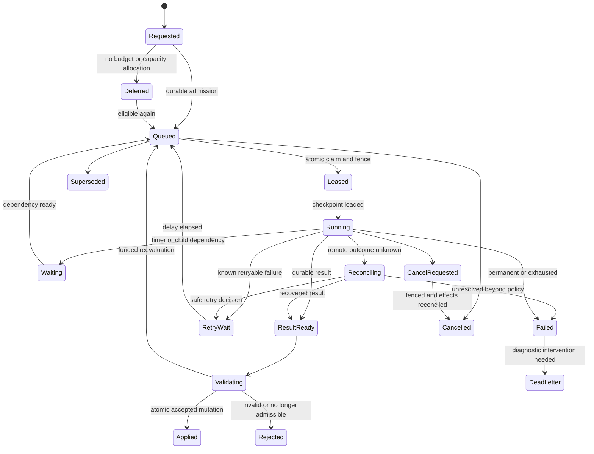
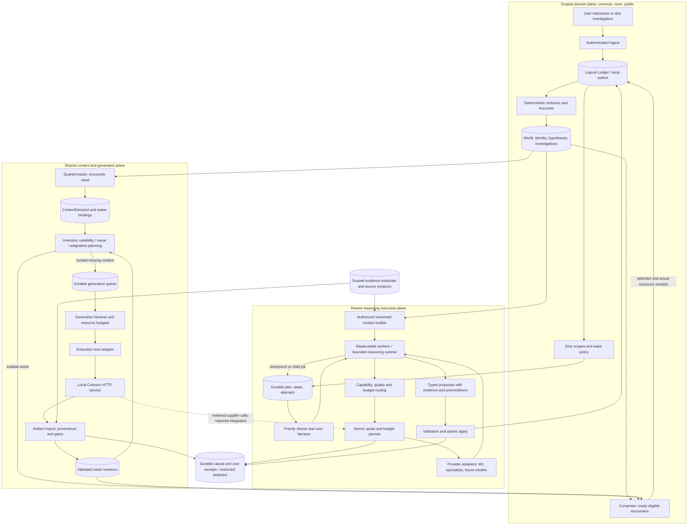

> Research snapshot from 2026-09-15. Findings informed target direction; provider/contract details may drift. Current decisions and pinned boundaries take precedence.

---
status: proposed
authority: architecture-research-review
research_date: 2026-09-15
scope: Companion extension to the core-engine review. Design recommendations, not implemented behavior or amendments to accepted decisions.
source_snapshot: KnowScroll-v2 3e8991ea62ee5f5abb28ec8b9417fe292b961e95
---

# KnowScroll: persistent intelligence, shared execution

**Recommendation:** keep the Ledger, worlds, rooms, inhabitants, typed proposals, and deterministic serving architecture. Build a deliberately small KnowScroll reasoning runtime around durable jobs and established model libraries. Globally schedule expensive requests and generation; persist each user's intelligence independently of the workers executing it.

This extends the [core-engine review](2026-09-15-CORE-ENGINE-ARCHITECTURE-REVIEW.md). It incorporates the founder's clarification: the complete spatial and social product belongs in the architecture. The earlier recommendation to postpone celestial machinery and broad agent societies is superseded **as a product-design recommendation**. Infrastructure can start small while the domain model supports the complete experience. Multiple agents may pursue long investigations; their authority, evidence, execution, and budgets must be explicit.

The most important architectural principle should be:

> A universe owns its durable meaning and history. Shared services supply bounded computation. No user's world depends on keeping an agent process alive.

The missing intelligence layer is still essential. Scheduling makes reasoning affordable and recoverable; it does not establish that the reasoning finds useful conceptual connections. This design therefore includes semantic investigations, evidence-backed bridge proposals, encounter plans, and evaluation of their usefulness.

**Reading path:** §§1–5 for the harness decision; §§6–13 for execution; §§14–18 for generation and operations; §§19–22 for implementation and scale. All numbers described as initial settings or scenarios are engineering proposals, not measured capacity or provider entitlements.

## 1. What runtime/harness KnowScroll actually needs

### 1.1 Start from the work

A Steward investigates a question about a person's encounters. A researcher investigates a claim. A room coordinates discussion and research over a shared subject. A Cartographer proposes a meaningful place or bridge. A Quartermaster identifies an unmet encounter need. These jobs need access to selected evidence and domain tools, not a filesystem and shell by default.

The runtime must support both a single structured inference and a bounded sequence of model/tool steps. Some sequences may delegate independent research subtasks. Persistent investigations can last weeks even though each execution burst takes seconds or minutes.

| Requirement | Required behavior | Primary owner |
|---|---|---|
| Identity and memory | Durable Steward/resident identity, scoped memories, investigations and decisions | KnowScroll domain storage |
| Sessions and continuation | Restore completed messages/tool results and provider continuation data; resume at a safe checkpoint | Runtime + checkpoint store |
| Tools | Typed arguments, server-bound scope, deadlines, bounded results, explicit effect semantics | Tool registry + domain ports |
| Structured results | Validate shape, references, permissions and domain preconditions | Runtime + proposal validator |
| Long work | Timers, child-job dependencies, checkpoints, wake reasons and stop conditions | Durable job runtime |
| Context | Retrieval, versioned summaries, original evidence, compaction with lineage | Context builder |
| Provider differences | Transport, streaming, usage, errors, model-specific capabilities | Provider adapters |
| Switching models | Select an eligible route and compile a compatible context | Router + context builder |
| Cancellation | Stop future work; fence application; reconcile in-flight effects and cost | Job controller + effect adapters |
| Quotas and concurrency | Admit every expensive attempt under shared resource limits | Global admission controller |
| Debugging | Inspect why work ran, exact input references, tool outcomes, result disposition and cost | Receipts + operations UI |
| Sandboxing | Capability-scoped tools; separate isolation for untrusted code/rendering | Tool executor / Cutroom |

A harness transcript supplies only part of this list. It cannot replace the product's Ledger, authorization, concurrency rules, or provider-wide scheduler.

### 1.2 The persistent unit is an investigation

Proposed logical object:

```typescript
interface Investigation {
  id: string;
  scope: { kind: 'universe' | 'room' | 'public'; id: string };
  question: string;
  explicitUserIntentRefs: string[];
  alternatives: Array<{ hypothesisId: string; evidenceRefs: string[] }>;
  openQuestions: string[];
  taskIds: string[];
  acceptedArtifactRefs: string[];
  nextWake: { reason: string; notBefore?: string } | null;
  stoppingRule: string;
  budgetAccountId: string;
  status: 'active' | 'waiting' | 'satisfied' | 'inconclusive' | 'cancelled';
}
```

An investigation can ask: “Is this person's repeated return to black holes about spacetime, visual spectacle, or an unresolved question about clocks?” Its alternatives remain alternatives. Watching longer does not settle them. Explicit statements can clarify current intent; they do not automatically establish a permanent identity.

A focused child job might compare clock explanations. Another might verify the conceptual bridge from relativity to GPS. A coordinator can synthesize the results into a proposed next experience. Child jobs receive narrower context and share the parent budget. They do not each create a new allowance or privileged identity. A model may request continuation, but deterministic policy decides whether new evidence, a pending dependency, or an explicit user request justifies another burst.

**Long horizon does not mean a continuously self-triggering loop.** It means durable questions, accumulated evidence, resumable work, and follow-through. Allow several agents when independent research or different expertise improves the answer; do not use agent agreement as independent evidence when they consumed the same sources.

### 1.3 Connect intelligence to the actual experience

Add a versioned chain:

`EncounterEvidence → InterestHypotheses → BridgeCandidate → EncounterPlan → eligible inventory/candidates → outcome evidence`

A bridge candidate needs source and destination concepts, a relation type, the explanatory mechanism connecting them, evidence, prerequisites, analogy limits, and why the encounter might be useful in this context. “These embeddings are close” is a retrieval signal, not a conceptual bridge.

Example: “Both clocks in relativity and biological clocks track time” is probably a superficial word overlap. “A user's question about gravitational time dilation can be developed through how GPS compensates for relativistic clock differences” has a teachable mechanism and an observable question. Whether this person wants it is a separate, revisable hypothesis.

The validator admits a bridge as a candidate with a scope and evidence status. The Composer can then consider an approved encounter plan under ordinary ranking constraints. Personal hypotheses must have this controlled path into candidate generation; leaving them only in the Steward's private journal cannot improve what appears next. World mutations and content selection remain different decisions: a useful bridge need not immediately create a new planet.

## 2. Pi vs Prime Agent vs Codex vs alternatives

### 2.1 Verdict by fit

| Candidate | Useful capabilities verified in source/docs | What KnowScroll still owns | Verdict |
|---|---|---|---|
| **AI SDK + small internal runtime** | Typed model calls, tools, structured-output abstraction, step controls, abort and middleware | Durable step journal, scope, global quotas, semantic memory, proposal application | **Preferred starting point**, consistent with D-005; prove the M3 adapter contract |
| **Pi agent core / provider library** | Replaceable stream function, context/tool hooks, abort, model abstraction; current repository also has a richer harness/session layer | Product persistence, scheduling, policy, evidence memory; interception of all auxiliary calls | **Strongest embedding alternative**; use the narrow core rather than importing coding defaults |
| **Pi coding-agent SDK** | Session history, compaction, extensions, headless use and inspection | Same global/product contracts; disable filesystem/shell defaults and ambient resource loading | Useful if its inspection/session facilities materially reduce work |
| **Prime Agent** | Pi-derived loop, persistent Python REPL, native subagents, session history, daemon-oriented operation and harness memory | Tenant isolation, durable product state, budget ownership, per-attempt admission and evidence semantics | **Do not choose as default product runtime**; consider for specialized sandboxed research |
| **Codex SDK / app-server** | Mature coding-agent execution, persisted threads, streaming, tools, interruption, structured-output interfaces | Global resource admission, domain context, narrow authorization; provider/protocol compatibility | Use for development or isolated code work, not the Steward's default runtime |
| **LangGraph** | Graph execution and persisted checkpoints; thread-level and cross-thread memory facilities | Ledger authority, transaction boundaries, tool idempotency, shared model limits | Credible alternative when branching workflows justify graph machinery |
| **Temporal** | Durable workflow/task dispatch and worker coordination | Semantic runtime, model adapters, tenant/token fairness, domain validation | Potential later orchestration substrate, not an LLM harness replacement |

This is a fit comparison, not a benchmark ranking. No candidate was run against KnowScroll's semantic evaluation set during this review.

### 2.2 Pi: useful seams, but do not mistake the coding shell for the core

At commit `8a7b0c03dfb702663acafb6dc29f8acaa4ffe391`, Pi separates provider functionality, agent core and coding-agent/session facilities. Its agent loop accepts a replaceable `StreamFn` and passes the model, compiled context and abort signal into it. Context transformation and before/after-tool hooks make it adaptable to typed KnowScroll tools. The current tree also includes a richer harness layer with sessions, lanes and compaction; the project should not be characterized solely from old minimal-CLI descriptions. [Pi loop](https://github.com/badlogic/pi-mono/blob/8a7b0c03dfb702663acafb6dc29f8acaa4ffe391/packages/agent/src/agent-loop.ts), [Pi SDK documentation](https://pi.dev/docs/latest/sdk).

Use an explicit tool registry, explicit resource loader and isolated configuration. The coding SDK's default tools and project/global extension discovery are convenient for a personal coding assistant but inappropriate defaults for a multi-user product. Session JSONL is useful for continuation and debugging; it is not an atomic world mutation journal.

**Important source finding:** wrapping the outer agent `StreamFn` alone does **not** prove all requests are admitted. Pi has lower-level provider retries, and its richer harness compaction calls `models.completeSimple` through a separate summary path. Disable/re-home those facilities or intercept them at a common lower boundary. [Provider retry implementation](https://github.com/badlogic/pi-mono/blob/8a7b0c03dfb702663acafb6dc29f8acaa4ffe391/packages/ai/src/utils/provider-retry.ts), [compaction invocation](https://github.com/badlogic/pi-mono/blob/8a7b0c03dfb702663acafb6dc29f8acaa4ffe391/packages/agent/src/harness/compaction/compaction.ts).

### 2.3 Prime Agent: its main advantage is not KnowScroll's main requirement

At commit `ad426c672327696c42d641379840212ca5a8b85b`, Prime Agent's RLM design keeps Python working state across tool calls and compaction and exposes native child-agent operations. This is attractive for computational exploration of large inputs. Its daemon/session features also support work continuing after a client detaches. [Prime Agent RLM design](https://github.com/PrimeIntellect-ai/prime-agent/blob/ad426c672327696c42d641379840212ca5a8b85b/packages/coding-agent/docs/rlm.md), [package identity](https://github.com/PrimeIntellect-ai/prime-agent/blob/ad426c672327696c42d641379840212ca5a8b85b/packages/coding-agent/package.json).

For KnowScroll, durable evidence, world state and investigations must survive replacement of the entire worker host. A resident Python namespace and daemon do not satisfy that requirement by themselves. Its memory store also does not supply KnowScroll's claims, privacy epochs, scoped hypotheses or deterministic mutation authority. Removing those defaults leaves much of the same custom integration work as the smaller alternatives.

Its compaction source directly invokes `completeSimple` inside a retry helper, separately from the normal agent stream function. Native children construct their own execution context. Accordingly, require explicit child-factory/provider interception tests; shared settings or a shared model registry do not prove every request crosses a parent's scheduler wrapper. [Prime compaction](https://github.com/PrimeIntellect-ai/prime-agent/blob/ad426c672327696c42d641379840212ca5a8b85b/packages/coding-agent/src/core/compaction/compaction.ts), [SDK stream wiring](https://github.com/PrimeIntellect-ai/prime-agent/blob/ad426c672327696c42d641379840212ca5a8b85b/packages/coding-agent/src/core/sdk.ts).

I would use Prime Agent only when a particular research job benefits from programmatic exploration, persistent scratch computation or its native RLM decomposition. Run that job in an isolated environment with bounded child work and globally metered provider access. It should return typed findings to KnowScroll rather than own the user's world.

### 2.4 Codex: embeddable, but the wrong default center

At commit `2fdcdeaf0e219eea34c710e01de2ee0571ddeeb5`, the TypeScript SDK launches a Codex CLI subprocess and consumes its event stream. It supports streaming, thread resumption, output schemas and cancellation. The app-server offers a richer client protocol, including interruption and experimental dynamic tools. [SDK implementation](https://github.com/openai/codex/blob/2fdcdeaf0e219eea34c710e01de2ee0571ddeeb5/sdk/typescript/src/exec.ts), [official SDK guide](https://learn.chatgpt.com/docs/codex-sdk), [app-server guide](https://learn.chatgpt.com/docs/app-server).

The captured provider configuration supports the Responses wire protocol; the old Chat Completions setting is explicitly rejected. MiniMax now documents a Responses endpoint, so “Codex cannot possibly use MiniMax” would be too strong. However, endpoint availability does not establish Codex compatibility: request fields, tool/schema guarantees, continuation, compaction and streaming need a real contract test. The provider code also has request/stream retry settings that must be governed by the global request boundary. [Codex provider configuration](https://github.com/openai/codex/blob/2fdcdeaf0e219eea34c710e01de2ee0571ddeeb5/codex-rs/model-provider-info/src/lib.rs).

Codex's coding environment and sandbox affordances are valuable for software work. The Steward primarily needs authorized evidence reads and typed proposals. Reproducing domain tools, custom provider semantics and scheduling around a coding subprocess adds integration surface without removing KnowScroll's central obligations. This is a product-fit judgment, not a claim that Codex lacks capable reasoning.

### 2.5 Alternatives and the decision boundary

LangGraph is worth adopting if investigations become complex, explicitly branching graphs whose checkpoint/resume behavior is otherwise difficult to maintain. Its checkpoint store still needs coordination with domain transactions; writing a graph checkpoint does not make an external tool effect exactly once. [LangGraph persistence](https://docs.langchain.com/oss/javascript/langgraph/persistence).

Temporal becomes attractive for extensive timers, retries, fan-out, signals and workflow-version operations across services. Worker task queues and dispatch throttles are useful, but requests/minute alone do not implement variable-token, per-user fairness. Keep inference admission outside or underneath workflow execution. [Temporal task queues](https://docs.temporal.io/task-queue).

Pi and Prime Agent carry MIT licenses at the inspected commits; Codex carries Apache-2.0. Preserve applicable license/notice requirements when redistributing. Licensing does not decide their architectural fit.

## 3. Build vs adopt recommendation

**Own the business runtime; adopt model transport and bounded loop primitives.** Start from the existing D-005 direction: AI SDK for model calls, a database job table for orchestration. Extend it with an explicit step journal, admission control, context bundles and proposal receipts. Do not build streaming parsers or a generic agent framework from scratch.

The internal runtime should have a small set of operations:

1. Claim a job with a lease and fencing token.
2. Load its authorized context and already completed steps.
3. Run the next deterministic, model, or tool step.
4. Persist its outcome and any effect receipt.
5. Commit a proposal, schedule a continuation, wait for children, or finish.

Use a model library for one provider invocation at a time. If using a library's automatic tool loop, prove that every step crosses the same admission and checkpoint boundary. A callback that records all steps only after the complete loop returns leaves a crash window across the entire loop.

AI SDK documents tool loops, step controls, structured output, cancellation and middleware. These are useful primitives. Its documented default retries and automatic continuation must be explicitly configured; they are not KnowScroll's retry policy. Set transport/library retries to zero where supported and let the runtime own retries, or intercept and meter every internal attempt at the actual request boundary. [AI SDK ToolLoopAgent](https://ai-sdk.dev/docs/reference/ai-sdk-core/tool-loop-agent), [middleware](https://ai-sdk.dev/docs/ai-sdk-core/middleware).

**Strongest counterargument:** custom durability code can become an unreliable workflow framework. Keep the supported shape narrow: model step, bounded tool step, deterministic transition, child dependency, timer. Avoid arbitrary user-authored workflow execution in v0.1. Adopt a workflow engine when recovery/versioning/timer complexity exceeds what this explicit state machine can safely maintain. “Small” describes scope, not a promise that durability takes 150 lines.

The library choice remains behind `ReasoningExecutor`. Pi core can replace the inner loop without changing world contracts. Temporal could eventually replace orchestration without becoming the authority for world truth. Neither migration should alter what a Steward proposal means.

## 4. MiniMax M3 integration architecture

### 4.1 What is verified, and what remains uncertain

Fresh official Markdown documentation identifies **`MiniMax-M3`**, a 1,000,000-token context window, multimodal input and tool use. It documents Anthropic-compatible Messages, OpenAI-compatible Chat Completions, and a Responses endpoint. This review does not substitute M2.7 for M3. Some search-indexed HTML results omitted M3; the directly fetched official Markdown pages were used for the current capability assessment. [Model catalog](https://platform.minimax.io/docs/guides/models-intro.md), [text-generation guide](https://platform.minimax.io/docs/guides/text-generation.md).

| Boundary | Current documentation | KnowScroll consequence |
|---|---|---|
| Primary transport | Messages under `https://api.minimax.io/anthropic` | Preferred initial route for explicit content/tool blocks |
| Alternatives | Chat under `https://api.minimax.io/v1`; Responses at `/v1/responses` | Separate adapter capability profiles; no assumption of identical behavior |
| Thinking | Messages defaults off; explicit adaptive/disabled controls. Chat has different defaults. Responses effort labels enable thinking but do not tune its depth | Always set the intended behavior; do not map arbitrary reasoning-effort labels as equivalent across vendors |
| Tool continuation | Full assistant content, including required thinking blocks, must be preserved | Persist compatible continuation data; do not strip it before tool-result round trips |
| Output shaping | Reviewed wire schemas do not establish native strict JSON-schema output | Parse and validate results; budget bounded repair or reject |
| Tool selection | Detailed Messages schema lists only `auto` and `none`, despite broader “fully supported” wording in the overview | Do not rely on forced `any`/named-tool selection until verified |
| Token counting | M3 Messages token-count endpoint is documented | Use when worthwhile; govern its own request quota, and retain an estimator fallback |
| Provider capacity | Public table lists 200 RPM and 10,000,000 combined input+output TPM for M3 | Configuration baseline only; actual account quota, burst semantics and concurrency must be confirmed |
| Batch / embeddings | No hosted text batch or embedding contract verified in reviewed index | Separate ports; do not invent OpenAI-compatible endpoints |
| Cancellation | No text-generation remote-cancel guarantee verified | Local abort does not establish stopped billing or computation |

Transport details: [Messages overview](https://platform.minimax.io/docs/api-reference/text-anthropic-api.md), [Messages schema](https://platform.minimax.io/docs/api-reference/text-chat-anthropic.md), [OpenAI compatibility](https://platform.minimax.io/docs/api-reference/text-openai-api.md), [Responses schema](https://platform.minimax.io/docs/api-reference/responses-create.md), [M3 tool guide](https://platform.minimax.io/docs/guides/text-m3-function-call.md), [rate limits](https://platform.minimax.io/docs/guides/rate-limits.md).

**Do not turn missing documentation into proof of absence.** Native schema enforcement, forced-tool behavior, precise account concurrency, and error headers remain compatibility questions. Conversely, an overview saying “compatible” does not justify assuming unsupported schema fields work.

### 4.2 Initial integration choice

Use a thin MiniMax Messages adapter behind the KnowScroll model port, reusing an established transport library. AI SDK remains the preferred application library, but its specific adapter must pass the checks below. The official MiniMax AI SDK guide points to a community provider and currently marks image/file input unsupported there. That limitation is in the adapter, not proof that M3 lacks vision. [MiniMax AI SDK guide](https://platform.minimax.io/docs/api-reference/text-ai-sdk.md).

For v0.1 structured jobs, request a typed final payload or a submission tool under the documented tool-selection mode; validate the returned object with the domain schema. If the model declines to call a tool or returns malformed output, record that outcome and permit at most a bounded funded repair. Do not assume `Output.object(schema)` can manufacture provider-side constrained decoding. If the selected adapter insists on an unsupported wire schema, use explicit text/tool generation plus validation or a narrow custom adapter; do not drop the schema requirement silently.

Choose thinking mode per job type. Strong reflection can enable it with enough total output allowance. Tiny extraction jobs can disable it if quality checks pass. Token accounting includes reasoning when counted as output; the runtime must recognize truncation even when no usable final answer remains. Preserve required continuation blocks as protected runtime data, not user-facing explanations or substitutes for evidence.

### 4.3 Caching, price and throttling

M3 passive prompt caching is documented. The separate explicit Anthropic cache-control support table omits M3, so do not assume the same explicit-cache behavior as M2.x. Normalize cache usage carefully: Anthropic-style separate input/cache buckets and OpenAI-style cached subsets must not be added using one universal formula. [Passive caching](https://platform.minimax.io/docs/api-reference/text-prompt-caching.md), [explicit-cache compatibility](https://platform.minimax.io/docs/api-reference/anthropic-api-compatible-cache.md).

At the captured date, the pay-as-you-go table lists M3 standard rates at input lengths up to 512k of **$0.30/M input tokens, $1.20/M output tokens and $0.06/M cache-read tokens**. It lists higher long-context and priority rates. Treat these as dated pricing inputs, not constants in semantic policy. Subscription/token-plan entitlements are a different quota system and must not be mistaken for backend pay-as-you-go capacity. [Pricing](https://platform.minimax.io/docs/guides/pricing-paygo.md), [Token Plan](https://platform.minimax.io/docs/token-plan/intro.md).

Classify HTTP and provider error envelopes. Rate limiting, overload, exhausted balance and invalid credentials need different actions. No `Retry-After` guarantee was found in the reviewed MiniMax pages; use a valid header if supplied, otherwise bounded jittered backoff and quota-aware rescheduling. Never treat all 429-like failures as a short transient. [Errors](https://platform.minimax.io/docs/api-reference/errorcode.md).

### 4.4 Compatibility gate before product integration

Run these as a future bounded adapter spike, not as assumed capabilities:

- One M3 request, one streamed request, interrupted stream and usage reconciliation.
- Multi-step tool exchange preserving required reasoning/signature blocks.
- Auto/no-tool behavior, malformed arguments, truncation and refusal.
- Actual behavior of schema-output options and any forced-tool selection before enabling them.
- Retry disabled at every transport layer; verify each request gets one permit.
- Input/cache/reasoning token accounting and price calculations.
- Timeout after dispatch: retain unknown outcome and prevent unauthorized application.
- A new provider route with the same typed job to expose leaked MiniMax assumptions.

No application-provider calls, model benchmark, account-limit inspection or live Cutroom generation were performed for this review. Research workers themselves used MiniMax M3; that does not validate KnowScroll's adapter or production pipeline.

## 5. Model-provider abstraction

The user's layering is correct, with one refinement: **route selection must happen before acquiring the exact provider permit**. The job scheduler can select an eligible job first; the runtime/router chooses a feasible provider; request admission then reserves that provider's quota. A fallback route needs a new permit. A queue that limits only jobs cannot govern different numbers of model calls per job.

Separate these contracts:

| Layer | Owns | Must not own |
|---|---|---|
| Job/domain | Question, intent, evidence scope, allowed outcomes, deadline | Vendor request JSON |
| Runtime | Steps, checkpoints, tools, continuation, cancellation | Interest truth or arbitrary provider bypass |
| Context builder | Authorized evidence selection and model-compatible context | A permanent untraceable narrative about the user |
| Router | Capability/quality/latency/budget policy and chosen route | Direct world mutations |
| Admission | Global resource reservations, fairness, health and quotas | Semantic interpretation |
| Provider adapter | Wire format, auth, streaming, usage, normalized errors | Job retries, product budgets or independent subagents |
| Validator/reducer | Proposal admissibility and atomic application | Trust in a model's self-reported confidence |

A minimal transport contract should expose **one invocation**, not “run agent until done”:

```typescript
interface ModelInvocation {
  requestId: string;
  jobId: string;
  stepId: string;
  attemptId: string;
  routeId: string;
  contextBundleId: string;
  messages: CompiledMessage[];
  tools: CompiledTool[];
  outputSchema?: JsonSchema;
  outputTokenCeiling: number;
  deadlineAt: string;
  permitId: string;
}

interface ModelOutcome {
  providerRequestId?: string;
  status: 'completed' | 'refused' | 'truncated' | 'failed' | 'unknown';
  messages: CompiledMessage[];
  usage: NormalizedUsage; // Unknown fields remain null, never zero.
  continuationRef?: string; // Opaque provider-specific data, if needed.
  rawReceiptRef: string;
}
```

The referenced types are design placeholders, not a compilable API implementation. A provider capability record must distinguish native schema enforcement, tool arguments, forced tool choice, parallel tools, vision/audio, context/output limits, token counting, prompt caching, batch execution, cancellation, usage fields and supported continuation modes. Capabilities are model-and-endpoint specific and have `documented`, `tested`, or `unknown` evidence status.

A generic `supportsJSON: true` is insufficient. Strict schema decoding, syntactically valid JSON, and a tool call containing JSON are different guarantees. Unsupported features should fail route eligibility or select an explicit compatibility path. Do not silently discard an output schema.

Retain provider-specific metadata in a namespaced envelope. Preserve reasoning/tool continuation blocks when the provider requires them; do not pretend they are portable plain-text conversation. Switching providers normally recompiles a fresh context from canonical evidence and completed tool results. Opaque provider state is not the only copy of task memory.

Embeddings use a separate typed port with vector dimension, model/version, distance metric and index generation. Replacing an embedding model requires a compatible index or re-embedding; it is not a drop-in change of model name.

## 6. Per-user state vs global execution plane

**Yes: make this a foundational principle.** One logical Ledger per universe can be represented by scoped rows in a shared database. It does not require one database file, queue, process, or provider session per user.

| Per-universe / scoped domain state | Shared execution resources |
|---|---|
| Observations, explicit requests, privacy epoch | Worker pools, scheduler, rate-limit state |
| Accounts and current world projection | Model adapters and routing policies |
| Steward identity, memory and investigations | Provider credentials and capacity allocations |
| Personal hypotheses and pending proposals | Jobs, attempts and operational receipts, all scope-tagged |
| Selection/exposure lineage and personal outcomes | Public evidence substrate and approved reusable assets |
| Room membership and permitted contributions | Global generation coordination and artifact storage |

A room is another explicit authorization scope. A shared room job reads permitted room material; membership does not grant access to participants' private Ledgers. A global worker is authorized to execute many scoped jobs sequentially, not to mix their context.

Workers should be **replaceable**, although their processes may stay warm to reuse HTTP connections and initialized libraries. Clear job-local state between executions. Durable identity lives in storage. No million-user architecture should require a million idle OS processes or chat sessions.

In the single-database version, observation append, dirty-marker update and job/outbox intent can share a transaction. A deferred dispatcher is also safe if its cursor and corresponding job creation are committed together and jobs are deduplicated. At distributed scale, each universe shard writes an outbox locally; the global queue consumes it at least once. The global executor returns a proposal to the owning shard, which alone authorizes application. There is no required distributed transaction spanning every universe and model provider.

**Ordering:** preserve causal references and order where a domain requires it. Unrelated universes execute concurrently. Within one universe, independent investigations can execute concurrently; conflicting proposal application is fenced. Direct messages retain distinct identities and an ordering key where conversation requires it. Infrastructure status belongs in operational tables, with meaningful outcomes referenced from the Ledger; every streaming token need not become a domain event.

## 7. Global reasoning-job scheduler

### 7.1 Durable job shape

A job is a request to accomplish bounded work, distinct from attempts and model calls. Its fields should include:

- Identity: job, scope, investigation, parent and causal trigger IDs.
- Work: kind, schema/runtime/prompt versions, immutable payload, coalescing key.
- Scheduling: class, enqueue time, `not_before`, soft target, hard expiry if applicable, dependencies.
- Cost: route candidates, estimated token vector, budget owner and maximum permitted spend.
- Freshness: input event high-water mark, read-set versions, privacy epoch.
- Execution: state, lease owner, lease deadline, monotonically increasing fencing token, attempt count.
- Outcome: result/proposal reference, failure category, supersession and cancellation references.

Do not put every provider request into the same opaque `payload` and hope the worker knows how to recover it. Persist attempts and model/tool steps as separately identifiable records.

### 7.2 Scheduling classes

Initial policy, to be calibrated:

| Class | Examples | Service intent |
|---|---|---|
| Interactive | Explicit Ask, direct resident question, requested explanation | Dispatch promptly when capacity exists; return pending status when it does not |
| Active continuity | Resolve an explicit branch gap; update an investigation during an active session | Seconds to a few minutes, with inventory fallback |
| Accumulated interpretation | Analyze meaningful recent episodes, revise bridge candidates | Minutes to an hour |
| Background inquiry | Dormant interests, public enrichment, optional room research | Hours or until a stated deadline |

These are service objectives, not promises independent of quota. User corrections/deletions should apply deterministically immediately; any follow-up reasoning is separate. Do not make a privacy correction wait behind a model queue.

Give classes explicit capacity shares and borrowing rules. Within a class, schedule users using weighted deficit round robin: each eligible user's turn earns a bounded credit quantum; dispatch work when its estimated cost fits the credit; charge the estimate, then reconcile actual cost. Idle users cannot accumulate unlimited credit. Large legitimate jobs eventually accumulate enough credit under admitted load, while maximum context/output bounds prevent a single unbounded request.

Use deadline urgency and age within those rules. A strict priority queue alone can starve background work. Provide a small minimum share to admitted lower-priority work when the provider is healthy; reclaim idle shares. If offered demand permanently exceeds capacity, no algorithm can guarantee all deadlines or non-starvation without refusing/deferring work. Record that condition explicitly.

### 7.3 Why the multiplicative score is insufficient

`urgency × relevance × information_gain × freshness / cost` is attractive but unstable:

- Model-estimated information gain is not calibrated utility and can be inflated.
- Cheap jobs may repeatedly outrank useful expensive jobs.
- Low freshness can permanently suppress old work even when its age deserves service.
- No scalar guarantees a user's quota or a provider's token/concurrency constraints.
- The system can learn to fund already popular interests and stop discovering new ones.

Use **hard eligibility → class/share → tenant fairness → bounded value estimate within a tenant**. Value estimates can prioritize two optional investigations competing for the same allowance. Record their inputs and policy version, and evaluate them against actual useful outcomes. They must not override privacy, capability, quality or hard resource constraints.

### 7.4 Work-conserving without becoming a stampede

Do not lease thousands of jobs into workers that only wait for tokens. Keep delayed work durable and calculate its next eligible time. Skip temporarily infeasible routes/jobs so one oversized request does not block the queue. Bound this scan with indexed ready sets rather than rescanning all jobs every poll. Reject or reshape a request that can never fit any eligible route's per-request or bucket limits; it must not wait forever for impossible capacity.

A running investigation releases its worker slot when waiting on child jobs or long timers. Model concurrency permits last only for an actual in-flight invocation, not for the entire investigation or an unrelated search-tool wait. Parents waiting for children must not occupy every worker and deadlock the pool.

At first, one scheduler loop arbitrates all capacity. Later, use a leader or partitioned dispatchers with shared atomic reservations. Multiple dispatchers each believing they own the complete global quota is an oversubscription bug.

## 8. Rate limiting and weighted fairness

### 8.1 Enforce a vector of limits

For every actual attempt, check all applicable limits:

`global spend ∩ budget owner ∩ provider account ∩ endpoint/model quota ∩ request rate ∩ input/output/combined token rate ∩ in-flight concurrency`

Some providers count input and output separately; others publish a combined token limit. Store the actual quota topology rather than imposing a universal interpretation. Different API keys may share an account quota. Key rotation does not create extra capacity.

Use token buckets or equivalent rate meters for replenishing capacity and semaphores for simultaneous requests. A token bucket must reflect the provider's burst/window behavior; a naive large bucket can violate a strict short-window cap. Keep safety headroom and adapt cautiously to observed throttling. Amazon describes both composed token buckets and the importance of protecting tenants during bursts; Envoy separates local burst protection from shared rate-limit services. These are transferable patterns, not a recommendation to deploy Envoy now. [AWS fairness](https://d1.awsstatic.com/builderslibrary/pdfs/fairness-in-multi-tenant-systems-david-yanacek.pdf), [Envoy global rate limiting](https://www.envoyproxy.io/docs/envoy/latest/intro/arch_overview/other_features/global_rate_limiting).

### 8.2 Reserve before calling; reconcile afterward

1. Compile/count the input using the route's tokenizer or a conservative estimator.
2. Set a bounded output allowance, including reasoning usage where the provider counts it.
3. Atomically reserve quota and budget; persist a dispatch permit and attempt intent.
4. Invoke the adapter with a deadline and that permit.
5. Persist actual usage and outcome; settle accounting exactly once by attempt ID.
6. Release in-flight capacity when completion is known; retain conservative treatment for unknown execution.

Budget reservation is not the same as token-window consumption. Refunding unused monetary reservation can be correct while immediately refilling a provider's minute bucket is incorrect. Each quota adapter defines reconciliation semantics. Unknown usage remains unknown with an upper-bound liability until reconciled; it must not become a free call.

All automatic retries, fallback providers, model-based compaction, output repairs, verification calls and subagent requests pass this boundary. If a transport or harness cannot expose these attempts, put an enforcing inference gateway in its path or do not use it for product execution.

### 8.3 Fairness uses cost, not just request count

A 500-token classification and a 30,000-token reflection should not consume equal scheduling credit. Normalize estimated resource use for fairness, then enforce the true multidimensional quotas separately. For example, use estimated dominant share of constrained token/request capacity as a credit charge, with bounded estimator error charged forward. This is inspired by multi-resource fairness; it is not a claim that a simple implementation satisfies all formal DRF guarantees. [Dominant Resource Fairness, NSDI 2011](https://www.usenix.org/legacy/event/nsdi11/tech/full_papers/Ghodsi.pdf).

Paid tiers may receive different bounded weights and allowances. Explicit user requests deserve protected capacity across tiers. A very active user can borrow idle capacity but cannot consume everyone else's reserved service. System-owned enrichment and experiments have their own capped accounts so they cannot evade user fairness by being relabeled “global.”

### 8.4 Capacity arithmetic

For a single route, approximate sustainable calls/minute by:

`min(RPM, input_TPM / mean_input, output_TPM / mean_output, combined_TPM / mean_total, concurrency × 60 / mean_duration_seconds)`

Omit dimensions the provider does not use. Means estimate throughput; tails and bursts require headroom and deadlines. This is planning arithmetic, not a service guarantee.

**Illustrative quota only:** 60 RPM, 300,000 combined TPM, 8 concurrent requests, 8,000 tokens/call, 20 seconds/call. The constraints permit at most `min(60, 37.5, 24) = 24 calls/minute` before headroom. At 70% planned utilization, budget 16.8 calls/minute. More worker processes cannot overcome that concurrency limit.

## 9. Batching, coalescing, and debounce strategy

### 9.1 Different mechanisms solve different waste

| Mechanism | What it combines | Appropriate use |
|---|---|---|
| Event ingestion batch | Transport of observations, preserving event identities | Client telemetry and low-cost accounting |
| Debounce | Repeated wake signals within a window | Accumulated interpretation |
| Coalescing | Several invalidations for one scope/task into one pending recomputation | World summary/bridge refresh |
| Incremental computation | Changes since a recorded high-water mark | Counters, episodes, indices, summaries |
| Exact cache / single flight | Identical authorized work and inputs | Public content annotation; same artifact evaluation |
| Model batch | Separate inputs submitted together | Embeddings or supported classifier batches |
| Provider asynchronous batch | Independent requests submitted for delayed execution | Offline enrichment and evaluations |

For the black holes → time dilation → relativity → wormholes → black holes sequence, update cheap observations/accounts immediately, preserve episode structure, and mark the relevant interpretation scope dirty. A single later job reads the trajectory and alternatives. Five videos are neither five independent curiosity confirmations nor five required LLM calls.

Initial policy candidates: a 90-second trailing debounce, a five-minute maximum wait during activity, and stronger triggers for explicit questions or meaningful contradictions. These settings should be tested; the existing proposal's 90-second wake rule is a starting point. Avoid a million-user daily heartbeat that calls a model merely to discover nothing changed. A deterministic wake planner can skip unchanged universes.

### 9.2 Correct coalescing under concurrent arrivals

Store `first_dirty_at`, `latest_event_seq`, `processed_event_seq`, accumulated dirty reasons and the pending job reference for `(scope, job_family)`. Signals coalesce; evidence does not disappear.

At execution, freeze input high-water mark `H`. If new events reach `H2` while the job runs, its eventual completion marks only the work through `H` as processed. In the same transaction, detect `H2 > H` and preserve/schedule the next wake. Never clear a boolean dirty flag unconditionally after processing an old snapshot: that loses new work.

Coalescing must union affected scopes/reasons or recompute from canonical state. “Last wins” is safe for a notification to reread all relevant state; it is unsafe for overwriting distinct deltas. Keep each explicit Ask, direct message, correction and user-requested branch as its own intent. Infrastructure may share their retrieval work, but it must settle each request separately.

Bound trailing debounce with a maximum wait so a continuously active user eventually gets interpretation. Pending obsolete jobs can be superseded. Do not rewrite the frozen input of a running call; schedule a continuation or reject/re-evaluate the result under §11.

### 9.3 What can batch across users

Embeddings and independent classifications can share a transport batch when the backend supports separate inputs and outputs. Preserve item IDs, per-item authorization, limits, errors and accounting. A private input batch remains private processing; batching does not authorize sharing results or constructing a combined conversational prompt.

Public concept extraction and reusable asset evaluation offer the strongest cross-user amortization. Personal Steward reasoning should ordinarily remain isolated. Combining 100 users' memories into one chat to save request count creates leakage and cross-contamination risks and may not save token capacity.

OpenAI's Batch API documents asynchronous requests with a 24-hour completion window and distinct batch limits; Anthropic documents batches that can expire after 24 hours, with request/enqueued-work limits. Gemini advertises delayed batch processing as well. Use these only for tasks whose freshness permits it, and track per-item completion; a batch is not one atomic success. No MiniMax batch facility is assumed without a verified contract. [OpenAI Batch](https://developers.openai.com/api/docs/guides/batch), [Anthropic batches](https://platform.claude.com/docs/en/build-with-claude/batch-processing), [Gemini Batch](https://ai.google.dev/gemini-api/docs/batch-api).

BentoML's adaptive batching and vLLM's token/sequence scheduling are useful when serving owned models. They optimize model-server throughput; they do not replace tenant fairness, budgets or proposal validation. [BentoML batching](https://docs.bentoml.com/en/latest/get-started/adaptive-batching.html), [vLLM scheduler](https://docs.vllm.ai/en/latest/api/vllm/config/scheduler/).

## 10. Context and memory architecture

### 10.1 Canonical memory is structured and revisable

Maintain several layers with different authority:

- **Evidence:** original permitted observations, exact user questions, source material and encounter/exposure receipts.
- **Episodic memory:** bounded summaries of related encounters, with event ranges and links to originals.
- **Semantic memory:** concepts, claims, supported relations and source versions; public and private stores are explicitly separated.
- **Personal hypotheses:** competing interpretations with supporting/contradicting evidence, confidence status, expiry and allowed uses.
- **Investigation memory:** question, progress, unfinished work, accepted findings and pending dependencies.
- **Working context:** an immutable, task-specific selection assembled for one execution burst.

A summary is a derived view, not an irreversible replacement for evidence. Keep exact wording for explicit questions, corrections, constraints and unresolved distinctions. Summary drift can turn “I don't understand why clocks differ” into “interested in relativity,” losing the most useful information.

### 10.2 Build a context bundle deliberately

The builder resolves scope/permissions first, then retrieves current task-relevant material. A bundle records:

`bundle_id, scope, privacy_epoch, job_id, build_version, event_high_water, entity_versions, prompt_version, evidence_refs, summary_versions, retrieval_query/version, token_budget, omitted_material_summary, content_hash`

Suggested allocation is task dependent, not a permanent fixed ratio: current question and instructions first; relevant world neighborhood and evidence next; alternatives/counterevidence and prior decisions next; supplementary retrieved material last. Reserve room for tools and output. A context budget should be far below the provider maximum for routine jobs; a large context window is a ceiling, not a target.

Retrieval uses entity links, time, investigation dependencies and full text, with embeddings as an additional candidate source. Retrieve counterevidence deliberately. Do not let the same current hypothesis determine every retrieval query and then treat the retrieved agreement as confirmation.

A transcript can reference an exact evidence slice for inspection. Durable proposal receipts retain those references and versions. Sensitive prompt bodies can live in access-controlled, deletable diagnostic storage with shorter retention than non-content cost receipts.

### 10.3 Avoid repeated reconstruction costs

Incrementally maintain episode summaries and domain neighborhoods; cache compiled public evidence blocks by source/version; use stable prompt prefixes where provider caching supports them. Cache keys include authorization scope, privacy epoch, prompt/tool versions, model context requirements and evidence versions. Never key private inference only by a question's text.

Summarization and compaction are model jobs when they use a model, with budgets and lineage. Reuse a valid summary rather than repeatedly summarizing summaries. If evidence is deleted or corrected, invalidate dependent summaries, retrieval indices and cached bundles. Keeping an old model transcript must not bypass a new privacy epoch.

For long investigations, checkpoint completed findings and tool results, then rebuild a bounded context at the next burst. Do not keep appending forever. Store provider continuation data only as an optional accelerator, with appropriate retention. Replaying committed results can be deterministic; rerunning a hosted model is a new experiment, even with the same seed.

## 11. Stale-result / optimistic-concurrency handling

**The proposed model is right: models produce proposals against identified inputs.** A single `base_world_version` is useful for inspection but too coarse as the only conflict test.

At world version 41, a job reads planet P revision 6, investigation I revision 3 and privacy epoch 8. Fifteen unrelated events advance the world to 45. If P and I are unchanged, the proposal may remain valid. If the user corrected the job's premise or deleted its evidence, it must not apply even if a coarse version check is accidentally omitted.

```typescript
interface ProposalEnvelope {
  id: string;
  jobId: string;
  scopeId: string; // Bound from the authenticated job, never trusted from model text.
  inputBundleId: string;
  baseWorldVersion: number;
  privacyEpoch: number;
  readSet: Array<{ entityId: string; revision: number }>;
  evidenceRefs: string[];
  proposedOperations: TypedDomainOperation[];
  expiresAt?: string;
  explanation: string;
}
```

The server supplies trusted envelope fields and validates model-supplied operations. The model's `confidence` can be stored as a labeled estimate; it is not authorization or calibrated correctness.

**Apply transaction:** check idempotency key → active privacy/cancellation fences → evidence validity → read/write preconditions → domain invariants → apply accepted operation group → append mutation/outcome events and outbox → record proposal disposition. Checks and writes must be atomic relative to conflicting domain writes. Do not validate outside a transaction and then apply blindly.

Classify stale outcomes:

| Change | Handling |
|---|---|
| Unrelated newer observations | Apply if the complete semantic read set still holds; preserve historical input watermark |
| Commutative observation/reference addition | Deterministic merge only when the operation's defined semantics permit it |
| Target renamed/moved/split; premise changed | Rebuild context and re-evaluate; do not mechanically transplant the model's conclusion |
| Privacy epoch changed, evidence withdrawn, authorization revoked | Reject application; stop further calls; reconcile cost and perform required cleanup |
| Better equivalent pending job exists | Supersede old work; retain receipt, avoid duplicate mutation |
| Result useful as public factual research but personal plan stale | Separately validate admissible public artifact; do not silently declassify personal output |

A “rebase” is either a proven deterministic transformation or another funded inference. It is not a generic free repair. Define atomic operation groups: a planet creation and its required provenance cannot be half-applied. Independent proposals may succeed or fail separately with explicit receipts.

Use fencing tokens for worker ownership too. An expired worker cannot commit a checkpoint or dispatch a new model step after a replacement has claimed the job. A remote request already in flight may still finish; only the current authorized application path can change the world.

## 12. Model routing

Begin with a small policy registry keyed by job type. MiniMax M3 is the initial general reasoning route, conditional on the compatibility checks in §4. Embeddings use a separately chosen model. Deterministic classification should remain deterministic when sufficient; a cheap specialist model is an evaluated addition, not a required fleet on day one.

| Work | Initial routing principle |
|---|---|
| Counters, eligibility, scope, timestamps, budget arithmetic | Deterministic code |
| Embeddings / candidate similarity | Dedicated embedding adapter and versioned index |
| Topic tagging / extraction | Smallest evaluated model that meets the schema and quality floor |
| Bridge inference / explanation planning | Strong reasoning route with retrieved mechanism evidence |
| Steward synthesis / competing interpretations | Strong route with alternatives and explicit uncertainty |
| High-impact or weakly evidenced proposal | Better evidence and/or independent verification; abstain if unresolved |
| Final world application | Deterministic validator/reducer |

A route specifies required capabilities, tested task-quality profile, context/output bounds, allowed data region/scope, latency class, budget ceiling and fallback set. Router decisions and fallback reasons are logged. Provider health can eliminate a route; it cannot authorize a less safe result. A smaller model during overload is acceptable only for tasks where it has demonstrated the required quality floor.

Do not equate self-reported confidence with difficulty. Better routing evidence includes task category, context size, missing citations, verifier disagreement, known benchmark failure patterns and previous schema failures. Escalation has a bounded budget. A second model reading the same unsupported claim is not new evidence.

Policy versions allow shadow evaluation of a new route against frozen, permitted contexts. Promote it by semantic quality, usefulness, latency and cost—not only valid JSON rate. Model switching changes context compilation and evaluation requirements, while domain operations stay unchanged.

## 13. Compute-budget system

Keep three separate accounting concepts:

1. **Physical usage:** requests, input/output/cache tokens, image/audio/video units, CPU/GPU seconds and wall time.
2. **Supplier cost:** priced usage under a versioned tariff, currency and time; estimated, reserved and settled amounts remain distinct.
3. **Product allowance:** user/tier/investigation/room/system/experiment budgets and policy credits.

A reservation has a budget owner, amount vector, purpose, expiry, attempt or generation ID and settlement key. Reserve atomically before dispatch. Unused allowance returns to the account according to policy; already incurred costs do not disappear when a proposal is rejected, a user cancels or a worker crashes.

A per-user monthly allowance is policy configuration, not money embedded in every semantic rule. The scheduler can defer a low-value optional refinement when marginal cost exceeds its current allocation. It must still honor explicit correction and deletion without inference. Record `deferred_budget`, `deferred_capacity`, `no_new_evidence`, `superseded` and `insufficient_quality` separately so an unfunded user is not misread as uninterested.

Reserve funds for verification and publication checks **before** starting expensive generation. A cheap draft that consumes the last allowance and cannot be safely reviewed is wasted work. Parent investigations share a hard total budget across child jobs, retries, compaction and tools. The initial allowance can increase by an explicit policy decision; agents cannot authorize their own unlimited replenishment.

Shared content needs a system or pooled-demand sponsor. Charge the supplier expenditure once to that generation. Attribution can allocate economic benefit across consumers later, but must not triple-count the supplier bill or silently charge each user the full shared render. Track cache savings and reuse separately from actual spend. Unknown provider usage remains a liability requiring reconciliation.

## 14. Quartermaster + Cutroom global generation architecture

### 14.1 Quartermaster expresses a need; shared planning chooses how to meet it

Keep a Quartermaster responsibility per user/world context, but make its expensive output a **ContentDemand**, not an immediate renderer call.

A demand describes:

`demand_id, scope, causal_signal_refs, encounter_intent, concept/claim_ids, audience/prerequisites, language, modality, continuity_constraints, evidence_requirements, deadline, reuse_policy, privacy_epoch, sponsor_budget, expiry`

For example: “Explain why clocks at different gravitational potentials differ, for a beginner who asked about GPS; distinguish the analogy from the mechanism; preserve the current narrative's language.” This is much more reusable and evaluable than an arbitrary prose video prompt.

The global planner performs: exact/semantic inventory search → suitability validation → existing generation lookup → reuse/adapt/repair/new-generation decision → reservation → generation job. Persist the demand-to-decision explanation. A low-cost retrieval path should settle many demands without any LLM call.

Two users needing the same explanation may share a render. Two similarly worded demands can still require different explanations: one asks about gravitational potential, another about velocity, another needs a visual correction of an earlier misleading analogy. Resolve conceptual compatibility before deduplicating.

### 14.2 The actual Cutroom boundary

The reviewed V1 contract is a **same-machine HTTP/JSON service**, with loopback/no-auth assumptions and artifacts returned as absolute paths on the engine machine. It accepts structured narration/claim identifiers/criteria and a required budget ceiling. It does not return a sources card. KnowScroll retains evidence provenance and assembles the final encounter. `requestId` provides submission replay/conflict behavior; cancellation takes effect at a stage boundary rather than guaranteeing reversal of in-flight supplier work. [Pinned Cutroom contract](https://github.com/KnowScroll/Cutroom/blob/d57e0921a662a0ce976faa1b7ba190820ff11529/docs/features/reel-contract.md).

The refreshed repository pin is `d57e0921a662a0ce976faa1b7ba190820ff11529`. The contract blob is unchanged from the prior review's `401f36fa1d80bd309de29a6b9000818dba877f10`. New planning-stage code was inspected, not run. Its worker receives a model port; its recording wrapper writes a receipt **after** a successful return. A thrown or interrupted call therefore needs additional attempt-intent accounting before this can establish all paid attempts. The current plan estimate counts image calls and video duration; it is not a complete KnowScroll cost reservation. [Model-port wrapper](https://github.com/KnowScroll/Cutroom/blob/d57e0921a662a0ce976faa1b7ba190820ff11529/apps/worker/src/recording-port.ts), [estimate](https://github.com/KnowScroll/Cutroom/blob/d57e0921a662a0ce976faa1b7ba190820ff11529/packages/pipeline/src/estimate.ts), [plan worker](https://github.com/KnowScroll/Cutroom/blob/d57e0921a662a0ce976faa1b7ba190820ff11529/apps/worker/src/plan-job.ts).

Do not treat contract journey results against a stand-in as proof of paid end-to-end rendering, concurrency safety, cancellation or provider cost enforcement. Conversely, a file absent from a commit diff is not evidence that its API route does not exist. This review makes no such absence claim.

### 14.3 How global generation reaches local Cutroom instances

One generation adapter per execution host claims assigned jobs, submits to its local Cutroom, persists `requestId/runId`, polls or consumes events with a saved cursor, and imports finished artifacts into KnowScroll-controlled storage. KnowScroll clients never receive arbitrary engine-local file paths.

At multiple hosts, an authenticated KnowScroll control channel talks to these adapters. Do not expose the V1 unauthenticated loopback service publicly. The host adapter validates artifact paths, imports/checksums files and records provenance before attaching them to inventory. A different host needs an explicit data transfer and compatible engine configuration; it cannot reuse another machine's absolute path.

One durable generation job can have many demand waiters. If one user leaves, detach or expire that demand; do not cancel a shared render still needed by others. If all demand expires and no public inventory policy sponsors the work, request cancellation and fence attachment. Cost incurred to that point remains recorded.

### 14.4 Governing the calls inside Cutroom

Limiting concurrent reels is necessary but insufficient: a reel can involve planning, image calls, video calls, speech, checks and repair. If Cutroom and KnowScroll share provider accounts, those calls compete with Steward reasoning too.

Preferred extension: inject a metered provider port or route Cutroom's provider traffic through the common admission service. Every internal attempt carries the generation ID, step ID and budget owner. Separate resource pools govern LLM, image, speech, video and local rendering capacity. A video permit must not be held while waiting for unrelated LLM capacity, and a parent generation must not monopolize workers while its provider task is queued.

Until this integration is available, use conservative run-level caps and explicitly partition provider capacity between KnowScroll and Cutroom. This is a coarse temporary bound, not exact global token accounting. Never claim a hard all-in ceiling unless every supplier call and local resource charge is bounded or reserved. Do not infer that `budgetCents` covers all external systems merely from its name.

Partial regeneration can save substantial cost, but it is a separate capability. The current contract does not establish arbitrary cross-run shot reuse or a generic incremental edit API. Initially reuse complete validated assets or generate a new approved variant. Add subasset reuse only with explicit lineage, continuity, rights, invalidation and adapter support.

## 15. Shared content inventory and reuse

### 15.1 Separate the reusable asset from the personal encounter

A public explanation can be reusable while its selection reason, private hypothesis and place in a user's narrative remain personal. Store an immutable `ContentAssetRevision` and a separate `EncounterBinding` that connects it to a universe, position, invitation and selection receipt.

| Asset/demand type | Default scope | Reuse condition |
|---|---|---|
| Supported explanation of black-hole evaporation | Public inventory | Evidence, level, language, framing and rights match |
| Generic bridge between relativity and GPS | Public inventory | Mechanism and limitations validated; no personal references |
| Bridge discovered while analyzing one user's world | Private until independently approved for public use | Abstract/general content must be rebuilt or validated without leaking personal context |
| Continuation naming a user's current world events | Universe/private | Same authorized scope and compatible narrative state |
| Shared room artifact | Room | Membership/publication policy and evidence status permit it |
| Correction based on a user's expressed confusion | Usually private binding; potentially reusable explanation | Do not store inferred “misconception” as established fact; remove private framing before public reuse |

“Personalized” is not a binary rendering requirement. Often the best economics are a reusable factual core plus a private contextual introduction or branch choice. That introduction is still a content artifact requiring validation if generated. Personal relevance can come from selection and sequence without synthesizing every frame for every person.

### 15.2 Lookup, equivalence and single flight

Use two stages. Retrieve plausible assets using concept/claim IDs, full text and embeddings. Then test suitability against encounter intent, prerequisite level, language, modality, source revision, narrative constraints, freshness, rights and scope. A vector-near result is not sufficient.

For exactly equivalent approved generation specs, compute a canonical fingerprint including all material content and privacy constraints. A database uniqueness rule or claim transaction creates one active generation per eligible fingerprint. Keep per-demand links so each user receives independent freshness/privacy validation when the asset completes.

Near-duplicate demands may be clustered by a bounded planner, but uncertain matches remain separate. Sharing should improve economics without collapsing different educational needs into generic content. Low-popularity topics require a protected exploration/inventory allowance; maximizing demand count alone creates a popularity feedback loop.

### 15.3 Asset lifecycle

`draft → validated → eligible → superseded/withdrawn` with immutable revisions, source/claim dependencies, checksums, generation receipts and permitted uses. Revoking a source or discovering a visual error invalidates affected inventory bindings and future serving. Already delivered encounters retain correction lineage; they are not silently rewritten as though the old claim never appeared.

Track reuse ratio, first-use latency, unused-generation rate, adaptation cost and suitability rejection rate. Reusing everything can be as harmful as regenerating everything if mismatched content repeatedly reaches users. A production two-stage recommender is useful precedent for separating candidate retrieval from final selection; KnowScroll's learning/agency goals and evidence gates remain its own. [YouTube recommendation architecture](https://research.google/pubs/deep-neural-networks-for-youtube-recommendations/).

## 16. Backpressure and degradation strategy

An asynchronous system can preserve requests while accumulating work that will never become useful. Monitor estimated work and deadline slack, not only queue length. AWS's backlog analysis highlights how queued work can extend recovery well after an outage and why age of first attempt is valuable. [AWS queue backlogs](https://d1.awsstatic.com/builderslibrary/pdfs/avoiding-insurmountable-queue-backlogs.pdf).

Use a deterministic overload policy with hysteresis:

| State | Reasoning behavior | Content/feed behavior |
|---|---|---|
| Normal | Normal coalescing; all admitted classes progress | Reuse first; generate funded gaps |
| Busy | Lengthen optional debounce; cap speculative children; protect explicit actions | Favor suitable ready assets; reduce speculative generation |
| Saturated | Defer/expire optional refreshes; stop new unfunded enrichment; preserve intent records | Existing inventory, Scroll fallbacks and honest pending branch status |
| Provider outage | Open circuit; schedule sparse probes; no repeated fleet-wide retries | Deterministic serving continues; creation awaits recovery |
| Recovery | Ramp capacity gradually; coalesce obsolete work; prioritize still-useful demand | Import completed assets safely; refill valuable gaps before optional stock |

A cheaper model is a route change subject to quality and permission rules, not a blanket overload response. Do not lower evidence thresholds to fill the feed. Do not synthesize interest changes because the system failed to generate something.

The feed can continue through an outage only while enough eligible inventory exists. Seed it, measure coverage and define what happens when it is exhausted: replay permitted content, offer an available Scroll/path, or show an honest limited state. “Never blocks scrolling” is a product goal with an inventory dependency, not an unconditional claim.

Bound pending work per scope, class and total estimated cost. Preserve explicit request records even if execution is deferred or refused; optional repeated refresh requests can collapse into dirty state. Deadlines distinguish a useful delayed answer from an obsolete branch preparation. Apply hysteresis before returning to normal so one successful request does not release the entire backlog.

## 17. Failure/retry/DLQ design

### 17.1 Lifecycle and separate success meanings

A useful job lifecycle is:



The diagram summarizes states; transitions such as expiry and pre-dispatch cancellation also apply at relevant boundaries. A generation may complete without satisfying any still-active demand. A model may complete while its proposal is rejected. Record execution outcome separately from application outcome.

### 17.2 The durable step protocol

Persist an effect intent and stable request identity **before** sending. Persist completion before starting the next dependent step. Use unique settlement keys for usage and unique application keys for domain effects. Keep dispatch fence and privacy epoch checks at every boundary.

A crash after the provider accepted a call but before the result was recorded is irreducibly ambiguous without provider lookup/idempotency. Leases do not close that gap. For a pure LLM call, a controlled retry may duplicate spend; record that liability and both attempts. For external mutable effects, query by idempotency key or reconcile before retrying. A saved returned result can be reused; an unknown result cannot be invented.

Worker lease expiry permits another worker to recover the job, but does not prove the previous remote request stopped. Apply a bounded reconciliation/timeout policy to in-flight permits. A late worker cannot write new state using an old fencing token. Use database time for durable lease arbitration and monotonic elapsed time for in-process timers where appropriate.

### 17.3 Failure matrix

| Failure | Action |
|---|---|
| Worker crash before send | Recover unexecuted intent under a new lease; dispatch only after fence/permit checks |
| Timeout or lost acknowledgement after send | Mark unknown, lookup/reconcile where supported; retry only under effect-specific policy |
| Provider 429 | Respect valid retry advice; reschedule globally; distinguish exhausted allowance from transient rate pressure |
| Overload / retryable 5xx | Capped exponential backoff with jitter; circuit breaker and global retry allowance |
| Invalid credentials / unsupported model or parameter | Pause route and surface configuration error; do not loop every user's job |
| Malformed structured output | Preserve raw receipt; one or a small configured number of repair attempts, then reject/fail |
| Policy refusal | Record refusal; change task only if a legitimate permitted reformulation exists; no provider-hopping to evade safeguards |
| Duplicate delivery / retry | Stable job/effect IDs; idempotent checkpoints and apply transaction |
| Privacy reset / user cancellation | Revoke future dispatch, fence attachment/application, request remote cancellation where available, settle spend |
| Deployment during a job | Checkpoint at boundaries; pin runtime/schema versions; drain or resume compatible jobs |
| Poisoned input / repeated deterministic failure | Quarantine or DLQ with redacted diagnostic reason and source references |

Retry policy belongs to one layer. Three retries in the job runner multiplied by three inside the SDK multiplied by child retries can produce a cost explosion. Every retry consumes quota and budget, and a retry allowance prevents failures from starving new work. Never sleep while holding unrelated scarce permits.

DLQ is an inspectable failed-job state/table initially. Redriving creates a new attempt linked to the old one, rechecks current authorization/budget/freshness, and requires a recorded correction or reason. Do not retry every DLQ item blindly after deployment. Source payloads in DLQ obey deletion and retention rules too.

### 17.4 Tool safety is part of correctness

Domain tools should bind universe/room identity server-side and expose read/propose operations with bounded outputs. Classify tools as pure reads, idempotent effects or non-idempotent effects. A model-selected ID never grants access by itself. Retrieved pages and room text are data, not authority to alter tool permissions.

Sandbox generated code, browser exploration and rendering where used. Do not equip ordinary interpretation jobs with arbitrary shell, filesystem, credentials or network capabilities simply because the chosen harness supports them. Cap tool fan-out and returned bytes as well as model tokens. The runtime's security boundary should remain valid when a prompt is confused or adversarial.

## 18. Observability and causal tracing

### 18.1 Trace what caused the work and what it changed

Keep durable links across:

`observation/explicit intent → trigger decision → job → context bundle → route decision → permit → model/tool attempt → result → proposal → validation → mutation → selected encounter → exposure/outcome`

For generation:

`signal → ContentDemand → reuse/generation decision → sponsored job → Cutroom host/request/run → supplier attempts → imported asset revision → validations → inventory binding → actual exposures`

Use IDs for these objects and trace links across async boundaries. A multi-day investigation should not require one enormous open tracing span. Each execution/attempt has a span, with durable causal relationships back to its investigation. OpenTelemetry's GenAI conventions provide useful common vocabulary; they are evolving, so pin the instrumentation version and retain stable KnowScroll receipt fields. [OpenTelemetry GenAI conventions](https://github.com/open-telemetry/semantic-conventions-genai/blob/main/docs/gen-ai/gen-ai-spans.md).

Every expensive attempt records why it ran, which policy authorized it, what input/version it used, its route and capability profile, estimated/reserved/actual usage, outcome, and application disposition. Also record why calls **did not** run. Otherwise cost analysis misses the effectiveness of coalescing, reuse and intentional abstention.

### 18.2 Admin analysis of Ledger, recommendation and watch behavior

Yes: build this capability. It is valuable for understanding recommendation failures, inventory gaps and user journeys. Join selection receipts, actual exposure intervals, user actions, content variants, world changes and compute receipts in a restricted analysis surface.

Watch-hours measurement needs a precise definition: eligible visible playback intervals, pause/background handling, replay treatment, device/session reconciliation and deduplication. A prepared or prefetched Reel is not an exposure. Autoplay, a kept item, an opened source and an explicit question remain separate observations. Aggregate watch hours are useful descriptive telemetry; they do not establish learning, durable interest or a causal improvement in recommendations.

The existing quality proposal already permits exposure accounting but prohibits watch time as a positive optimizer signal. The founder's request authorizes **admin analysis**; it does not require silently changing the product objective to maximizing time spent. If a later recommendation policy uses a watch-derived feature, specify that use and its constraints in a new decision, then evaluate it with broader outcomes. [Current quality policy](core-engine/14-QUALITY-ANTI-SLOP.md).

For experimentation, log policy/model versions, candidate sets or their reproducible references, exclusions, positions, branch availability, inventory state, exposure assignment, and selection probabilities where the policy actually defines them. Do not invent propensities for deterministic or partially logged choices. A new model's apparent benefit can come from different supply, latency or exposure rather than better interpretation.

Use randomized, bounded exploration or appropriate controlled comparisons when testing causal benefit. Offline replay cannot reveal a user's response to content never shown. Shared generated inventory creates interference between cohorts: record generation policy and consider asset/cohort or time-block isolation when an experiment changes supply.

### 18.3 Operational dashboards and privacy

Core views:

- Queue age/estimated token work by class; first-attempt delay vs retry delay; deadline misses.
- Per-user service distribution and quota denials; starvation/aging; system and experiment consumption.
- Provider RPM/TPM/concurrency utilization, throttling, latency tails, unknown outcomes and retry spend.
- Coalescing ratio, context size/cache behavior, stale/rejected proposal rates and evidence failures.
- Demand satisfaction, generation reuse, unused assets, complete cost per useful encounter and outage coverage.
- Qualitative/experimental bridge usefulness, appropriateness and correction rates—not merely valid JSON or watch time.

At million-user scale, do not put user IDs into unbounded metric labels. Keep scope IDs in restricted receipts/traces and aggregate metrics by bounded dimensions. Admin access is role-scoped and audited. Raw context and user content have deliberate retention and deletion rules; diagnostic access should not create a second permanent private Ledger outside the privacy system. Operational cost totals can survive content deletion without retaining the deleted text.

## 19. v0.1 implementation

### 19.1 Concrete deployment

For the repository's recorded single-host phase, keep **Node/TypeScript + SQLite/WAL + Drizzle + one worker process + the existing API**, with table-backed jobs. This preserves D-001/D-002 rather than silently replacing them. “One worker process” may run a small bounded number of asynchronous model calls; it need not process every network wait serially. Separate permits govern each resource.

Use AI SDK behind a tested M3 Messages adapter; explicit runtime steps; Zod/JSON Schema contracts; local artifact storage with an object-store port; one local Cutroom adapter. The scheduler, context builder, router, limiter and runtime can be modules inside that worker. They are logical boundaries, not seven new services.

For the **first genuinely multi-host hosted deployment**, prefer managed PostgreSQL over carrying SQLite onto shared network storage. It can still be a modular monolith with one worker pool. This is a proposed future decision superseding D-001 at the hosting/concurrency boundary, not a claim that a particular registered-user count requires migration. If that hosted deployment is the immediate launch target, make PostgreSQL the initial database and record the decision before implementation.

The minimum durable concepts are: events/projections, dirty scopes, investigations, jobs, attempts/steps, context bundles, proposals, model receipts, budget reservations, content demands, generation runs and asset revisions. They do not all need independent services or elaborate repositories. Reuse the generic job/attempt machinery for reasoning and generation while keeping different contracts and resource policies.

### 19.2 One end-to-end flow

1. API accepts an observation or explicit request, scoped to the authenticated universe.
2. Transaction records it and the required durable dispatch/dirty intent.
3. Cheap reducers update accounts and projections; the Composer serves ready content.
4. Scheduler admits a due scoped job; builder freezes a context bundle.
5. Runtime chooses a route, acquires the exact resource permit and records attempt intent.
6. Adapter executes one model request; runtime journals its result/tool steps.
7. Validator applies admissible proposals transactionally or records rejection/staleness.
8. A resulting demand searches shared inventory or joins a funded generation.
9. The imported/validated result becomes eligible for serving, with exposure lineage when actually shown.

Explicit Ask can use the same queue with interactive priority. The API can wait briefly or relay a worker stream; it should return pending status when capacity is unavailable. It must not import a vendor SDK to bypass the global policy. This deliberately revises the core proposal's “Ask in API → one highspeed call” shortcut while preserving a responsive product experience.

### 19.3 What to build first without narrowing the product

Implement complete contracts for world/place identity, residents, room scope, investigations, evidence, proposals and encounter bindings. Then prove vertical behavior through those contracts: a question produces an investigation; bounded agents investigate; a bridge becomes an eligible experience; the world changes for a stated reason; Return preserves continuity.

This is an implementation sequence, not removal of planets, rooms or the full user experience. Avoid inventing many independent schedulers for named agents. Steward, researcher, Cartographer, room resident and Quartermaster job types all use the same execution discipline.

Add durable `next_wake_at` timers with jitter instead of scheduling every user's night session at the same global instant. Launchd/process supervision may run the worker on the current host; domain timers belong in storage and survive restarts. No provider call is necessary for a timer that finds no changed evidence or due investigation.

### 19.4 Acceptance tests that establish the architecture

These are **required implementation checks, not tests run in this document-only review**:

| Adversarial scenario | Required result |
|---|---|
| Five related videos in ten minutes | All observations preserved; bounded coalesced interpretation; no automatic five-call pattern |
| New event arrives while a dirty job finishes | New high-water mark survives; follow-up work is not lost |
| Two distinct explicit questions | Both intents settled, even if retrieval work is shared |
| One user floods jobs while another asks once | Flood stays within allowance; quieter user receives service under admitted load |
| Retry, compaction and child job each call the model | Every actual attempt obtains a permit and cost receipt |
| Provider capacity exhausted with worker slots free | No calls bypass limits; eligible other resources can still progress |
| Two workers claim/recover the same job | Stale worker is fenced; one domain application; duplicated supplier spend is visible if unavoidable |
| Crash between send and response persistence | Unknown outcome recorded; no false claim of exactly-once execution |
| User corrects/deletes evidence during inference | Old result cannot change the world or become newly exposed |
| Unrelated world update during inference | Valid read-set proposal need not be discarded solely for a global version bump |
| Three users request one compatible public explanation | One funded generation, three separately authorized bindings |
| One waiter cancels a shared generation | Others retain demand; no premature cancellation |
| Cutroom returns a local path on another host | Host adapter imports it; client never receives an unusable path |
| Provider outage plus continuing activity | Feed uses inventory; optional work coalesces; recovery avoids a stampede |
| Malformed/refused M3 result | Bounded repair or clear rejection; no direct mutation |
| Model finds a superficial word association | Mechanism/evidence evaluation rejects it despite schema validity |
| New provider/model or prompt version | Frozen evaluation set exposes quality/compatibility regressions before promotion |

Build fault injection at the transport and persistence seams. Use a fake provider to deterministically exercise failures, then a separately budgeted real-provider contract spike. Neither alone establishes user usefulness; representative user journeys and consented evaluation must assess whether the resulting bridges actually help.

## 20. Scaling path from v0.1 → 1M users

### 20.1 Scale by work, not registrations

A dormant registered user may require no inference. An active investigation can require several calls. Capacity planning needs DAU, triggered jobs/active user, calls/job, token distribution, tool latency, cache hit rate, generation miss rate, deadlines and burst factors.

**Scenario assumptions:** 10% of registered users active each day; two reasoning jobs/active user/day after coalescing; three model calls/job; 7,000 new input and 1,000 output tokens/call; 20 seconds mean call duration. No cache discount, retries, video, embeddings or tool costs. This is illustrative, not a forecast. Applying the dated M3 standard prices in §4 gives `$0.0033/call`.

| Registered users | DAU | Calls/day | Mean calls/minute | Illustrative LLM cost/day |
|---:|---:|---:|---:|---:|
| 100 | 10 | 60 | 0.042 | $0.20 |
| 500 | 50 | 300 | 0.208 | $0.99 |
| 1,000 | 100 | 600 | 0.417 | $1.98 |
| 10,000 | 1,000 | 6,000 | 4.17 | $19.80 |
| 100,000 | 10,000 | 60,000 | 41.67 | $198.00 |
| 1,000,000 | 100,000 | 600,000 | 416.67 | $1,980.00 |

At the million-user row, mean demand is approximately **3.33 million tokens/minute and 139 concurrent calls** at 20 seconds each. At 70% planned utilization, provision roughly **596 RPM, 4.76 million TPM and 199 concurrency**, before additional peak allowance. The published 200-RPM M3 table would bind even though its 10M-TPM number looks generous. Actual account concurrency remains unverified.

With 200 RPM and 70% planned utilization, the request-rate-only envelope is `200 × 0.7 × 1440 / 6 = 33,600 active users/day` under these assumptions. Other limits may reduce it. Coalescing, fewer calls, cache use, additional evaluated routes or negotiated capacity change the result. More Node workers alone do not.

Generation must have its own model: `eligible demand × cache miss rate × variants/need × supplier work/variant`. Ten users sharing an asset improve generation economics without necessarily reducing their private interpretation work. If every user needs unique video, a shared queue improves control but does not make that video inexpensive.

### 20.2 Evolution by observed bottleneck

| Stage | Plausible deployment | Evidence that justifies the next change |
|---|---|---|
| v0.1 / recorded owner-and-friends phase | SQLite, API, one bounded worker, table queues and one Cutroom host | Recovery/scoping journeys pass; measure actual jobs and tokens |
| Around 1k users | Hosted PostgreSQL if multi-host operation is needed; a small worker pool; object storage | Host availability, write contention or concurrency requirements justify migration |
| Around 10k | Independently scale reasoning and generation workers; shared atomic quota reservations; indexed ready queues | Queue-age or CPU measurements identify resource bottlenecks |
| Around 100k | Partition hot job scans; separate analytics; dedicated provider admission service if multiple runtimes need it | DB load, fairness coordination and provider fleet justify service separation |
| Around 1M | Shard universe ownership when needed; outbox/inbox boundaries; distributed workers and allocated provider capacity | Measured storage/write/region requirements drive sharding; quality/cost data drives model mix |

These are landmarks, not migration thresholds. PostgreSQL plus a sensibly designed worker pool can remain appropriate over a wide range; user count alone does not justify Kafka or Kubernetes. Limit changes and cost planning may matter well before database throughput.

For distributed admission, begin with transactional shared reservations. If that becomes a bottleneck, lease conservative capacity slices to dispatchers from a single authority per quota scope; slices must not sum beyond the parent allowance. Reclaim expired unused grants carefully and include outstanding in-flight liabilities. Persist enough state that an admission-service restart does not refill every bucket to full. If the shared limiter is unavailable, expensive dispatch fails closed while deterministic serving continues; any offline capacity grants must already be bounded and durable.

At sharded scale, domain events and local outbox commit together; consumers deduplicate; results route back to the owning universe shard. Public inventory and provider quotas can be partitioned differently. Preserve global causal IDs and per-scope sequence rules without imposing a total order on all users.

### 20.3 When additional infrastructure earns its place

- **Redis:** only when low-latency shared reservation/ready-set coordination becomes a measured DB bottleneck. It must not become an accidental second truth for jobs or money.
- **Temporal:** when long workflow timers, signals, versioning and recovery logic dominate maintenance; keep the same proposal and provider ports.
- **Kafka:** when multiple high-volume consumers need retained event streams and independent replay beyond transactional outbox capacity. It does not make model side effects exactly once.
- **Kubernetes:** when fleet scheduling/rollouts/resource isolation across many workers justify operating it; it does not schedule supplier tokens.
- **vLLM/BentoML or another self-hosted serving stack:** when utilization, quality and full operating cost justify owning inference capacity. GPU token/sequence scheduling remains below KnowScroll admission.
- **A general inference gateway:** when several applications/providers require centralized credentials, telemetry and policy. Audit retry/fallback behavior so it does not bypass the authoritative budget layer.

## 21. Final architecture diagram



The diagram shows logical responsibilities. In v0.1, most shared-plane boxes live inside one worker process and one database. The dotted Cutroom edge is a required integration or conservatively partitioned-capacity boundary, not a feature claimed to exist today. Provider results return through the runtime and validation; no model has a direct write path to world state.

## 22. Concrete technology recommendations

| Area | Recommendation now | Reconsider when |
|---|---|---|
| Product architecture | Keep the full universe/room/inhabitant design and Ledger/reducer authority | Evidence shows a domain concept does not serve the experience |
| Runtime | Small TypeScript state machine with explicit journaled steps | Workflow complexity warrants a durable engine |
| Model library | AI SDK behind a tested provider port; pin compatible versions in the lockfile | M3/tool/streaming needs are better satisfied by Pi core or another narrow library |
| Harness alternative | Pi core, with explicit tools and all-call interception | Its richer harness meaningfully improves inspection/continuation |
| Prime Agent / Codex | Specialized isolated research or development workloads | A concrete workload requires their coding/computational environment |
| Initial general model | MiniMax M3, explicitly configured transport/thinking/output limits | Task evaluations justify specialists or provider changes |
| Structured output | Zod/JSON Schema validation plus bounded repair; native enforcement only when verified | Tested provider capability improves |
| Persistence | SQLite/WAL for recorded single host; managed PostgreSQL at hosted multi-host boundary | Measured capacity/availability requires partitioning |
| Queue | Database tables, atomic leases, fenced checkpoints, outbox/inbox | Queue scanning or service boundaries outgrow this shape |
| Scheduling | Class shares + weighted tenant fairness + per-attempt quota vector | Measurements justify more sophisticated allocation |
| Retrieval | Existing concept/evidence links + full text; add versioned embeddings where useful | Retrieval quality and size justify a vector index |
| Generation | ContentDemand + shared inventory + host-local Cutroom adapter | Cross-host capability, partial regeneration and metered supplier ports are implemented |
| Assets | Files initially behind a storage port; object storage for hosted delivery | Geographic scale or media transformations justify more infrastructure |
| Observability | Durable domain/cost receipts + OpenTelemetry-compatible spans + restricted ops UI | Traffic justifies a separate analytics store/collector deployment |

### Proposed decision updates for implementation planning

Do not edit accepted append-only decisions in place. Record new decisions that:

1. Establish scoped truth and globally shared execution as a fundamental boundary.
2. Extend D-002 beyond leases to step intents, unknown effects, fencing and atomic result application.
3. Retain D-005's library-plus-job-table approach while supporting multiple bounded investigations and child jobs.
4. Revise the initial model routing from the historical M2.7/M3 division to the founder's M3-first assumption, subject to adapter checks.
5. Put Ask, compaction, verification and every child call under global admission.
6. Replace obsolete Quartermaster SDK assumptions with ContentDemand and the actual Cutroom contract.
7. Add shared asset revisions, scope-aware reuse and independent per-user bindings.
8. Define restricted behavioral analytics and its relationship to recommendation objectives.
9. Supersede D-001 only when the deployment target or measured requirements justify PostgreSQL.

**Final judgment:** the architecture in [03-ARCHITECTURE.md](core-engine/03-ARCHITECTURE.md) makes sense as the control structure for the full product. Preserve it, correct its recovery/SDK shortcuts, and add two missing contracts: evidence-backed semantic investigations that influence actual experiences, and global resource admission that governs every expensive action. The best initial harness is a small KnowScroll-owned runtime using established libraries; its durable state is larger and more important than its agent loop.

## 23. Research sources and engineering references

### Evidence method and limits

Research date: **2026-09-15**. This extension combines current local authority/proposal inspection, pinned upstream source reads, official provider documentation and production-system references. Two read-only MiniMax-M3 research workers assisted with harness and provider/Cutroom inspection. Their recommendations were reviewed against code. In particular, the final review rejects claims that an outer stream wrapper automatically covers lower-level retries/compaction, that a session daemon supplies product durability, or that the M3 Messages schema guarantees forced tool selection.

No application code, database migrations, accepted decisions or product-authority files were changed. This is not a load test or deployment audit. No KnowScroll/Cutroom generation or adapter benchmark was executed. Provider page prices/capabilities are dated documentation facts; account entitlements remain unverified. Source absence claims are limited to the inspected interface, not an entire provider's possible private capabilities.

**Local authority and context:** [founding architecture](ARCHITECTURE.md), [core process architecture](core-engine/03-ARCHITECTURE.md), [Steward](core-engine/10-CORE-AGENT.md), [quality constraints](core-engine/14-QUALITY-ANTI-SLOP.md), [accepted decisions](../../steering/DECISIONS.md), [recorded state](../../steering/STATE.md), [earlier source manifest](2026-09-15-CORE-ENGINE-REVIEW-SOURCES.md).

### Pinned harness and integration sources

| Source | Snapshot / relevant evidence |
|---|---|
| [Pi](https://github.com/badlogic/pi-mono/tree/8a7b0c03dfb702663acafb6dc29f8acaa4ffe391) | `8a7b0c03dfb702663acafb6dc29f8acaa4ffe391`: agent loop/types, provider retry, harness compaction, SDK/session configuration, license |
| [Prime Agent](https://github.com/PrimeIntellect-ai/prime-agent/tree/ad426c672327696c42d641379840212ca5a8b85b) | `ad426c672327696c42d641379840212ca5a8b85b`: loop/SDK, separate compaction calls, RLM design and package identity, session/memory facilities |
| [Codex](https://github.com/openai/codex/tree/2fdcdeaf0e219eea34c710e01de2ee0571ddeeb5) | `2fdcdeaf0e219eea34c710e01de2ee0571ddeeb5`: TS SDK subprocess, provider WireApi/retries, app-server interfaces, license |
| [Cutroom contract](https://github.com/KnowScroll/Cutroom/blob/d57e0921a662a0ce976faa1b7ba190820ff11529/docs/features/reel-contract.md) | New repository snapshot `d57e0921a662a0ce976faa1b7ba190820ff11529`; contract Git blob `667f88547fa458580e52548eb6d6a7310d5548d8`, unchanged from prior pin |
| [Cutroom recording port](https://github.com/KnowScroll/Cutroom/blob/d57e0921a662a0ce976faa1b7ba190820ff11529/apps/worker/src/recording-port.ts) | Return-time receipts do not capture unknown failed attempts |
| [Cutroom estimate](https://github.com/KnowScroll/Cutroom/blob/d57e0921a662a0ce976faa1b7ba190820ff11529/packages/pipeline/src/estimate.ts) | Image/video estimate scope; not full application cost |

### Provider and library references

- MiniMax: [model catalog](https://platform.minimax.io/docs/guides/models-intro.md), [M3 function calls](https://platform.minimax.io/docs/guides/text-m3-function-call.md), [Messages overview](https://platform.minimax.io/docs/api-reference/text-anthropic-api.md), [Messages schema](https://platform.minimax.io/docs/api-reference/text-chat-anthropic.md), [OpenAI compatibility](https://platform.minimax.io/docs/api-reference/text-openai-api.md), [Chat schema](https://platform.minimax.io/docs/api-reference/text-chat-openai.md), [Responses](https://platform.minimax.io/docs/api-reference/responses-create.md).
- MiniMax operations: [limits](https://platform.minimax.io/docs/guides/rate-limits.md), [errors](https://platform.minimax.io/docs/api-reference/errorcode.md), [pricing](https://platform.minimax.io/docs/guides/pricing-paygo.md), [passive caching](https://platform.minimax.io/docs/api-reference/text-prompt-caching.md), [explicit caching](https://platform.minimax.io/docs/api-reference/anthropic-api-compatible-cache.md), [AI SDK adapter guide](https://platform.minimax.io/docs/api-reference/text-ai-sdk.md).
- AI SDK: [ToolLoopAgent](https://ai-sdk.dev/docs/reference/ai-sdk-core/tool-loop-agent), [middleware](https://ai-sdk.dev/docs/ai-sdk-core/middleware). Adopted as primitives; KnowScroll owns durable boundaries.
- OpenAI: [Codex SDK](https://learn.chatgpt.com/docs/codex-sdk), [app-server](https://learn.chatgpt.com/docs/app-server), [Batch API](https://developers.openai.com/api/docs/guides/batch).
- Batch alternatives: [Anthropic Message Batches](https://platform.claude.com/docs/en/build-with-claude/batch-processing), [Gemini Batch](https://ai.google.dev/gemini-api/docs/batch-api). Gemini reference was verified through its official indexed documentation; a direct page fetch timed out.

### Production patterns transferred, and their limits

| Reference | What KnowScroll should borrow | What it does not establish |
|---|---|---|
| [AWS fairness](https://d1.awsstatic.com/builderslibrary/pdfs/fairness-in-multi-tenant-systems-david-yanacek.pdf) | Admission, quotas, burst handling and protection from noisy neighbors | A complete LLM scheduler or user-value objective |
| [AWS queue backlogs](https://d1.awsstatic.com/builderslibrary/pdfs/avoiding-insurmountable-queue-backlogs.pdf) | Bounded useful work, queue-age monitoring, deliberate recovery | Infinite durable queues being harmless |
| [Dominant Resource Fairness](https://www.usenix.org/legacy/event/nsdi11/tech/full_papers/Ghodsi.pdf) | Reason about several constrained resources rather than request count alone | Formal fairness guarantees for this proposed heuristic |
| [Envoy global limits](https://www.envoyproxy.io/docs/envoy/latest/intro/arch_overview/other_features/global_rate_limiting) | Shared enforcement with local burst protection | Token accounting, semantic priority or a need to deploy Envoy |
| [Temporal task queues](https://docs.temporal.io/task-queue) | Durable dispatch and worker coordination | Exactly-once supplier effects or automatic token fairness |
| [LangGraph persistence](https://docs.langchain.com/oss/javascript/langgraph/persistence) | Checkpoints and explicit thread/store separation | Atomic consistency with an external Ledger |
| [PostgreSQL SELECT / locking](https://www.postgresql.org/docs/current/sql-select.html) | Atomic worker claim patterns with `FOR UPDATE SKIP LOCKED` | Fairness from SQL ordering alone |
| [BentoML adaptive batching](https://docs.bentoml.com/en/latest/get-started/adaptive-batching.html) | Bounded server-side batch windows for compatible independent inputs | Permission to mix users in one model conversation |
| [vLLM scheduler configuration](https://docs.vllm.ai/en/latest/api/vllm/config/scheduler/) | Token/sequence limits and model-server admission | Supplier quota control for externally hosted APIs |
| [YouTube recommendation architecture](https://research.google/pubs/deep-neural-networks-for-youtube-recommendations/) | Separate retrieval/candidate generation from final ranking | KnowScroll's learning objective or inference of motivation |
| [OpenTelemetry GenAI conventions](https://github.com/open-telemetry/semantic-conventions-genai/blob/main/docs/gen-ai/gen-ai-spans.md) | Common model/tool trace vocabulary | Durable causal truth or authorization to retain raw user content |

### Review execution receipts

Research workers both completed with exit code 0. `pio` reports:

| Research task | Total tokens, including cache reads | Reported cost |
|---|---:|---:|
| Pi / Prime Agent source inspection | 131,083 | $0.009506 |
| MiniMax / Cutroom inspection | 157,369 | $0.010835 |

These are worker-run receipts, not the total cost of this review or a product-cost benchmark. Worker prose was not accepted as evidence without checking relevant sources. The proposed runtime and scale calculations remain engineering recommendations requiring the acceptance checks in §19.
